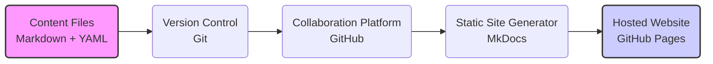
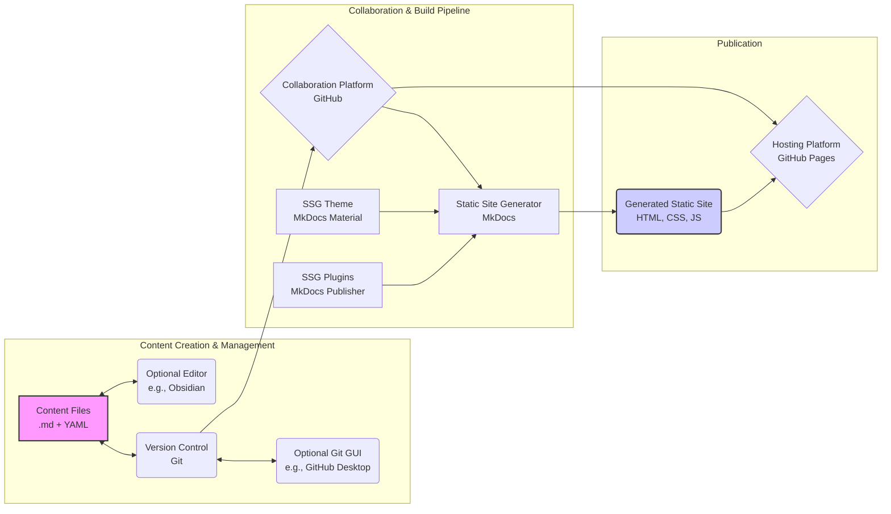

## Executive Summary

This document serves as the technical manual for CircusWiki, a project dedicated to building a resilient, community-driven, and openly accessible knowledge base focused on inclusive circus-pedagogy, movement pedagogy, and related fields. 
It addresses the challenge of fragmented knowledge by creating a durable "knowledge commons."
The core philosophy emphasizes that content is central (stored as Markdown text files with YAML metadata), ensuring longevity and independence from specific platforms. Key principles include decentralization (using Git version control), separation of content and presentation, openness (CC BY-SA 4.0 license), and transparency.
The technical foundation relies on Markdown for content, YAML for metadata, Git for version control, GitHub for collaboration and hosting, and MkDocs (with the Material theme) to generate the static website viewable at https://nica-ev.github.io/docs/. This manual details the architecture, workflows, contribution methods, and rationale behind these choices, aimed at practitioners, technical users, and potential partners.

## 1. Introduction

### 1.1. Purpose of this Document

This document serves a dual purpose for the CircusWiki project. FiThis document serves as the technical manual for CircusWiki, a project dedicated to building a resilient, community-driven, and openly accessible knowledge base focused on inclusive circus-pedagogy, movement pedagogy, and related fields. It addresses the challenge of fragmented knowledge by creating a durable "knowledge commons."
The core philosophy emphasizes that content is central (stored as Markdown text files with YAML metadata), ensuring longevity and independence from specific platforms. Key principles include decentralization (using Git version control), separation of content and presentation, openness (CC BY-SA 4.0 license), and transparency.
The technical foundation relies on Markdown for content, YAML for metadata, Git for version control, GitHub for collaboration and hosting, and MkDocs (with the Material theme) to generate the static website viewable at https://nica-ev.github.io/docs/. This manual details the architecture, workflows, contribution methods, and rationale behind these choices, aimed at practitioners, technical users, and potential partners.rstly, it acts as a **comprehensive technical introduction**, outlining the project's motivations, core philosophy, underlying architecture, and technological choices. Secondly, it functions as a **technical manual**, providing detailed information on the system's components, data formats, workflows, and contribution methods. The aim is to offer sufficient detail for users to understand the project deeply, contribute effectively, and potentially replicate or adapt the system for their own needs.

### 1.2. Target Audience

This document is intended for a diverse audience, including:

*   **Practitioners and Educators:** Individuals working in inclusive circus-pedagogy, movement pedagogy, social circus, and related fields who wish to understand the project's goals and how to utilize or contribute content.
*   **Technical Users:** Individuals interested in the specific technologies used (Markdown, Git, MkDocs), the system architecture, data structures, and potentially contributing technically or replicating the setup.
*   **Potential Partners & Stakeholders:** Organizations, societies, funders, or even policymakers seeking a clear overview of the project's technical foundation, sustainability model, and collaborative nature.

### 1.3. Problem Statement: The Challenge of Scattered Knowledge

Within the vibrant fields of circus and movement pedagogy, a wealth of valuable knowledge, practical exercises, and pedagogical insights exists. However, this knowledge is often fragmented, difficult to access, and reliant on personal networks or specific events. Furthermore, valuable online resources and platforms that have attempted to consolidate this information have sometimes disappeared, taking the accessible knowledge with them. This creates significant barriers to learning, sharing, and building upon collective expertise, particularly across geographical and linguistic divides.

### 1.4. Project Goal: A Resilient Knowledge Commons

**CircusWiki** aims to address these challenges by creating a **resilient, community-driven, and openly accessible knowledge base**. It is designed as a wiki-like space focused on movement-based pedagogy, inclusive practices, and related topics. The fundamental goal is to build a durable "knowledge commons" where information is preserved, shared freely, easily discovered, and collectively maintained, independent of any single entity or proprietary platform.

### 1.5. Project Links

*   **Project Website (Live View):** [https://nica-ev.github.io/docs/](https://nica-ev.github.io/docs/)
*   **Primary Organization:** [https://nica.network](https://nica.network) (NICA e.V.)
*   **Github Repository:** [https://github.com/nica-ev/docs](https://github.com/nica-ev/docs)

## **2. Core Philosophy & Guiding Principles**

The development and architecture of CircusWiki are grounded in a set of core principles designed to address the challenges of knowledge preservation and accessibility within the fields of movement pedagogy and inclusive circus. These principles guide every technical decision and shape the project's community model.

### **Content is the Core:** 
The most fundamental principle is that the knowledge itself – captured in plain text Markdown files, structured YAML metadata, and associated assets like images – constitutes the true value of CircusWiki. 
**This collection of files is the wiki.**
The tools used to view or interact with this content, such as the project website, are considered secondary interfaces. This focus ensures the inherent value remains independent of any specific presentation technology.

### **Decentralization by Design:** 
To combat the risk of knowledge loss due to platform disappearance or reliance on single entities, CircusWiki is built using Git, a distributed version control system. This means that anyone can create a complete, independent copy (a "fork") of the entire project, including its full history. 
If the original hosting location ceases to exist, the knowledge base can live on through these distributed copies, ensuring resilience and preventing a single point of failure.
**This decentralization is a cornerstone of the project's long-term sustainability strategy.**

### **Separation of Content and Presentation:** 
Directly linked to the "Content is the Core" principle, we strictly separate the raw information (Markdown/YAML) from how it is displayed. 
The current website generated by MkDocs is just one possible visualization. Because the content exists in a simple, structured, plain-text format, it can be readily adapted for various outputs – a different website design, a mobile application, printable manuals, offline archives, or direct analysis of the raw data – without altering the source material. 
**This separation future-proofs the content against technological obsolescence.**

### **Knowledge Accessibility & Searchability:** 
A primary goal is to make specialized knowledge easily discoverable and usable (in multiple ways). This is achieved through clear content structure and the use of descriptive and clearly defined metadata (tags, categories, etc.), embedded within each file.

On the primary web interface, we utilize this currently by providing a full-text search aswell as sortable tables that show a subset of files with displayed metadata. 

We regularly review and adapt the structure and schemes both for the content and the metadata. Considerations like adaptability, accessibility as well as data sparseness (less data is better) are the driving forces here.

### **Longevity & Resilience:**
Beyond decentralization, the project prioritizes longevity by relying on widely adopted, stable, and non-proprietary open standards like Markdown, YAML, and Git. This minimizes dependence on specific software vendors and increases the likelihood that the content will remain readable and usable far into the future, even if current tools are abandoned.

### **Openness & Collaboration:** 
CircusWiki aims to be a community resource, built by and for the community. All contributed content is licensed under the [Creative Commons Attribution-ShareAlike 4.0 International (CC BY-SA 4.0)](https://creativecommons.org/licenses/by-sa/4.0/deed.en) license. This permissive license allows anyone to freely use, share, and adapt the content for any purpose (even commercially), provided they give appropriate credit and share any derivative works under the same license. This encourages broad adoption and contribution.

### **Transparency:** 
Utilizing Git ensures that every change made to the content is tracked, timestamped, and attributed to a contributor. This complete version history provides full transparency into the evolution of the knowledge base, allowing users to see how information has changed over time and fostering trust in the collaborative process.

### **Multilingualism:** 
Recognizing that language can be a significant barrier, a key future objective is to implement robust mechanisms for translating content into multiple languages, further enhancing global accessibility. While technically challenging and potentially costly, this remains a high priority.

### **Format Flexibility:** 
Stemming from the separation of content and presentation, the project aims to support consuming the knowledge in formats that best suit the user's needs, whether online via the website, offline using the raw files, or through potential future applications or print formats.

This also means, that we are open to including metadata in our schemes, that are used by a specific application - for example video links in the metadata, that are used by a mobile-app that only shows games content with user friendly ways to filter and watch the content based on the metadata.

## **3. Technical Architecture Overview**

The technical architecture of CircusWiki is designed around the core principles of content longevity, decentralization, and the separation of content from its presentation. It utilizes a **static site generation** approach, meaning the final website consists of pre-built HTML, CSS, and JavaScript files, rather than relying on dynamic server-side processing for each page view. This enhances performance, security, and simplifies hosting.

At its heart, the system revolves around the **content files** themselves – primarily Markdown text files enriched with YAML metadata. These files represent the core knowledge base, the "wiki" itself. All other components serve to manage, process, and present this core content.

### **3.1 High-Level Workflow**

Conceptually, the flow of information and processes can be visualized as follows:



*   **Content Files:** The source material, written in Markdown with structured YAML metadata. This is the essential data.
*   **Version Control:** Changes to the content files are tracked using Git, providing history and enabling collaboration.
*   **Collaboration Platform:** GitHub hosts the Git repository, making it accessible online and providing tools for community contributions (like Pull Requests).
*   **Static Site Generator:** MkDocs reads the content files from the repository and builds the static HTML website.
*   **Hosted Website:** The generated website files are served online, currently via GitHub Pages, making the content easily accessible via a web browser.

### **3.2 Detailed Component View**

A more detailed view reveals the specific tools currently employed in the primary workflow, while highlighting the optional nature of certain components:



*   **Content Files (.md + YAML):** The core knowledge base, stored as plain text files.
*   **Optional Editor (e.g., Obsidian):** While any text editor can be used, tools like Obsidian offer enhanced features for working with linked Markdown files (wikilinks, backlinks, graph view) which can be beneficial for navigating and structuring the knowledge base. Its use is entirely optional.
*   **Version Control (Git):** The foundational system for tracking every change made to the content files, ensuring transparency and enabling rollbacks. It operates locally on a contributor's machine.
*   **Optional Git GUI (e.g., GitHub Desktop):** Graphical tools like GitHub Desktop provide a user-friendly interface for Git commands (committing, pushing, pulling), lowering the barrier for those unfamiliar with command-line interfaces. Also optional; Git can be used via the command line or other clients.
*   **Collaboration Platform (GitHub):** The central online hub where the main Git repository is hosted. It facilitates collaborative workflows through features like forks, branches, and pull requests, and manages access permissions.
*   **Static Site Generator (MkDocs):** A Python-based tool configured via the `mkdocs.yml` file. It processes the Markdown/YAML content files, applies the theme and plugins, resolves internal links, and generates the final static HTML website structure.
*   **SSG Theme (MkDocs Material):** Provides the visual appearance, layout, navigation, search functionality, and responsive design for the generated website. Highly configurable.
*   **SSG Plugins (MkDocs Publisher):** A collection of plugins specifically enhancing the MkDocs workflow, particularly for integration with Obsidian-style features like wikilink syntax, callouts, and advanced metadata handling (like the `publish` flag).
*   **Generated Static Site:** The output of the MkDocs build process – a collection of HTML, CSS, JavaScript, and asset files ready for web hosting.
*   **Hosting Platform (GitHub Pages):** A service that takes the generated static site files directly from the GitHub repository and makes them available on the web.

### **3.3 Typical Workflow**

The process for updating or adding content typically follows these steps:

1.  **Obtain Content:** A contributor gets the latest version of the content files, usually by "pulling" changes from the GitHub repository to their local machine using Git (via command line or a tool like GitHub Desktop).
2.  **Edit/Create Content:** Using a text editor (optionally Obsidian), the contributor modifies existing Markdown files or creates new ones, ensuring correct Markdown syntax and YAML metadata.
3.  **Stage & Commit Changes:** The contributor tells Git which changes they want to save ("stage") and then saves a snapshot of these changes with a descriptive message ("commit"). This happens locally.
4.  **Push Changes:** The contributor uploads their local commits to the central GitHub repository ("push"). If contributing directly, this updates the main project; if contributing via fork, this updates their personal copy, ready for a Pull Request.
5.  **Automated Build (Optional but common):** Systems like GitHub Actions can be configured to automatically trigger the `mkdocs build` process whenever changes are pushed to the main branch of the repository.
6.  **Deployment:** The newly built static site files are automatically deployed to the hosting platform (GitHub Pages), making the updated content live on the website. (Manual build and deployment are also possible).

This architecture ensures that the core content remains independent, version-controlled, and accessible, while leveraging robust, widely-used tools for collaboration, processing, and presentation.

## **4. Core Technologies & Rationale**

The technical foundation of CircusWiki is built upon a carefully selected stack of primarily open-source or widely adopted technologies. The choices prioritize longevity, accessibility, collaboration, transparency, and the core principle of separating content from its presentation.

### **4.1 Content Format: Markdown**

**Description:** 
Markdown is a lightweight markup language using plain-text formatting syntax. It's designed to be easily readable and writable in its raw form but readily convertible to HTML and other formats.

**Role:** 
Markdown is the fundamental format for all textual content within CircusWiki (game descriptions, articles, documentation).

**Rationale:**
* **Human-Readable:** Content remains understandable even without rendering software.
* **Simplicity:** Easy to learn and write, allowing contributors to focus on the content itself.
* **Platform Independent:** Plain text files can be created and edited with virtually any text editor on any operating system.
* **Version Control Friendly:** Text-based format works extremely well with Git for tracking changes line-by-line.
* **Open Standard:** Avoids vendor lock-in and ensures long-term accessibility of the core content.

### **4.2 Metadata Format: YAML**

**Description:** 
YAML (YAML Ain't Markup Language) is a human-friendly data serialization standard, often used for configuration files and embedding structured data within text files.

**Role:** 
YAML is used in a "front matter" block at the beginning of each Markdown file to embed structured metadata (like tags, author, creation date, difficulty, categories, etc.).

**Rationale:**
*   **Structured Data:** Allows associating key-value pairs with content in a standardized way.
*   **Enhanced Discoverability:** Enables powerful searching, filtering, and organization based on metadata fields.
*   **Human-Readable:** Like Markdown, YAML syntax is designed for readability.
*   **Automation:** Allows the static site generator (MkDocs) and potentially other tools to process content intelligently based on its metadata.

### **4.3 Version Control System (VCS): Git**
**Description:** 
Git is a free and open-source distributed version control system designed to handle everything from small to very large projects with speed and efficiency. It tracks changes to files over time.

**Role:** 
Git is the backbone for managing the entire history of the CircusWiki content. Every change, addition, or deletion is recorded.

**Rationale:**
* **Decentralization:** Every contributor working with Git has a full copy (clone/fork) of the project's history, enabling true distributed work and ensuring project resilience – the project can live on even if the central repository disappears.
* **Transparency:** Provides a complete, auditable history of who changed what and when.
* **Collaboration:** Facilitates multiple contributors working on the content simultaneously through branching and merging workflows.
* **Data Integrity:** Ensures the history is preserved and allows reverting to previous versions if needed.
* **Industry Standard:** The de facto standard for version control, especially in open-source projects.

### **4.4 Collaboration Platform: GitHub**

**Description:** 
GitHub is a web-based platform providing hosting for Git repositories, along with a suite of collaboration tools like issue tracking, pull requests (for proposing and reviewing changes), project management features, and user management.

**Role:** 
GitHub currently serves as the central, public hosting location for the CircusWiki Git repository, facilitating community contributions and discussion.

**Rationale:**
* **Robust Hosting:** Provides reliable hosting for the Git repository.
* **Collaboration Tools:** Excellent features for managing contributions (Pull Requests), tracking tasks/bugs (Issues), and fostering community interaction.
* **Wide Adoption:** Familiar to many potential contributors, especially those with technical backgrounds. Millions of open-source projects rely on it.
* **Integration:** Seamlessly integrates with GitHub Pages for website hosting.
* **Free Tier:** Offers free hosting for public repositories.
* **Flexibility:** While GitHub itself is proprietary (Microsoft-owned), the underlying Git repository is fully portable. The project can be easily migrated to alternatives (like GitLab, Gitea, or self-hosted solutions) if necessary, maintaining project independence.

### **4.5 Static Site Generator (SSG): MkDocs**

**Description:**
MkDocs is a fast, simple, and popular open-source static site generator geared towards building project documentation. It takes a collection of Markdown files and renders them into a complete HTML website.

**Role:** 
MkDocs reads the Markdown content files and their YAML front matter, processes them according to the configuration (`mkdocs.yml`), and generates the static HTML, CSS, and JavaScript files that form the browseable CircusWiki website.

**Rationale:**
* **Markdown-Centric:** Designed specifically to work with Markdown content.
* **Simplicity:** Relatively easy to configure and use.
* **Performance:** Generates static files, resulting in very fast load times for the end-user website.
* **Security:** Static sites have a minimal attack surface as there is no server-side code execution or database dependency on the live site.
* **Plugin Ecosystem:** Supports plugins to extend functionality (see MkDocs-Publisher).
* **Offline Preview:** Allows building and previewing the website locally (`mkdocs serve`) before deployment.

### **4.6 SSG Theme: MkDocs Material**

**Description:** 
Material for MkDocs is a highly popular and feature-rich open-source theme for MkDocs.

**Role:** 
Provides the visual appearance, layout, navigation, search functionality, and overall user interface for the generated CircusWiki website.

**Rationale:**
* **Modern Design:** Offers a clean, responsive, and aesthetically pleasing user experience out-of-the-box.
* **Feature Rich:** Includes excellent built-in search, customizable navigation (tabs, sidebars), code highlighting, admonitions (info/warning boxes), social links, and more.
* **Customizable:** Highly configurable through `mkdocs.yml` and supports custom CSS/JavaScript if needed.
* **Well-Maintained:** Actively developed and supported by its creator and community.

### **4.7 SSG Plugins: MkDocs-Publisher**

**Description:** 
MkDocs-Publisher is not a single plugin but an open-source *collection* of MkDocs plugins, specifically designed to enhance the workflow between Markdown editors like Obsidian and MkDocs publication.

**Role:** 
Extends MkDocs' core functionality to better handle specific Markdown syntax often used in Obsidian (like `[[wikilinks]]` and callouts/admonitions) and leverage metadata for features like conditional publishing (`publish: true` flag). It helps integrate tags and categories from the YAML front matter seamlessly into the site structure or display.

**Rationale:**
* **Improved Workflow:** Smoothens the process for contributors who prefer using Obsidian, automatically handling syntax differences.
* **Enhanced Metadata Usage:** Enables more sophisticated use of the YAML front matter for site generation logic (e.g., only publishing files marked `publish: true`).
* **Additional Features:** Provides functionalities beyond standard MkDocs that are beneficial for a knowledge base (potentially specific tag handling, backlink generation, etc. - *depending on which specific Publisher plugins are active*).

### **4.8 Hosting Platform: GitHub Pages**

**Description:** 
GitHub Pages is a static site hosting service offered by GitHub that takes HTML, CSS, and JavaScript files directly from a repository on GitHub and publishes them as a website.

**Role:** 
Hosts the static website files generated by MkDocs, making CircusWiki accessible online via its URL ([https://nica-ev.github.io/docs/](https://nica-ev.github.io/docs/)).

**Rationale:**
* **Free Hosting:** Provided at no cost for public repositories.
* **Seamless Integration:** Works directly with the GitHub repository and build workflows (e.g., deploying automatically after changes are merged).
* **Reliability:** Leverages GitHub's robust infrastructure.
* **Simplicity:** Requires minimal configuration to get started.
* **Flexibility:** If needed in the future, the generated static site files can be hosted on virtually any web server or hosting platform (Netlify, Vercel, self-hosted, etc.).

**4.9 Optional Content Editor: Obsidian**

**Description:** 
Obsidian is a powerful, free (for personal use) knowledge base and Markdown editor application that works on local Markdown files.

**Role:** 
Serves as an *optional but recommended* tool for contributors to create, edit, and organize their CircusWiki content locally before contributing it via Git/GitHub.

**Rationale (as an option):**
*   **Enhanced Editing Experience:** Offers features like live preview, bidirectional linking, graph visualization of notes, tags, templates, and a vast plugin ecosystem.
*   **Local-First:** All data resides in local folders, giving users full control.
*   **Offline Capability:** Works entirely offline.
*   **Integration:** MkDocs-Publisher specifically helps bridge the syntax and features used in Obsidian with the MkDocs build process.

>[!important]+ **Important:** 
>Contribution **does not require** Obsidian; any plain text editor capable of handling Markdown is sufficient.

### **4.10 Optional Git Client: GitHub Desktop**
**Description:** 
GitHub Desktop is a free, graphical application developed by GitHub that provides a visual interface for common Git commands.

**Role:** 
Serves as an *optional* tool for contributors to interact with the Git repository (cloning, committing changes, pushing/pulling, creating branches) without using the command-line interface.
* **Rationale (as an option):**
* **Ease of Use:** Lowers the barrier to entry for contributors unfamiliar or uncomfortable with Git command-line operations.
* **Simplified Workflow:** Visualizes changes and simplifies common Git tasks.

>[!important]+ **Important:** 
>Contribution **does not require** GitHub Desktop; Git commands can be executed via the command line or other Git clients.

## **5. Data Structure & Formats**

The core of CircusWiki resides in its content files and the structured information associated with them. This section details the organization of these files, the formats used, and the philosophy behind structuring the knowledge base. A key principle is the **separation of content and presentation**: the raw Markdown files, metadata, and assets are the persistent knowledge base, while tools like MkDocs provide one way to visualize it.

### **5.1 Repository File/Folder Structure**

The project's files are organized within a Git repository. While the system encourages structuring knowledge primarily through linking and metadata (see 5.2 and 5.3), a specific folder structure is necessary for technical reasons, particularly for assets and website generation.

Okay, I understand. You want the first column to visually represent the folder hierarchy using the ASCII tree characters.

Here's the updated table:

| Folder/File Structure                         | Explanation                                                                                                                                             |
| :-------------------------------------------- | :------------------------------------------------------------------------------------------------------------------------------------------------------ |
| `docs-nica/`                                  | **Root Folder:** Contains configuration files (`mkdocs.yml`, `license`, `readme.md`), potentially local tool configuration, and the main `docs` folder. |
| └── `docs/`                                   | **`docs/` Folder:** The primary container for all user-facing content (Markdown files) and website assets.                                              |
| &nbsp;&nbsp;&nbsp;&nbsp;├── `blog/posts/`     | *Example subfolder within `docs/` for organizing specific content like blog posts.*                                                                     |
| &nbsp;&nbsp;&nbsp;&nbsp;├── `img/`            | Contains all non-Markdown assets (e.g., images like `.jpg`, `.png`, `.gif`; documents like `.pdf`) that are linked within the content.                  |
| &nbsp;&nbsp;&nbsp;&nbsp;├── `javascript/`     | Contains custom JavaScript files used by MkDocs to add specific functionalities to the generated website.                                               |
| &nbsp;&nbsp;&nbsp;&nbsp;├── `stylesheets/`    | Contains custom CSS files used by MkDocs to add specific styling to the generated website.                                                              |
| &nbsp;&nbsp;&nbsp;&nbsp;└── `... (.md files)` | Markdown files containing the actual knowledge articles. These reside directly within `docs/` or within its subfolders.                                 |
| └── `... (config files)`                      | Configuration files like `mkdocs.yml`, `license`, `readme.md` reside in the root folder.                                                                |

```
docs-nica/
├── docs
│   ├── blog
│   │   └── posts
│   ├── img
│   ├── javascripts
│   ├── stylesheets
│   └── ...
└── ...
```

*   **Root Folder:** Contains configuration files (`mkdocs.yml`, `license`, `readme.md`), potentially local tool configuration (e.g., for Obsidian), and the main `docs` folder.
*   **`docs/` Folder:** This is the primary container for all user-facing content and website assets.
    *   **`docs/img : Contains all non-Markdown assets linked within the content, such as images (`.jpg`, `.png`, `.gif`), documents (`.pdf`), etc. This ensures assets are stored alongside the content.
    *   **`docs/javascript/` & `docs/stylesheets/`:** Contain custom JavaScript and CSS files used by MkDocs to add specific functionalities or styling to the generated website.
    *   **Content Files (.md):** Markdown files containing the actual knowledge articles reside directly within `docs/` or within subfolders.
*   **Language Subfolders (Future State):** To support multilingual content, the planned structure involves placing language-specific content within subfolders named after language codes (e.g., `docs/de/`, `docs/en/`, `docs/fr/`). Each language folder would mirror the structure needed for its content, potentially including subfolders like `blog/`. The current structure might differ slightly until full multilingual support is implemented.

**Philosophy:** While folders are used for technical organization (assets, languages), the primary method for organizing and navigating the *knowledge itself* is intended to be bottom-up, relying on internal linking and metadata rather than a rigid, predefined folder hierarchy for topics.

### **5.2 Markdown Usage**

All textual content is written in **Markdown**, a lightweight markup language using plain-text formatting syntax.

**Basic Formatting:** 
Standard Markdown is used for structure and emphasis (headings, lists, bold, italics, code blocks, blockquotes, etc.), ensuring readability both in raw text and rendered formats.

**Internal Linking:**
Connecting related pieces of information is fundamental to the wiki concept. This is achieved through:
* **Standard Markdown Links:** `[Link Text](path/to/other_file.md)`
* **Wikilinks:** `[[Target Note Name]]`. This simpler syntax, popular in tools like Obsidian, is supported via the `mkdocs-publisher` plugin, which converts them to valid links during website generation.

**Purpose of Linking:** 
Links create an interconnected web of knowledge, allowing users to explore related concepts organically. They are crucial for discoverability and preventing "orphaned" notes (content that cannot be reached through navigation). The philosophy encourages creating links manually where a meaningful connection exists, fostering an emergent structure rather than automated, potentially meaningless connections.

**Maps of Content (MOCs) / Index Files:** 
Certain Markdown files serve primarily as curated entry points or overviews for specific topics. These "MOCs" or "Index" files mainly consist of links (either manually written or dynamically generated, see below) pointing to relevant content notes, providing a structured way to navigate subsets of the knowledge base.

### **5.3 YAML Metadata (Front Matter)**

To add structured, machine-readable information to each content file, CircusWiki utilizes **YAML front matter**. This is a block of YAML code placed at the very beginning of each Markdown file, enclosed by triple-dashed lines (`---`).

**Purpose:** 
Metadata enhances content by:
*   Providing consistent information (author, creation date).
*   Enabling powerful search and filtering capabilities.
*   Allowing for conditional processing (e.g., marking a page as unpublished).
*   Facilitating dynamic content aggregation (e.g., automatically creating lists or tables in MOCs based on tags or other fields using tools like Obsidian/Dataview).

**Mandatory Fields (All Content Files):**
Every Markdown file intended as part of the knowledge base must include the following basic metadata fields:
*   `publish: true` / `false`: Controls whether the page is included in the published website (handled by `mkdocs-publisher`).
*   `tags: [tag1, tag2, ...]` : A list of keywords for broad categorization and search filtering.
*   `created: YYYY-MM-DD HH:MM:SS`: Date and time the content was initially created.
*   `updated: YYYY-MM-DD HH:MM:SS`: Date and time the content was last significantly modified.
*   `title: "Page Title"`: The main title of the page, used for display and navigation.
*   `description: "Brief summary..."`: A short description used for search results and potentially SEO.
*   `authors: [Author Name 1, Author Name 2]`: List of contributors to the content.

**Content-Type Specific Fields:** 
Beyond the mandatory fields, different types of content utilize specific, standardized sets of metadata relevant to their nature. This allows for more granular searching and tailored presentation.

**Example (Pedagogical Games):** 
Game description files include additional fields like:
*   `category: [kennenlernen, kreisspiel]`: More specific categories (distinct from general tags).
*   `Schwierigkeit: einfach` / `mittel` / `schwer`: Difficulty level.
*   `Material: Bälle`: Required materials.
*   `Spieldauer: 10 - 15`: Estimated duration in minutes.
*   `source: unbekannt` / `Name`: Origin or source of the game.
*   `group-min: 3`: Minimum number of participants.
*   `group-max: 30`: Maximum number of participants.

**Other Content Types:** 
Similar structured metadata schemas exist or will be defined for other content types (e.g., pedagogical concepts, exercises, project documentation) as the wiki evolves.

**Schema Definition:** 
A dedicated document within the wiki itself outlines all currently used metadata fields, their purpose, expected format, and allowed values. This schema is considered an evolving part of the project as new content types and organizational needs emerge.

>[!info]+ Conclusion
>By combining human-readable Markdown with structured YAML metadata and a focus on meaningful internal linking, this data structure provides a flexible, searchable, and resilient foundation for the CircusWiki knowledge base, adaptable to various forms of presentation and future evolution.

## 6. Key Features & Functionality

CircusWiki is designed not just as a website, but as a flexible and resilient knowledge management system. Its key features stem directly from its underlying architecture and philosophy:

### 6.1 Content Organization: Bottom-Up & Structured Access

**Core Unit:** 
The fundamental unit of knowledge is the individual Markdown file (`.md`), containing text content and associated YAML metadata.

**Minimal Folder Structure:** 
Folders are used primarily for technical necessities: 
- language separation like `/de`, `/en`
- asset storage like `/docs/images`, `/docs/stylesheets`
- blog functionality `/docs/de/blog`)

**Metadata-Driven:** 
The primary organization relies on the rich metadata embedded within each file (tags, categories, etc.) rather than a rigid, top-down folder hierarchy.

**Emergent Structure via Linking:** 
Content files naturally link to related content files, creating an interconnected web of knowledge that evolves organically.

**Curated Access Points (MOCs):** 
Special Markdown files, often called "Maps of Content" (MOCs) or "Index Files," serve as curated entry points. These files primarily contain links (manually written or dynamically generated based on metadata queries) to specific subsets of content, providing structured pathways through the knowledge base. This allows the structure to be easily adapted and changed without breaking the underlying content.

### 6.2 Metadata-Driven Discovery

**Rich Metadata:** 
Every content file includes mandatory and optional YAML metadata (e.g., `tags`, `category`, `difficulty`, `author`, `created`, `updated`)

**Faceted Search & Filtering:** 
This structured metadata allows users (and potentially automated tools) to find information through precise filtering and searching based on specific criteria, going beyond simple text search.

**Dynamic Content Aggregation:** 
Tools (like Obsidian with the Dataview plugin, used during content curation) can query this metadata across all files to dynamically generate lists, tables, and overview pages (like MOCs), ensuring index pages stay up-to-date as content is added or modified.

### 6.3 Powerful Search Functionality

**Integrated Search:** 
The website generated by MkDocs, using the Material theme, includes a powerful and fast client-side search function.

**Comprehensive Indexing:** 
The search indexes the full text content of all pages as well as the metadata (titles, descriptions, tags), allowing users to find relevant information quickly.

### 6.4 Internal Content Linking & Connectivity

**Interconnected Knowledge:** 
Files are linked using standard Markdown links (`[link text](path/to/file.md)`) or potentially Obsidian-style Wikilinks (`[[File Name]]`) which are processed by the MkDocs-Publisher plugin.

**Ensuring Accessibility:** 
The goal is for every piece of content to be reachable via links from other relevant content or MOCs/Index files. Orphaned notes (files with no incoming and outgoing links) are actively avoided.

**Meaningful Connections:**
Emphasis is placed on creating links that represent meaningful relationships between content, rather than linking arbitrarily.

**Graph Visualization:** 
Tools like Obsidian's graph view can be used during content curation to visualize the link structure, identify isolated content clusters, and ensure the overall connectivity of the knowledge base.

### 6.5 Full Version History & Transparency

**Complete Audit Trail:** 
Leveraging Git, every change made to any file (content or configuration) is tracked, timestamped, and attributed to an author.

**Change Tracking:** 
Users can view the history of any page, compare versions, and understand how the content has evolved over time via the GitHub interface.

**Rollback Capability:**
Previous versions of the content can be easily restored if needed.

### 6.6 Flexible Offline Access

**Raw Content Access:** 
As the core content consists of plain text Markdown and YAML files, the entire knowledge base can be downloaded (by cloning or downloading the Git repository) and accessed offline using any text editor. This provides direct access to the fundamental information.

**Local Website Simulation:** 
Users can run a fully functional, interactive version of the website on their local machine. This requires installing Python, MkDocs, and necessary themes/plugins, then running the `mkdocs serve` command within the cloned repository directory. This allows offline browsing with the full search and navigation experience.

### 6.7 Potential for Multiple Visualizations & Outputs

**Content is King:** 
The separation of the raw content (Markdown/YAML) from its presentation layer (MkDocs website) is a core principle.

**Future-Proofing:** 
This separation means the content is not locked into the current website format. The same source files could potentially be used in the future to generate:
-   Mobile applications
-   Printed books or manuals
-   Different website layouts or platforms
-   Data exports for analysis or integration with other systems

### 6.8 Accessibility Baseline & Potential

**Semantic HTML:** 
Static site generators like MkDocs typically produce clean, semantic HTML, which provides a good baseline for accessibility (e.g., for screen readers).

**Content Focus:** 
The focus on well-structured Markdown content aids accessibility.

**Future Enhancements:** 
The separation of content and presentation makes it easier to implement future accessibility improvements (e.g., ARIA attributes, contrast adjustments) primarily within the theme or template layer, without needing to modify the core content extensively.

## 7. Current Status & Content

This section outlines the current operational state of the CircusWiki project, the scope of its content, and the status of key features like translation and funding as of April 2025.

### Operational Status of Core Systems

The fundamental technical infrastructure underpinning CircusWiki is fully operational. This includes:

- **Version Control:** The Git repository is active and tracks all content history.
- **Collaboration Platform:** The project is hosted on GitHub [https://github.com/nica-ev/docs](https://github.com/nica-ev/docs) enabling public visibility and contribution workflows (Pull Requests, Issues).
- **Static Site Generation:** The MkDocs build process, utilizing the Material for MkDocs theme and the MkDocs-Publisher plugin collection, successfully converts the Markdown content and metadata into a static website.
- **Website Hosting:** The generated website is deployed and accessible via GitHub Pages at
  [https://nica-ev.github.io/docs/](https://nica-ev.github.io/docs/).

### Current Content Scope

The knowledge base currently comprises primarily:

- **Pedagogical Games:** Approximately 170 descriptions of games relevant to circus and movement pedagogy, tagged with metadata for difficulty, group size, materials, etc.
- **Organizational Documentation:** Documentation related to the processes and structures of NICA e.V.
- **Other content:** We have currently roughly 800 notes for various topics that still need to be cleaned up manually and included into the wiki

The system is designed to accommodate various other content types, and the scope is expected to grow as community contribution increases.

### Translation Status

Multilingual support is identified as a **high-priority goal** to maximize accessibility across language barriers. However:

-   **Implementation:** Translation functionality is **not yet implemented** within the live website.
-   **Investigation:** Research and testing are underway to determine the most stable, longterm and effective technical solution. 
-   **Complexity & Cost:** Implementing a robust and maintainable translation workflow presents technical challenges. Furthermore, automated translation services incur costs (e.g., an initial estimate suggested approximately €40 via DeepL to translate the current content volume (200 notes) into one additional language).

### Funding Status

-   **Current Funding:** All current operational expenses, primarily related to potential future costs like translation services or domain names, are covered by the NICA e.V. society. The core hosting via GitHub Pages for the public repository is currently free.
-   **Long-Term Sustainability:** To ensure the project's longevity and cover potential future costs (especially large-scale translation or expanded infrastructure), exploring sustainable funding models, such as a donation system, is under consideration for the future.

## 8. Sustainability, Decentralization & Community Model

The long-term viability and growth of CircusWiki depend not only on its technical foundation but also on its inherent design for resilience and its approach to community building.

### 8.1 Decentralization as Core Sustainability

The project's architecture, built on the distributed version control system **Git**, is inherently decentralized. This is a fundamental aspect of its design for longevity.
Every contributor who clones or forks the repository obtains a **complete, independent copy** of all content (Markdown files, metadata, assets) and its entire version history.

This fundamental design choice ensures the project's **resilience**. Should the primary hosting platform (currently GitHub) or the initiating organization become unavailable, the knowledge base can persist, be re-hosted, and continue to evolve from any existing copy held by the community.
This directly addresses the historical problem of valuable resources disappearing when a central platform or initiative ceases operation, safeguarding the collective knowledge.

### 8.2 Internal Use Case & Ongoing Relevance

The CircusWiki system is actively used as the primary knowledge management and documentation platform for our society NICA e.V.
This includes storing pedagogical resources (like game descriptions) used in daily practice, as well as internal organizational processes and documentation vital to the society's operation.
This direct, ongoing internal reliance creates a strong, practical incentive for the core team to actively maintain, update, and improve the system. This ensures its continued relevance and helps prevent stagnation, providing a baseline level of activity and stewardship.

### 8.3 Community Outreach & User Engagement

We are actively engaging with potential users and stakeholders within the inclusive circus-pedagogy, movement pedagogy, and related fields.
This includes presenting the project and its resources to potential user groups like youth centers, schools, individual practitioners, and other relevant organizations.

The goals of this outreach are to:
-   Raise awareness of the available knowledge.
-   Encourage the use and adoption of the resources.
-   Gather valuable feedback for future improvements and content development.
-   Foster a sense of shared ownership and encourage future contributions.

### 8.4 Contributor Onboarding Strategy

Building a vibrant and sustainable contributor community is recognized as a gradual process that requires patience and support. We aim to slowly invite and onboard external contributors, understanding that there can be both **technical barriers** (e.g., unfamiliarity with Markdown, Git, or GitHub) and **motivational hurdles**.

The strategy focuses on making the initial steps to contribute as straightforward as possible, offering clear pathways for users to increase their level of involvement as they become more comfortable.

### 8.5 Support & Documentation

Lowering barriers to participation requires clear, accessible, and comprehensive documentation.
We are committed to providing guides integrated within the wiki itself, explaining:
-   How to effectively use the website and its features (search, navigation).
-   Detailed instructions on the various methods for contributing content.

This documentation will include written guides and potentially video tutorials covering common workflows (e.g., finding information, contributing via email, basic GitHub usage).
Direct support via email (`wiki@nica.network`) or other channels will be available for individuals needing assistance with using the resource or the contribution process.

### 8.6 Multiple Contribution Pathways

Recognizing that potential contributors possess diverse technical skills and preferences, CircusWiki supports multiple methods for submitting content to ensure inclusivity.

**Direct Technical Contribution:** 
For those comfortable with the tools, contributions can be made directly using the standard Git and GitHub workflow (forking the repository, creating/editing Markdown files, and submitting Pull Requests for review). Support is offered to learn this process.

**Simplified Contribution:** 
For those less familiar with the technical tools, content can be submitted easily via:
        -   Email to `wiki@nica.network`
        -   Traditional mail
        -   Providing files in common formats (e.g., Word documents, plain text files, PDFs, photos).
Content submitted through these simplified pathways will be reviewed, formatted, and integrated into the system by the core project team.

This flexible approach ensures that valuable knowledge and practical experience can be captured and shared, regardless of the contributor's technical background.

## 9. How to Use & Contribute

CircusWiki is designed for both consuming information and community contribution. We welcome everyone interested in movement pedagogy and related fields to use and help grow this resource.

### 9.1 Using the Content

There are several ways to access the knowledge within CircusWiki:

**Online Browsing (Recommended):**
-   The easiest way is to visit the live website: [https://nica-ev.github.io/docs/](https://nica-ev.github.io/docs/)
-   This version includes full search capabilities, navigation, and the intended visual layout.

**Offline Reading (Basic):**
-   You can download or clone the entire project repository from GitHub.
-   This gives you local access to all the raw content files (`.md` Markdown files) and associated assets (images, PDFs in the `docs/assets/` folder).
-   You can read these files directly using any standard text editor or Markdown viewer. This provides access to the core information but without the website's navigation or advanced search features.

**Offline Browsing (Advanced):**
For the full website experience offline, you can run a local version using MkDocs. This requires some technical setup:
1.  **Clone the Repository:** Use Git to clone the project repository to your local machine.
2.  **Install Prerequisites:** Ensure you have Python, pip (Python's package installer), and Git installed.
3.  **Install Dependencies:** Navigate to the cloned repository's directory in your terminal and install the required Python packages. With the `requirements.txt` file in the project root, you can do this by running:
    ```bash
    pip install -r requirements.txt
    ```
    Alternatively, you can install the packages individually if you don't have the `requirements.txt` file or need specific versions (refer to project documentation for the exact list).
4.  **Run Local Server:** Execute the command `mkdocs serve` in the terminal from the repository's root directory.
5.  **View Locally:** Open your web browser and navigate to the local address provided by MkDocs (usually `http://127.0.0.1:8000`).

This method allows you to browse the site locally exactly as it appears online, including search and navigation.

### 9.2 Contributing Content

We strongly encourage contributions to help expand and enrich CircusWiki. There are pathways available for various levels of technical comfort:

#### Indirect Contribution Methods

If you are not familiar or comfortable with Git and GitHub, you can contribute easily via these methods:

-   **Email:** Send your content (game descriptions, articles, ideas, corrections, photos, links) directly to: `wiki@nica.network`
-   **Other Formats:** You can provide content as plain text files, Microsoft Word documents, PDFs, or even physical letters. Contact us via the email above to arrange the best way.
-   **Process:** Once received, the core project team will review your contribution, format it appropriately into Markdown with the necessary metadata, and integrate it into the repository.

#### Direct Contribution Method (via GitHub)

For those comfortable with or willing to learn Git and GitHub, direct contributions are highly welcome and offer more immediate involvement:

**Prerequisites:** 
You will need a free GitHub account.

**Optional Tools:**
-   Using a Markdown editor like **Obsidian** can enhance the writing and linking experience locally.
-   Using a graphical Git client like **GitHub Desktop** can simplify interacting with Git if you prefer not to use the command line.

**General Workflow:**
1.  **Fork the Repository:** Create your own copy ("fork") of the main CircusWiki repository on GitHub.
2.  **Clone Your Fork:** Download your fork to your local machine (`git clone`).
3.  **Create/Edit Files:** Make your changes or additions locally. Create new `.md` files or edit existing ones, ensuring you include the appropriate YAML front matter metadata (refer to the metadata documentation).
4.  **Commit Changes:** Save your changes using Git (`git commit`). Write clear commit messages explaining what you changed.
5.  **Push Changes:** Upload your committed changes to your fork on GitHub (`git push`).
6.  **Submit a Pull Request (PR):** From your fork on GitHub, create a "Pull Request" directed towards the main CircusWiki repository. This proposes your changes for inclusion.

**Review Process:** 
The core team will review your Pull Request, potentially provide feedback or ask for modifications, and then merge it into the main project once approved.

**Need Help?** 
We understand this workflow might be new to some. We are happy to provide guidance and support to help you get started with contributing directly via GitHub. Please reach out via `wiki@nica.network`.

## 10. Future Development

CircusWiki is an evolving project. While the core infrastructure is stable and functional, several key areas are planned for future development and refinement to enhance its utility, reach, and sustainability.

### 10.1 Translation Implementation

**Priority:** 
Enabling multilingual content is the highest priority development goal to significantly lower language barriers and increase accessibility across diverse communities.

**Status:** Currently under active investigation. Not yet implemented.

**Challenges:** 
Implementing translation involves both technical and financial considerations. Automated translation services (like DeepL) incur costs, requiring a sustainable funding model (potentially donations) in the long run.
The current proposed solution:
- custom python script
- core logic for translation: parsing the markdown file, seperating text content from content that needs to stay unchanged like links, attached image-names, code, metadata etc...
- using an API call to DeepL and send only the text content, retrieving the translation
- building the translated file (or overwriting an existing one) using both the unchanged parts and the translated text parts, so the final content has no changes beside the actual translated text parts. This ensures functionality of the links and systems that rely on the metadata.

The script would parse the entire directy (including subfolders). As the source of content can be in multiple languages, and we also do not want to translate every file all the time - we introduce the following metadata:
hash - this stores a hash-number of the current file, is used to identify changes in the file
lang - the language this document is in (de, be, fr, en, and so on)
orig - true or false. If set to true, this is considered the base version (and language) from wich to translate into all other missing (or outdated) language versions

This data is used by the script to determine wether a file needs a new translation (the origin has changed)

**Goal:** 
To establish a robust and scalable workflow for adding and maintaining content in multiple languages.

### 10.2 Enhanced Metadata and Schema Refinement

**Context:** 
The use of YAML front matter for metadata is central to organizing and discovering content.

**Ongoing Process:** 
The metadata schema (the specific fields used and their definitions) is considered an evolving component. As new types of content are added and community needs become clearer, the schema will be refined.
A dedicated document outlining the current metadata schemas for different content types will be maintained within the wiki itself, ensuring transparency and guidance for contributors.

**Goal:** 
To develop increasingly meaningful and consistent metadata structures that improve filtering, searching, and the dynamic generation of content relationships (e.g., in Maps of Content).

### 10.3 Contributor Guidelines

**Need:** 
As the contributor base potentially grows, more detailed guidelines will be beneficial.

**Scope:** 
These guidelines will cover aspects such as:
-   Content style and tone of voice.
*   Recommended Markdown formatting practices.
*   Structure for specific content types (e.g., game descriptions, pedagogical articles).
*   Image submission guidelines (formats, sizing, captions).
*   Metadata usage best practices.

**Goal:** 
To ensure content consistency, quality, and ease of integration, while still allowing for diverse voices and perspectives.

### 10.4 Community Building Activities

**Focus:** 
Actively fostering a sense of community ownership and encouraging participation beyond simple content consumption.

**Activities:** 
Potential activities include:
-   More targeted outreach to relevant organizations and practitioners.
-   Online workshops or Q&A sessions on using and contributing to the wiki.
-   Establishing clearer channels for feedback and discussion (e.g., using GitHub Discussions or a dedicated forum).
-   Recognizing and highlighting contributor efforts.

**Goal:** 
To build a vibrant, engaged, and supportive community around the CircusWiki knowledge base.

### 10.5 Exploring Alternative Visualizations and Outputs

**Foundation:** The core principle of separating content (Markdown/YAML) from presentation (MkDocs website) enables diverse output formats or use of the content.

**Possibilities:** 
In the near term, we aim to explore the feasibility of:
- Providing print-ready versions (e.g., PDFs of specific sections or the entire wiki).
- Providing offline version of the static website with full functionality (search, all content offline)
- Developing simple mobile application interfaces for accessing specific parts of the content on the phone or tablet. This includes exploring different UI and interaction functionality compared to the static website.
- Providing data exports in different formats (e.g., JSON, HTML) for use in other applications or research.
- Providing frameworks for the use of this content together with LLMs (Large Language Models) to provide more context
- Developing framework to enable RAG based semantic search on the website
	- (automatically) generating / updating vector embeddings based on all text content (markdown files)
	- provide an interface on the website that shows a certain number of retrieved chunks from a vector search (aswell as the link to its source) based on a search term as an alternative search compared to the fuzzy keyword based traditional text search.

**Goal:** 
To maximize the utility and accessibility of the collected knowledge by offering multiple ways to consume it, leveraging the flexibility of the underlying data structure.

### 10.6 Refining Review and Integration Process

**Need:** 
To ensure quality and consistency as contributions potentially increase, especially via the direct GitHub workflow (Pull Requests).

**Development:** 
Formalizing the process for reviewing submitted content (whether via email or Pull Request).
This includes defining:
-   Review criteria (accuracy, relevance, formatting, adherence to guidelines).
-   Roles and responsibilities for reviewers.
-   Expected timelines for feedback and integration.
-   Workflows for handling feedback and revisions.
   
**Goal:** 
To establish a clear, transparent, and efficient process for integrating community contributions into the main knowledge base.

# Tasks for Enhancing CircusWiki Technical Manual

Based on the review of `_inbox/CircusWiki - Technical Manual.md`:

- [ ] Add a brief executive summary or "TL;DR" section at the beginning of the manual for a quick overview.
- [ ] Consider adding relevant screenshots (e.g., website search, game page example, Obsidian interface, GitHub PR process) to visually aid understanding.
- [ ] Explicitly link to or embed the detailed metadata schema definition mentioned in Section 5.3 within the manual.
- [ ] Explicitly mention the `requirements.txt` file (if it exists) in Section 9.1 (Offline Browsing) for installing dependencies.
- [ ] Rework the placeholder note in Section 8.6 ("==rework this section, mention photo process with CircA==") regarding the simplified contribution process, particularly the photo aspect.
- [ ] Briefly elaborate on the nature or types of content within the "~800 notes" backlog mentioned in Section 7 (Current Content Scope).

