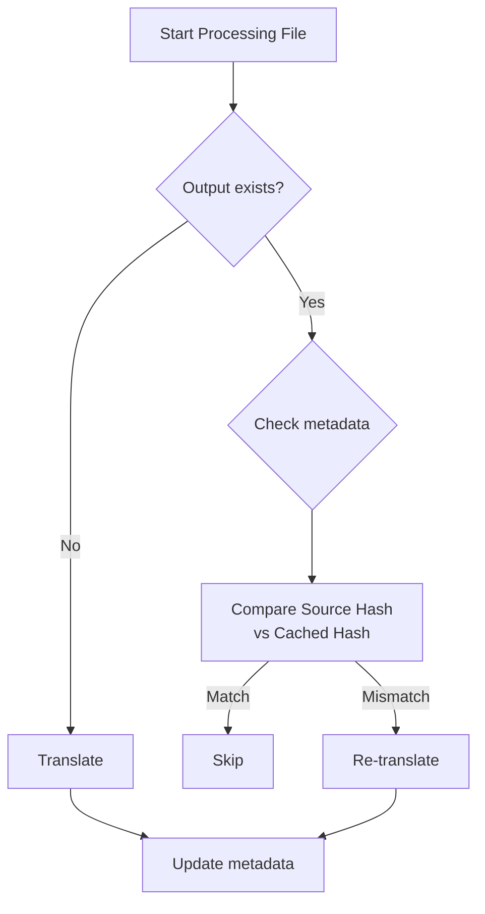
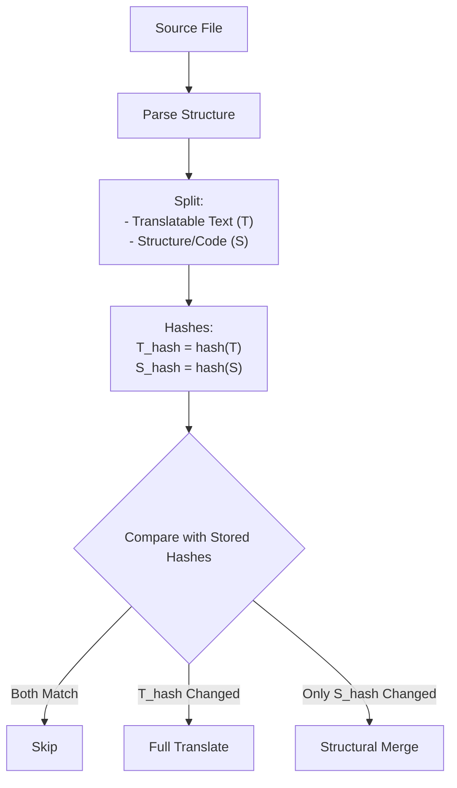

```mermaid
graph TD
    A[Start Processing File] --> B{Output exists?}
    B -->|No| C[Translate]
    B -->|Yes| D{Check metadata}
    D --> E[Compare Source Hash<br>vs Cached Hash]
    E -->|Match| F[Skip]
    E -->|Mismatch| G[Re-translate]
    C --> H[Update metadata]
    G --> H
```

### Proposed Solution: Triple-Hash System

```mermaid
graph TD
    A[Source File] --> B[Parse Structure]
    B --> C["Split:
    - Translatable Text (T)
    - Structure/Code (S)"]
    C --> D["Hashes:
    T_hash = hash(T)
    S_hash = hash(S)"]
    D --> E{Compare with Stored Hashes}
    E -->|Both Match| F[Skip]
    E -->|T_hash Changed| G[Full Translate]
    E -->|Only S_hash Changed| H[Structural Merge]
```

