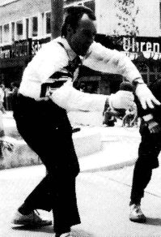
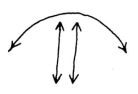
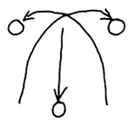

### Die Säulen-Seite
Quelle: [[Kaskade 001#Die Säulen-Seite]]

{ align=left }
Dr. P. Luftiko (siehe Bild)

O.K. Du kannst jetzt 2 Bälle in einer Hand jonglieren, mit links genauso wie mit rechts. Du könntest es jetzt mit 4 versuchen. Aber warte noch ein bißchen! Es gibt Hunderte von Möglichkeiten, diese Fähigkeit mit 3 Bällen in der "Säulen"-Form zu gebrauchen, die Deine Freunde in Erstaunen versetzen würden und Dein Publikum zum Brüllen bringt.

Die Grundform der "Säulen": 2 Bälle in der rechten Hand parallel zueinander geworfen (d.h. nicht im Kreis), während die linke Hand den 3. im gleichen Rhythmus hochwirft, wie die recht Hand den äußeren Ball wirft.

Mit diesem Grundrhythmus kannst Du durch kleine Veränderungen dieses Thema unendlich variieren. Du kannst die Flugbahnen ändern und die Hand wechseln, mit der Du 2 jonglierst.

In den folgenden Beschreibungen beziehen sich die Begriffe "Einzel(ball)" und "Doppel(bälle)" auf die Flugbahnen und nicht auf die Anzahl der Bälle in jeder Hand. D.h. bei der Grundform, daß der Einzelball in der Mitte und die Doppelbälle außen springen.

#### Tennis

Der Einzelball wird anfangs ganz rechts hochgeworfen,

dann fliegt er im hohen Bogen nach links und wieder zurück, immer hin und her. Die Flugbahnen sehen so aus:

Die Doppelbälle bilden das "Netz" (Du könntest dabei vielleicht Tennisschlägergeräusche machen oder John McEnroe nachmachen!)

#### Hürden

Der Anfang ist ähnlich wie beim Tennis, bloß diesmal macht der Einzelball eine Zwischenlandung in der Mitte.

Jeder der beiden Doppelbälle stellt ein Hürde dar. (Wenn Du bei jeder Landung des Einzelballs "boing" sagst, hat der Zuschauer den Eindruck, daß der Ball dotzt.)

#### Kreuzung

Natürlich kannst Du auch mit den Doppelbällen Tricks machen. Hier kreuzen sie sich.

Obwohl Du die Vorsichtsmaßnahme getroffen hast, den einen Doppelball etwas höher als den anderen zu werfen, wirst Du leider allzuoft erleben, daß sie in der Mitte zusammenstoßen und unkontrollierbar wegfliegen. Keine Bange! Mit Übung wirst Du diesen Zusammenstoß absichtlich hinkriegen, ohne daß die 2 Bälle in unterschiedliche Richtungen außerhalb Deiner Reichweite entkommen.

Je höher der Zusammenstoß, desto begeisterter die Zuschauer.

#### Gekreuzte Arme

Versuche den rechten Doppelball mit der linken Hand und gleichzeitig den linken Doppelball mit Deiner rechten zu fangen. Das Fangen ist normalerweise nicht so arg schwierig, aber dann das senkrechte Hochwerfen...!! Übe nur mit den Doppelbällen, bis dies klappt, bevor Du wieder den Einzelball dazunimmst.

#### Schulterwürfe
(für Fortgeschrittene!)

Anstatt die Doppelbälle einfach senkrecht hochzuwerfen, schmeiße sie von hinten über die Schultern, mit der rechten Hand über die rechte Schulter und links über links. Wenn Du Dich nicht richtig warm gemacht hast, wirst Du Dir die Schultern dabei verrenken. Wenn sich die Doppelbälle gegen Deinen Willen über Deinem Kopf kreuzen, dann hast Du anscheinend das gleiche Problem wie ich!

