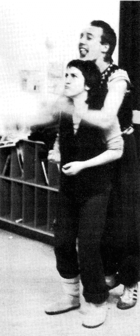

## Eine neue Zeitschrift für Europas
[[Kaskade 001#Eine neue Zeitschrift für Europas]]

Wir sind total verrückt! Nicht nur daß wir seit einem Jahr die 7. Europäische Jonglierwoche mitorganisieren, nein, wir wollen uns auch noch die Arbeit machen, in Frankfurt eine europäische Jonglierzeitschrift herauszugeben.

Aber das gehört auch eng zusammen:

Wir bekamen so viele begeisterte Briefe und Anrufe von Jongleuren aus ganz Európa, jeder war anders, jeder hatte eine neue Idee, erzählte von einem Auftritt, einer Tournee, von einem Theatertreffen hier und einem Jongleurfest da (z.B. Covent Garden, Bremen oder Kopenhagen) und gemeinsam hatten sie alle die Vorfreude auf das Zusammentreffen und den Austausch mit anderen Jongleuren.

Da fiel uns die Idee wieder ein, die in Laval bei dem letzten Jongleurtreffen schon herumschwirrte: "Es wäre toll, wenn es eine Jongleurzeitschrift für Europa gäbe, damit wir auch über die jährlichen Treffen hinaus in Kontakt bleiben können und erfahren können, wo Jongleure ihr Unwesen treiben. Es müßte nur jemand in die Hand nehmen." OK. Wir machen es.

Und wie stellen wir uns das vor? Wir möchten gerne ein Zeitschrift schaffen für alle Jongleure in Europa, von Anfängern bis Profis, unabhängig davon, ob sie einer Organusation wie der IJA angehören oder nicht. Dies bringt zunächst vor allem das sprachliche Problem auf den Tisch, denn ein wichtiger Grund für eine europäische Zeitschrift ist ja auch, daß "Jugglers World" (außer daß sie nur über amerikanische Ereignisse berichtet) nur in Englisch erscheint. Nicht jeder Jongleur kann und will eine englische Zeitschrift lesen. Also erscheint die europäische Zeitschrift erst mal in English und Deutsch. (Hoffentlich sind die Autoren mit unserer freien Übersetzung einverstanden!)

Wir hätten gerne die erste Ausgabe auch in Französisch herausgegeben, aber das scheiterte leider an "jonglierfachlichen" Sprachkenntnissen und Zeit. Vielleicht findet sich ja jemand, der sich anbietet, die nächsten Ausgaben ins Französische zu übersetzen?! Vielleicht gibt es ja auch Bedarf und Übersetzer für andere Sprachen?

Inhaltlich haben wir uns folgende Gedanken gemacht: Wir möchten von Jongliergruppen und einzelnen Jongleuren berichten, wie sie zum Jonglieren gekommen sind, was ihnen daran besonderen Spaß macht, ihre Ideen und Träume um das Jonglieren... Wir möchten von Auftrittserfahrungen in ganz Europa schreiben (auf der Straße, in Theatern, unter der Zirkuskuppel ...) und Anekdoten von der Straße erzählen. Es wäre gut, auch "Kritiken" von gesehenen Shows, Jonglierbüchern usw. zu bringen

Außerdem möchten wir gerne Rubriken einrichten, wie: Anleitung zum Requisitenbau, Sprachtips für Auslandstourneen, Extrahobbys (Zaubern...), Tips und Tricks (z.B. suchen wir jemand, der eine regelmäßige Workshopseite schreibt), Veranstaltungskalender (Festivals Auftritte, Gruppentreffen...) und Kleinanzeigen (Tourneepartner gesucht, Keulen zu verschenken..)

Natürlich können und wollen wir diese Artikel nicht alle selber schreiben. Wir verstehen uns mehr als Sammelstelle, "lay-outer" und Herausgeber. Wir beide können nicht überall in Europa gleichzeitig sein, aber Ihr alle zusammen könnt das!

Deshalb bitten wir Euch, uns Artikel und gute Bilder zu schicken, über alle Ereignisse und Geschichten, die Ihr erlebt habt und uns alle Infos und Termine zukommen zu lassen, die entfernt und konkret etwas mit jonglieren zu tun haben. Wir würden uns wünschen, einen festen "Korrespondenten" und Ansprechpartner in jedem Land zu haben, damit es eine wirklich europäische Zeitschrift werden kann.

{ align=left }

### **Jongleure**

Mit diesen Ideen haben wir uns an einige Jongleure und Jongliergruppen gewandt, die uns daraufhin mit Artikeln, Infos, Ideen, Anzeigen und lieben Briefen geholfen haben, diese erst Ausgabe möglich zu machen. Vielen vielen Dank an alle.

Der letzte Punkt ist die Finanzierung. Die Zeitschrift soll zunächst vierteljährlich erscheinen. Da wir die Auflage vorausplanen müssen und selber kein großes finanzielles Risiko eingehen können, ist die Zeitschrift nur über Abonnement und Vorauszahlung zu beziehen. (Wer mehrere Hefte für z. B. den Ladenverkauf will, der wende sich bitte direkt an uns.)

Der Preis ist kostendeckend berechnet d.h. Papier, Letraset, Porto, Kopien, Bilder, und vor allem Druck unsere Arbeitszeit natürlich ausgenommen.

Also, nehmt Euch alle den Abo-Schnipsel, füllt ihn aus und bringt ihn uns vorbei oder schickt ihn uns mit der Post, falls Ihr uns auf dem Treffen nicht findet. Über Anzeigenkunden und vor allem Spenden freuen wir uns natürlich riesig!

Wir hoffen, Euch gefällt unsere Idee und freuen uns auf Eure Anregungen und Kritik, und darauf, die nächste Ausgabe mit Euren Artikeln zusammenzustellen. Viel Spaß beim Lesen.

*Gabi & Paul*