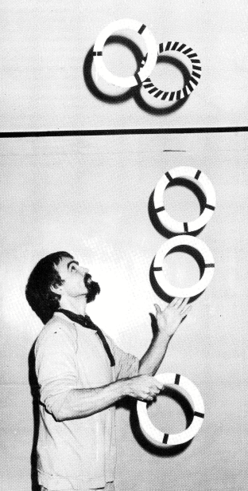
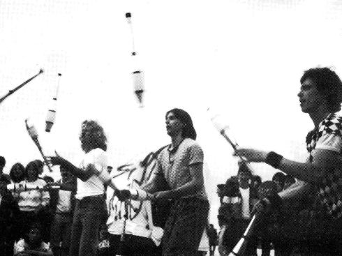
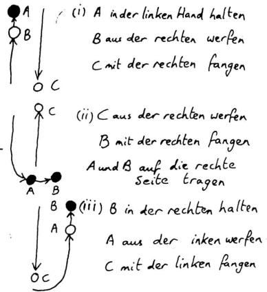
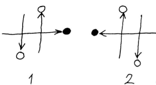

## Eine neue Zeitschrift für Europas
[[Eine neue Zeitschrift für Europa]]

Wir sind total verrückt! Nicht nur daß wir seit einem Jahr die 7. Europäische Jonglierwoche mitorganisieren, nein, wir wollen uns auch noch die Arbeit machen, in Frankfurt eine europäische Jonglierzeitschrift herauszugeben.

Aber das gehört auch eng zusammen:

Wir bekamen so viele begeisterte Briefe und Anrufe von Jongleuren aus ganz Európa, jeder war anders, jeder hatte eine neue Idee, erzählte von einem Auftritt, einer Tournee, von einem Theatertreffen hier und einem Jongleurfest da (z.B. Covent Garden, Bremen oder Kopenhagen) und gemeinsam hatten sie alle die Vorfreude auf das Zusammentreffen und den Austausch mit anderen Jongleuren.

Da fiel uns die Idee wieder ein, die in Laval bei dem letzten Jongleurtreffen schon herumschwirrte: "Es wäre toll, wenn es eine Jongleurzeitschrift für Europa gäbe, damit wir auch über die jährlichen Treffen hinaus in Kontakt bleiben können und erfahren können, wo Jongleure ihr Unwesen treiben. Es müßte nur jemand in die Hand nehmen." OK. Wir machen es.

Und wie stellen wir uns das vor? Wir möchten gerne ein Zeitschrift schaffen für alle Jongleure in Europa, von Anfängern bis Profis, unabhängig davon, ob sie einer Organusation wie der IJA angehören oder nicht. Dies bringt zunächst vor allem das sprachliche Problem auf den Tisch, denn ein wichtiger Grund für eine europäische Zeitschrift ist ja auch, daß "Jugglers World" (außer daß sie nur über amerikanische Ereignisse berichtet) nur in Englisch erscheint. Nicht jeder Jongleur kann und will eine englische Zeitschrift lesen. Also erscheint die europäische Zeitschrift erst mal in English und Deutsch. (Hoffentlich sind die Autoren mit unserer freien Übersetzung einverstanden!)

Wir hätten gerne die erste Ausgabe auch in Französisch herausgegeben, aber das scheiterte leider an "jonglierfachlichen" Sprachkenntnissen und Zeit. Vielleicht findet sich ja jemand, der sich anbietet, die nächsten Ausgaben ins Französische zu übersetzen?! Vielleicht gibt es ja auch Bedarf und Übersetzer für andere Sprachen?

Inhaltlich haben wir uns folgende Gedanken gemacht: Wir möchten von Jongliergruppen und einzelnen Jongleuren berichten, wie sie zum Jonglieren gekommen sind, was ihnen daran besonderen Spaß macht, ihre Ideen und Träume um das Jonglieren... Wir möchten von Auftrittserfahrungen in ganz Europa schreiben (auf der Straße, in Theatern, unter der Zirkuskuppel ...) und Anekdoten von der Straße erzählen. Es wäre gut, auch "Kritiken" von gesehenen Shows, Jonglierbüchern usw. zu bringen

Außerdem möchten wir gerne Rubriken einrichten, wie: Anleitung zum Requisitenbau, Sprachtips für Auslandstourneen, Extrahobbys (Zaubern...), Tips und Tricks (z.B. suchen wir jemand, der eine regelmäßige Workshopseite schreibt), Veranstaltungskalender (Festivals Auftritte, Gruppentreffen...) und Kleinanzeigen (Tourneepartner gesucht, Keulen zu verschenken..)

Natürlich können und wollen wir diese Artikel nicht alle selber schreiben. Wir verstehen uns mehr als Sammelstelle, "lay-outer" und Herausgeber. Wir beide können nicht überall in Europa gleichzeitig sein, aber Ihr alle zusammen könnt das!

Deshalb bitten wir Euch, uns Artikel und gute Bilder zu schicken, über alle Ereignisse und Geschichten, die Ihr erlebt habt und uns alle Infos und Termine zukommen zu lassen, die entfernt und konkret etwas mit jonglieren zu tun haben. Wir würden uns wünschen, einen festen "Korrespondenten" und Ansprechpartner in jedem Land zu haben, damit es eine wirklich europäische Zeitschrift werden kann.

{ align=left }

### **Jongleure**

Mit diesen Ideen haben wir uns an einige Jongleure und Jongliergruppen gewandt, die uns daraufhin mit Artikeln, Infos, Ideen, Anzeigen und lieben Briefen geholfen haben, diese erst Ausgabe möglich zu machen. Vielen vielen Dank an alle.

Der letzte Punkt ist die Finanzierung. Die Zeitschrift soll zunächst vierteljährlich erscheinen. Da wir die Auflage vorausplanen müssen und selber kein großes finanzielles Risiko eingehen können, ist die Zeitschrift nur über Abonnement und Vorauszahlung zu beziehen. (Wer mehrere Hefte für z. B. den Ladenverkauf will, der wende sich bitte direkt an uns.)

Der Preis ist kostendeckend berechnet d.h. Papier, Letraset, Porto, Kopien, Bilder, und vor allem Druck unsere Arbeitszeit natürlich ausgenommen.

Also, nehmt Euch alle den Abo-Schnipsel, füllt ihn aus und bringt ihn uns vorbei oder schickt ihn uns mit der Post, falls Ihr uns auf dem Treffen nicht findet. Über Anzeigenkunden und vor allem Spenden freuen wir uns natürlich riesig!

Wir hoffen, Euch gefällt unsere Idee und freuen uns auf Eure Anregungen und Kritik, und darauf, die nächste Ausgabe mit Euren Artikeln zusammenzustellen. Viel Spaß beim Lesen.

*Gabi & Paul*

## Zirkus gesucht!
**Ein Bericht zweier Clowns, die keine Lust mehr hatten, in der DDR zu leben**
[[Zirkus gesucht!]]
### Von Streuselschnecke ...

Wie der ganze Zirkus angefangen hat? Na, das ist fast eine unendliche Geschichte....

{ align=left }

Uli liebte den Geruch von frischem Holz, wurde Tischler, ging als Handwerker zum Zirkus und begann zu jonglieren. Kattrin wußte nichts besseres und studierte Schauspiel. Uli kam mach Berlin zurück und wollte auf einem Fest sein Können zeigen. Allerdings trank er vor Aufregung zuviel und die Bälle machten mit ihm, was sie wollten. So lernten wir uns kennen und Uli wurde Kattrins Jonglierlehrer.

Das war im Februar 1980, und wir entdeckten bald unsere gemeinsame Ader für das Komische. Im Herbst hatten wir unseren ersten Auftritt unter dem Namen ULK. (Die Anfangsbuchstaben von Uli und Kattrin)

Aber es war gar nicht ulkig, eher blamabel. Aber aller Anfang ist schwer, wir übten weiter: Steppen, Jonglieren, Pantomieme... Da es in der DDR keine Workshops gibt, waren wir auf private Unterstützung angewiesen.

Im Sommer 1981 war Kattrin mit ihrem Studium fertig und mußte für drei Jahre als Absolvent an ein Theater gehen. So sah das Gesetz es vor, sonst hätte sie keinen Studienabschluß erhalten. Und ohne Abschluß ist man nichts in der DDR. Das bedeutet: Egal wie gut jemand ist, oder was er kann, ohne staatlichen Abschluß darf er nicht auftreten, also auf seinem Gebiet nicht arbeiten. Und wer nicht arbeitet, ist asozial, und wer asozial ist, wird eingeknastet.

Aber Ihr müßt nicht denken, daß es dadurch keine eigene Initiative mehr gibt: Im Gegenteil, denn in der Not erfindet der Teufel die Fliege. In Ateliers, Dachböden, Wohnungen finden Lesungen, Ausstellungen, Konzerte, Theaterprogramme statt. Einfach so auf der Straße aufzutreten, ist verboten, aber dennoch machen es manche, obwohl sie mit hohen Geldstrafen zu rechnen haben.

Aber nun zurück zu uns. Kattrin ging ans Theater, aber nach einem halben Jahr mußte der Absolventenvertrag aus gesundheitlichen Gründen aufgehoben werden. Sie kam nach Berlin zurück und wir probierten ein Clownsprogramm für Kinder, bauten Requisiten und unsere Bühne.

Uli hatte, während Kattrin am Theater arbeitete, unseren Hund Cato (reinrassiger englischer Hühnerhund) dressiert. Cato wurde unser Zirkuslöwe.

Kattrin beantragte beim Magistrat ihre Auftrittszulassung, die sie durch ihr abgeschlossenes Schauspielstudium ohne Probleme erhielt. Da Uli nichts dergleichenn vorweisen konnte, hätte er eigentlich gar nicht auftreten dürfen. So wurde er Kattrins "Assistent". Durch die Überorganisation des Erlaubniswesens fiel das nicht auf.

Ebenso bei Clemens, der unser Techniker wurde. (Er wartet leider immer noch auf seine Ausreise.) Clemens hatte ein Auto, na Auto ist wohl übertrieben: Es hieß Herbert, war älter als wir und war eigentlich ein Vollinvalide. Aber, Gott sei gedankt, blieb es immer nur auf den Rückfahrten stehen. Ein treues Gefährt. Das Tandem hatten wir für alle notfälle dabei, bis es uns gestohlen wurde.

Nun wollten wir für unser Programm Werbung machen. Dazu müßt Ihr wissen, daß es in der DDR keine Fotokopiergeräte gibt. Drucken lassen kann man auch nicht ohne weiteres. Wir hätten erstmal unseren Namen "Kinderzirkus Streuselschnecke" staatlich genehmigen lassen müssen. Dazu hatten wir auch keine Lust. Also schrieben wir alles mit der Hand und beklebten die Karten mit einem Buntpapierclown. es war mühsam, aber es machte Spaß.

Wir bekamen viele Angebote, da wir in unserer Art einzig in der DDR waren, und weil wir durch unsere Einfachheit, Lustigkeit und Spielfreude eine Alternative zum staatlich geförderten Angebot darstellten.

### ... zu Pusteblume

Als wir ein Jahr später unser Programm der staatliche Konzert- und Gastspieldirektion zeigten, um eine Gruppeneinstufung zu bekommen, damit Uli als Kattrins Partner anerkannt wird, sagte die Kommission, unser Programm enthalte keine pädagogischen Werte.

{ align=right}

Also erhielten wir nichts und schummelten uns weiter durch, immer wissend, daß entdeckt werden könnte, daß Uli gar nicht auftreten darf. (Zwei Wochen vor unserer Ausreise kam es heraus.)

Im Sommer 83, als wir bei einem kirchlichen Friedensfest spielen wollten, legte uns ein Kulturfunktionär nahe, dies sein zu lassen, denn sonst würden wir Auftrittsverbot für die gesamte DDR erhalten.

Vorfälle ähnlicher Art machten uns immer klarer, daß wir an die Grenzen der Möglichkeiten unserer Arbeit und Pläne stießen. Darum mußten und wollten wir über kurz oder lang die DDR verlassen.

Seit März leben wir nun hier. Wir sind dabei, wieder ein Programm für Kinder aufzubauen. Wir heißen jetzt nicht mehr Streuselschnecke, da dieses Gebäck hier nicht bekannt ist, sondern "Kinderzirkus Pusteblume".

Unser tiefer Traum ist es, in ein paar Jahren einen Zirkus zu gründen, in dem liebe und lustige Leute mitmachen sollen. Aber leider fehlt das Geld für diesen Traum. Es wäre schade, wenn es daran scheitern würde.

Deswegen wäre es schön, wenn ihr mithelft, diesen Traum zu verwirklichen und ein bißchen Geld dafür auf unser extra dafür eingerichtetes Konto überweist:

Bankleitzahl: 42060021
Volksbank Gelsenkirchen)
Kontonummer: 518.503.240
Und wenn es nur eine Mark ist, denn Kleinvieh macht auch einen Zirkus.

Vielen Dank, und wenn Ihr mehr Interesse an diesem Projekt habt, oder Ihr etwas über den Kinderzirkus Pusteblume wissen wollt, dann schreibt an:

Kattrin Kupke & Uli Zschau
Arminstr.10
4650 Gelsenkirchen
Tel.:0209/27 16 42

Also auf bald oder auch nicht
*Kattrin & Uli*

## Lächeln überwindet Schwerkraft
**Brief von Toby Philpott, Europäischer Direktor der IJA**
[[Lächeln überwindet Schwerkraft]]

Seit zwei Jahren trage ich den Titel "Europäischer Direktor der International Jugglers Association" (IJA) Das ist ein Titel, den W.C.Fields geliebt hätte, da er so wichtig und mysteriös (lingt klingt und fast nichts bedeutet. Ich "dirigiere" niemanden und verbringe den Großteil meiner Zeit in England.

{ align=left }

Die IJA begann als eine kleine Gruppe von Freunden und ist jetzt eine große Organisation mit Hunderten von Mitgliedern in Amerika. Das erste europäische Jongleurtreffen bestand ebenfalls nur aus einer kleinen Gruppe von Freunden in England, aber es war der erste Schritt, das Wort "International" zu rechtfertigen. Heute zieht dieses Treffen Menschen aus mehr als zehn verschiedenen Ländern an.

Die Treffen werden größer und es kommen auch viele Nicht-Mitglieder. Die meisten von ihnen sehen keinen Grund, der IJA beizutreten, wenn das einzige, was sie davon haben, ein amerikanisches Magazin und eine Adressenliste ist, die sie nie gebrauchen werden.

Das kann ich verstehen. Wenn es die IJA nicht geben würde, würde ich immer noch gerne andere Jongleure treffen (nicht nur die Leute, die von mir gelernt haben), ich würde wissen wollen, wo ich Requisiten kaufen kann, wo ich Shows sehen kann, wo ich auf der Straße auftreten kann. Ich würde immer noch Ideen teilen wollen und Leute sehen wollen, die besser jonglieren als ich selbst. Ich habe das meiste davon auch machen können bevor ich von der IJA gehört hatte, aber ich habe mehr gesehen und getan, seit wir angefangen haben, Treffen in Europa zu organisieren. Diese Treffen sind der beste Grund dafür, eine offizielle Organisation zu haben. Es ist keine Gewerkschaft, und wir können keine Auftritte vermitteln oder gar Freundschaften garantieren.

Ich glaube, daß Europa einen Vertreter im amerikanischen IJA Vorstand haben sollte, der Kontakt mit den alteingesessenen Mitgliedern in den Staaten und anderen Ländern hält, und der beginnen sollte, die Organisation wirklich zu einer internationalen zu machen.

Wenn ich den Saal eines Jongleurtreffens betrete, sehe ich zwei grundsätzliche Typen von Menschen. Manche arbeiten übend, schwitzend und Techinken perfektionierend, ihre eigenen Grenzen sprengend. Ich nenne diese die Olympianer, um diese Suche nach Perfektion, sportlichen Kampfgeist und den Anhauch von griechischen Göttern und Göttinnen zu unterstreichen Superhelden.

Andere sind gekommen, um zu spielen, sie lachen und scherzen, experimentieren, improvisieren, tauschen Ideen aus und haben Spaß. Ich nenne sie die "Fahrenden Spieler" und sie sind die einfachen Sterblichen, die Gaukler, die ihre Fähigkeiten zur Improvisation nutzen, wie alle Fahrenden und Spieler es tun müssen.

Du denkst vielleicht, daß jemand mit einem Titel wie "Europäischer Direktor" ein "Olympianer" wäre. Eigentlich habe ich jonglieren als Jux während einer faulen Phase meines Lebens angefangen. Jetzt habe ich einige Jahre als Performer und als Lehrer hinter mir, aber ich will immer den Spaß an der Sache vermitteln, ich erwarte keine Goldmedaille.

Wir brauchen die Helden und die Clowns. Die Olympianer können uns zeigen, was mit Hingabe möglich ist, sie setzen neue Maßstäbe und sie selber können sich an einem Publikum erfreuen, das wirklich die Arbeit anerkennen kann, die in jeder einzelnen Bewegung steckt.

Die Fahrenden Spieler sind diejenigen, die neue Leute hereinbringen, die neuen Jongleuren zum Start verhelfen, die das Wort verbreiten und die unterhalten.

Du wirst dies in einer Zeitschrift lesen, die von zwei Deutschen angegangen wurde, die gerne mehr Europäer in der IJA sehen würden.

Ich schreibe dies als Brief, weil ich kein Journalist bin und ich mache meine Fehler in der Öffentlichkeit, wie üblich. Wenn Du willst, daß diese Zeitschrift weitergeht, bitte schreibe den Herausgebern der Zeitschrift oder sende Fotos. Wenn Du willst, daß Europa eine wichtigere Rolle in der IJA spielt, schreibe mir, und ich werde versuchen, unsere Position den anderen Vorstandsmitgliedern zu erklären. Wenn Du lieber eine unabhängige europäische Gruppe hättest, dann leg los und gründe eine. Ich denke, es wäre schade, sich gänzlich von einer Organisation zu spalten, die seit 37 Jahren besteht und Mitglieder in vielen Ländern hat.

Übrigens, wenn Du denkst, daß ein richtiger Olympianer ein besserer Sprecher für Europa wäre, dann kannst Du selber kandidieren, oder finde einen jonglierenden Politiker, der unser Vertreter für 1985 sein soll.
In der Zwischenzeit hoffe ich, Dich zu sehen, während unserer paar Tage zusammen. Und vergiß nicht: Lächeln überwindet Schwerkraft. (Das ist ein guter Slogan, um eine Wahl zu gewinnen, oder um unseren Übersetzern Kopfschmerzen zu bereiten.)

## Autonome Jongliergruppe Wiesbaden und die 7. Europäische Jonglierwoche
**Schwerkraft - na und!**
[[Schwerkraft - na und!]]

Erst seit relativ kurzer Zeit besteht die autonome Jongliergruppe SCHWERKRAFT NA UND! aus Wiesbaden oder besser noch aus der Rhein-Main-Gegend.
Noch im August 1982 gab es in Wiesbaden nur wenige Jongleure, die kaum etwas voneinander wußten. Durch Zufall kamen die drei der ersten Stunde, Paul, Uli und Christoph zusammen, jonglierten dann in Wiesbadens Grünanlagen und beschlossen, wenige Wochen später zum 5. Europäischen Jongliertreffen nach Kopenhagen zu fahren.

{ align=right}

Fritz aus Frankfurt kam mit. Nach dem Motto: "Nur was man tut, wird getan" und unter dem Eindruck des Kopenhagener Treffens wollte Fritz das 6. Europäische Treffen in Frankfurt veranstalten. Er unterlag bei der Abstimmung in Kopenhagen mit seiner spontanen Idee den besser vorbereiteten Jongleuren aus Frankreich.

Paul und Christoph noch mit der Begeisterung des in den letzten drei Tagen in Kopenhagen Erlebten standen nachdenklich aber voller Ideen an der Reeling der Fähre zurück nach Deutschland. Die Gründung der autonomen jongliergruppe schwerkraft-na und! nahm hier ihren Anfang.

Seitdem treffen sich die Jongleure jeden Donnerstag von 17.00-22.00 Uhr im Sommer im Nero-Park und im Winter im Haus der Jugend, einer Räumlichkeit, die vom Jugendamt der Stadt Wiesbaden zur Verfügung gestellt wird.
Innerhalb kürzester Zeit war die Gruppe auf 20 Leute angewachsen.

Jede Woche neue Gesichter, aber jede Woche wurden auch Leute vermißt, die nie wieder im Club gesehen wurden. Ein harter Kern von 10-15 Leuten hat sich mittlerweile herauskristallisiert.
Der offene Charakter der Gruppe und die Organisation nach dem Lustprinzip macht es äußerst schwierig, das gemeinsame Potential wirkungsvoll in Auftrittskonzepten umzusetzen. Trotz gemeinsam angeschaffter Jonglierutensilien, wie 14 Einräder, Keulen, Ringe, Rola-Bolas, Devil-Sticks etc. und einem relativ hohen Standard an Können unterscheiden sich die Jongliertechniken der einzelnen untereinander doch erheblich, so daß mehrere festere Kleingruppen entstanden sind, wie JOMIPO-Luftiko, Werner WAHNSINN & Christoph CHAOS Katinka und die Flohjonglage usw.
Differierendes Können und unterschiedliche Auftrittskonzepte dieser Gruppen macht es Neuanfängern schwer, die zur autonomen Jongliergruppe stoßen, in ihr integriert zu werden, während Einzelkönner es leichter haben.

Diese Entwicklung ist im Club oft diskutiert worden, aber bisher sind noch keine konkreten Anstrengungen zu Änderungen unternommen worden.

Trotzdem finden zu den verschiedensten Gelegenheiten gemeinsame Auftritte statt. Auf Straßenfesten, bei Ferienspielen und Festivals, auch bei Hochzeiten, in Jugendzentren und Schulen ist die Gruppe aufgetreten. Wir haben auch bei "Künstler für den Frieden" im Mai 1983 in Darmstadt gespielt, eine Fernsehsendung mit dem Südwestfunk gemacht, sowie einen Auftritt im Rahmen des Berliner Sommernachtstraumes beim "Größten Feuertheater des Jahrhunderts" von André Heller im Juli 1984.

In der Zwischenzeit reifte Fritz' Idee, ein europäisches Jongliertreffen zu veranstalten, heran.
Bei Verhandlungen mit der Stadt Frankfurt erreichten wir, daß ein großer Teil der Saalmiete für das Volksbildungsheim übernommen wurde.
Die zentrale Lage des Veranstaltungsortes in der Innenstadt und der Reiz der "Weltstadt Frankfurt", brachte den Ausschlag beim Geschäftstreffen in Laval, die 7. Europäische Jonglierwoche in Frankfurt zu veranstalten.
Seit diesem Termin hatten wir es uns zur Aufgabe gemacht, das nächste Treffen noch bunter, noch abwechslungsreicher und vor allem noch öffentlichkeitswirksamer zu gestalten. Die ursprüngliche, wilde Idee von Fritz war ein spektakuläres Treffen zu arrangieren, dessen Höhepunkt in einer Feuerjonglage endet, mit 500 Jongleuren und ihren 1500 Feuerkeulen zu den berauschenden Rhythmen einer Rock-Band vor dem Prestige- und Prunkbau der Frankfurter Oper beim Schein des Vollmondes.

Es soll eine Chance sein, das Flair der Bank- und Businessstadt wenigstens für 4 Tage zu kippen, Phantasie in die Straßenschluchten, in den Beton zu bringen. Den Menschen der Stadt ein anderes Lebensgefühl nahezubringen, sie zum Schmunzeln oder gar zum Lachen zu bringen. "Chaos ist angesagt. Turbulent soll es werden. Bunt wird es sein." (Frankfurter Rundschau)
Die Frage der Planbarkeit solcher Ideen haben wir lange diskutiert. An der Praxis der städtischen Behörden scheiterten viele geplante Aktionen, was aber spontane Ideen der Jongleure nicht verhindern soll.

Gleichzeitig wurde die Wichtigkeit einer Verbreitung dieser Ideen durch sämtliche Medien erörtert. Der Konflikt zwischen Veröffentlichung und der vielleicht berechtigten Angst vor Ausschlachtung und Vermarktung unserer Phantasien, Ideen und unseres Könnens durch die Medien, ließ ein Filmprojekt scheitern.

Gegen eine bloße Berichterstattung durch Presse, Funk und Fernsehn hatten wir nichts einzuwenden.
Eine Pressemitteilung ging an dpa und sämtliche große überregionale und lokale Zeitungen. Am 1. September haben wir in einer Jonglier- und Plakataktion in Frankfurts Einkaufsstraßen und am 10. September mit einer für Frankfurt sicherlich unüblichen Pressejongliershowplakatwandsprühaktionskonferenz auf das Spektakel der Jongleure hingewiesen.

Die Umsetzbarkeit aller Ideen muß sich auch am Anspruch der Veranstaltung orientieren. Viele Jongleure kommen, um ihre jonglierenden Freunde aus ganz Europa zu treffen, um Erfahrungen auszutauschen und um selbst ein anderes Lebensgefühl von gleichgesinnten mitzuerleben, ohne selbst unter dem Druck zu stehen, dieses Gefühl an andere vermitteln zu müssen. Man trifft sich auch, um ein bißchen unter sich zu sein. Dieser Anspruch ist sicher nicht arrogant und öffentlichkeitsfeindlich, denn viele produzieren sich das ganze Jahr für das Lebensgefühl anderer Leute nach außen.

Aber auch die Organisation aller anderen, nach außen hin wenig sichtbaren aber meistens wichtigen Punkte mußte gelöst werden:
Haben wir genug Schlafplätze? Wer sorgt für Verpflegung? Wie soll die Publik Show organisiert werden? Wie teilen wir den Kassen-und Kartendienst ein? Wo lassen wir Plakate drucken? Behördliche Genehmigungen für jeden gelassenen oder beabsichtigten Furz vor, während und nach der Jonglierwoche besorgen. usw...

Alles in Allem hat uns die Organisation der 7. Europäischen Jonglierwoche Spaß gemacht und wir hoffen, daß es allen Jongleuren und sonstwie Beteiligten ebenso geht und sie sich an Frankfurt 1984 mit gutem Gefühl erinnern und mit neuen Impulsen und Ideen nach Hause kommen.

Christoph Schmitt

## KASKADE workshop
### Die Säulen-Seite
[[Die Säulen-Seite]]

{ align=left }
Dr. P. Luftiko (siehe Bild)

O.K. Du kannst jetzt 2 Bälle in einer Hand jonglieren, mit links genauso wie mit rechts. Du könntest es jetzt mit 4 versuchen. Aber warte noch ein bißchen! Es gibt Hunderte von Möglichkeiten, diese Fähigkeit mit 3 Bällen in der "Säulen"-Form zu gebrauchen, die Deine Freunde in Erstaunen versetzen würden und Dein Publikum zum Brüllen bringt.

Die Grundform der "Säulen": 2 Bälle in der rechten Hand parallel zueinander geworfen (d.h. nicht im Kreis), während die linke Hand den 3. im gleichen Rhythmus hochwirft, wie die recht Hand den äußeren Ball wirft.

Mit diesem Grundrhythmus kannst Du durch kleine Veränderungen dieses Thema unendlich variieren. Du kannst die Flugbahnen ändern und die Hand wechseln, mit der Du 2 jonglierst.

In den folgenden Beschreibungen beziehen sich die Begriffe "Einzel(ball)" und "Doppel(bälle)" auf die Flugbahnen und nicht auf die Anzahl der Bälle in jeder Hand. D.h. bei der Grundform, daß der Einzelball in der Mitte und die Doppelbälle außen springen.

#### Tennis

Der Einzelball wird anfangs ganz rechts hochgeworfen,

dann fliegt er im hohen Bogen nach links und wieder zurück, immer hin und her. Die Flugbahnen sehen so aus:

Die Doppelbälle bilden das "Netz" (Du könntest dabei vielleicht Tennisschlägergeräusche machen oder John McEnroe nachmachen!)

#### Hürden

Der Anfang ist ähnlich wie beim Tennis, bloß diesmal macht der Einzelball eine Zwischenlandung in der Mitte.

Jeder der beiden Doppelbälle stellt ein Hürde dar. (Wenn Du bei jeder Landung des Einzelballs "boing" sagst, hat der Zuschauer den Eindruck, daß der Ball dotzt.)

#### Kreuzung

Natürlich kannst Du auch mit den Doppelbällen Tricks machen. Hier kreuzen sie sich.

Obwohl Du die Vorsichtsmaßnahme getroffen hast, den einen Doppelball etwas höher als den anderen zu werfen, wirst Du leider allzuoft erleben, daß sie in der Mitte zusammenstoßen und unkontrollierbar wegfliegen. Keine Bange! Mit Übung wirst Du diesen Zusammenstoß absichtlich hinkriegen, ohne daß die 2 Bälle in unterschiedliche Richtungen außerhalb Deiner Reichweite entkommen.

Je höher der Zusammenstoß, desto begeisterter die Zuschauer.

#### Gekreuzte Arme

Versuche den rechten Doppelball mit der linken Hand und gleichzeitig den linken Doppelball mit Deiner rechten zu fangen. Das Fangen ist normalerweise nicht so arg schwierig, aber dann das senkrechte Hochwerfen...!! Übe nur mit den Doppelbällen, bis dies klappt, bevor Du wieder den Einzelball dazunimmst.

#### Schulterwürfe
(für Fortgeschrittene!)

Anstatt die Doppelbälle einfach senkrecht hochzuwerfen, schmeiße sie von hinten über die Schultern, mit der rechten Hand über die rechte Schulter und links über links. Wenn Du Dich nicht richtig warm gemacht hast, wirst Du Dir die Schultern dabei verrenken. Wenn sich die Doppelbälle gegen Deinen Willen über Deinem Kopf kreuzen, dann hast Du anscheinend das gleiche Problem wie ich!

### Schummeln!
[[Schummeln!]]

Wenn Du phosphorisierende Bälle hast, die im Dunkeln leuchten, kannst Du beim Publikum den Eindruck erwecken, daß Du die Säulenform machst. Auf einmal bleibt einer der Doppelbälle (der, den Du festhälst) unglaublicherweise in der Luft stehen und weigert sich, runterzukommen. (Du hälst ihn einfach hoch, aber das sieht der Zuschauer nicht!) der abtrünnige Ball, der scheinbar die Gesetze der Schwerkraft überwunden hat, kann jetzt erstaunliche akrobatische Tricks vorführen, bevor er wieder seinen Platz im Muster einnimmt. Zum Beispiel:

#### Das Yo-Yo

Du hälst den "Schummelball" immer ein paar Zentimeter über einem der springenden Bälle. Bewege Deine Hand rauf und runter; so daß der Abstand zwischen gehaltenem und fliegendem Ball immer konstant bleibt. Es sieht aus, als wären die Bälle an einer Schnur zusammengebunden.

#### Das Pendel

Dies ist auch ein Yo-Yo-Trick, wobei sich die Hände beim Festhalten eines Schummelballs abwechseln. Ein Einzelball springt senkrecht in der Mitte auf und ab, während sich die Schummelbälle scheinbar hin und her "ziehen", und Deine Arme schwingende Pendelbewegungen machen. (Dabei könntest Du auch abwechselnd die Beine schwingen oder "Ticktack" sagen.)

{ align=left }

**Transkript des Bildes**

(i) A in der linken Hand halten
B aus der rechten werfen
C mit der rechten fangen

(ii) C aus der rechten werfen
B mit der rechten fangen
A und B auf die rechte Seite tragen

(iii) B in der rechten halten
A aus der linken werfen
C mit der linken fangen

**Hier einige noch rebellischere Tricks für einen Schummelball:**
#### Die Sense

Der Schummelball schießt waagerecht zwischen den beiden geworfenen hin und her, zuerst über den herunterkommenden, dann unter den aufsteigenden Ball. Die Hand, in der Du den Schummelball hälst, "schneidet" durch die 2-Ball-Jonglage wie eine Sense.

Eine graziöse (und leichtere) Variante ist das "unendliche Sensen". Der Schummelball beschreibt keine gerade, waagerechte Linie, sondern ein Unendlichkeitszeichen (oder liegende Acht).

#### Orbit

Ein besonders rebellischer Schummelball fängt vielleicht an, um Deinen Kopf zu kreisen wie eine lästige Fliege. (Summ,summ!)

Da Du eigentlich nur 2 Bälle jonglierst und den dritten nur festhälst, ist die Anzahl von Streichen, die dieser dritte Ball spielen kann, durch nichts begrenzt, außer Deiner Anatomie!