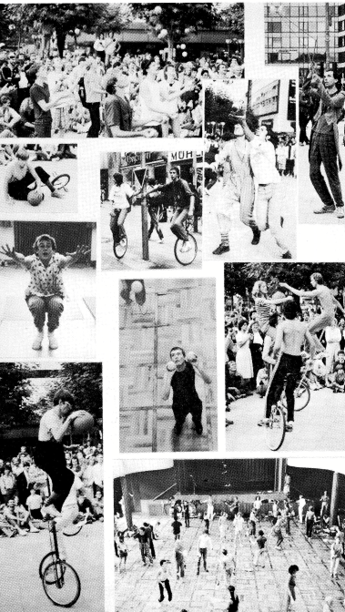
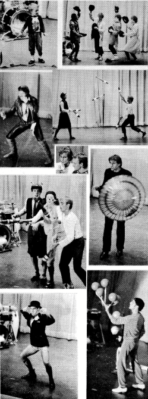
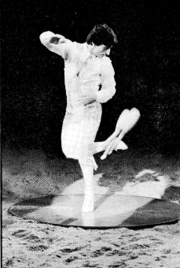
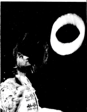
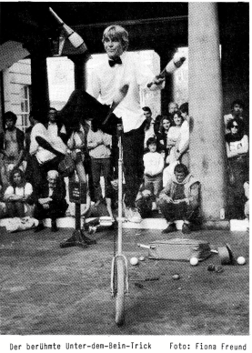

## JONGLIERWOCHE '84
**Müßige Gedanken zu Frankfurt von einem, der dabei war**

400 diese Mal, Leute. Die 7.Europäische Jonglierwoche in Frankfurt war bisher die größte und beweist, daß zumindest was Jonglieren auf dieser Seite des Atlantik angeht, geht der einzigst mögliche Weg aufwärts.
Aber da war noch etwas wichtigeres als Zahlen dieses Jahr, da war ein Gefühl, daß das zweite Wochenende im September immer die Zeit sein wird, wo Jongleure aus ganz Europa alles andere zur Seite legen werden, um zusammen zu sein.

Deshalb gibt es solche Treffen: Einundfünfzig Wochen des Jahres sind die Jongleure Europas weit verteilt, in Gruppen von 3,4, oder 5, aber meistens sind sie alleine in ihren eigenen kleinen Ecken, Erfinden, Üben, Arbeiten. Kaum, wenn überhaupt, haben sie die Gelegenheit ihre Ideen und Tricks auszutauschen. Selten haben sie die Möglichkeit, das, was sie haben, zu teilen.

Dann näherte sich dieser September und die Jongleurwanderung fing langsam an. Die Zeichen waren nur denen sichtbar, die die gleiche Reise machten: Keulengriffe, die aus Rucksäcken hervorlugten, (normale Leute wunderten sich, warum irgendjemand 3 Squaschschläger mit sich herumtragen sollte); eine Melone auf einem Kopf, der offensichtlich weder zu einem Buchhalter noch zu einem Engländer gehörte; ein Wohnmobil illegal auf einem Bürgersteig geparkt, mit einem Zettel an der Windschutzscheibe "Wo seid ihr alle?"

So fing es an, weit verstreut und locker. Aber das änderte sich schnell, und bis 1800 Uhr am Mittwochabend, dem offiziellen Anfang des diesjährigen Treffens, hatte die Invasion der Jongleure ihren Höhepunkt erreicht. Der Raum, der für die Willkommensparty vorgesehen war, konnte kaum alle Ankömmlinge fassen.
Einige fingen gleich an zu jonglieren, aber die meisten saßen mit offenem Mund da und fragten sich: "Wo kommen sie alle her?" Es gab 400 Antworten darauf.

Und für diejenigen, die den Großteil des Jahres alleine jonglieren oder die zum ersten Mal auf einem solchen Treffen waren, war es ein riesiger Schock. Wem guckst du zuerst zu? Wie hat er das gemacht? Wo kam das Ding her? Overload!

Und sie hatten noch vier überladene Tage vor sich!
Todd Strongs und Andrew Allens Talent mit Diabolos und Devil Sticks waren der Beweis dafür, daß Jonglieren micht nur eine Sache von Keulen und Bällen ist, obwohl Antonio Bucci und seine 7 Bälle beispielhaft waren.

Tim Batślustige YoYo-Nummer hat dazu geführt, daß alle, die am Sonntag noch ein Duncan kaufen wollten, enttäuscht wurden, alle YoYos waren ausverkauft.
Gérard Estrem mit seinem Devil Stick, Klapp's Kallis Keulen Kompany's Hutnummer, die Liste könnte lange fortgeführt werden und ich entschuldige mich bei allen 390 Leuten, die ich nicht erwähnte. Es sei genug zu sagen, daß jede anwesende Person etwas Neues zu lernen zeigte und daß das Treffen selber eine Quelle von Informationen für jeden war, der eine Stunde auf dem Balkon, der die Halle überblickte, verbringen wollte.

{ align=left }

Und die öffentliche Show?

Absolut die beste öffentliche Show, die je auf einem Europäischen Treffen präsentiert wurde.

Die Nummern waren abwechslungsreich, unterhaltsam, auf die Öffentlichkeit zugeschnitten und verliefen sehr glatt. Besonderer Dank geht an Paul Keast und Uli Meister, das unschlagbare Duo, das die gesamte Show professionell, humorvoll und in drei Sprachen ansagte.

Die öffentliche Show ist ein wichtiges Element der Jongliertreffen, eine Art offene Tür, die der Öffentlichkeit erlaubt, selber zu sehen, daß wir nicht nur ein Haufen fahrender Zigeuner sind, die Babys stehlen und die öffentliche Ordnung stören, sondern daß wir statt dessen eine sehr talentierte Gruppe von sehr unabhängigen Menschen sind.
Mimen, Musiker, Komiker, Akrobaten, Jongleure und rundum nette Leute, die eine Stadt nur dann ausplündern würden, wenn es im Vertrag stünde.
Die diesjährige öffentliche Show war in dieser Hinsicht ein Erfolg, es gab der Stadt Frankfurt zwei Stunden Bezauberung, während gleichzeitig alle Jongleure die Chance hatten, sich gegenseitig zu applaudieren. Noch einmal vielen Dank an alle Organisatoren der Show für diese gute Arbeit.

Und wieder eine Entschuldigung dafür, nicht Nummer für Nummer alle Teilnehmer der öffentlichen Show aufzuzählen, das wird von anderen gemacht, außerdem könnte ich nie allen gerecht werden.
Ich werde auch nicht dem Treffen an sich gerecht. Meine eigentliche Absicht mit dem Artikel war, das Gefühl des Ereignisses rüberzubringen, die Zusammengehörigkeit, die Kameradschaft, all das, das Element, was jeden Kongress mit dem nächsten verbindet und was der Grund ist, daß Leute jedes Jahr in größerer Zahl wiederkommen. Es ist nicht nur das Jonglieren, sondern es ist etwas anderes und von niemandem, der nicht selber da war, kann erwartet werden, daß er versteht, was es ist!

Aber was es ist, in all seiner Einfachheit, ist folgendes:
Die Treffen sind immer voller Spaß. Alle Philosophie und Tiefsinnigkeit, die Du Dir vorstellen kannst, kann nie die Treffen so zusammenfassen, wie das eine Wort es kann. Spaß ist das, was das Jonglierfestival ausmacht, weil Jonglieren Spaß ist umd immer sein sollte.
Vielen Dank an die Autonome Jongliergruppe. Mit ihren Spielen, ihrer Organisation und ihrer harten Arbeit haben sie erreicht, das Gefühl zu erhalten und gaben jedem Anwesenden einen guten Grund, sich nächstes Jahr wieder zu treffen in Louvain-La-Neuve, Belgien.

Jobik LaCombe

Da der größte Teil unserer Leser selber auf dem Jongliertreffen war, ist es wohl unnötig, einen vollständigen Bericht zu geben.
Wie Jobik schreibt, kann man sowieso nicht richtig würdigen, was dort passiert ist, ohne dabei gewesen zu sein. Stattdessen haben wir einige Photos gesammelt, die Dir vielleicht vieles in Erinnerung rufen, und einige Informationen gesammelt, die Dir vielleicht entgangen sind.
Hast Du zum Beispiel gewußt, daß im Fernsehn einiges über uns gesendet wurde? Am Freitag gab es im Heute Journal einen kurzen Bericht über die Wettspiele, in Aspekte zeigten sie später noch mehr davon. In der Hessenschau zeigten sie auch einige Scenen (mit einem fürchterlichen Kommentar), was wahrscheinlich noch dazu beitrug, das Volksbildungsheim für die Show am Abend zu füllen. (Das war das Fehrnsehteam, was sich mit blendenden Scheinwerfern breit gemacht hatte.) Und vielleicht das erstaunlichste ist, daß ein kurzer Film mit Interview von ABC-News in die Staaten übertragen wurde. (Ein längerer Film, der über Fritz Brehm gedreht wurde und viele Festivalscenen enthält, wird wahrscheinlich im Frühjahr im ZDF gezeigt.)
Für alle, die sich bis zum Geschäftstreffen am Sonntag noch nicht von der Party erholt hatten, hier noch einmal die wichtigsten Entscheidungen: Es wurde einstimmig beschlossen, daß das Treffen nächstes Jahr bei Brüssel sein wird, mit Unterstützung der Stadt.
Es wurde auch angekündigt, daß das 10. Treffen in der Stadt des 1. europäischen Jonglierfests, in Brighton, an der Südküste Englands stattfinden soll.
Toby Philpott wurde ohne Gegenstimme wieder zum Europäischen Organisator gewählt.
Es wurde angesagt, daß durch die vielen Teilnehmer die Unkosten gedeckt werden konnten und "Kaskade" einen Zuschuß für das 1. Jahr erhalten kann. Der Rest geht - wie schon Tradition an die Organisatoren des nächsten Treffens.
Obwohl die meisten mit dem Festival sehr zufrieden schienen, wurde der Verlauf der Workshops etwas kritisiert. Trotz ihrer Brillianz und ihrem Unterhaltungswert waren sie eher Vorführungen als Workshops, in dem Sinn, daß die Teilnehmer selber an der Verbesserung ihrer Techniken arbeiten. Vielleicht können die Organisatoren und Workshopper für nächstes Jahr darüber nachdenken.

Falls Du es nicht gesehen hast, die Gewinner der Wettbewerbe bekamen ein Taschen jonglierset aus 3 bunten Perlen (Bällen), Mensch-ärgere-dich-nicht-männchen (Keulen), Unterlegscheiben (Ringe) und Streichhölzern (Feuerkeulen) alles in einer Streichholzschachtel verpackt.

### Gala

{ align=left }

Falls Du nicht mehr genau weißt, was an der öffentlichen Show sooo gut war, hier noch einmal kurz der Programablauf:
STEVE MOCK aus Amsterdam begann das Program mit einer klassischen 3-Ballnummer. Die 2 FRÈRES PAMPELMOUSE aus Frankreich zeigten sehr lustige, akrobatische Jonglage.
TIM BAT aus London yoyote in und um seine Melone, obwohl er seine Hose vergessen hatte. WERNER SCHREINER aus Wiesbaden versuchte die kleinsten Bälle der Welt zu jonglieren und verlor sie. ACHIM SCHLOTFELDT aus Bremen rock'n rolled 3Keulen. Werner versuchte sich mit der größten Keule der Welt. J.J.(Gérard Estrem) aus Frankreich war der Clown, der zeigte, wie der Steinzeitmensch das Jongliern entdeckte, ALEX DANDRIDGE und MICK NOAKES aus England schmissen sich Keulen auf Giraffen zu. NEIL ROBINSON (z.Z. in Deutschland) mit seiner Tuch- und chinesichen-Ringe-Zauberei war faszinierend und lustig gleichzeitig.
NARBO, der typisch amerikanische Tourist (aus Paris) verwechselte Frankfurt mit Amsterdam. SUMARAN aus Wiesbaden wackelte auf 2 Rola Bolas herum. Das INSTITUT FRANCAIS DE JONGLAGE schlug alles mit ihrer rasend schnellen Keulen-passing Show. WON ISRAEL, amerikanischer Mime fuhr sein Motorrad ins Nichts.

Nach der Pause:
KLAPPS KALLI'S KEULEN KOMPANY aus Hamburg machten verrückte Sachen mit Hüten. FRANCOIS CHOTARD'S Balldrehakt spricht für sich.
DAVID CRONIN und ANGELIKA GROSSE aus Kassel zeigten eine Jonglier-Workshop-Travestie. LYNN THOMAS, von DAVID PHILPOTT assistiert, wirbelte Dinge über seinen chinesichen Schirm. Der SAKI-ZIRKUS gab ein Heimspiel mit einer kurzen 12-Balljonglage. MARTIN SCHWIETZKE aus Montpelier zeigte eine absolut perfekte 5-Ballnummer, die den größten Applaus des Abends erhielt.
BARRY ROSENBERG von den Staaten und Henrik(?) aus Dänemark spielten eine lustige Nummer mit Bällen und Bananen. SUE BROADWAY aus Australien warf Strohhüte herum.
TODD STRONG spielte mit seinem Diabolo und zusammen mit ANDREW ALLEN zeigte er die schnellsten Devil-Stick-Tricks (beide aus Amerika). SEM ABRAHAMS aus Holland zerbrach fast die Bühne, als er auf seinem Einrad seilsprang.
MARCELINE KAHN aus Barcelona zeigte sehr beeindruckendes Feuerkeulenschwingen. MAX und CHRIS aus London und ACHIM aus Bremen jonglierten Feuerkeulen. Statt einer Zugabe verwöhnte uns COTTON mit einer Bühnenversion seiner pariser Straßenshow mit Bällen und Keulen.

## Manuel Alvarez bei Circus Roncalli

{ align=left }

Alvarez bei Roncalli — das ist perfekte Fußarbeit mit Keulen, rasant dargeboten zu spanischen Klängen. Dynamisch stürmt er mit einem über 6 kg schweren Torero-kostüm in die Manege und beginnt eine flotte Jonglage mit 7 Ringen.
Nach kurzem Requisitenwechsel folgt der Höhepunkt seiner Nummer — eine fußbetonte 3 Keulen-jonglage. Mit tänzerischem Können zeigt Manuel Alvarez leichtfüßige, rechts wie links gleichermaßen präzis ausgeführte kick-ups, wobei er eine runde Holzplatte von 2 m Durchmesser nicht verläßt!
Mehrmals fängt er hinter dem Rücken geworfene Keulen in der Kniekehle auf, läßt sie zum Fuß gleiten, um sie sodann übergangslos wieder in die Jonglage einzugliedern. In atemberaubendem Tempo wirbeln die Keulen mit einfacher Drehung gewandt von Hand zu Fuß, Fuß zu Fuß, Fuß zu Hand.
Seine Spezialität ist der einfüßige kick-up mit 3 Keulen gleichzeitig, wobei er 2 fängt, während die dritte mit dem gleichen Fuß nochmals hochgekickt und sofort weiterjongliert wird.

{ align=left }

Acht Plastikteller mit boomerang-ähnlichen Flugeigenschaften läßt er zum Ende seiner Darbietung bis dicht unter die Zeltkuppel schnellen. Die Höhe des Zirkuszeltes reicht jedoch kaum für diese Nummer, erklärt uns Alvarez.
Wir haben ihn vor der Vorstellung in seinem Wohnwagen besucht und dabei auch seine Frau und die beiden kleinen Töchter kennengelernt. Bei einer Tasse Kaffee erzählt uns der 27jährige, in Sevilla geborene Sohn der berühmten spanischen Artistenfamilie Alvarez daß er 8 Jahre bei verschiedenen Zirkusunternehmen in Afrika engagiert war, später in Spanien und Frankreich gastierte und seit Anfang dieses Jahres bei Roncalli verpflichtet ist. Auch seine Frau entstammt einer alten Zirkusfamilie und beiden gefällt die Atmosphäre im Roncallizirkus sehr.

Von ihr erfahren wir, daß auch die beiden Töchter sich schon in der hohen Kunst der Akrobatik üben.
Besonderes Augenmerk verdienen Alvarez Jonglierkeulen er habe sich noch nie welche kaufen müssen, berichtet er stolz, sondern stellt sie in eigener Handarbeit aus Holz und Kork her.
Fälschlicherweise berichtete die letzte Ausgabe der Kaskade, daß nicht Manuel, sondern sein Onkel Pepito Alvarez bei Roncalli spiele, was wir hiermit ausdrücklich korrigieren (Hierfür möchten wir uns entschuldigen, d. Red.)
Wir möchten uns nochmals bei Manuel Alvarez und seiner Familie für die Gastfreundschaft bedanken und wünschen ihm weiterhin viel Erfolg.

Astrid und Jojo

## VERANSTALTUNGSORT: STRASSE
### London - Covent Garden

Für Neulinge bei Straßenauftritten und für stadtfremde Akteure soll diese Kolumne einige Informationen über die Auftrittsscene in Europa geben, so daß Ihr wißt, welche Probleme und Möglichkeiten es in einer Stadt gibt, bevor Ihr dort ankommt.

{ align = right}
Der berühmte Unter-dem-Bein-Trick
Foto: Fiona Freund

In London ist das anerkannte Zentrum für Straßenshows Covent Garden. Es ist nicht nur eine der geschäftigsten Touristengegenden, sondern Straßenkünstler sind auch willkommen (solange sie konform gehen!). Auf den ersten Blick kann das Niveau der Konkurrenz von Magiern, Musikern, Akrobaten und natürlich anderen Jongleuren recht abschreckend erscheinen. Aber eigentlich ist es fast unmöglich, bei nur zwei legalisierten Auftrittsplätzen und tausenden von Besuchern keine Zuschauermenge für Deine Show anzuziehen.
Die beiden Plätze werden von zwei verschiedenen Stellen organisiert und haben verschiedene Regeln. Es ist am Besten, mit dem West Piazza-Platz an der St. Pauls Kirche anzufangen. Dieser wird von Alternative Arts (Basement, 1-4 King Street, London WC 2, Tel.: 01-2) verwaltet, die eine Lizenz ausstellen für die Aufführung eines jeden Programms, das nicht rassistisch, unsittlich oder auf sonstige Weise anstößig ist, unabhängig von der Qualität der Show. (Ein separater Feueraufführungspaß und bestimmte Sicherheitsvorkehrungen sind nõtig, wenn Du Feuer benutzt.)

Einen Termin für einen Auftritt zu bekommen ist allerdings schwieriger als die Erlaubnis zu bekommen. Der Tag ist von 1130 Uhr bis zum Dunkelwerden in halbe Stunden aufgeteilt und Du mußt Dich am Auftrittsort auf einer Liste für eine freie halbe Stunde eintragen.
Da sehr viele Leute auftreten wollen, kann sich jeder nur einmal täglich eintragen, und um sicher zu sein, einen Platz zu ergattern, mußt Du Dich im Sommer vor 800 Uhr morgens eintragen. Außerdem mußt Du um 1000 Uhr auf dem Platz sein, wenn von Alternative Arts Angestellten anfallende Probleme besprochen werden.

Der zweite Platz ist in der North Hall des renovierten Marktgebäudes, er ist überdacht. Er wird von dem Covent Garden Market Management (Unit 41, The Market, Covent Garden, London WC2, Tel.:01-8369137) verwaltet. Sie bestehen auf ein strengeres Auswahlverfahren und es gibt größere Einschränkungen zum Beispiel ist Feuer nicht erlaubt und alles, was eine Sauerei verursachen könnte (zerbrochene Eier, halb gegessene Äpfel) ist verbannt. Es gibt hier eine "ruhige Zeit" zwischen 1500 Uhr und 1700 Uhr, wo Musik mit Verstärker und Percussioninstrumente usw. nicht gebraucht werden dürfen. (Viele regelmäßig erscheinende Akteure benutzen batteriebetriebene Verstärker, um Casetten abzuspielen, und das hilft, eine Menschenmenge anzuziehen.)
Die Buchung ist auch anders: Jede Gruppe kann höchstens 2 Stunden pro Woche buchen. Reserviert wird jeweils Montags um 1430 Uhr für die darauffolgende Woche. Das kann natürlich Probleme für Künstler geben, die nur kurze Zeit in London sein können.

Viele Akteure haben jemand, der für sie mit dem Hut rumgeht und sammelt ("bottler"), der im allgemeinen ein Viertel der Einnahmen bekommt. Es sind normalerweise immer "bottler" da, und bei so vielen Zuschauern lohnt es sich oft, einen anzustellen.
Die festen Regeln mögen einige Spontaneität nehmen, die einem Straßenkünstler gefällt, aber sie sichern, daß jeder eine Chance hat, einen Auftritt zu machen, ohne von einem anderen, lauteren, erfahreneren Künstler verdrängt zu werden.

Es gibt wenige etablierte Alternativen zu Covent Garden, um Shows zu machen. Der Barbican Complex heißt Straßenkünstler willkommen und kann um die Mittagszeit ein guter Platz sein (Tel.: Margot Landell 01-6384141) und auch Camden Lock market in Nordlondon (Camden Town U-Bahnstation) kann Sonntas nachmittags einen Versuch wert sein.

Wenn Du mal eine Abwechslung von London brauchst, hat die Kathedralenstadt Canterbury eine gute Fußgängerzone und sie zieht viele Touristen, aber weniger Jongleure an. Straßenshows sind erlaubt und können sehr lukrativ sein.
Ich hoffe, dieser Artikel ist nützlich für Leute, die daran denken, einmal nach London zu kommen. Vielleicht könntest Du über die Straßenshowsituation in Deiner Stadt für die nächste Nummer von Kaskade berichten?

Charlie Holland

### Eine kleine Anekdote aus Rest-Berlin
**wie es leibt und lebt, mitten in Preußen**

Im Frühjahr hatten wir des öfteren Ärger mit der Polizei hier-welcher Straßenkünstler hatte den noch nicht? Die untersagten uns, zunächst höflich, später dann eindringlich, mit Fackeln zu jonglieren. Feuer unter freiem Himmel, wer weiß nicht wie ungeheuer gefährlich dies ist!!! Nun, da wir hier wohnen und noch öfter hier auftreten wollen, bemühten wir uns um eine Genehmigung der zuständigen Behörden. Doch wer ist zuständig?? Über zwei Monate dauerte der Zick-Zack-Lauf von Behörde zu Behörde, Tiefbauamt, Feuerwehr, diverse Polizeidienststellen und das Gewerbeaufsichtsamt markieren die Wendepunkte des Hindernislaufs. Unterhaltsamster Teil der Affaire war ein Ortstermin, nicht am Tatort Kurfürstendamm, wo sich unsere Touristenbelustigung in der Regel ereignet, nein auf einem riesigen, freien Platz an der Mauer abseits allen brennbaren Gutes. Dort mußten wir unter den Augen von 8(!) Beamten der diversen Behörden mit unseren Fackeln jonglieren.
Dies alles natürlich während der üblichen Bürostunden, also bei Tageslicht, und wer weiß wie vergleichsweise läppisch Fackeln bei Tageslicht wirken, wundert sich nicht, daß wir die Genehmigung endlich doch erhielten. Dies jedoch nicht ohne einige Auflagen zu erfüllen: So müssen wir eine stabile Holzkiste für unsere Utensilien mitführen (!?) genauso wie eine Wolldecke um eventuelle, überschüssige Flammen an unserer oder des Publikums Kleidung zu ersticken, außerdem müssen wir 3m Abstand zum Publikum halten und schließlich eine ausreichende Haftpflichtversicherung nachweisen können. Dies alles jedoch nur an bestimmten, ausgewählten Plätzen auf dem Kurfürstendamm.

Es ist schon ein komisches Gefühl zu dem Platz zu kommen, wo Du immer auftrittst und zu wissen, Du hast eine offizielle Auftrittsgenehmigung des Polizeipräsidenten und eine Haftpflichtversicherung mit 1 Million DM Deckungsumme.
Es sollte jedoch niemand Angst bekommen, hier in Berlin öffentlich mit Fackeln zu jonglieren. Es ist nur den Leuten, die hier für längere Zeit auf der Straße auftreten wollen, zu empfehlen, nicht zu hoch zu jonglieren oder — wie wir damals — den Fackelturm (Schulterstand mit je 3 Fackeln) im Programm zu haben, sodaß die Polizeistreifen dies von der Straße aus über die Köpfe der "Massen" hinweg sehen können. Freunde von uns haben auf diese Weise das ganze Jahr über keinerlei Schwierigkeiten gehabt, In diesem Sinne: "Feuer frei!"

Michael Genähr

**(Image: A black and white photo of a street performer juggling fire torches.)** #todo 

Foto: Friedhelm Teicke

**(Image: A black and white photo of a street performer juggling clubs.)** #todo

Alex Dandridge in Covent Garden

Foto: Fiona Freund

"Hat jemand ein Feuerzeug?"

**(Image: A logo with juggling clubs, balls, and a unicycle.)** #todo

## JONGLIEREN - SPORT ODER KULTUR ? 
**WETTSPIEL ODER WETTKAMPF ?**

Das Thema, das diese Ausgabe beherrschen würde, ist bald klargeworden. Briefe an "KASKADE" und Berichte über die U. S. Convention in "Jugglers World" handelten von diesen zwei Möglichkeiten, an das Jonglieren heranzugehen. Wir drucken Ausschnitte ab, um eine Diskussion anzuleiern.

### Spiel hat Geschichte

Wahrscheinlich ist eines der faszinierensten Dinge beim Jonglieren, daß es den Gebrauch von nonverbalen Funktionen des Gehirns fördert. Bei der Erwachsenenbildung habe ich festgestellt, wie Büroangestellte und Studenten anscheinend große Erleichterung von dem "Gewicht der Worte" finden, wenn sie Jonglieren.
Vir brauchen aber beide Bewußtseinsformen, die vebale, analytische und diejenige, die es uns ermöglicht, Muster und Dreidimensionalität zu erfassen. Es ist wichtig, sowohl die Unendlichkeits-(oder Achter-) form zu sehen und zugleich jeden der einzelnen Gegenstände, die sie beschreiben, unter Kontrolle zu halten.

An einem ruhigen Strand hast Du vielleicht Steine über das Wasser hüpfen lassen, oder eine schwimmende Zielscheibe ausgemacht, oder ein "Boules"-Spiel mit großen runden Steinen improvisiert. Beim Ausgraben eines altsächsischen Dorfs (6-700 n.Chr.) wurde ein Haufen kleiner, absolut runder Kiesel gefunden, die in jener Gegend sonst nicht vorkommen, was auf die uralte Faszination für glatte Kugeln deutet, mit denen man hier vielleicht eine Art Murmelspiel spielte.

Obwohl solche Spiele sicherlich Spaß machten, versuchten die Menschen schließlich, die Bälle genauer zu beherrschen, so daß das etwas zufällige Boules entwickelt wurde, bis zum englischen "Bowls", das auf perfektem, flachem Rasen gespielt wird, oder bis zum flachen Snooker-oder Pooltisch mit symmetrischen Kugeln. Diese Perfektion ließ weniger Raum für Fehler, und eine klarere Bestimmung der Spielflächen und der Maße. der Gegenstände führte zu genaueren Spielregeln, Zeitgrenzen und Punktsystemen. Das war keine negative Entwicklung, da Spiel schließlich eine Ernsthaftigkeit (Regeln, Technik, Wettbewerb) dulden kann in einem Maße, wie es sich das Ernsthafte im Weltgeschehen in bezug auf Spielfreude nicht leisten kann.

Wir entwickein auch Gegenstande, die ausschließlich dem Spiel gewidmet sind. Bei vielen solcher Spielzeuge ist eine sich stets wiederholende Bewegung an sich durchaus befriedigend, ich denke an Kreisel, YoYo, Hulakupreifen und Frisbee.

Wenn die älteste Form des Spiels (d.h. Tätigkeiten, die nicht direkt dem Überleben dienten) wahrscheinlich der Tanz war, so war mit ziemlicher Sicherheit die nächstälteste das Spiel mit Werkzeug oder Waffen, wie es im Theater und in Kampfsportarten im Fernen Osten erscheint. Musik und Tanz sind insofern dem Jonglieren ähnlich, daß das Produkt nichts Beständiges ist, kein Denkmal des Künstlers, sondern ein sichtbar gemachter Prozeß, zeitlich und räumlich ständig wechselnde Muster.
Rhythmische Bewegung mit Gegenständen hat jetzt in Form der rhythmischen Sportgymnastik die Olympischen Spiele erreicht, und dieses Zusammenschmelzen verwandter Kunstformen wird wahrscheinlich fortgesetzt werden.

Bei erstaunlich wenigen Spielen werden mehr als ein Ball benutzt, und bei allen läßt man sie gelegentlich zum Stillstand kommen, um das Muster zu betrachten, bevor weitergespielt wird.
Das Jonglieren scheint also etwas Einzigartiges zu sein, auch als Ballspiel betrachtet, da die Bälle in ständiger Bewegung sind. Außerdem kann man es alleine oder in Gruppen "spielen", und es muß nicht das polarisierte Zwei-Mannschaften-Format annehmen. Es ist grundsätzlich kooperativ, braucht kein Punktsystem, und insofern nähert es sich dem "puren Spiel" (d.h. es ist in sich befriedigend).
Du kannst zwar Deine Reflexe mit denen eines anderen messen, aber es ist erst dann wirklich befriedigend, wenn ihr einen gemeinsamen Rhythmus findet (wie bei einem perfekten, endlosen Ballwechsel beim Tischtennis).
Und es muß nicht einmal ein Ballspiel sein.

Ich nehme an, daß die meisten von euch einen leichten Trancezustand erlebt haben, während ihr in Jonglieren vertieft wart, und Zuschauer sind oft gebannt durch das wirbelnde, hypnotisierende Muster, das sie nicht ganz beschreiben können. Es ist wirklich zauberhaft, in einer Weise, die den Bühnenzauberer eher mechanisch erscheinen läßt. In der englischen Sprache sind die Worte für Zauber und Fantasie (magic und imagination) durch den Begriff der Schöpfung von Bildern (images) eng verwandt.
Es ist möglich daß das Anschauen des endlos fließenden Musters ähnlich wie das Anschauen der Flammen eines Holzfeuers beruhigende Wirkung hat. Es gibt keine harten Kanten oder Strukturen zu erfassen. Worte können es nicht genau beschreiben, und so beruhigt es den Verstand.
Vielleicht hat der Jongleur eine noch urtümlichere Ausstrahlung als die des Geschichtenerzählers, da er es seinem Publikum überläßt, seine eigenen wortlosen Bilder zu schaffen, und dadurch wird der Jongleur zum mythischen Traumspinner.
Es kann viel mehr sein als ein bloßes Spiel.

Toby Philpott

### Olympiade für Olympianer

Francois Chotards Ideen sind eher auf das kommende Treffen in Belgien gerichtet, die Entwicklungen, die er gerne sehen würde und die Ideen, die er durch das Treffen der Öffentlichkeit zeigen möchte.
Zum Beispiel:
Chotard:"... die Beziehung zwischen Jonglieren, Sport und Kultur einerseits und andererseits die Idee, daß ein Jongleur nicht nur ein Unterhalter, ein Manipulateur, ein Narr ist, sondern daß er durchs Jonglieren eine Verwirklichung der Ideale der Menschenwürde, der Freiheit und der ganzheitlichen Entwicklung erreicht.
Jonglieren ist ein Sport. Wie alle Sportarten ist es eine Verwirklichung der Möglichkeiten des menschlichen Körpers, ein Versuch, eine optimale Kondition zu erreichen; es heißt, sich an ernsthaftes Training und ein diszipliniertes Leben zu gewöhnen (Hygiene, Schlaf, Ernährung...) was alles psychologische Vorteile mit sich bringt.

Außerdem heißt Jonglieren ebenso wie beim Sport, Wettkampf, Streben nach einem Titel, einem Rekord, einer Medaille. Die Goldmedaillen und Goldenen Clowns des Festivals Zirkus von Morgen in Paris und das Internationale Zirkus Festival in Monaco sind Beweise dafür.
Und ich denke, daß die europäischen Treffen da noch einen langen Weg vor sich haben.
Es wäre gut und motivierend, wenn außer den "Wettbewerben zum Spaß" auch ernsthafte Wettbewerbe organisiert würden. "Kaskade" und die Jongliertreffen könnten eine Quelle des Ideenaustauschs sein und, ohne utopisch klingen zu wollen, meine ich, daß solche Ideen, gescheit praktiziert, in Zukunft dazu führen könnten, Jonglieren zur Zulassung als olympische Disziplin vorzuschlagen.
Persönlich sehe ich bei einem Jongleur mindestens so viele sportliche Qualitäten, wie bei einem Schützen beim Schießwettbewerb in Los Angeles.
Ich würde mich freuen, wenn Ihr Euch diese Ideen mal durch den Kopf gehen lassen würdet, liebe Jongleure:

Die Einführung einer Kommission, die dafür zuständig ist, diese Art von Jonglieraktivitäten zu koordinieren und ein Auswahlsystem für die Teilnehmer zu finden, Tricks zu definieren, die Jury zusammenzustellen, Punkte zu verteilen...
Ich denke zum Beispiel, daß die. Jury für zwei Kriterien Punkte vergeben sollte, erstens für Technik, je nach Schwierigkeitsgrad und zweitens für die artistische Interpretation, wobei Rhythmus, Ästhetik, Choreographie und Originalität beurteilt werden.
(Vergleichbar mit dem Bewertungssystem für Eislauf oder Freistilwindsurfing) Diese Bewertung würde eine Klassifikation ermöglichen, die dem subjektiven Eindruck der Öffentlichkeit über die Schönheit des Spektakels entsprechen würde.
Wir sollten ein "Preissymbol" (wie Oskars für den Film) erfinden, was gleichzeitig als Markenzeichen für Werbung und zur Popularisierung von Jonglieren in der Öffentlichkeit dienen könnte.
Vielleicht würde eine Eintragung im Guiness-Buch der Rekorde einen Eindruck auf die Öffentlichkeit machen, kommerziell gesehen."

Francois Chotard bei der Public Show in Frankfurt

In einer späteren Antwort gab er zu, daß eine neue Erfahrung seine Meinung etwas geändert hat. Er hatte an dem 3. Internationalen Jonglier- und Zauberfestival in Rive-de-Gier zwischen St.Etienne und Lyon teilgenommen, das von Asthony, einem bekannten französischem Artisten organisiert wurde.

**(Image: The numbers 4, 5, and 5, stacked on top of each other, with a stylized design.)** #todo

Die Jury bei der diesjährigen IJA Convention (Image) #todo

Foto: "Jugglers World"

Chotard: "Der Sonntag wurde von dem Wettbewerbsgeist dominiert. Er bestand wirklich aus Wettbewerb und ich konnte die Spannung spüren, die Nervosität, die Verbissenheit, all die Dinge, die gegen den Geist von Vergnügen und Spaß verstoßen.
Die Wurzel des Problems ist folgendes: der Artist, der auf Titel und Medaillen aus ist, derjenige, den Toby Philpott in der 1. Kaskade so treffend den "Olympianer" nannte, mag es vorziehen, an solchen Treffen teilzunehmen, um seine Visitenkarte zu verschönern. Aber der "Amateur" im wahrsten Sinne des Wortes, als derjenige, der aus Liebe zur Sache jongliert, wird an den europäischen Treffen mehr Spaß haben... und so sollte das Festival '85 auch sein."

---

Die Zukunftsideen, die Francois Chotard in seinem ersten Brief aufstellt, sind auf dem großen Treffen der I.J.A. in den USA größtenteils schon Wirklichkeit.
Die Herbstausgabe von "Jugglers World" ist voll von den Ergebnissen der "ernsthaften" Wettbewerbe, die im Juli in Las Vegas gehalten wurden. Hier kannst Du lesen, wie Albert Lucas nicht nur die beste Bühnenshow lieferte, um die "US-Nationalmeisterschaft" zu gewinnen, sondern auch den 100m Jogging-Sprint in 12,67 Sekunden gewann, so wie den 7-Gegenstand- Wettbewerb mit 1Min 36,53 Sek. (bisheriger Rekord: 20,89 Sek.!), den 5-Keulen-Wettbewerb mit 21 Min. 5,67 Sek. (bisheriger Rekord 6 Min. 10 Sek) und "Ringe nach Anzahl" (Numbers Challenge) mit 9 Stück für mehr als die erforderlichen 20 sauberen Würfe in der Luft hielt!
Der Wettbewerb für Bühnens die "US-Nationals" hat ein noch raffinierteres Punktsystem als das von Francois vorgeschlagene.
60% der Noten gelten der Technik (unterteilt in Noten für Schwierigkeit und für fehlerfreies Jonglieren), 40% der Präsentation(einschließlich einer Kostüm-Kategorie).
Teilnehmer müssen eine Vorrunde bestehen, und nur die 10 Besten erreichen die Endaus-

### The Joggler's Jottings
**The case for juggling as sport**

Bill Giduz, Redakteur von Jugglers World, schreibt in einem Brief an "Kaskade":
Ich finde, die europäischen "Wettspiele zum Spaß" ganz toll, und das wäre etwas, das wir auch bei unserem Kongreß einführen könnten.
Aber ich glaube, daß ihr bald auch unter den Druck kommen werdet, irgendeine Art benoteten Einzelwettbewerb einzuführen. Ich glaube, so etwas soll es früher gegeben haben unter dem Namen "Rastelli-Meisterschaft", aber ich weiß nicht viel über dieses Forum.(Wir haben nie davon gehört. Kann uns jemand schreiben, was es war und warum es das nicht mehr gibt? d. Red.) Vielleicht sagt die Tatsache, daß es nicht mehr existiert, einiges über seine Popularität aus! Ich möchte trotzdem behaupten, daß Wettbewerb eher Interesse für unsere Kongresse geweckt hat und das nicht auf Kosten von purem Spaß. Ich glaube, daß es ganz natürlich ist, wenn Gleichgesinnte sich miteinander messen wollen, und wir bei der IJA bieten ihnen eine faire Gelegenheit dazu... und außerdem Anderen die Möglichkeit zu sehen, wie die besten Jongleure ihr Bestes zeigen. Weniger als 10% aller Kongreßteilnehmer beteiligen sich aktiv an den Wettbewerben, aber ich wette, daß 90% zuschauen wollen."

In seiner eigenen JW-Spalte, "The Juggler's Jottings", plädiert Bill für Wettbewerbe, die ausschließlich nach sportlichen und technischen Kriterien bewertet werden. Er erklärt:
"Die Auftrittskünstler haben jeden Tag an jeder Straßenecke ein Forum. Die arme Sau, die keine extrovertierte Persönlichkeit hat, aber trotzdem leidenschaftlich jongliert, hat dagegen keine Möglichkeit, Beachtung zu bekommen und wird wegen seiner mangelnden Präsentation ignoriert. Ich will, daß solche Leute auch gerechte Anerkennung für ihre Fähigkeiten kriegen, ohne unter dem Zwang zu stehen, unterhaltsam zu sein."
Er stellt sich vor, wie ein Moderator bei der Olympiade 1992 kommentieren wird:

Foto: Astrid Schenk

**(Image: A logo of a stylized figure juggling balls.)** #todo

"Als nächste tritt die Engländerin Minny Bahls an. Schauen Sie sich diese Präzision an mit der sie 5 Bälle hinter dem Rücken jongliert! Die Höhepunkte der Flugbahnen sind keine 5 cm auseinander. Achtung! Ein etwas wackeliger Übergang zur "Shower"-Form.. dadurch verliert sie wahrscheinlich ein Zehntel. Aber wie mühelos geht sie vom Shower in eine Bodenjonglage über! Und jetzt zum Abschluß eine Pirouette... meisterhaft gefangen. Einfach super! Sehen Sie, wie sie lächelt. Und wie die Zuschauer toben — sie wissen, wie gut das war!"
Wenn Jonglieren als olympische Disziplin anerkannt wäre, glaubt Bill, daß "mehr Leute die technische und körperliche Schwierigkeit des Jonglierens würdigen würden, und daß sie langsam verstehen würden, wie schwierig es ist — aus dieser unendlich komplexen Sportart eine schöne Kunstform zu kreieren!"

Also was meint Ihr dazu? Schreibt uns Eure Meinung!

Foto: "Jugglers World"

## Sportkultur in Oldenburg

Vom 16.-18.11.84 fand am Sportinstitut der Universität Oldenburg der "2. Spiel- und Bewegungsmarkt zur alternativen Sortkultur" statt.
Die Veranstaltung war in die drei großen Bereiche Arbeitsforen, Darbietungen verschiedener Gruppen und Solisten und Diskussionen unterteilt. Es sollten Möglichkeiten aufgezeigt werden, Sport anders zu betreiben, als im herkömmlichen Stil, nämlich durch mehr Spiel statt Wettkampf und Spiele mit großen Gruppen. Grenzbereiche zwischen Sport und Theater wie Pantomime, Tanz und Kunststücke wie Akrobatik und Jonglieren standen aber auch auf dem Programm.
Samstagvormittags fanden vier Arbeitsforen unter den Themen Spiel, Körpererfahrung, Kunststücke sowie Tanz und Ausdruck statt. In dem Arbeitsforum Kunststücke wurden unter anderem Jonglier-, Akrobatik und Rhönradworkshops angeboten.
Insgesamt gesehen erschien mir das Angebot der Arbeitsforen für Sportpädagogen interessanter als für Gaukler, Jongleure und sonstige Artisten, die hier etwas neues lernen wollten.
Freitags und Samstagabend fanden öffentliche Darbietungen statt, die einen Überblick geben sollten über den Stand von "alternativen" Sport-, Spiel- und Artistengruppen.
Unter anderem traten die Gruppen Kontrollierter Abstrurz, Ätsch, Klapps Kalli's Keulen Kompany, Tanztheater Bonn, Tanztheater Impuls und Tanztheater Elcetera auf.
Außerdem trat noch der Einradfahrer Sem Abrahams und der Jongleur Werner Rausch auf. Bei den Abendprogrammen übertrumpfte Professionalismus jedoch Spiel und "Alternativität" — was immer man darunter auch verstehen mag. Wenn schon die 2 Clowns der Clown- und Gauklerschule Oldenburg ihre Ansagen mit höchst artistischen Nummern verbinden, fällt es mancher Gruppe, die anschließend auftritt schwer, dem auch durch den "Oldenburger Kultursommer" (Festival der Straßenkunst mit städtischer Unterstützung) verwöhntem Publikum etwas begeisterndes zu zeigen.

**(Image: A black and white photo of Sem Abrahams riding a unicycle.)** #todo

Sem Abrahams in Frankfurt

Bei dem Kinderprogramm am Samstagnachmittag unter anderem mit Ätsch und Knall & Fall war noch mehr Spontaneität, Begeisterung und Spielfreude bei den Zuschauern und den Akteuren zu beobachten.
Samstags und Sonntags fanden außerdem noch Diskussionen unter folgenden Themen statt:

1.  Alternativer Sport in der Schule
2.  Alternative Sportkultur-entpolitisierte Billigkultur?
3.  Her mit der Knete-Finanzierungs- und Organisationstricks alternativer Sportkultur.

Die Organisation dieser Veranstaltung war optimal, alle Teilnehmer hatten einen kostenlosen Schlafplatz und für die Verpflegung wurde ausreichend gesorgt.Insgesamt hatte ich mir mehr Spielfreude und Spontaneität gewünscht und weniger Theorie und superartistische Darbietungen, aber vielleicht bin ich mit falschen Vorstellungen und Ansprüchen nach Oldenburg gefahren.

Reinhold Becker
