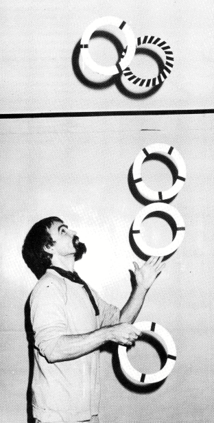

## **Lächeln überwindet Schwerkraft**
**Brief von Toby Philpott, Europäischer Direktor der IJA**
[[Kaskade 001#Lächeln überwindet Schwerkraft]]

Seit zwei Jahren trage ich den Titel "Europäischer Direktor der International Jugglers Association" (IJA) Das ist ein Titel, den W.C.Fields geliebt hätte, da er so wichtig und mysteriös (lingt klingt und fast nichts bedeutet. Ich "dirigiere" niemanden und verbringe den Großteil meiner Zeit in England.

{ align=left }

Die IJA begann als eine kleine Gruppe von Freunden und ist jetzt eine große Organisation mit Hunderten von Mitgliedern in Amerika. Das erste europäische Jongleurtreffen bestand ebenfalls nur aus einer kleinen Gruppe von Freunden in England, aber es war der erste Schritt, das Wort "International" zu rechtfertigen. Heute zieht dieses Treffen Menschen aus mehr als zehn verschiedenen Ländern an.

Die Treffen werden größer und es kommen auch viele Nicht-Mitglieder. Die meisten von ihnen sehen keinen Grund, der IJA beizutreten, wenn das einzige, was sie davon haben, ein amerikanisches Magazin und eine Adressenliste ist, die sie nie gebrauchen werden.

Das kann ich verstehen. Wenn es die IJA nicht geben würde, würde ich immer noch gerne andere Jongleure treffen (nicht nur die Leute, die von mir gelernt haben), ich würde wissen wollen, wo ich Requisiten kaufen kann, wo ich Shows sehen kann, wo ich auf der Straße auftreten kann. Ich würde immer noch Ideen teilen wollen und Leute sehen wollen, die besser jonglieren als ich selbst. Ich habe das meiste davon auch machen können bevor ich von der IJA gehört hatte, aber ich habe mehr gesehen und getan, seit wir angefangen haben, Treffen in Europa zu organisieren. Diese Treffen sind der beste Grund dafür, eine offizielle Organisation zu haben. Es ist keine Gewerkschaft, und wir können keine Auftritte vermitteln oder gar Freundschaften garantieren.

Ich glaube, daß Europa einen Vertreter im amerikanischen IJA Vorstand haben sollte, der Kontakt mit den alteingesessenen Mitgliedern in den Staaten und anderen Ländern hält, und der beginnen sollte, die Organisation wirklich zu einer internationalen zu machen.

Wenn ich den Saal eines Jongleurtreffens betrete, sehe ich zwei grundsätzliche Typen von Menschen. Manche arbeiten übend, schwitzend und Techinken perfektionierend, ihre eigenen Grenzen sprengend. Ich nenne diese die Olympianer, um diese Suche nach Perfektion, sportlichen Kampfgeist und den Anhauch von griechischen Göttern und Göttinnen zu unterstreichen Superhelden.

Andere sind gekommen, um zu spielen, sie lachen und scherzen, experimentieren, improvisieren, tauschen Ideen aus und haben Spaß. Ich nenne sie die "Fahrenden Spieler" und sie sind die einfachen Sterblichen, die Gaukler, die ihre Fähigkeiten zur Improvisation nutzen, wie alle Fahrenden und Spieler es tun müssen.

Du denkst vielleicht, daß jemand mit einem Titel wie "Europäischer Direktor" ein "Olympianer" wäre. Eigentlich habe ich jonglieren als Jux während einer faulen Phase meines Lebens angefangen. Jetzt habe ich einige Jahre als Performer und als Lehrer hinter mir, aber ich will immer den Spaß an der Sache vermitteln, ich erwarte keine Goldmedaille.

Wir brauchen die Helden und die Clowns. Die Olympianer können uns zeigen, was mit Hingabe möglich ist, sie setzen neue Maßstäbe und sie selber können sich an einem Publikum erfreuen, das wirklich die Arbeit anerkennen kann, die in jeder einzelnen Bewegung steckt.

Die Fahrenden Spieler sind diejenigen, die neue Leute hereinbringen, die neuen Jongleuren zum Start verhelfen, die das Wort verbreiten und die unterhalten.

Du wirst dies in einer Zeitschrift lesen, die von zwei Deutschen angegangen wurde, die gerne mehr Europäer in der IJA sehen würden.

Ich schreibe dies als Brief, weil ich kein Journalist bin und ich mache meine Fehler in der Öffentlichkeit, wie üblich. Wenn Du willst, daß diese Zeitschrift weitergeht, bitte schreibe den Herausgebern der Zeitschrift oder sende Fotos. Wenn Du willst, daß Europa eine wichtigere Rolle in der IJA spielt, schreibe mir, und ich werde versuchen, unsere Position den anderen Vorstandsmitgliedern zu erklären. Wenn Du lieber eine unabhängige europäische Gruppe hättest, dann leg los und gründe eine. Ich denke, es wäre schade, sich gänzlich von einer Organisation zu spalten, die seit 37 Jahren besteht und Mitglieder in vielen Ländern hat.

Übrigens, wenn Du denkst, daß ein richtiger Olympianer ein besserer Sprecher für Europa wäre, dann kannst Du selber kandidieren, oder finde einen jonglierenden Politiker, der unser Vertreter für 1985 sein soll.
In der Zwischenzeit hoffe ich, Dich zu sehen, während unserer paar Tage zusammen. Und vergiß nicht: Lächeln überwindet Schwerkraft. (Das ist ein guter Slogan, um eine Wahl zu gewinnen, oder um unseren Übersetzern Kopfschmerzen zu bereiten.)
