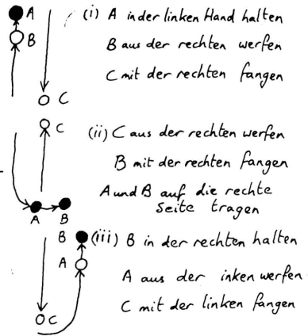
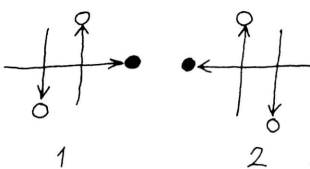
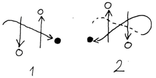
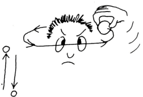

### Schummeln!
Quelle: [[Kaskade 001#Schummeln!]]

Wenn Du phosphorisierende Bälle hast, die im Dunkeln leuchten, kannst Du beim Publikum den Eindruck erwecken, daß Du die Säulenform machst. Auf einmal bleibt einer der Doppelbälle (der, den Du festhälst) unglaublicherweise in der Luft stehen und weigert sich, runterzukommen. (Du hälst ihn einfach hoch, aber das sieht der Zuschauer nicht!) der abtrünnige Ball, der scheinbar die Gesetze der Schwerkraft überwunden hat, kann jetzt erstaunliche akrobatische Tricks vorführen, bevor er wieder seinen Platz im Muster einnimmt. Zum Beispiel:

#### Das Yo-Yo

Du hälst den "Schummelball" immer ein paar Zentimeter über einem der springenden Bälle. Bewege Deine Hand rauf und runter; so daß der Abstand zwischen gehaltenem und fliegendem Ball immer konstant bleibt. Es sieht aus, als wären die Bälle an einer Schnur zusammengebunden.

#### Das Pendel

Dies ist auch ein Yo-Yo-Trick, wobei sich die Hände beim Festhalten eines Schummelballs abwechseln. Ein Einzelball springt senkrecht in der Mitte auf und ab, während sich die Schummelbälle scheinbar hin und her "ziehen", und Deine Arme schwingende Pendelbewegungen machen. (Dabei könntest Du auch abwechselnd die Beine schwingen oder "Ticktack" sagen.)

{ align=left }

**Transkript des Bildes**

(i) A in der linken Hand halten
B aus der rechten werfen
C mit der rechten fangen

(ii) C aus der rechten werfen
B mit der rechten fangen
A und B auf die rechte Seite tragen

(iii) B in der rechten halten
A aus der linken werfen
C mit der linken fangen

**Hier einige noch rebellischere Tricks für einen Schummelball:**
#### Die Sense

Der Schummelball schießt waagerecht zwischen den beiden geworfenen hin und her, zuerst über den herunterkommenden, dann unter den aufsteigenden Ball. Die Hand, in der Du den Schummelball hälst, "schneidet" durch die 2-Ball-Jonglage wie eine Sense.

Eine graziöse (und leichtere) Variante ist das "unendliche Sensen". Der Schummelball beschreibt keine gerade, waagerechte Linie, sondern ein Unendlichkeitszeichen (oder liegende Acht).

#### Orbit

Ein besonders rebellischer Schummelball fängt vielleicht an, um Deinen Kopf zu kreisen wie eine lästige Fliege. (Summ,summ!)

Da Du eigentlich nur 2 Bälle jonglierst und den dritten nur festhälst, ist die Anzahl von Streichen, die dieser dritte Ball spielen kann, durch nichts begrenzt, außer Deiner Anatomie!