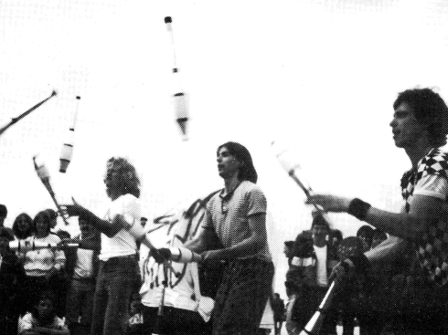

## Autonome Jongliergruppe Wiesbaden und die 7. Europäische Jonglierwoche
**Schwerkraft - na und!**
[[Schwerkraft - na und!]]

Erst seit relativ kurzer Zeit besteht die autonome Jongliergruppe SCHWERKRAFT NA UND! aus Wiesbaden oder besser noch aus der Rhein-Main-Gegend.
Noch im August 1982 gab es in Wiesbaden nur wenige Jongleure, die kaum etwas voneinander wußten. Durch Zufall kamen die drei der ersten Stunde, Paul, Uli und Christoph zusammen, jonglierten dann in Wiesbadens Grünanlagen und beschlossen, wenige Wochen später zum 5. Europäischen Jongliertreffen nach Kopenhagen zu fahren.

{ align=right}

Fritz aus Frankfurt kam mit. Nach dem Motto: "Nur was man tut, wird getan" und unter dem Eindruck des Kopenhagener Treffens wollte Fritz das 6. Europäische Treffen in Frankfurt veranstalten. Er unterlag bei der Abstimmung in Kopenhagen mit seiner spontanen Idee den besser vorbereiteten Jongleuren aus Frankreich.

Paul und Christoph noch mit der Begeisterung des in den letzten drei Tagen in Kopenhagen Erlebten standen nachdenklich aber voller Ideen an der Reeling der Fähre zurück nach Deutschland. Die Gründung der autonomen jongliergruppe schwerkraft-na und! nahm hier ihren Anfang.

Seitdem treffen sich die Jongleure jeden Donnerstag von 17.00-22.00 Uhr im Sommer im Nero-Park und im Winter im Haus der Jugend, einer Räumlichkeit, die vom Jugendamt der Stadt Wiesbaden zur Verfügung gestellt wird.
Innerhalb kürzester Zeit war die Gruppe auf 20 Leute angewachsen.

Jede Woche neue Gesichter, aber jede Woche wurden auch Leute vermißt, die nie wieder im Club gesehen wurden. Ein harter Kern von 10-15 Leuten hat sich mittlerweile herauskristallisiert.
Der offene Charakter der Gruppe und die Organisation nach dem Lustprinzip macht es äußerst schwierig, das gemeinsame Potential wirkungsvoll in Auftrittskonzepten umzusetzen. Trotz gemeinsam angeschaffter Jonglierutensilien, wie 14 Einräder, Keulen, Ringe, Rola-Bolas, Devil-Sticks etc. und einem relativ hohen Standard an Können unterscheiden sich die Jongliertechniken der einzelnen untereinander doch erheblich, so daß mehrere festere Kleingruppen entstanden sind, wie JOMIPO-Luftiko, Werner WAHNSINN & Christoph CHAOS Katinka und die Flohjonglage usw.
Differierendes Können und unterschiedliche Auftrittskonzepte dieser Gruppen macht es Neuanfängern schwer, die zur autonomen Jongliergruppe stoßen, in ihr integriert zu werden, während Einzelkönner es leichter haben.

Diese Entwicklung ist im Club oft diskutiert worden, aber bisher sind noch keine konkreten Anstrengungen zu Änderungen unternommen worden.

Trotzdem finden zu den verschiedensten Gelegenheiten gemeinsame Auftritte statt. Auf Straßenfesten, bei Ferienspielen und Festivals, auch bei Hochzeiten, in Jugendzentren und Schulen ist die Gruppe aufgetreten. Wir haben auch bei "Künstler für den Frieden" im Mai 1983 in Darmstadt gespielt, eine Fernsehsendung mit dem Südwestfunk gemacht, sowie einen Auftritt im Rahmen des Berliner Sommernachtstraumes beim "Größten Feuertheater des Jahrhunderts" von André Heller im Juli 1984.

In der Zwischenzeit reifte Fritz' Idee, ein europäisches Jongliertreffen zu veranstalten, heran.
Bei Verhandlungen mit der Stadt Frankfurt erreichten wir, daß ein großer Teil der Saalmiete für das Volksbildungsheim übernommen wurde.
Die zentrale Lage des Veranstaltungsortes in der Innenstadt und der Reiz der "Weltstadt Frankfurt", brachte den Ausschlag beim Geschäftstreffen in Laval, die 7. Europäische Jonglierwoche in Frankfurt zu veranstalten.
Seit diesem Termin hatten wir es uns zur Aufgabe gemacht, das nächste Treffen noch bunter, noch abwechslungsreicher und vor allem noch öffentlichkeitswirksamer zu gestalten. Die ursprüngliche, wilde Idee von Fritz war ein spektakuläres Treffen zu arrangieren, dessen Höhepunkt in einer Feuerjonglage endet, mit 500 Jongleuren und ihren 1500 Feuerkeulen zu den berauschenden Rhythmen einer Rock-Band vor dem Prestige- und Prunkbau der Frankfurter Oper beim Schein des Vollmondes.

Es soll eine Chance sein, das Flair der Bank- und Businessstadt wenigstens für 4 Tage zu kippen, Phantasie in die Straßenschluchten, in den Beton zu bringen. Den Menschen der Stadt ein anderes Lebensgefühl nahezubringen, sie zum Schmunzeln oder gar zum Lachen zu bringen. "Chaos ist angesagt. Turbulent soll es werden. Bunt wird es sein." (Frankfurter Rundschau)
Die Frage der Planbarkeit solcher Ideen haben wir lange diskutiert. An der Praxis der städtischen Behörden scheiterten viele geplante Aktionen, was aber spontane Ideen der Jongleure nicht verhindern soll.

Gleichzeitig wurde die Wichtigkeit einer Verbreitung dieser Ideen durch sämtliche Medien erörtert. Der Konflikt zwischen Veröffentlichung und der vielleicht berechtigten Angst vor Ausschlachtung und Vermarktung unserer Phantasien, Ideen und unseres Könnens durch die Medien, ließ ein Filmprojekt scheitern.

Gegen eine bloße Berichterstattung durch Presse, Funk und Fernsehn hatten wir nichts einzuwenden.
Eine Pressemitteilung ging an dpa und sämtliche große überregionale und lokale Zeitungen. Am 1. September haben wir in einer Jonglier- und Plakataktion in Frankfurts Einkaufsstraßen und am 10. September mit einer für Frankfurt sicherlich unüblichen Pressejongliershowplakatwandsprühaktionskonferenz auf das Spektakel der Jongleure hingewiesen.

Die Umsetzbarkeit aller Ideen muß sich auch am Anspruch der Veranstaltung orientieren. Viele Jongleure kommen, um ihre jonglierenden Freunde aus ganz Europa zu treffen, um Erfahrungen auszutauschen und um selbst ein anderes Lebensgefühl von gleichgesinnten mitzuerleben, ohne selbst unter dem Druck zu stehen, dieses Gefühl an andere vermitteln zu müssen. Man trifft sich auch, um ein bißchen unter sich zu sein. Dieser Anspruch ist sicher nicht arrogant und öffentlichkeitsfeindlich, denn viele produzieren sich das ganze Jahr für das Lebensgefühl anderer Leute nach außen.

Aber auch die Organisation aller anderen, nach außen hin wenig sichtbaren aber meistens wichtigen Punkte mußte gelöst werden:
Haben wir genug Schlafplätze? Wer sorgt für Verpflegung? Wie soll die Publik Show organisiert werden? Wie teilen wir den Kassen-und Kartendienst ein? Wo lassen wir Plakate drucken? Behördliche Genehmigungen für jeden gelassenen oder beabsichtigten Furz vor, während und nach der Jonglierwoche besorgen. usw...

Alles in Allem hat uns die Organisation der 7. Europäischen Jonglierwoche Spaß gemacht und wir hoffen, daß es allen Jongleuren und sonstwie Beteiligten ebenso geht und sie sich an Frankfurt 1984 mit gutem Gefühl erinnern und mit neuen Impulsen und Ideen nach Hause kommen.

Christoph Schmitt