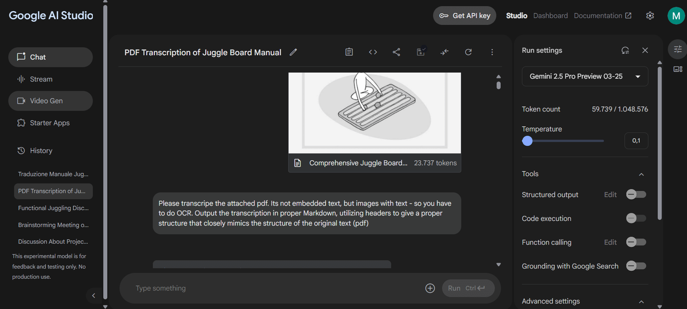
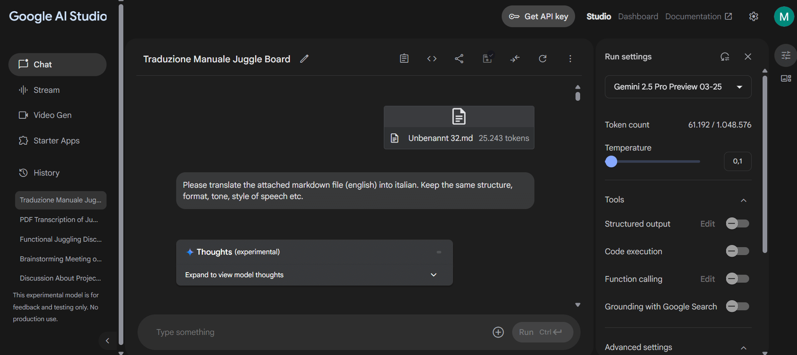

# Tutorial: Translating PDF Documents Using Large Language Models

## Introduction

This tutorial outlines a process for translating the content of PDF documents, particularly those containing non-selectable image-based text, using Large Language Models (LLMs). The workflow involves optimizing the PDF, extracting text via Optical Character Recognition (OCR), translating the text, and finally, reformatting the translation into a PDF.

**Prerequisites:**

*   A Google Account (for accessing Google AI Studio).
*   Optional: PDF optimization software (e.g., pdf24 Creator).
*   Optional: A text editor or word processor capable of handling Markdown and exporting to PDF (e.g., Obsidian, Microsoft Word).

## Step 1: Preparing the PDF Document

**Objective:** Reduce the PDF file size to optimize it for processing by the LLM while maintaining text readability. LLMs often have input size limits, and smaller files process more efficiently.

**Considerations:**

*   **Text-based PDFs:** If the text within the PDF can be selected (meaning it is embedded electronically), file size reduction is typically easier and can achieve smaller sizes without loss of quality.
*   **Image-based PDFs:** If the PDF pages are images of text (text cannot be selected individually), size reduction involves image compression. Care must be taken not to reduce the quality so much that the text becomes illegible for OCR.

**Procedure (Example using pdf24):**

1.  Open your PDF document in a tool like pdf24 Creator ([https://www.pdf24.org/](https://www.pdf24.org/)).
2.  Utilize the compression or size reduction features. Common effective settings include:
    *   Enabling web optimization.
    *   Converting colors to grayscale.
3.  Experiment with compression levels, aiming for a file size below **5 MB** while ensuring the text remains clear and readable.
4.  Save the optimized PDF file.

## Step 2: Extracting Text using Google AI Studio (Transcription/OCR)

**Objective:** Use an LLM's multimodal capabilities to perform OCR on the prepared PDF and extract the text content in a structured format.

**Procedure:**

1.  Navigate to **Google AI Studio** ([https://aistudio.google.com/](https://aistudio.google.com/)) and log in with your Google Account. Note: AI Studio is primarily a tool for experimenting with models and prompts.
2.  Start a new session or chat.
3.  Attach the optimized PDF file to your session (e.g., using the attachment button or drag-and-drop).
4.  Input the following prompt into the user message area:
    ```
    Please transcribe the attached PDF. It contains images with text, requiring OCR. Output the transcription in proper Markdown format, utilizing headers and lists to create a structure that closely mimics the original document's layout.
    ```
5.  Configure the model settings:
    *   Maintain default settings unless you have specific requirements.
    *   Set the **Temperature** to **0.1**. A lower temperature encourages more deterministic and less creative output, which is suitable for accurate transcription.
6.  Submit the prompt. The transcription process may take several minutes (potentially 4-6 minutes or longer, depending on PDF size and complexity).
7.  Once the generation is complete, copy the resulting Markdown text.
    *   *Method 1:* Use the copy option often provided within the interface (e.g., via a menu associated with the response).
    *   *Method 2:* Manually select all the generated text and copy it (Ctrl+C or right-click -> Copy).
8.  Paste the copied Markdown text into a plain text editor (like Notepad, VS Code, Obsidian, etc.).
9.  Save this content as a plain text file. Using `.txt` or `.md` (Markdown) extensions is recommended. The Markdown formatting helps preserve the document's structure (headings, lists).



## Step 3: Translating the Extracted Text using Google AI Studio

**Objective:** Translate the extracted Markdown text into the desired target language, preserving the original structure and formatting.

**Procedure:**

1.  In **Google AI Studio**, start a **new chat** to ensure a fresh context for the translation task.
2.  Attach the saved `.txt` or `.md` file containing the extracted Markdown text.
3.  Input a translation prompt, specifying the source and target languages. Example for English to Italian:
    ```
    Please translate the attached Markdown file (English) into Italian. Maintain the original structure, formatting, tone, and style of speech precisely.
    ```
    *   **Modify the prompt** according to your specific source and target languages (e.g., "...translate the attached Markdown file (German) into Spanish..."). Translation quality may vary depending on the language pair.
4.  Configure the model settings:
    *   Ensure default settings are appropriate.
    *   Set the **Temperature** to **0.1** to promote faithfulness to the source text and structure during translation.
5.  Submit the prompt. Translation may also take several minutes, comparable to the transcription time.
6.  Once generated, copy the translated Markdown text using the methods described in Step 2 (interface copy button or manual selection).



## Step 4: Reformatting the Translated Text into a PDF Document

**Objective:** Convert the translated Markdown text back into a PDF document for sharing or archiving.

**Procedure:**

1.  Paste the copied translated Markdown text into a suitable application.
2.  **Recommended:** Use a text editor or document processor that understands Markdown formatting to preserve structure (headings, lists, etc.).
    *   **Obsidian** ([https://obsidian.md/](https://obsidian.md/)) is a free tool that works well with Markdown files and often has PDF export capabilities (directly or via plugins).
    *   Modern word processors (like Microsoft Word) may also import or paste Markdown and allow saving/exporting as PDF, though formatting fidelity can vary.
    *   Dedicated Markdown-to-PDF converters are also available online or as installable software.
3.  Use the application's "Export to PDF" or "Save As PDF" function.
4.  Review the resulting PDF to ensure the formatting and content appear as expected.

## Conclusion

This tutorial demonstrated a workflow for leveraging Google AI Studio to transcribe and translate PDF documents, including those requiring OCR. By preparing the PDF, extracting text using a configured LLM, translating the result, and reformatting it, users can obtain translated versions of their documents. While this method offers a free or low-cost solution, users should be mindful of potential variations in OCR accuracy and translation quality, especially for complex layouts or less common languages. Processing times depend significantly on document size and server load.