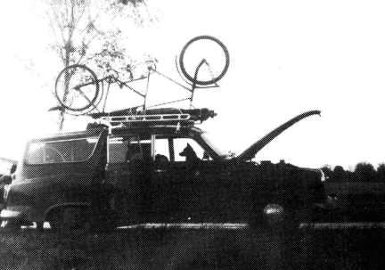

## Zirkus gesucht!
**Ein Bericht zweier Clowns, die keine Lust mehr hatten, in der DDR zu leben**
[[Zirkus gesucht!]]
### Von Streuselschnecke ...

Wie der ganze Zirkus angefangen hat? Na, das ist fast eine unendliche Geschichte....

{ align=left }

Uli liebte den Geruch von frischem Holz, wurde Tischler, ging als Handwerker zum Zirkus und begann zu jonglieren. Kattrin wußte nichts besseres und studierte Schauspiel. Uli kam mach Berlin zurück und wollte auf einem Fest sein Können zeigen. Allerdings trank er vor Aufregung zuviel und die Bälle machten mit ihm, was sie wollten. So lernten wir uns kennen und Uli wurde Kattrins Jonglierlehrer.

Das war im Februar 1980, und wir entdeckten bald unsere gemeinsame Ader für das Komische. Im Herbst hatten wir unseren ersten Auftritt unter dem Namen ULK. (Die Anfangsbuchstaben von Uli und Kattrin)

Aber es war gar nicht ulkig, eher blamabel. Aber aller Anfang ist schwer, wir übten weiter: Steppen, Jonglieren, Pantomieme... Da es in der DDR keine Workshops gibt, waren wir auf private Unterstützung angewiesen.

Im Sommer 1981 war Kattrin mit ihrem Studium fertig und mußte für drei Jahre als Absolvent an ein Theater gehen. So sah das Gesetz es vor, sonst hätte sie keinen Studienabschluß erhalten. Und ohne Abschluß ist man nichts in der DDR. Das bedeutet: Egal wie gut jemand ist, oder was er kann, ohne staatlichen Abschluß darf er nicht auftreten, also auf seinem Gebiet nicht arbeiten. Und wer nicht arbeitet, ist asozial, und wer asozial ist, wird eingeknastet.

Aber Ihr müßt nicht denken, daß es dadurch keine eigene Initiative mehr gibt: Im Gegenteil, denn in der Not erfindet der Teufel die Fliege. In Ateliers, Dachböden, Wohnungen finden Lesungen, Ausstellungen, Konzerte, Theaterprogramme statt. Einfach so auf der Straße aufzutreten, ist verboten, aber dennoch machen es manche, obwohl sie mit hohen Geldstrafen zu rechnen haben.

Aber nun zurück zu uns. Kattrin ging ans Theater, aber nach einem halben Jahr mußte der Absolventenvertrag aus gesundheitlichen Gründen aufgehoben werden. Sie kam nach Berlin zurück und wir probierten ein Clownsprogramm für Kinder, bauten Requisiten und unsere Bühne.

Uli hatte, während Kattrin am Theater arbeitete, unseren Hund Cato (reinrassiger englischer Hühnerhund) dressiert. Cato wurde unser Zirkuslöwe.

Kattrin beantragte beim Magistrat ihre Auftrittszulassung, die sie durch ihr abgeschlossenes Schauspielstudium ohne Probleme erhielt. Da Uli nichts dergleichenn vorweisen konnte, hätte er eigentlich gar nicht auftreten dürfen. So wurde er Kattrins "Assistent". Durch die Überorganisation des Erlaubniswesens fiel das nicht auf.

Ebenso bei Clemens, der unser Techniker wurde. (Er wartet leider immer noch auf seine Ausreise.) Clemens hatte ein Auto, na Auto ist wohl übertrieben: Es hieß Herbert, war älter als wir und war eigentlich ein Vollinvalide. Aber, Gott sei gedankt, blieb es immer nur auf den Rückfahrten stehen. Ein treues Gefährt. Das Tandem hatten wir für alle notfälle dabei, bis es uns gestohlen wurde.

Nun wollten wir für unser Programm Werbung machen. Dazu müßt Ihr wissen, daß es in der DDR keine Fotokopiergeräte gibt. Drucken lassen kann man auch nicht ohne weiteres. Wir hätten erstmal unseren Namen "Kinderzirkus Streuselschnecke" staatlich genehmigen lassen müssen. Dazu hatten wir auch keine Lust. Also schrieben wir alles mit der Hand und beklebten die Karten mit einem Buntpapierclown. es war mühsam, aber es machte Spaß.

Wir bekamen viele Angebote, da wir in unserer Art einzig in der DDR waren, und weil wir durch unsere Einfachheit, Lustigkeit und Spielfreude eine Alternative zum staatlich geförderten Angebot darstellten.

### ... zu Pusteblume

Als wir ein Jahr später unser Programm der staatliche Konzert- und Gastspieldirektion zeigten, um eine Gruppeneinstufung zu bekommen, damit Uli als Kattrins Partner anerkannt wird, sagte die Kommission, unser Programm enthalte keine pädagogischen Werte.

{ align=right}

Also erhielten wir nichts und schummelten uns weiter durch, immer wissend, daß entdeckt werden könnte, daß Uli gar nicht auftreten darf. (Zwei Wochen vor unserer Ausreise kam es heraus.)

Im Sommer 83, als wir bei einem kirchlichen Friedensfest spielen wollten, legte uns ein Kulturfunktionär nahe, dies sein zu lassen, denn sonst würden wir Auftrittsverbot für die gesamte DDR erhalten.

Vorfälle ähnlicher Art machten uns immer klarer, daß wir an die Grenzen der Möglichkeiten unserer Arbeit und Pläne stießen. Darum mußten und wollten wir über kurz oder lang die DDR verlassen.

Seit März leben wir nun hier. Wir sind dabei, wieder ein Programm für Kinder aufzubauen. Wir heißen jetzt nicht mehr Streuselschnecke, da dieses Gebäck hier nicht bekannt ist, sondern "Kinderzirkus Pusteblume".

Unser tiefer Traum ist es, in ein paar Jahren einen Zirkus zu gründen, in dem liebe und lustige Leute mitmachen sollen. Aber leider fehlt das Geld für diesen Traum. Es wäre schade, wenn es daran scheitern würde.

Deswegen wäre es schön, wenn ihr mithelft, diesen Traum zu verwirklichen und ein bißchen Geld dafür auf unser extra dafür eingerichtetes Konto überweist:

Bankleitzahl: 42060021
Volksbank Gelsenkirchen)
Kontonummer: 518.503.240
Und wenn es nur eine Mark ist, denn Kleinvieh macht auch einen Zirkus.

Vielen Dank, und wenn Ihr mehr Interesse an diesem Projekt habt, oder Ihr etwas über den Kinderzirkus Pusteblume wissen wollt, dann schreibt an:

Kattrin Kupke & Uli Zschau
Arminstr.10
4650 Gelsenkirchen
Tel.:0209/27 16 42

Also auf bald oder auch nicht
*Kattrin & Uli