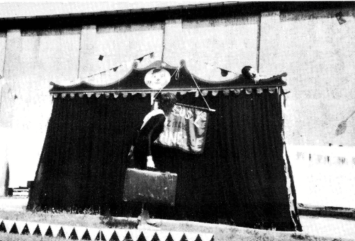
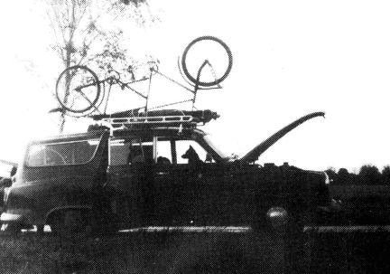

## Hledá se cirkus!
**Zpráva dvou klaunů, kteří už nechtěli žít v NDR**
[Hledá se cirkus!](Zirkus%20gesucht!.md)
### Od Šnečka s posypem ...

Jak to celé s cirkusem začalo? No, to je skoro nekonečný příběh....

{ align=left }

Uli miloval vůni čerstvého dřeva, stal se truhlářem, k cirkusu se dostal jako řemeslník a začal žonglovat. Kattrin nevěděla nic lepšího a studovala herectví. Uli se vrátil do Berlína a chtěl na slavnosti předvést své umění. Ovšem před vzrušením vypil příliš mnoho a míčky si s ním dělaly, co chtěly. Tak jsme se poznali a Uli se stal Kattrininým učitelem žonglování.

To bylo v únoru 1980 a brzy jsme objevili naši společnou vášeň pro komiku. Na podzim jsme měli svůj první společný výstup pod jménem ULK. (Počáteční písmena Uli a Kattrin)

Ale nebylo to vůbec vtipné, spíše trapné. Ale každý začátek je těžký, cvičili jsme dál: step, žonglování, pantomima... Protože v NDR neexistovaly žádné workshopy, byli jsme odkázáni na soukromou podporu.

V létě 1981 Kattrin dokončila studium a musela na tři roky jako absolventka nastoupit do divadla. Tak to zákon předepisoval, jinak by nedostala diplom. A bez diplomu nejste v NDR nic. To znamená: bez ohledu na to, jak je někdo dobrý nebo co umí, bez státního diplomu nesmí vystupovat, tedy v oboru pracovat. A kdo nepracuje, je asociál, a kdo je asociál, je zavřený.

Ale nemusíte si myslet, že tím zanikla vlastní iniciativa: naopak, v nouzi ďábel létá. V ateliérech, na půdách, v bytech se konají čtení, výstavy, koncerty, divadelní programy. Jednoduše vystupovat na ulici je zakázáno, ale přesto to někteří dělají, i když jim hrozí vysoké pokuty.

Ale teď zpět k nám. Kattrin šla do divadla, ale po půl roce musela být absolventská smlouva zrušena ze zdravotních důvodů. Vrátila se do Berlína a my jsme zkusili klaunský program pro děti, postavili rekvizity a naši scénu.

Uli mezitím, co Kattrin pracovala v divadle, cvičil našeho psa Cata (čistokrevného anglického ohaře). Cato se stal naším cirkusovým lvem.

Kattrin požádala magistrát o povolení k vystupování, které díky svému dokončenému hereckému studiu bez problémů získala. Protože Uli nic podobného nemohl předložit, vlastně vůbec nesměl vystupovat. Tak se stal Kattrininým "asistentem". Díky přebujelé byrokracii to nikdo nezaznamenal.

Stejně tak u Clemense, který se stal naším technikem. (Bohužel stále čeká na své vystěhování.) Clemens měl auto, no auto je asi přehnané: jmenovalo se Herbert, bylo starší než my a bylo v podstatě úplně v nepořádku. Ale, díky bohu, vždycky se porouchalo jen na zpáteční cestě. Věrný společník. Tandem jsme měli pro všechny nouzové případy, dokud nám ho neukradli.

Teď jsme chtěli pro náš program dělat reklamu. K tomu musíte vědět, že v NDR neexistují kopírky. Tisknout si něco také není jen tak možné. Museli bychom si nechat státně schválit naše jméno "Dětský cirkus Šneček s posypem". K tomu jsme také neměli chuť. Takže jsme všechno psali ručně a karty jsme polepili barevným papírovým klaunem. Byla to dřina, ale bavilo nás to.

Dostali jsme mnoho nabídek, protože jsme byli ve svém druhu v NDR jedineční a protože jsme naší jednoduchostí, veselostí a hravostí představovali alternativu ke státně podporované nabídce.

### ... k Pampelišce

Když jsme o rok později ukázali náš program státnímu ředitelství koncertů a hostování, abychom získali skupinovou klasifikaci, aby byl Uli uznán jako Kattrinin partner, komise řekla, že náš program neobsahuje žádné pedagogické hodnoty.

{ align=right}

Takže jsme nic nedostali a dál jsme se protloukali, vždy s vědomím, že by se mohlo zjistit, že Uli vůbec nesmí vystupovat. (Dva týdny před naším odjezdem se to provalilo.)

V létě 83, když jsme chtěli hrát na církevní slavnosti míru, nám kulturní funkcionář doporučil, abychom to nedělali, protože jinak bychom dostali zákaz vystupování pro celou NDR.

Podobné incidenty nám stále jasněji ukazovaly, že narážíme na hranice možností naší práce a našich plánů. Proto jsme museli a chtěli dříve či později NDR opustit.

Od března zde žijeme. Znovu budujeme program pro děti. Už se nejmenujeme Šneček s posypem, protože toto pečivo zde není známé, ale "Dětský cirkus Pampeliška".

Naším hlubokým snem je za pár let založit cirkus, ve kterém by se účastnili milí a zábavní lidé. Ale bohužel na tento sen chybí peníze. Byla by škoda, kdyby to zkrachovalo na tom.

Proto by bylo hezké, kdybyste pomohli tento sen uskutečnit a poslali trochu peněz na náš k tomu speciálně zřízený účet:

Bankovní kód: 42060021
Volksbank Gelsenkirchen)
Číslo účtu: 518.503.240
A i kdyby to byla jen marka, protože i malá zvířata dělají cirkus.

Moc děkujeme, a pokud máte o tento projekt větší zájem, nebo chcete o dětském cirkusu Pampeliška něco vědět, napište na:

Kattrin Kupke & Uli Zschau
Arminstr.10
4650 Gelsenkirchen
Tel.:0209/27 16 42

Takže na brzkou, nebo i pozdní shledanou
*Kattrin & Uli
