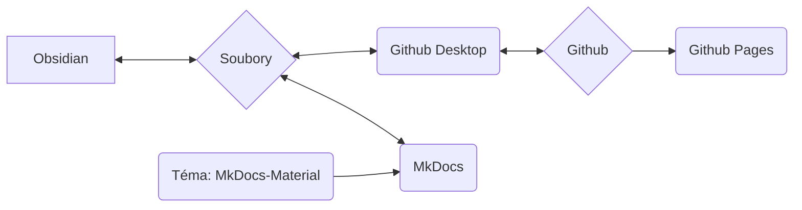

Používáme MkDocs jako systém pro dokumentování našich procesů, postupů a pracovních toků a jejich zpřístupnění online.

## Základní myšlenka systému

>[!info]
>- Obsah a rozvržení jsou striktně odděleny
>- Vše je založeno na jednoduchých textových souborech ve formátu Markdown ( *.md )
>- žádná proprietární data
>- Vše lze v zásadě (až na několik výjimek) provádět v textovém editoru ( já osobně používám Obsidian a vysvětlím pracovní postupy s ním )
>- data lze upravovat lokálně
>- pomocí MkDocs jsou data z Markdownu převedena na statickou webovou stránku
>- data z Markdownu i data webové stránky jsou uložena v repozitáři Git společnosti Nica e.v.
>- přes Github Pages je pak vše dostupné jako webová stránka



>[!info]+ 
>Každá jednotlivá softwarová komponenta (Github, Github Pages, Github Desktop, MkDocs, Obsidian, MkDocs-Materials) je **open source a lze ji používat zdarma**.
>
>Pokud by jednotlivé komponenty odpadly (služba by byla ukončena, software by již nebyl dostupný nebo z jiných důvodů), samotná data (tedy soubory Markdown) zůstanou zachována.
>
>Použití Githubu nám na jedné straně umožňuje verzování dat – to znamená, že každá změna je zdokumentována a sledovatelná, a každou změnu lze také vrátit zpět.
>Umožňuje také ostatním přispívat k dokumentaci, aniž bychom museli spravovat uživatelská data nebo se starat o bezpečnost systému (to je však technicky poněkud náročnější).
>
>Tímto jsme dlouhodobě mnohem odolnější. Jelikož taková dokumentace v průběhu času roste, považuji to za obrovskou výhodu.
 
### Zapojení dalších osob
Systém popsaný níže může pro osoby, které se jinak s kódem a programováním příliš nesetkávají, na první pohled působit ohromujícím nebo odrazujícím dojmem.

Abychom to řešili, máme následující alternativní možnosti tvorby obsahu:
- Vytváření obsahu jako stránky ve WordPressu
- Obsah jako textový soubor, soubor Word (nebo jiné běžné formáty)

Tyto obsahy pak poslat e-mailem aktuálně zodpovědné osobě (viz [Tiráž](Impressum.md)). Ta je pak zapracuje.
## Souborový systém

>[!info]+ Struktura adresářů a soubory
>**/docs**
>**/site**
>
>license
>mkdocs.yml
>readme.md

## Obsidian

Zejména díky použití [Obsidianu](Obsidian%20Setup.md) jako textového editoru má toto nastavení obrovské výhody:

- Obsidian je obzvláště vhodný pro velké množství jednotlivých souborů, které jsou propojeny pomocí tagů nebo odkazů, nebo jsou kategorizovány pomocí struktury adresářů (podadresářů).
- Obsidian dokáže tato data graficky zobrazit, což zejména zlepšuje správu velkého množství dat.

Další velkou výhodou Obsidianu je obrovský ekosystém pluginů. To nám umožňuje velmi snadno přidávat funkce, jako například:
- Filtrování / vyhledávání podobné databázi
- Správa tagů (např. změny ve více souborech najednou, jako je přejmenování často používaného tagu)
- Snadná správa metadat (tzv. [Frontmatter](Frontmatter%20Properties.md) nebo YAML)

## Github

Je program pro správu verzí dat, který lze používat online.
### Github Desktop

Git je ve skutečnosti nástroj příkazového řádku – to mnohé odrazuje.
Github Desktop tento problém řeší tím, že potřebnou funkcionalitu zabalí do aplikace s jednoduchým grafickým rozhraním.

### Github Pages

Github Pages je služba od Githubu.
Pokud jsou v repozitáři uložena data webové stránky v určitém formátu, mohou být zobrazena jako webová stránka.

- služba je zdarma
- MkDocs provede všechny potřebné kroky automaticky

Výhoda pro nás:
- žádný vlastní hosting
- žádné poplatky
- pro nahrání / aktualizaci obsahu stačí pouze příkaz příkazového řádku: ```

```
mkdocs gh-deploy
```

Celkově se nemusíme o nic starat, můžeme pracovat téměř výhradně lokálně.
## MkDocs

[MkDocs](https://mkdocs.org) je software pro vytváření online dostupných dokumentací.
Obsah se vytváří v jednoduchých textových souborech – to lze provádět v jakémkoli textovém editoru, který podporuje [formát Markdown](Markdown.md). 

>[!info]- Seznam možných textových editorů
>- Notepad++
>- Atom
>- Visual Studio Code
>- Sublime
>- Textový editor Windows
>- Obsidian

Pomocí příkazu příkazového řádku se MkDocs spustí a může:

- lokálně zobrazit hotovou verzi webové stránky
	- ta se automaticky aktualizuje při změnách v textových souborech
	- to umožňuje velmi rychlé a snadné psaní a formátování obsahu
- vytvořit data pro statickou webovou stránku (lokálně)
	- ta lze pak například přímo nahrát na server
- pomocí propojení s Github Pages přímo nahrát statickou webovou stránku
	- to je zdarma, pokud je dokumentace veřejně dostupná a pod licencí open source (obojí splňujeme)

Kompletní dokumentaci naleznete na [mkdocs.org](https://www.mkdocs.org).

### Téma: MkDocs Material

https://squidfunk.github.io/mkdocs-material/
