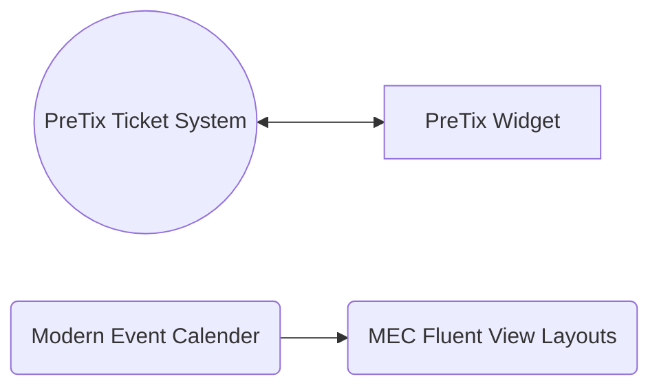

# Wordpress

## Pluginy
## Systém pro události a rezervace

## Návody

-   :material-clock-fast:{ .lg .middle } __Účetnictví__

    ---

    Jak u nás vytvořit stránku ve Wordpressu.
     autor: piiit

    [:octicons-arrow-right-24: Zobrazit](wordpress-pages.md){  .md-button }

[Jak vytvořit stránku ve Wordpressu](wordpress-pages.md)
