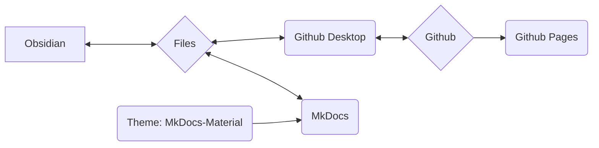

Wir nutzen MkDocs als System um unsere Prozesse, Vorgehensweisen und Abläufe zu dokumentieren und online zur Verfügung zu stellen.

## Grundidee des Systems

>[!info]
>- Content und Layout sind strikt getrennt
>- Alles basiert auf simplen Textdateien im Markdown Format ( *.md )
>- keine proprietären Daten
>- Alles kann prinzipiell (bis auf wenige Ausnahmen) mit einem Texteditor gemacht werden ( ich selber nutze Obsidian und werde die Arbeitsweisen damit erklären )
>- die Daten können lokal bearbeitet werden
>- mittels MkDocs werden die Markdown Daten in eine statische Webseite umgewandelt
>- die Markdown Daten sowie die Webseite Daten werden auf dem Git Repository von Nica e.v. gespeichert
>- Über Github Pages ist das ganze dann als Webseite aufrufbar



>[!info]+ 
>Jede einzelne Software Komponente (Github, Github Pages, Github Desktop, MkDocs, Obsidian, MkDocs-Materials) ist **Open Source und kostenfrei nutzbar**.
>
>Sollten einzelne Komponenten wegfallen (Service wird eingestellt, Software nicht länger verfügbar oder andere Gründe) sind die eigentlichen Daten (also die Markdown Dateien) immer noch da.
>
>Die Nutzung von Github erlaubt uns einerseits die Versionierung der Daten - dies bedeutet das jede Änderung dokumentiert und nachvollziehbar ist, sowie jede Änderung auch wieder zurückgenommen werden kann.
>Es erlaubt es außerdem anderen an der Dokumentation mitzuarbeiten ohne das wir Nutzerdaten verwalten müssen oder um uns die Sicherheit des Systems sorgen müssen (dies ist allerdings technisch etwas aufwendiger).
>
>Somit sind wir langfristig deutlich resilienter. Da eine solche Dokumentation auf lange Zeit wächst finde ich dies einen enormen Vorteil 
 
### Einbindung von anderen Personen
Das im folgende beschriebene System kann für Personen welche sonst recht wenig mit Code und Programmieren zu tun haben auf den ersten Blick überwältigend oder abschreckend sein.

Um dies zu adressieren haben wir folgende Alternative Möglichkeiten zur Inhalts Erstellung:
- Inhalte in Wordpress als Seite erstellen
- Inhalte als Textdatei, Word-Datei (oder andere typische Formate)

Diese Inhalte dann per mail an die aktuell verantwortliche Persone (siehe [Impressum](Impressum.md) ) senden. Diese werden dann eingepflegt.
## Dateisystem

>[!info]+ Verzeichniss Struktur und Dateien
>**/docs**
>**/site**
>
>license
>mkdocs.yml
>readme.md

## Obsidian

Besonders durch die Nutzung von [[Obsidian Setup|Obsidian]] als Texteditor hat dieses Setup gewaltige Vorteile:

- Obsidian ist besonders geeignet für eine große Anzahl einzelner Dateien welche durch Tags oder Verlinkung verknüpft sind oder mittels Verzeichnissstrukturen (Unterverzeichnisse) kategorisiert sind
- Obsidian kann diese Daten grafisch darstellen was besonders das managen von großen Mengen an Daten verbessert

Ein weiterer großer Vorteil von Obsidian ist das riesige Plugin Ökosystem. Dies erlaubt es uns sehr einfach Funktionalität hinzuzufügen wie z.B.
- Datenbank ähnliche Filterung / Suche
- Tag Verwaltung (z.B. Änderungen in vielen Dateien gleichzeitig wie das umbenennen eines vielfach genutzten Tags)
- einfaches managen von Meta-Daten (sogenanntes [[Frontmatter Properties|Frontmatter]] oder YAML)

## Github

Ist ein Versions Kontroll Programm für Daten welches online genutzt werden kann.
### Github Desktop

Git ist eigentlich ein Kommandozeilen Tool - das schreckt viele ab.
Github Desktop löst dieses Problem indem es die nötige Funktionalität in eine Anwendung mit einer einfachen grafischen Oberfläche packt.

### Github Pages

Github Pages ist ein Service von Github.
Sind auf einem Repository Website Daten in einer bestimmten Form gespeichert - können diese als Webseite angezeigt werden.

- der Service ist kostenfrei
- MkDocs erledigt alle nötigen Schritte von alleine

Der Vorteil für uns:
- kein eigenes Hosting
- keine Gebühren
- zum hochladen / aktualisieren des Inhaltes benötigt es lediglich einen Kommandozeilen Befehl: ```

```
mkdocs gh-deploy
```

Im großen und ganzen müssen wir uns um nichts kümmern, können fast ausschließlich lokal arbeiten.
## MkDocs

[MkDocs](https://mkdocs.org) ist eine Software zum erstellen von online verfügbaren Dokumentationen.
In einfachen Textdateien wird der Inhalt erstellt - dies kann in jedem beliebigen Texteditor erfolgen welcher das [[Markdown|Markdown Format]] beherrscht. 

>[!info]- Liste möglicher Texteditoren
>- Notepad++
>- Atom
>- Visual Studio Code
>- Sublime
>- Windows Text Editor
>- Obsidian

Mittels eines Kommandozeilen Befehls wird MkDocs dann ausgeführt und kann:

- offline eine fertige Version der Webseite anzeigen
	- diese wird automatisch aktualisiert wenn es Änderungen an den Textdateien gibt
	- das erlaubt ein sehr schnelles und einfaches verfassen und gestalten der Inhalte
- die Daten für die statische Webseite erstellen (lokal)
	- diese können dann z.B. direkt auf einen Server geladen werden
- mittels Anbindung an Github Pages die statische Webseite direkt hochladen
	- dies ist kostenfrei solange die Dokumentation öffentlich verfügbar und unter einer OpenSource Lizenz steht (beides erfüllen wir)

For full documentation visit [mkdocs.org](https://www.mkdocs.org).

### Theme: MkDocs Material

https://squidfunk.github.io/mkdocs-material/