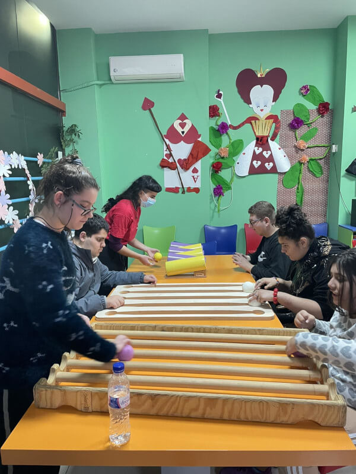

# **Ασφάλεια: Κλειδί για τον Αυτισμό**

[Monokyklo](Monokyklo.md) - Θεσσαλονίκη, Ελλάδα
*Σύνταξη: Εύα Παρλάνη*

## **Η Αρχή**

Η **ομάδα του Μονοκύκλου** εισήγαγε μεθόδους *Λειτουργικού Τζάγκλινγκ* στη Θεσσαλονίκη, με πρωταρχικό στόχο την **προσβασιμότητα των τεχνών του τσίρκου σε άτομα με αναπηρία**. Η ομάδα αποτελούνταν από εκπαιδευτές με υπόβαθρο στις τέχνες του τσίρκου και ειδική εκπαίδευση στο Λειτουργικό Τζάγκλινγκ, την οποία απέκτησαν μέσω συμμετοχής σε διεθνή σεμινάρια και εκπαιδευτικά προγράμματα για εμψυχωτές.

Το πρόγραμμα, με τίτλο **«Μια Κυλιόμενη Μπάλα»**, σχεδιάστηκε ως **ολοκληρωμένη παρέμβαση** σε διάφορα **Κέντρα Ημέρας ΑμεΑ (ΚΗΑμεΑ)** της Θεσσαλονίκης. Στόχος του ήταν να προσφέρει έναν **δημιουργικό, συμπεριληπτικό χώρο έκφρασης** μέσω της γλώσσας του τζάγκλινγκ και της κίνησης.

Ως εμψυχώτρια με εμπειρία σε εργαστήρια τσίρκου και έχοντας παρακολουθήσει εκπαιδεύσεις σε **Θεσσαλονίκη, Βουδαπέστη και Μιλάνο**, εντάχθηκα στο πρόγραμμα με μια **βαθιά επιθυμία να κάνω τις τέχνες του τσίρκου προσβάσιμες σε όλους** – χωρίς αποκλεισμούς ή διακρίσεις. Ως επικεφαλής της ομάδας, εστίασα στην **ενίσχυση της ομαδικής δυναμικής** και στη δημιουργία ενός **ασφαλούς, υποστηρικτικού περιβάλλοντος** στο οποίο οι συμμετέχοντες θα μπορούσαν να εξερευνήσουν μια άγνωστη δραστηριότητα με **αυτοπεποίθηση και άνεση**.

Ένα βασικό στοιχείο του προγράμματος ήταν ότι **επισκεπτόμασταν τους συμμετέχοντες στα δικά τους περιβάλλοντα**, φέρνοντας μαζί μας όλο τον απαραίτητο εξοπλισμό. Αυτή η προσέγγιση, που επέτρεπε στα άτομα να παραμένουν σε **οικείους και προστατευμένους χώρους**, αποδείχθηκε ουσιαστική για τη **διευκόλυνση της πρώιμης εμπλοκής και άνεσής τους** με τις δραστηριότητες. Κατέστη σαφές ότι ο **σεβασμός στον ρυθμό και την ατομικότητα κάθε συμμετέχοντα**, σε συνδυασμό με την **ενεργή συνεργασία με τους εκπαιδευτικούς του χώρου**, συνέβαλαν σημαντικά στην επιτυχία του προγράμματος.

---
## **Η Περίπτωση του Νικόλα**

Ανάμεσα στις πολλές ιστορίες που προέκυψαν, ξεχώρισε ο **Νικόλας**. Ο Νικόλας, περίπου δέκα ετών, είναι **στο φάσμα του αυτισμού**. Έχει **περιορισμένη ομιλία και εκφραστικές ικανότητες** και συνήθως **κινείται στον χώρο μόνο με την υποστήριξη** ενός ειδικού παιδαγωγού. Ήταν ιδιαίτερα ευαίσθητος στους **δυνατούς ήχους** και στις **απότομες κινήσεις**, γεγονός που τον καθιστούσε επιφυλακτικό και διστακτικό κατά τις αρχικές μας συναντήσεις.

Κατά τις **δύο πρώτες επισκέψεις μας**, ο Νικόλας παρέμενε σε απόσταση. **Δεν πλησίαζε τα αντικείμενα**, και παρόλο που τον προσεγγίζαμε με ανοιχτότητα και φροντίδα, **δεν ανταποκρινόταν στην λεκτική επικοινωνία**. Η **σωματική και συναισθηματική του απόσταση** παρέμενε σταθερή.

Όμως, κάτι άλλαξε κατά τη **τρίτη συνάντηση**. Για πρώτη φορά, ο **Νικόλας πήρε τις μπάλες του τζάγκλινγκ**, έκανε **οπτική επαφή** και **αποδέχθηκε την παρουσία μας**. Από εκείνη τη στιγμή, άρχισε να δημιουργείται μια σύνδεση. Άρχισε να μας **υποδέχεται με εμπιστοσύνη**, να βοηθά στην προετοιμασία του χώρου, να **δοκιμάζει νέους συνδυασμούς** και να **επιστρέφει στα αντικείμενα αυτόνομα**.

Πιστεύω ότι καταφέραμε να προσφέρουμε στον Νικόλα ένα **περιβάλλον χωρίς απειλές** – έναν χώρο όπου μπορούσε να **πειραματιστεί, να δημιουργήσει, να δοκιμάσει, ακόμα και να αποτύχει** χωρίς φόβο κρίσης. Ήταν ένας **ασφαλής χώρος αυτοέκφρασης** και ανακάλυψης, όπου η διαδικασία του μπορούσε να ξεδιπλωθεί με **τον δικό του ρυθμό**.

Από εκείνο το σημείο και μετά, ο Νικόλας **δεν έχασε ποτέ συνάντηση**. **Θυμόταν τους συνδυασμούς** που εξασκούσαμε, **δοκίμαζε νέους με ενθουσιασμό** και έδειχνε ολοένα και μεγαλύτερη **αυτονομία** στην εξερεύνησή του. Με τον καιρό, **μείωσε την εξάρτησή του από τον υποστηρικτικό του δάσκαλο** και, σε μια δυνατή στιγμή σύνδεσης, άρχισε να **μοιράζεται προσωπικές πληροφορίες** μαζί μας – μια πράξη που σηματοδοτούσε βαθιά εμπιστοσύνη.

Μέσα από αυτή τη διαδικασία, παρατηρήσαμε μια σαφή **αύξηση στην αυτοπεποίθηση του Νικόλα**, στις **δεξιότητες επικοινωνίας** και στην **κοινωνική του εξωστρέφεια**. Το ταξίδι του είναι μόνο ένα παράδειγμα της **μεταμορφωτικής δύναμης του Λειτουργικού Τζάγκλινγκ**, τόσο για την **ψυχο-συναισθηματική ανάπτυξη** όσο και για τη **σωματική ενεργοποίηση**.

{ align=left }

---

## **Προσωπικός Αναστοχασμός**
Αυτή η εμπειρία υπήρξε **βαθιά μεταμορφωτική** για εμένα – όχι μόνο επαγγελματικά, αλλά και προσωπικά. Μπόρεσα να **εφαρμόσω μια μέθοδο στην οποία πιστεύω**, και ταυτόχρονα, να γίνω μάρτυρας του πώς **το τσίρκο μπορεί να λειτουργήσει ως εργαλείο ένταξης, ενδυνάμωσης και επικοινωνίας**.

Η καθημερινή επαφή με τους συμμετέχοντες – τις **μοναδικές τους αντιδράσεις**, τις **μικρές ή μεγάλες νίκες τους** – μου υπενθύμισε τη **δύναμη της απλότητας**: την απλότητα της **κίνησης**, του **παιχνιδιού**, της **παρουσίας**.

Αυτή η διαδικασία **με ενίσχυσε ως εκπαιδεύτρια**, ως εμψυχώτρια και ως άνθρωπο. Επαναβεβαίωσε την πεποίθησή μου ότι **η τέχνη μπορεί να είναι μια γέφυρα** – ένα εργαλείο για **πρόσβαση**, για **σύνδεση** και για **αλληλεγγύη**.
