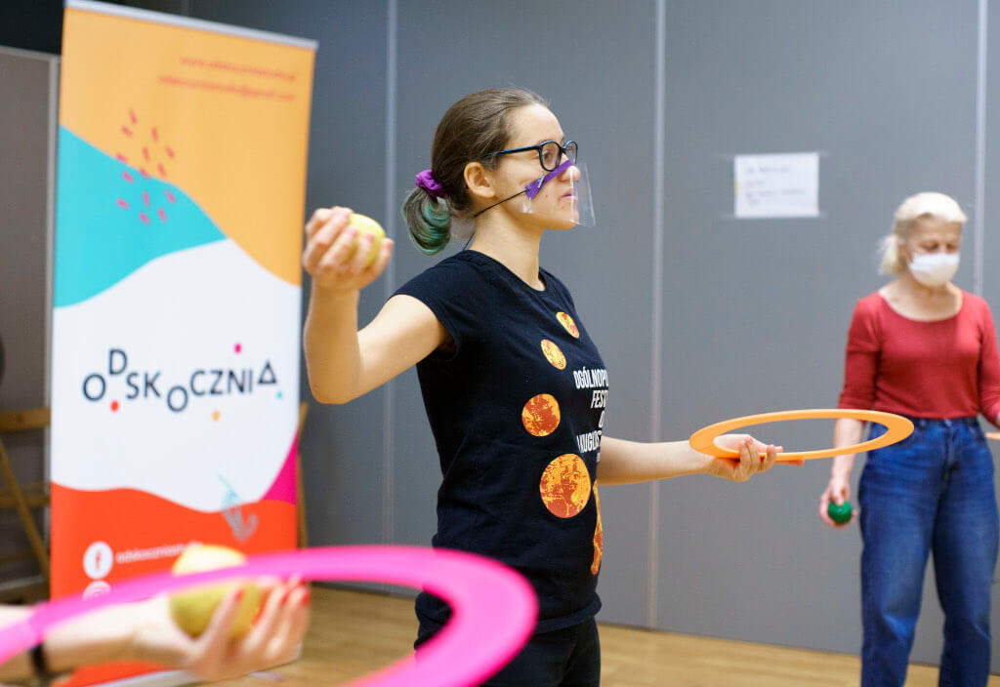
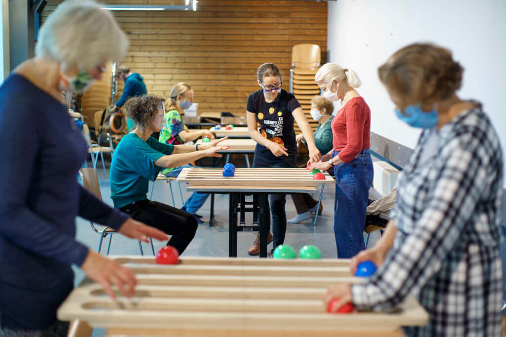
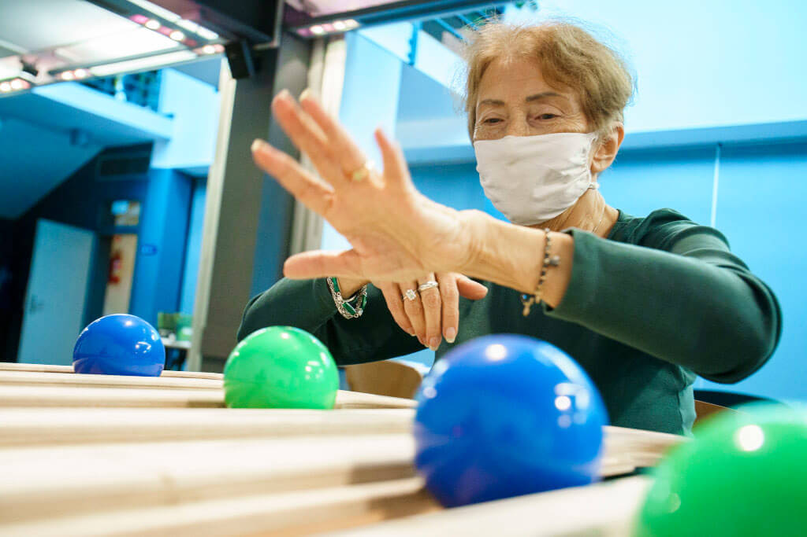

# **Χωρίς Όριο Ηλικίας — Λειτουργική Ζογκλερική με Ηλικιωμένους κατά τη Διάρκεια του Λοκντάουν**

[Odskocznia Studio](Odskocznia%20Studio.md) - Βαρσοβία, Πολωνία
Συντάκτης: Wiktoria Witenberg

## **Ομάδα Στόχος**
 Το έργο αυτό, υπό την καθοδήγηση του **Odskocznia Studio**, σχεδιάστηκε για **ενήλικες ηλικίας 65 ετών και άνω**. Μέσω μιας **ανοιχτής πρόσκλησης**, καλέσαμε ηλικιωμένους να συμμετάσχουν σε μαθήματα **Λειτουργικής Ζογκλερικής (FJ)** που φιλοξενήθηκαν στο **Centrum Kultury Praga-Południe** στη Βαρσοβία. Οι συμμετέχοντες ήταν **ανεξάρτητοι, δραστήριοι ηλικιωμένοι**—ικανοί να εγγραφούν και να παρευρεθούν μόνοι τους—τους οποίους θα περιέγραφα ως άτομα που λειτουργούν σε **μέσο έως υψηλό επίπεδο για την ηλικία τους**.

---

## **Προέλευση και Πλαίσιο**
 Η ιδέα προέκυψε τον **Μάρτιο του 2020**, κατά τη διάρκεια του πρώτου **λοκντάουν λόγω COVID-19**. Η Paulina, ιδρύτρια του Odskocznia Studio, εξέφρασε ενδιαφέρον για την ανάπτυξη ενός **προγράμματος βασισμένου στο τσίρκο για ηλικιωμένους**. Λίγους μήνες αργότερα, καθώς οι περιορισμοί άρθηκαν προσωρινά, ξεκινήσαμε τον σχεδιασμό. Παρά τον αυξανόμενο αριθμό κρουσμάτων και την απειλή ενός δεύτερου λοκντάουν, πήραμε τη συλλογική απόφαση να προχωρήσουμε—με προσοχή.

Η **ομάδα μας από τέσσερις εκπαιδευτές** περιλάμβανε:
* Δύο κύριοι εκπαιδευτές (με κάποια εμπειρία στη διδασκαλία Juggle Board)
* Δύο υποστηρικτικοί εκπαιδευτές (νέοι στη Λειτουργική Ζογκλερική)

Κάθε **ομάδα έως 12 συμμετεχόντων** καθοδηγούνταν από έναν κύριο εκπαιδευτή και έναν βοηθό.

Το δικό μου υπόβαθρο περιλάμβανε:
* Ένα **σεμινάριο τριών ημερών** με τον Craig Quat το 2017 (πριν τυποποιηθεί το “The Seminar”)
* Ένα **πιλοτικό έργο** με ηλικιωμένους στη Βαρσοβία (6 συνεδρίες / 9 ώρες)
* Αρκετές **ατομικές συνεδρίες FJ**

Ο Kamil, ένας από τους κύριους εκπαιδευτές, είχε συν-καθοδηγήσει το πιλοτικό πρόγραμμα. Η Paulina και η Julia ήταν νέες στη μεθοδολογία. Πριν από την έναρξη του **No Age Limit**, διεξήγαγα μια **εκπαίδευση δύο ωρών** στις βασικές αρχές της FJ και στα **μοτίβα του Juggle Board** για τους υποστηρικτικούς εκπαιδευτές.

---

## **Στόχοι**

**Ανάπτυξη Εκπαιδευτών**
 Να δοθεί στους νέους εκπαιδευτές **πρακτική εμπειρία** στη διευκόλυνση της Λειτουργικής Ζογκλερικής, συμβάλλοντας στην επέκταση μιας τοπικής βάσης **έμπειρων και ανεξάρτητων διευκολυντών**.

**Ευημερία Συμμετεχόντων**
 Να προσφερθούν στους ηλικιωμένους **χαρούμενες, ενσωματωμένες εμπειρίες** που υποστήριζαν την **κοινωνική σύνδεση και τη σωματική δραστηριότητα**, ειδικά σε μια περίοδο **αυξημένης απομόνωσης**. Οι συνεδρίες σχεδιάστηκαν με έμφαση στην **συναισθηματική ασφάλεια, το αισθητηριακό παιχνίδι** και την **κίνηση σε κατάσταση ροής**, σεβόμενοι ταυτόχρονα **αυστηρά πρωτόκολλα υγείας** (απόσταση, μάσκες, μη φυσική επαφή).

---

## **Χώρος και Εργαλεία**
 Οι τάξεις διεξήχθησαν σε ένα **ευρύχωρο υπόγειο** του πολιτιστικού κέντρου. Αρχικά, φανταζόμασταν ένα ζεστό στούντιο γιόγκα, αλλά ο ανοιχτός χώρος αποδείχθηκε ιδανικός για **ασφαλή απόσταση**. Χωρίσαμε τον χώρο σε δύο ζώνες:

* Ένας **καθιστός κύκλος** για ομαδική ανασκόπηση
* Μια **περιοχή Juggle Board**, όπου κάθε ζευγάρι είχε ένα **αφιερωμένο τραπέζι σε απόσταση δύο μέτρων**

Κατά τη **διάρκεια της πρώτης συνεδρίας**, όλοι οι συμμετέχοντες επέλεξαν να παραμείνουν καθιστοί. Αλλά με τον καιρό, **περισσότεροι άρχισαν να στέκονται**—ένα σημάδι **αυξανόμενης αυτοπεποίθησης** και **σωματικής άνεσης**. Εξασφαλίζαμε πάντα ότι **υπήρχαν διαθέσιμες καρέκλες**, επιτρέποντας στους συμμετέχοντες να ξεκινούν από εκεί που ένιωθαν ασφαλείς.

Ο εξοπλισμός περιλάμβανε:
* **Juggle Boards**
* **Μαντήλια, μπάλες, στεφάνια, ρόπαλα, poi**
* **Φτερά παγωνιού**
* **Hula hoops** (που εισήχθησαν στην τελευταία συνεδρία)

Για δύο συνεδρίες, μεταφερθήκαμε σε ένα **μικρότερο κλειστό γυμναστήριο** για να εξερευνήσουμε φτερά και στεφάνια. Ο οικείος χώρος επέτρεψε το **δημιουργικό χάος** διατηρώντας παράλληλα τη **συνοχή της ομάδας**—κάτι πιο δύσκολο στον μεγαλύτερο χώρο.

---

## **Σχεδιασμός και Ροή Συνεδρίας**
 Το πρόγραμμα διήρκεσε **πέντε εβδομάδες**, με **μία συνεδρία 90 λεπτών ανά εβδομάδα**, πάντα προγραμματισμένη τα πρωινά (κάτι που, όπως μάθαμε αργότερα, **δεν ήταν η προτιμώμενη ώρα** για πολλούς συμμετέχοντες).

**Δομή Συνεδρίας**:
* **Κύκλος Καλωσορίσματος**
* **Προθέρμανση Εγκεφάλου** (π.χ. διμερής συντονισμός, ασκήσεις δακτύλων "πιανίστα")
* **Πρώτη Δραστηριότητα με Αντικείμενα** (πάντα το Juggle Board)
* **Σύντομο Διάλειμμα**
* **Δεύτερη Δραστηριότητα με Αντικείμενα** (εναλλασσόμενη: poi, μαντήλια, μπάλες, φτερά, hula hoop)
* **Κύκλος Ανασκόπησης και Αποχαιρετισμού**

Με αυτή την ομάδα ηλικιωμένων, οι **ανοιχτήριοι και κλειστήριοι κύκλοι φυσικά επεκτείνονταν** περισσότερο από ό,τι σε άλλα πλαίσια. Πολλοί συμμετέχοντες εξέφρασαν έντονη ανάγκη να **μοιραστούν, να ανασκοπήσουν και να συνδεθούν**—μια ουσιαστική απάντηση σε μήνες απομόνωσης.

Κάθε συνεδρία καθοδηγούνταν από **έναν εκπαιδευτή και έναν βοηθό**, εξασφαλίζοντας **εξατομικευμένη προσοχή** και υποστηρικτικό ρυθμό.

---

## **Αποτελέσματα και Σκέψεις**

**Ανάπτυξη Εκπαιδευτών**
 Λόγω του **δεύτερου λοκντάουν**, η ικανότητά μας να **μέντορες νέους εκπαιδευτές** περιορίστηκε. Ως κύριος διευκολυντής, μεγάλο μέρος της ενέργειάς μου παρέμεινε εστιασμένο στη διαχείριση της **συναισθηματικής ευημερίας** της ομάδας. Παρόλα αυτά, οι υποστηρικτικοί εκπαιδευτές απέκτησαν πολύτιμη **πρακτική εμπειρία** και μια σαφέστερη κατανόηση των **θεμελιωδών μοτίβων FJ**.

**Ευημερία Συμμετεχόντων**
 Αυτός ο στόχος **επιτεύχθηκε πλήρως**. Η ομάδα παρέμεινε αφοσιωμένη και χαρούμενη καθ' όλη τη διάρκεια, και ολοκληρώσαμε το πρόγραμμα με μια αίθουσα γεμάτη **ικανοποιημένους, συνδεδεμένους συμμετέχοντες**.

Μια βασική διαπίστωση αφορούσε τον **προγραμματισμό**. Είχαμε υποθέσει ότι οι ηλικιωμένοι θα προτιμούσαν τις πρωινές συνεδρίες. Ωστόσο, τα σχόλια αποκάλυψαν μια **προτίμηση για αργότερες ώρες**, υπενθυμίζοντάς μας να **αμφισβητούμε τις παραδοχές**—ακόμη και εκείνες που βασίζονται στη λογική ή την προηγούμενη εμπειρία.

Για την αξιολόγηση των αποτελεσμάτων, χρησιμοποιήσαμε τόσο **λεκτική ανατροφοδότηση** όσο και ένα **δημιουργικό εργαλείο**: το **Blob Tree**. Οι συμμετέχοντες επέλεξαν και χρωμάτισαν τον χαρακτήρα που αντικατόπτριζε καλύτερα πώς ένιωθαν. Οι περισσότεροι επέλεξαν τη φιγούρα **στο κέντρο της σκηνής, κάτω από τα φώτα**. Τα σχόλιά τους μιλούσαν για το ότι ένιωθαν **ορατοί, εκτιμημένοι και συνδεδεμένοι**—μετά από μόλις πέντε συνεδρίες.

---

## **Τελικές Σκέψεις**
 Σε μια εποχή φόβου και αβεβαιότητας, αυτό το έργο δημιούργησε έναν **μικρό αλλά ισχυρό χώρο** για **κοινότητα, χαρά και παρουσία**. Ακόμη και με **μάσκες και αποστάσεις**, ακόμη και κατά τη διάρκεια του λοκντάουν, ήταν δυνατό να **καλλιεργηθεί η σύνδεση**.

Η **Λειτουργική Ζογκλερική** και οι **πρακτικές κοινωνικού τσίρκου** προσέφεραν κάτι περισσότερο από σωματική δραστηριότητα—πρόσφεραν έναν **δρόμο προς την ανθεκτικότητα, την έκφραση και την αίσθηση του ανήκειν**. Η εμπειρία μας υπενθύμισε ότι η **ηλικία δεν είναι όριο, αλλά μια αρχή**.
