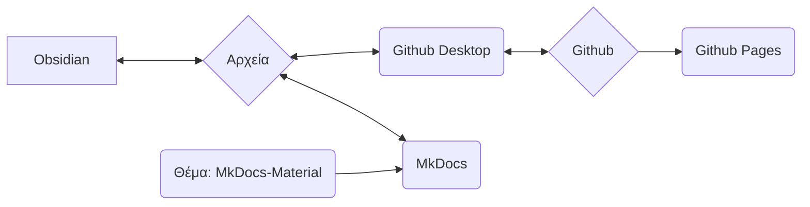

Χρησιμοποιούμε το MkDocs ως σύστημα για την τεκμηρίωση των διαδικασιών, των μεθόδων και των ροών εργασίας μας και για τη διάθεσή τους στο διαδίκτυο.

## Βασική ιδέα του συστήματος

>[!info]
>- Το περιεχόμενο και η διάταξη είναι αυστηρά διαχωρισμένα
>- Τα πάντα βασίζονται σε απλά αρχεία κειμένου σε μορφή Markdown ( *.md )
>- Δεν υπάρχουν ιδιόκτητα δεδομένα
>- Τα πάντα μπορούν, κατ' αρχήν, να γίνουν με έναν επεξεργαστή κειμένου (με λίγες εξαιρέσεις) (εγώ προσωπικά χρησιμοποιώ το Obsidian και θα εξηγήσω τις μεθόδους εργασίας με αυτό)
>- Τα δεδομένα μπορούν να επεξεργαστούν τοπικά
>- Μέσω του MkDocs, τα δεδομένα Markdown μετατρέπονται σε μια στατική ιστοσελίδα
>- Τα δεδομένα Markdown καθώς και τα δεδομένα της ιστοσελίδας αποθηκεύονται στο αποθετήριο Git του Nica e.v.
>- Μέσω του Github Pages, το σύνολο είναι στη συνέχεια προσβάσιμο ως ιστοσελίδα



>[!info]+ 
>Κάθε μεμονωμένο στοιχείο λογισμικού (Github, Github Pages, Github Desktop, MkDocs, Obsidian, MkDocs-Materials) είναι **ανοιχτού κώδικα και δωρεάν**.
>
>Εάν μεμονωμένα στοιχεία πάψουν να υπάρχουν (η υπηρεσία διακοπεί, το λογισμικό δεν είναι πλέον διαθέσιμο ή για άλλους λόγους) τα πραγματικά δεδομένα (δηλαδή τα αρχεία Markdown) εξακολουθούν να υπάρχουν.
>
>Η χρήση του Github μας επιτρέπει αφενός την έκδοση των δεδομένων - αυτό σημαίνει ότι κάθε αλλαγή τεκμηριώνεται και είναι αναζητήσιμη, καθώς και ότι κάθε αλλαγή μπορεί να αναιρεθεί.
>Επιτρέπει επίσης σε άλλους να συνεισφέρουν στην τεκμηρίωση χωρίς να χρειάζεται να διαχειριζόμαστε δεδομένα χρηστών ή να ανησυχούμε για την ασφάλεια του συστήματος (αυτό είναι, ωστόσο, τεχνικά λίγο πιο περίπλοκο).
>
>Έτσι, είμαστε μακροπρόθεσμα πολύ πιο ανθεκτικοί. Δεδομένου ότι μια τέτοια τεκμηρίωση αναπτύσσεται μακροπρόθεσμα, θεωρώ αυτό ένα τεράστιο πλεονέκτημα.
 
### Συμμετοχή άλλων ατόμων
Το σύστημα που περιγράφεται στη συνέχεια μπορεί να είναι συντριπτικό ή αποθαρρυντικό με την πρώτη ματιά για άτομα που συνήθως δεν έχουν πολλά να κάνουν με κώδικα και προγραμματισμό.

Για να το αντιμετωπίσουμε αυτό, έχουμε τις ακόλουθες εναλλακτικές δυνατότητες δημιουργίας περιεχομένου:
- Δημιουργία περιεχομένου στο Wordpress ως σελίδα
- Περιεχόμενο ως αρχείο κειμένου, αρχείο Word (ή άλλες τυπικές μορφές)

Αυτά τα περιεχόμενα στη συνέχεια αποστέλλονται μέσω email στο άτομο που είναι υπεύθυνο αυτήν τη στιγμή (βλ. [Στοιχεία Επικοινωνίας](Impressum.md)). Αυτά θα ενσωματωθούν.
## Σύστημα αρχείων

>[!info]+ Δομή καταλόγων και αρχεία
>**/docs**
>**/site**
>
>license
>mkdocs.yml
>readme.md

## Obsidian

Ειδικά μέσω της χρήσης του [Obsidian](Obsidian%20Setup.md) ως επεξεργαστή κειμένου, αυτή η ρύθμιση έχει τεράστια πλεονεκτήματα:

- Το Obsidian είναι ιδιαίτερα κατάλληλο για μεγάλο αριθμό μεμονωμένων αρχείων που συνδέονται μέσω ετικετών ή συνδέσμων ή κατηγοριοποιούνται μέσω δομών καταλόγων (υποκατάλογοι)
- Το Obsidian μπορεί να απεικονίσει αυτά τα δεδομένα γραφικά, κάτι που βελτιώνει ιδιαίτερα τη διαχείριση μεγάλων ποσοτήτων δεδομένων

Ένα άλλο μεγάλο πλεονέκτημα του Obsidian είναι το τεράστιο οικοσύστημα πρόσθετων. Αυτό μας επιτρέπει να προσθέτουμε λειτουργικότητα πολύ εύκολα, όπως π.χ.
- Φιλτράρισμα / αναζήτηση παρόμοια με βάση δεδομένων
- Διαχείριση ετικετών (π.χ. αλλαγές σε πολλά αρχεία ταυτόχρονα, όπως η μετονομασία μιας ετικέτας που χρησιμοποιείται συχνά)
- Εύκολη διαχείριση μετα-δεδομένων (το λεγόμενο [Frontmatter](Frontmatter%20Properties.md) ή YAML)

## Github

Είναι ένα πρόγραμμα ελέγχου εκδόσεων για δεδομένα που μπορεί να χρησιμοποιηθεί στο διαδίκτυο.
### Github Desktop

Το Git είναι στην πραγματικότητα ένα εργαλείο γραμμής εντολών - αυτό αποθαρρύνει πολλούς.
Το Github Desktop λύνει αυτό το πρόβλημα ενσωματώνοντας την απαραίτητη λειτουργικότητα σε μια εφαρμογή με ένα απλό γραφικό περιβάλλον.

### Github Pages

Το Github Pages είναι μια υπηρεσία του Github.
Εάν τα δεδομένα ιστοσελίδας είναι αποθηκευμένα σε ένα αποθετήριο με συγκεκριμένη μορφή, μπορούν να εμφανιστούν ως ιστοσελίδα.

- η υπηρεσία είναι δωρεάν
- Το MkDocs εκτελεί όλες τις απαραίτητες ενέργειες αυτόματα

Το πλεονέκτημα για εμάς:
- καμία δική μας φιλοξενία
- κανένα τέλος
- για τη μεταφόρτωση / ενημέρωση του περιεχομένου απαιτείται μόνο μια εντολή γραμμής: ```

```
mkdocs gh-deploy
```

Συνολικά, δεν χρειάζεται να ανησυχούμε για τίποτα, μπορούμε σχεδόν αποκλειστικά να εργαζόμαστε τοπικά.
## MkDocs

Το [MkDocs](https://mkdocs.org) είναι ένα λογισμικό για τη δημιουργία τεκμηριώσεων που είναι διαθέσιμες στο διαδίκτυο.
Το περιεχόμενο δημιουργείται σε απλά αρχεία κειμένου - αυτό μπορεί να γίνει σε οποιονδήποτε επεξεργαστή κειμένου που υποστηρίζει τη [μορφή Markdown](Markdown.md). 

>[!info]- Λίστα πιθανών επεξεργαστών κειμένου
>- Notepad++
>- Atom
>- Visual Studio Code
>- Sublime
>- Windows Text Editor
>- Obsidian

Μέσω μιας εντολής γραμμής, το MkDocs εκτελείται και μπορεί:

- να εμφανίσει μια ολοκληρωμένη έκδοση της ιστοσελίδας εκτός σύνδεσης
	- αυτή ενημερώνεται αυτόματα όταν υπάρχουν αλλαγές στα αρχεία κειμένου
	- αυτό επιτρέπει την πολύ γρήγορη και εύκολη σύνταξη και σχεδίαση του περιεχομένου
- να δημιουργήσει τα δεδομένα για τη στατική ιστοσελίδα (τοπικά)
	- αυτά μπορούν στη συνέχεια, για παράδειγμα, να μεταφορτωθούν απευθείας σε έναν διακομιστή
- μέσω σύνδεσης με το Github Pages να ανεβάσει απευθείας τη στατική ιστοσελίδα
	- αυτό είναι δωρεάν εφόσον η τεκμηρίωση είναι δημόσια διαθέσιμη και υπό άδεια ανοιχτού κώδικα (και τα δύο τα πληρούμε)

Για πλήρη τεκμηρίωση επισκεφθείτε το [mkdocs.org](https://www.mkdocs.org).

### Θέμα: MkDocs Material

https://squidfunk.github.io/mkdocs-material/
