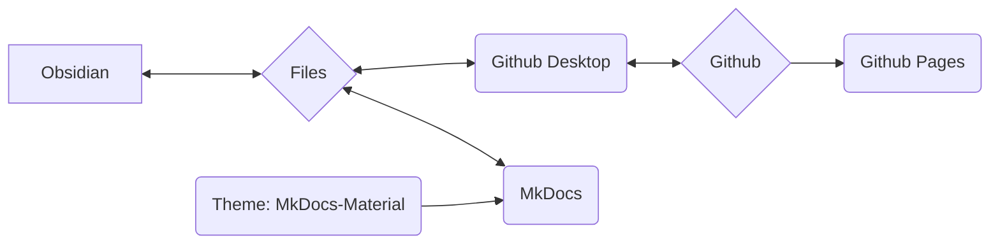

We use MkDocs as a system to document our processes, procedures, and workflows, and to make them available online.

## Core Concept of the System

> [!info]
> - Content and layout are strictly separated.
> - Everything is based on simple text files in Markdown format (*.md).
> - No proprietary data.
> - In principle, everything can be done with a text editor (with a few exceptions). I personally use Obsidian and will explain the workflows with it.
> - The data can be edited locally.
> - MkDocs converts the Markdown data into a static website.
> - Both the Markdown data and the website data are stored in the Git repository of Nica e.v.
> - The entire site is then accessible via Github Pages.



> [!info]+
> Every single software component (Github, Github Pages, Github Desktop, MkDocs, Obsidian, MkDocs-Materials) is **open source and free to use**.
>
> If individual components were to be discontinued (service terminated, software no longer available, or other reasons), the actual data (i.e., the Markdown files) would still exist.
>
> Using Github allows us version control for the data, meaning every change is documented and traceable, and any change can be reverted.
> It also allows others to contribute to the documentation without us having to manage user data or worry about system security (though this is technically a bit more complex).
>
> This makes us significantly more resilient in the long term. Since documentation like this grows over time, I consider this a huge advantage.

### Involving Other People
The system described below might seem overwhelming or intimidating at first glance to people who don't have much experience with coding and programming.

To address this, we have the following alternative methods for content creation:
- Create content in WordPress as a page.
- Submit content as a text file, Word document (or other typical formats).

These contents can then be emailed to the currently responsible person (see [Imprint](Impressum.md)). They will then be integrated.

## File System

> [!info]+ Directory Structure and Files
> **/docs**
> **/site**
>
> license
> mkdocs.yml
> readme.md

## Obsidian

Especially through the use of [Obsidian](Obsidian%20Setup.md) as a text editor, this setup offers significant advantages:

- Obsidian is particularly well-suited for a large number of individual files that are linked through tags or connections, or categorized using directory structures (subdirectories).
- Obsidian can display this data graphically, which particularly improves the management of large amounts of data.

Another major advantage of Obsidian is its vast plugin ecosystem. This allows us to easily add functionality, such as:
- Database-like filtering/searching.
- Tag management (e.g., making changes in many files simultaneously, like renaming a frequently used tag).
- Easy management of metadata (so-called [Frontmatter](Frontmatter%20Properties.md) or YAML).

## Github

Is a version control program for data that can be used online.
### Github Desktop

Git is actually a command-line tool, which deters many people.
Github Desktop solves this problem by packaging the necessary functionality into an application with a simple graphical interface.

### Github Pages

Github Pages is a service from Github.
If website data is stored in a specific format in a repository, it can be displayed as a website.

- The service is free.
- MkDocs handles all the necessary steps automatically.

The advantage for us:
- No own hosting.
- No fees.
- To upload/update the content, only a command-line command is needed: ```

```
mkdocs gh-deploy
```

Overall, we don't have to worry about anything and can work almost exclusively locally.

## MkDocs

[MkDocs](https://mkdocs.org) is software for creating documentation that can be made available online.
Content is created in simple text files – this can be done in any text editor that supports the [Markdown format](Markdown.md).

> [!info]- List of possible text editors
> - Notepad++
> - Atom
> - Visual Studio Code
> - Sublime
> - Windows Text Editor
> - Obsidian

MkDocs is then run using a command-line command and can:

- Display a finished version of the website offline.
	- This is automatically updated when there are changes to the text files.
	- This allows for very fast and easy content creation and formatting.
- Create the data for the static website (locally).
	- This can then be, for example, directly uploaded to a server.
- Upload the static website directly via integration with Github Pages.
	- This is free as long as the documentation is publicly available and under an open-source license (we meet both criteria).

For full documentation visit [mkdocs.org](https://www.mkdocs.org).

### Theme: MkDocs Material

https://squidfunk.github.io/mkdocs-material/
