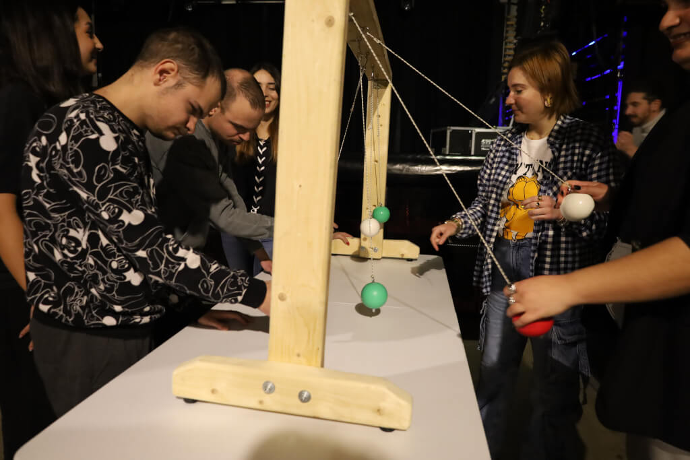
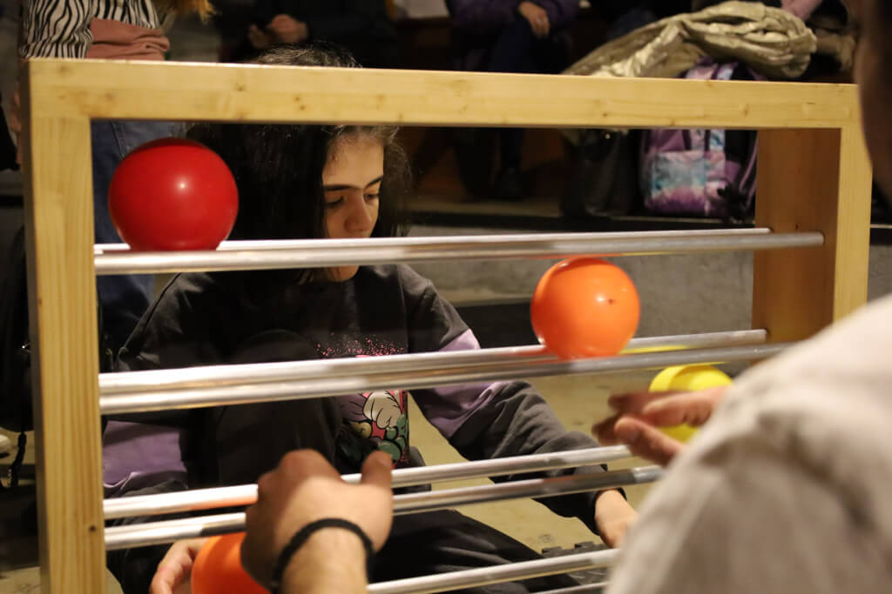
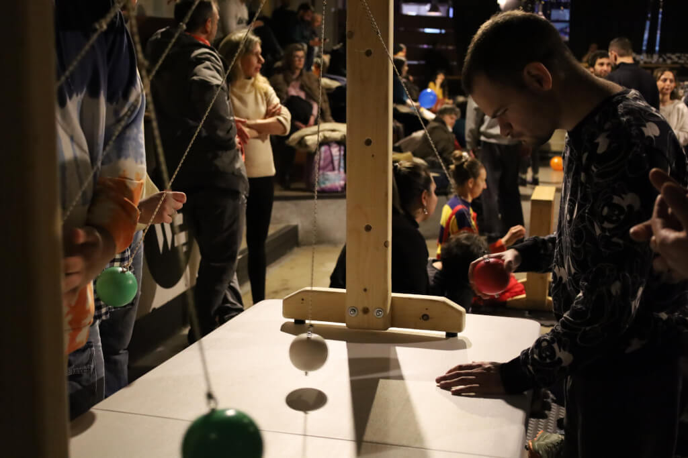

# **Colores y Patrones para Fomentar Interacciones Amistosas**

[Monokyklo](Monokyklo.md) - Tesalónica, Grecia
**Escrito por** el equipo de Monokyklo

---

## **Estructura y Entorno**

Cada sesión comenzaba con una **breve introducción de los juegos** tanto para los formadores como para los participantes, seguida de una **exploración libre**. Se animaba a los participantes a **tomar la iniciativa**, lo que nos permitía observar qué **patrones, colores o movimientos atraían naturalmente su interés**. Los facilitadores proporcionaban un **apoyo suave y no intrusivo**, centrándose en el fomento de la autonomía y el ánimo.

Las sesiones se llevaron a cabo en interiores, en las **áreas recreativas designadas** de cada DDC. Los materiales se exhibían en mesas e incluían:

* El **Juggle Board**
* **Aros de hula-hoop**, **platos giratorios**, **pañuelos** y **pelotas de malabares**

El programa se desarrolló durante varios meses, con **visitas casi diarias a cinco centros diferentes**, lo que brindó una oportunidad para la **observación longitudinal y la participación diversa de los asistentes**.

---

## **Desarrollo de la Sesión y Diseño del Juego**

Cada sesión de 90 minutos seguía una estructura consistente:

* **Juego de apertura en círculo** donde todos compartían nombres y novedades personales
* Una **sesión principal** con estaciones de actividad rotativas o juegos en grupos pequeños
* Un **descanso de 10 a 20 minutos** según la energía del grupo
* **Reflexión grupal de cierre**, compartiendo los momentos destacados y comentarios

Las actividades rotaron a través de **juegos de Malabares Funcionales** y otras experiencias circenses. Algunas sesiones utilizaron un **diseño tipo reloj**, permitiendo a los participantes moverse de forma independiente entre las actividades. El diseño estructurado pero lúdico permitió la **adaptación a los intereses y necesidades individuales**.

---

## **Observaciones y Resultados**

El objetivo central —**facilitar la apertura social y la interacción entre pares**— se cumplió claramente. Observamos:

* **Conexiones interpersonales más fuertes**, especialmente entre personas previamente retraídas
* Una diferencia notable en las **preferencias de juego** según la edad y el tipo de discapacidad
* Dos participantes con hiperactividad mostraron **impulsividad**, aunque esta se mantuvo **sin ser disruptiva**
* Los participantes se **sentían atraídos por los colores brillantes y los patrones estructurados**, y aunque crear nuevas secuencias era un desafío, la mayoría persistió y **lo logró con guía**

Los **educadores familiares desempeñaron un papel crucial**. Cuando los participantes contaban con el apoyo de alguien en quien confiaban, **la concentración, la participación y la alegría aumentaron**. Las herramientas que incorporaban **codificación por colores y números** resultaron especialmente efectivas. En los cinco DDC, los participantes mostraron:

* **Mayor regulación conductual**
* **Participación más consistente**
* **Mayor apertura a probar cosas nuevas**
* **Mayor compromiso social** tanto con compañeros como con formadores

---

## **Conclusión**

Esta iniciativa demostró cómo los Malabares Funcionales pueden ser una **herramienta poderosa para la inclusión y la conexión**. Con **sesiones más frecuentes y estructuradas**, creemos que sería posible lograr un **progreso aún mayor en habilidades motoras, compromiso cognitivo y comportamiento social**.

La participación constante del **personal de los DDC fue un factor clave de éxito**. Su presencia ayudó a crear una **atmósfera segura y familiar** en la que los participantes se sintieron cómodos para explorar, asumir riesgos y establecer nuevas relaciones. El programa no solo enriqueció la experiencia diaria de los participantes, sino que también **empoderó a los cuidadores y educadores** para involucrarse en la pedagogía inclusiva de una manera práctica y alegre.
