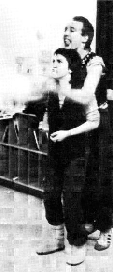
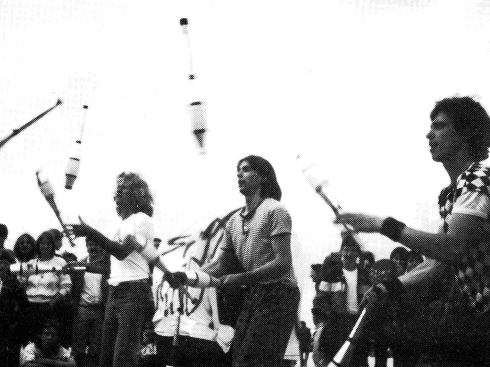
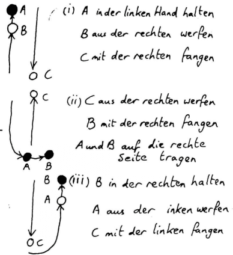
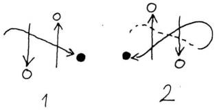
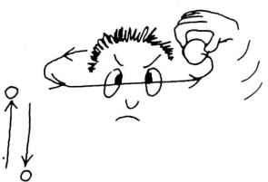

## Una nueva revista para Europa
[Una nueva revista para Europa](Eine%20neue%20Zeitschrift%20für%20Europa.md)

¡Estamos locos! No solo porque llevamos un año coorganizando la 7ª Semana Europea del Malabarismo, sino que además nos vamos a meter en el trabajo de editar una revista europea de malabarismo en Frankfurt.

Pero todo está estrechamente relacionado:

Recibimos tantas cartas y llamadas entusiastas de malabaristas de toda Europa, cada uno diferente, cada uno con una nueva idea, contando sobre una actuación, una gira, un encuentro de teatro aquí y un festival de malabarismo allá (por ejemplo, Covent Garden, Bremen o Copenhague), y todos compartían la misma anticipación por el encuentro y el intercambio con otros malabaristas.

Entonces nos vino a la mente la idea que ya rondaba en Laval durante el último encuentro de malabaristas: "Sería genial si hubiera una revista de malabarismo para Europa, para que podamos mantenernos en contacto más allá de los encuentros anuales y saber dónde andan los malabaristas. Solo alguien tendría que encargarse de ello". Vale. Lo haremos.

¿Y cómo lo imaginamos? Nos gustaría crear una revista para todos los malabaristas de Europa, desde principiantes hasta profesionales, independientemente de si pertenecen a una organización como la IJA o no. Esto, en primer lugar, plantea el problema del idioma, ya que una de las razones importantes para una revista europea es que "Jugglers World" (además de que solo informa sobre eventos estadounidenses) solo se publica en inglés. No todos los malabaristas pueden o quieren leer una revista en inglés. Por lo tanto, la revista europea se publicará inicialmente en inglés y alemán. (¡Esperamos que los autores estén de acuerdo con nuestra traducción libre!)

Nos hubiera gustado publicar la primera edición también en francés, pero lamentablemente fracasó debido a los conocimientos lingüísticos "profesionales del malabarismo" y al tiempo. ¿Quizás alguien se ofrezca a traducir las próximas ediciones al francés? ¿Quizás haya demanda y traductores para otros idiomas?

En cuanto al contenido, hemos pensado lo siguiente: Nos gustaría informar sobre grupos de malabarismo y malabaristas individuales, cómo empezaron a hacer malabarismos, qué les divierte especialmente, sus ideas y sueños en torno al malabarismo... Nos gustaría escribir sobre experiencias de actuaciones en toda Europa (en la calle, en teatros, bajo la carpa del circo...) y contar anécdotas de la calle. Sería bueno también incluir "críticas" de espectáculos vistos, libros de malabarismo, etc.

Además, nos gustaría crear secciones como: Guía para la construcción de accesorios, consejos de idiomas para giras en el extranjero, hobbies extra (magia...), consejos y trucos (por ejemplo, buscamos a alguien que escriba una página de taller regular), calendario de eventos (festivales, actuaciones, reuniones de grupos...) y anuncios clasificados (se busca compañero de gira, se regalan mazas...).

Por supuesto, no podemos ni queremos escribir todos estos artículos nosotros mismos. Nos vemos más como un punto de encuentro, "diseñadores" y editores. Nosotros dos no podemos estar en toda Europa al mismo tiempo, ¡pero todos vosotros juntos podéis hacerlo!

Por eso os pedimos que nos enviéis artículos y buenas fotos, sobre todos los eventos e historias que hayáis vivido y que nos hagáis llegar toda la información y fechas que tengan alguna relación, lejana o concreta, con el malabarismo. Nos gustaría tener un "corresponsal" fijo y un punto de contacto en cada país para que pueda ser una revista verdaderamente europea.

{ align=left }

### **Malabaristas**

Con estas ideas, nos dirigimos a algunos malabaristas y grupos de malabarismo que, a su vez, nos ayudaron con artículos, información, ideas, anuncios y amables cartas a hacer posible esta primera edición. Muchas, muchas gracias a todos.

El último punto es la financiación. La revista aparecerá inicialmente trimestralmente. Dado que debemos planificar la tirada con antelación y no podemos asumir un gran riesgo financiero nosotros mismos, la revista solo se puede adquirir mediante suscripción y pago por adelantado. (Quienes deseen varios ejemplares para, por ejemplo, la venta en tiendas, que se pongan en contacto directo con nosotros).

El precio se calcula para cubrir costes, es decir, papel, Letraset, franqueo, copias, imágenes y, sobre todo, la impresión; nuestro tiempo de trabajo, por supuesto, queda excluido.

Por lo tanto, coged todos el cupón de suscripción, rellenadlo y traédnoslo o enviádnoslo por correo si no nos encontráis en el encuentro. ¡Por supuesto, nos alegran enormemente los anunciantes y, sobre todo, las donaciones!

Esperamos que os guste nuestra idea y esperamos vuestras sugerencias y críticas, y poder preparar la próxima edición con vuestros artículos. Que disfrutéis de la lectura.

*Gabi & Paul*

## ¡Se busca circo!
**Un reportaje de dos payasos que ya no querían vivir en la RDA**
[¡Se busca circo!](Zirkus%20gesucht!.md)
### De Streuselschnecke...

¿Cómo empezó todo el circo? Bueno, es casi una historia interminable...

{ align=left }

A Uli le encantaba el olor a madera fresca, se hizo carpintero, fue al circo como artesano y empezó a hacer malabarismos. Kattrin no sabía hacer nada mejor y estudió actuación. Uli regresó a Berlín y quería mostrar sus habilidades en una fiesta. Sin embargo, bebió demasiado por la excitación y las pelotas hicieron con él lo que quisieron. Así nos conocimos y Uli se convirtió en el profesor de malabarismo de Kattrin.

Eso fue en febrero de 1980, y pronto descubrimos nuestra vena cómica compartida. En otoño tuvimos nuestra primera actuación bajo el nombre de ULK. (Las letras iniciales de Uli y Kattrin).

Pero no fue nada gracioso, más bien vergonzoso. Pero todos los comienzos son difíciles, seguimos practicando: claqué, malabarismo, pantomima... Como no hay talleres en la RDA, dependíamos del apoyo privado.

En el verano de 1981, Kattrin terminó sus estudios y tuvo que ir a un teatro durante tres años como recién graduada. Así lo dictaba la ley, de lo contrario no habría obtenido el título universitario. Y sin título, no eres nada en la RDA. Esto significa: no importa lo bueno que sea alguien o lo que sepa hacer, sin un título estatal no puede actuar, es decir, no puede trabajar en su campo. Y quien no trabaja es antisocial, y quien es antisocial, va a la cárcel.

Pero no debéis pensar que por eso no hay iniciativa propia: al contrario, la necesidad agudiza el ingenio. En estudios, áticos, apartamentos se celebran lecturas, exposiciones, conciertos, programas de teatro. Actuar simplemente en la calle está prohibido, pero aun así lo hacen algunos, aunque se arriesgan a fuertes multas.

Pero volvamos a nosotros. Kattrin fue al teatro, pero después de medio año, el contrato de recién graduada tuvo que rescindirse por motivos de salud. Regresó a Berlín y probamos un programa de payasos para niños, construimos accesorios y nuestro escenario.

Uli, mientras Kattrin trabajaba en el teatro, había adiestrado a nuestro perro Cato (un perro de caza inglés de pura raza). Cato se convirtió en nuestro león de circo.

Kattrin solicitó al ayuntamiento su permiso de actuación, que obtuvo sin problemas gracias a su título de actuación completado. Como Uli no tenía nada parecido que presentar, en realidad no debería haber podido actuar. Así se convirtió en el "asistente" de Kattrin. Debido a la excesiva burocracia del sistema de permisos, esto no llamó la atención.

Lo mismo ocurrió con Clemens, que se convirtió en nuestro técnico. (Lamentablemente, todavía está esperando su salida). Clemens tenía un coche, bueno, coche es decir mucho: se llamaba Herbert, era más viejo que nosotros y estaba prácticamente inservible. Pero, gracias a Dios, solo se averiaba en los viajes de vuelta. Un vehículo fiel. Llevábamos el tándem para todas las emergencias hasta que nos lo robaron.

Ahora queríamos anunciar nuestro programa. Para ello, debéis saber que en la RDA no existen las fotocopiadoras. Tampoco se puede imprimir fácilmente. Primero tendríamos que haber obtenido la aprobación estatal de nuestro nombre "Circo Infantil Streuselschnecke". Tampoco teníamos ganas de eso. Así que escribimos todo a mano y pegamos las tarjetas con un payaso de papel de colores. Fue laborioso, pero divertido.

Recibimos muchas ofertas, ya que éramos únicos en nuestro estilo en la RDA, y porque, con nuestra sencillez, alegría y espíritu lúdico, representábamos una alternativa a la oferta subvencionada por el estado.

### ... a Pusteblume

Cuando un año después mostramos nuestro programa a la Dirección Estatal de Conciertos y Espectáculos para obtener una clasificación de grupo, para que Uli fuera reconocido como compañero de Kattrin, la comisión dijo que nuestro programa no contenía valores pedagógicos.

{ align=right}

Así que no obtuvimos nada y seguimos arreglándonos, siempre sabiendo que podrían descubrir que Uli no tenía permiso para actuar. (Dos semanas antes de nuestra salida, se descubrió).

En el verano del 83, cuando queríamos actuar en una fiesta de la paz organizada por la iglesia, un funcionario cultural nos aconsejó que no lo hiciéramos, de lo contrario, se nos prohibiría actuar en toda la RDA.

Incidentes de este tipo nos hicieron darnos cuenta cada vez más de que estábamos llegando a los límites de las posibilidades de nuestro trabajo y nuestros planes. Por eso, tarde o temprano, tuvimos que y quisimos abandonar la RDA.

Desde marzo vivimos aquí. Estamos reconstruyendo un programa para niños. Ya no nos llamamos Streuselschnecke, ya que este pastel no es conocido aquí, sino "Circo Infantil Pusteblume".

Nuestro profundo sueño es fundar un circo en unos años, en el que participen personas amables y divertidas. Pero lamentablemente falta dinero para este sueño. Sería una pena que fracasara por eso.

Por eso, sería genial si nos ayudarais a hacer realidad este sueño y transfiriendo un poco de dinero a nuestra cuenta creada para este fin:

Código bancario: 42060021
Volksbank Gelsenkirchen)
Número de cuenta: 518.503.240
Y aunque solo sea una marca, porque hasta el ganado pequeño hace un circo.

Muchas gracias, y si tenéis más interés en este proyecto, o queréis saber algo sobre el Circo Infantil Pusteblume, escribid a:

Kattrin Kupke & Uli Zschau
Arminstr.10
4650 Gelsenkirchen
Tel.:0209/27 16 42

Así que hasta pronto o quizás no
*Kattrin & Uli*

## La sonrisa vence a la gravedad
**Carta de Toby Philpott, Director Europeo de la IJA**
[La sonrisa vence a la gravedad](Lächeln%20überwindet%20Schwerkraft.md)

Llevo dos años ostentando el título de "Director Europeo de la International Jugglers Association" (IJA). Es un título que a W.C. Fields le habría encantado, ya que suena tan importante y misterioso y no significa casi nada. Yo no "dirijo" a nadie y paso la mayor parte de mi tiempo en Inglaterra.

{ align=left }

La IJA comenzó como un pequeño grupo de amigos y ahora es una gran organización con cientos de miembros en América. La primera reunión europea de malabaristas también consistió solo en un pequeño grupo de amigos en Inglaterra, pero fue el primer paso para justificar la palabra "Internacional". Hoy en día, esta reunión atrae a personas de más de diez países diferentes.

Las reuniones se hacen más grandes y también vienen muchos no miembros. La mayoría de ellos no ven ninguna razón para unirse a la IJA si lo único que obtienen es una revista estadounidense y una lista de direcciones que nunca usarán.

Puedo entender eso. Si la IJA no existiera, todavía me gustaría conocer a otros malabaristas (no solo a la gente que ha aprendido de mí), querría saber dónde comprar accesorios, dónde ver espectáculos, dónde actuar en la calle. Todavía querría compartir ideas y ver a gente que hace malabarismos mejor que yo. He podido hacer la mayor parte de esto incluso antes de oír hablar de la IJA, pero he visto y hecho más desde que empezamos a organizar reuniones en Europa. Estas reuniones son la mejor razón para tener una organización oficial. No es un sindicato, y no podemos organizar actuaciones ni siquiera garantizar amistades.

Creo que Europa debería tener un representante en la junta directiva estadounidense de la IJA que mantenga el contacto con los miembros establecidos en los Estados Unidos y en otros países, y que comience a hacer de la organización realmente internacional.

Cuando entro en la sala de una reunión de malabaristas, veo dos tipos básicos de personas. Algunos trabajan practicando, sudando y perfeccionando técnicas, superando sus propios límites. Yo los llamo los Olímpicos, para subrayar esta búsqueda de la perfección, el espíritu de lucha deportivo y el toque de dioses y diosas griegas, superhéroes.

Otros han venido a jugar, ríen y bromean, experimentan, improvisan, intercambian ideas y se divierten. Yo los llamo los "Juglares Errantes" y son los simples mortales, los charlatanes, que utilizan sus habilidades de improvisación, como deben hacer todos los errantes y jugadores.

Quizás pienses que alguien con un título como "Director Europeo" sería un "Olímpico". En realidad, empecé a hacer malabarismos como pasatiempo durante una etapa de inactividad en mi vida. Ahora tengo varios años de experiencia como intérprete y profesor, pero siempre quiero transmitir la diversión de la actividad, no espero una medalla de oro.

Necesitamos a los héroes y a los payasos. Los Olímpicos pueden mostrarnos lo que es posible con dedicación, marcan nuevos estándares y ellos mismos pueden disfrutar de un público que realmente puede apreciar el trabajo que hay en cada movimiento.

Los Juglares Errantes son los que atraen a gente nueva, ayudan a los nuevos malabaristas a empezar, corren la voz y entretienen.

Leerás esto en una revista que han emprendido dos alemanes que querrían ver a más europeos en la IJA.

Escribo esto como una carta porque no soy periodista y cometo mis errores en público, como de costumbre. Si quieres que esta revista continúe, por favor escribe a los editores de la revista o envía fotos. Si quieres que Europa juegue un papel más importante en la IJA, escríbeme e intentaré explicar nuestra posición a los demás miembros de la junta. Si prefieres tener un grupo europeo independiente, adelante y créalo. Creo que sería una pena separarse por completo de una organización que tiene 37 años de existencia y miembros en muchos países.

Por cierto, si crees que un auténtico Olímpico sería un mejor portavoz para Europa, puedes presentarte tú mismo, o encontrar un político malabarista que sea nuestro representante para 1985.
Mientras tanto, espero verte durante nuestros pocos días juntos. Y no olvides: la sonrisa vence a la gravedad. (Este es un buen eslogan para ganar una elección, o para dar dolor de cabeza a nuestros traductores).

## Grupo autónomo de malabarismo de Wiesbaden y la 7ª Semana Europea del Malabarismo
**¡Gravedad, y qué!**
[¡Gravedad, y qué!](Schwerkraft%20-%20na%20und!.md)

El grupo autónomo de malabarismo SCHWERKRAFT NA UND! de Wiesbaden, o mejor dicho, de la región Rin-Meno, existe desde hace relativamente poco tiempo.
Todavía en agosto de 1982, solo había unos pocos malabaristas en Wiesbaden que apenas se conocían entre sí. Por casualidad, los tres fundadores, Paul, Uli y Christoph, se conocieron, luego hicieron malabarismos en los parques de Wiesbaden y decidieron, pocas semanas después, ir al 5º Encuentro Europeo de Malabarismo en Copenhague.

{ align=right}

Fritz de Frankfurt vino con ellos. Siguiendo el lema: "Solo se hace lo que se hace" y bajo la impresión del encuentro de Copenhague, Fritz quería organizar el 6º Encuentro Europeo en Frankfurt. Perdió la votación en Copenhague con su idea espontánea frente a los malabaristas franceses, mejor preparados.

Paul y Christoph, todavía entusiasmados por lo vivido en los últimos tres días en Copenhague, estaban pensativos pero llenos de ideas en la barandilla del ferry de regreso a Alemania. Aquí comenzó la fundación del grupo autónomo de malabarismo schwerkraft-na und!.

Desde entonces, los malabaristas se reúnen todos los jueves de 17:00 a 22:00 horas, en verano en el Nero-Park y en invierno en la Haus der Jugend, un local cedido por la oficina de juventud de la ciudad de Wiesbaden.
En muy poco tiempo, el grupo creció hasta 20 personas.

Cada semana caras nuevas, pero cada semana también se echaba de menos a gente que nunca más se veía en el club. Mientras tanto, se ha formado un núcleo duro de 10-15 personas.
El carácter abierto del grupo y la organización según el principio del placer hacen extremadamente difícil plasmar el potencial común de manera efectiva en conceptos de actuación. A pesar de los accesorios de malabarismo adquiridos conjuntamente, como 14 monociclos, mazas, aros, Rola-Bolas, Devil-Sticks, etc., y un nivel de habilidad relativamente alto, las técnicas de malabarismo de cada uno difieren considerablemente, lo que ha llevado a la formación de varios subgrupos más estables, como JOMIPO-Luftiko, Werner WAHNSINN & Christoph CHAOS Katinka y la Juggling de Pulgas, etc.
Las diferentes habilidades y los distintos conceptos de actuación de estos grupos dificultan la integración de los nuevos principiantes que se unen al grupo autónomo de malabarismo, mientras que los artistas individuales lo tienen más fácil.

Esta evolución se ha debatido a menudo en el club, pero hasta ahora no se han tomado medidas concretas para realizar cambios.

A pesar de ello, se realizan actuaciones conjuntas en diversas ocasiones. Hemos actuado en fiestas callejeras, en juegos de vacaciones y festivales, también en bodas, en centros juveniles y escuelas. También actuamos en "Artistas por la Paz" en mayo de 1983 en Darmstadt, hicimos un programa de televisión con Südwestfunk, así como una actuación en el marco del "Sueño de Noche de Verano de Berlín" con el "Mayor Teatro de Fuego del Siglo" de André Heller en julio de 1984.

Mientras tanto, la idea de Fritz de organizar un encuentro europeo de malabarismo maduró.
En las negociaciones con la ciudad de Frankfurt, logramos que se asumiera una gran parte del alquiler de la sala para el Volksbildungsheim.
La ubicación central del lugar del evento en el centro de la ciudad y el encanto de la "ciudad mundial de Frankfurt" fueron decisivos en la reunión de negocios de Laval para organizar la 7ª Semana Europea del Malabarismo en Frankfurt.
Desde esa fecha, nos hemos propuesto hacer el próximo encuentro aún más colorido, más variado y, sobre todo, más visible para el público. La idea original y salvaje de Fritz era organizar un encuentro espectacular que culminara en un espectáculo de fuego, con 500 malabaristas y sus 1500 mazas de fuego al ritmo embriagador de una banda de rock frente al edificio de prestigio y esplendor de la Ópera de Frankfurt a la luz de la luna llena.

Debe ser una oportunidad para cambiar el ambiente de la ciudad bancaria y de negocios durante al menos 4 días, llevar la fantasía a los cañones de las calles, al hormigón. Acercar a la gente de la ciudad una sensación de vida diferente, hacerles sonreír o incluso reír. "Se anuncia el caos. Será turbulento. Será colorido." (Frankfurter Rundschau)
Hemos debatido durante mucho tiempo la cuestión de la planificabilidad de tales ideas. Muchas acciones planificadas fracasaron debido a la práctica de las autoridades municipales, pero esto no debe impedir las ideas espontáneas de los malabaristas.

Al mismo tiempo, se debatió la importancia de difundir estas ideas a través de todos los medios de comunicación. El conflicto entre la publicación y el quizás justificado temor a la explotación y comercialización de nuestras fantasías, ideas y habilidades por parte de los medios de comunicación, hizo fracasar un proyecto cinematográfico.

No teníamos objeciones a una mera cobertura por parte de la prensa, la radio y la televisión.
Se envió un comunicado de prensa a la dpa y a todos los principales periódicos nacionales y locales. El 1 de septiembre, señalamos el espectáculo de los malabaristas con una acción de malabarismo y carteles en las calles comerciales de Frankfurt y el 10 de septiembre con una conferencia de prensa de carteles y grafitis, ciertamente inusual para Frankfurt, sobre el espectáculo de los malabaristas.

La viabilidad de todas las ideas también debe orientarse al nivel del evento. Muchos malabaristas vienen para reunirse con sus amigos malabaristas de toda Europa, para intercambiar experiencias y para vivir ellos mismos una sensación de vida diferente con personas de ideas afines, sin tener la presión de tener que transmitir esta sensación a otros. También se reúnen para estar un poco entre ellos. Esta aspiración no es ciertamente arrogante ni hostil al público, ya que muchos se exhiben durante todo el año para el estilo de vida de otras personas.

Pero también tuvo que resolverse la organización de todos los demás puntos, poco visibles externamente pero en su mayoría importantes:
¿Tenemos suficientes plazas para dormir? ¿Quién se encarga de la comida? ¿Cómo se organiza el espectáculo público? ¿Cómo organizamos el servicio de caja y de entradas? ¿Dónde imprimimos los carteles? Obtener permisos de las autoridades para cada pedo emitido o intencionado antes, durante y después de la semana del malabarismo. etc...

En definitiva, la organización de la 7ª Semana Europea del Malabarismo nos ha resultado divertida y esperamos que todos los malabaristas y demás participantes sientan lo mismo y recuerden Frankfurt 1984 con buenos sentimientos y vuelvan a casa con nuevos impulsos e ideas.

Christoph Schmitt

## Taller KASKADE
### La página de las columnas
[La página de las columnas](Die%20Säulen-Seite.md)

{ align=left }
Dr. P. Luftiko (ver imagen)

O.K. Ahora puedes hacer malabarismos con 2 pelotas en una mano, con la izquierda igual que con la derecha. Podrías intentar con 4 ahora. ¡Pero espera un poco! Hay cientos de maneras de usar esta habilidad con 3 pelotas en la forma de "columnas" que asombrarían a tus amigos y harían reír a tu público.

La forma básica de las "columnas": 2 pelotas en la mano derecha lanzadas paralelamente entre sí (es decir, no en círculo), mientras la mano izquierda lanza la tercera al mismo ritmo que la mano derecha lanza la pelota exterior.

Con este ritmo básico, puedes variar este tema infinitamente con pequeños cambios. Puedes cambiar las trayectorias y la mano con la que haces malabarismos con 2.

En las siguientes descripciones, los términos "individual (pelota)" y "doble (pelotas)" se refieren a las trayectorias y no al número de pelotas en cada mano. Es decir, en la forma básica, la pelota individual salta en el centro y las pelotas dobles en los extremos.

#### Tenis

La pelota individual se lanza inicialmente muy a la derecha,

luego vuela en un arco alto hacia la izquierda y de vuelta, siempre de un lado a otro. Las trayectorias son así:

Las pelotas dobles forman la "red" (¡quizás podrías hacer ruidos de raqueta de tenis o imitar a John McEnroe!).

#### Vallas

El comienzo es similar al del tenis, solo que esta vez la pelota individual hace una parada intermedia en el centro.

Cada una de las dos pelotas dobles representa una valla. (Si dices "boing" con cada caída de la pelota individual, el espectador tendrá la impresión de que la pelota rebota).

#### Cruce

Por supuesto, también puedes hacer trucos con las pelotas dobles. Aquí se cruzan.

Aunque has tomado la precaución de lanzar una pelota doble un poco más alta que la otra, lamentablemente experimentarás muy a menudo que chocan en el centro y salen volando sin control. ¡No te preocupes! Con práctica, conseguirás que choquen a propósito sin que las 2 pelotas escapen en direcciones diferentes fuera de tu alcance.

Cuanto más alto sea el choque, más entusiasmado estará el público.

#### Brazos cruzados

Intenta atrapar la pelota doble derecha con la mano izquierda y al mismo tiempo la pelota doble izquierda con la mano derecha. Atraparla normalmente no es tan difícil, ¡pero luego lanzarla verticalmente hacia arriba...! Practica solo con las pelotas dobles hasta que esto funcione, antes de volver a incorporar la pelota individual.

#### Lanzamientos por encima del hombro
(¡para avanzados!)

En lugar de lanzar las pelotas dobles simplemente hacia arriba, lánzalas por encima de los hombros desde atrás, con la mano derecha por encima del hombro derecho y la izquierda por encima de la izquierda. Si no te has calentado bien, te dislocarás los hombros. Si las pelotas dobles se cruzan por encima de tu cabeza en contra de tu voluntad, ¡entonces tienes el mismo problema que yo!

### ¡Hacer trampas!
[¡Hacer trampas!](Schummeln!.md)

Si tienes pelotas fosforescentes que brillan en la oscuridad, puedes dar al público la impresión de que estás haciendo la forma de columnas. De repente, una de las pelotas dobles (la que sostienes) se queda increíblemente en el aire y se niega a bajar. (¡Simplemente la sostienes, pero el espectador no lo ve!) la pelota rebelde, que aparentemente ha desafiado las leyes de la gravedad, puede ahora realizar asombrosos trucos acrobáticos antes de volver a ocupar su lugar en el patrón. Por ejemplo:

#### El Yo-Yo

Siempre sostienes la "pelota trampa" a unos centímetros de una de las pelotas que caen. Mueve la mano hacia arriba y hacia abajo; de modo que la distancia entre la pelota sostenida y la que cae permanezca constante. Parece que las pelotas están atadas con un cordón.

#### El Péndulo

Este es también un truco de yo-yo, en el que las manos se alternan al sostener una pelota trampa. Una pelota individual salta verticalmente hacia arriba y hacia abajo en el centro, mientras las pelotas trampa parecen "tirar" de un lado a otro, y tus brazos hacen movimientos de péndulo oscilante. (También podrías balancear las piernas alternativamente o decir "tic-tac").

{ align=left }

**Transcripción de la imagen**

(i) Sostener A en la mano izquierda
Lanzar B desde la derecha
Atrapar C con la derecha

(ii) Lanzar C desde la derecha
Atrapar B con la derecha
Llevar A y B al lado derecho

(iii) Sostener B en la derecha
Lanzar A desde la izquierda
Atrapar C con la izquierda

**Aquí algunos trucos aún más rebeldes para una pelota trampa:**
#### La Guadaña

La pelota trampa se mueve horizontalmente entre las dos lanzadas, primero por encima de la que cae, luego por debajo de la que sube. La mano en la que sostienes la pelota trampa "corta" a través del malabarismo de 2 pelotas como una guadaña.

Una variante elegante (y más fácil) es la "guadaña infinita". La pelota trampa no describe una línea recta y horizontal, sino un signo de infinito (o un ocho tumbado).

#### Órbita

Una pelota trampa particularmente rebelde podría empezar a girar alrededor de tu cabeza como una mosca molesta. (¡Zumbido, zumbido!)

Dado que en realidad solo haces malabarismos con 2 pelotas y solo sostienes la tercera, ¡el número de travesuras que esta tercera pelota puede hacer no tiene límites más que tu anatomía!
