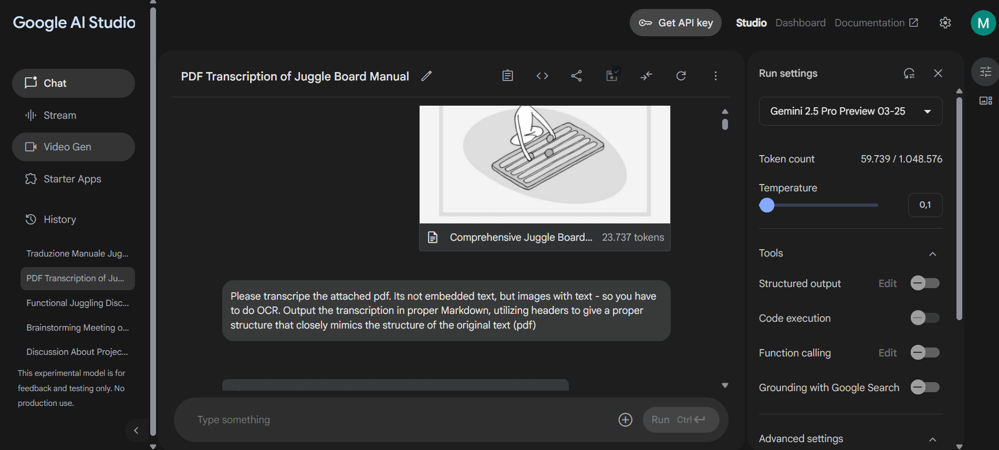

# Tutorial: Traducción de Documentos PDF Mediante Modelos de Lenguaje Grandes

## Introducción

Este tutorial describe un proceso para traducir el contenido de documentos PDF, especialmente aquellos que contienen texto basado en imágenes no seleccionable, utilizando Modelos de Lenguaje Grandes (LLM). El flujo de trabajo implica optimizar el PDF, extraer texto mediante Reconocimiento Óptico de Caracteres (OCR), traducir el texto y, finalmente, reformatear la traducción a un PDF.

**Requisitos previos:**

*   Una cuenta de Google (para acceder a Google AI Studio).
*   Opcional: Software de optimización de PDF (por ejemplo, pdf24 Creator).
*   Opcional: Un editor de texto o procesador de textos capaz de manejar Markdown y exportar a PDF (por ejemplo, Obsidian, Microsoft Word).

## Paso 1: Preparación del Documento PDF

**Objetivo:** Reducir el tamaño del archivo PDF para optimizarlo para el procesamiento por parte del LLM, manteniendo al mismo tiempo la legibilidad del texto. Los LLM a menudo tienen límites de tamaño de entrada y los archivos más pequeños se procesan de manera más eficiente.

**Consideraciones:**

*   **PDFs basados en texto:** Si el texto dentro del PDF se puede seleccionar (lo que significa que está incrustado electrónicamente), la reducción del tamaño del archivo es generalmente más fácil y puede lograr tamaños más pequeños sin pérdida de calidad.
*   **PDFs basados en imágenes:** Si las páginas del PDF son imágenes de texto (el texto no se puede seleccionar individualmente), la reducción del tamaño implica la compresión de imágenes. Se debe tener cuidado de no reducir la calidad tanto como para que el texto se vuelva ilegible para el OCR.

**Procedimiento (Ejemplo con pdf24):**

1.  Abre tu documento PDF en una herramienta como pdf24 Creator ([https://www.pdf24.org/](https://www.pdf24.org/)).
2.  Utiliza las funciones de compresión o reducción de tamaño. Las configuraciones comunes y efectivas incluyen:
    *   Habilitar la optimización para la web.
    *   Convertir colores a escala de grises.
3.  Experimenta con los niveles de compresión, apuntando a un tamaño de archivo inferior a **5 MB**, asegurándote de que el texto permanezca claro y legible.
4.  Guarda el archivo PDF optimizado.

## Paso 2: Extracción de Texto Mediante Google AI Studio (Transcripción/OCR)

**Objetivo:** Utilizar las capacidades multimodales de un LLM para realizar OCR en el PDF preparado y extraer el contenido textual en un formato estructurado.

**Procedimiento:**

1.  Navega a **Google AI Studio** ([https://aistudio.google.com/](https://aistudio.google.com/)) e inicia sesión con tu cuenta de Google. Nota: AI Studio es principalmente una herramienta para experimentar con modelos y prompts.
2.  Inicia una nueva sesión o chat.
3.  Adjunta el archivo PDF optimizado a tu sesión (por ejemplo, usando el botón de adjuntar o arrastrando y soltando).
4.  Introduce el siguiente prompt en el área de mensajes del usuario:
    ```
    Por favor, transcribe el PDF adjunto. Contiene imágenes con texto, lo que requiere OCR. Genera la transcripción en formato Markdown adecuado, utilizando encabezados y listas para crear una estructura que imite de cerca la disposición del documento original.
    ```
5.  Configura los ajustes del modelo:
    *   Mantén la configuración predeterminada a menos que tengas requisitos específicos.
    *   Establece la **Temperatura** en **0.1**. Una temperatura más baja fomenta una salida más determinista y menos creativa, lo cual es adecuado para una transcripción precisa.
6.  Envía el prompt. El proceso de transcripción puede tardar varios minutos (potencialmente 4-6 minutos o más, dependiendo del tamaño y la complejidad del PDF).
7.  Una vez que la generación esté completa, copia el texto Markdown resultante.
    *   *Método 1:* Usa la opción de copiar que a menudo se proporciona dentro de la interfaz (por ejemplo, a través de un menú asociado con la respuesta).
    *   *Método 2:* Selecciona manualmente todo el texto generado y cópialo (Ctrl+C o clic derecho -> Copiar).
8.  Pega el texto Markdown copiado en un editor de texto plano (como Bloc de notas, VS Code, Obsidian, etc.).
9.  Guarda este contenido como un archivo de texto plano. Se recomienda usar extensiones `.txt` o `.md` (Markdown). El formato Markdown ayuda a preservar la estructura del documento (encabezados, listas).



## Paso 3: Traducción del Texto Extraído Mediante Google AI Studio

**Objetivo:** Traducir el texto Markdown extraído al idioma de destino deseado, preservando la estructura y el formato originales.

**Procedimiento:**

1.  En **Google AI Studio**, inicia un **nuevo chat** para asegurar un contexto fresco para la tarea de traducción.
2.  Adjunta el archivo `.txt` o `.md` guardado que contiene el texto Markdown extraído.
3.  Introduce un prompt de traducción, especificando los idiomas de origen y destino. Ejemplo de inglés a italiano:
    ```
    Por favor, traduce el archivo Markdown adjunto (inglés) al italiano. Mantén con precisión la estructura, el formato, el tono y el estilo de expresión originales.
    ```
    *   **Modifica el prompt** según tus idiomas de origen y destino específicos (por ejemplo, "...traduce el archivo Markdown adjunto (alemán) al español..."). La calidad de la traducción puede variar según el par de idiomas.
4.  Configura los ajustes del modelo:
    *   Asegúrate de que la configuración predeterminada sea la adecuada.
    *   Establece la **Temperatura** en **0.1** para promover la fidelidad al texto y la estructura de origen durante la traducción.
5.  Envía el prompt. La traducción también puede tardar varios minutos, comparable al tiempo de transcripción.
6.  Una vez generado, copia el texto Markdown traducido utilizando los métodos descritos en el Paso 2 (botón de copiar de la interfaz o selección manual).


## Paso 4: Reformateo del Texto Traducido a un Documento PDF

**Objetivo:** Convertir el texto Markdown traducido de nuevo a un documento PDF para compartirlo o archivarlo.

**Procedimiento:**

1.  Pega el texto Markdown traducido copiado en una aplicación adecuada.
2.  **Recomendado:** Utiliza un editor de texto o un procesador de documentos que entienda el formato Markdown para preservar la estructura (encabezados, listas, etc.).
    *   **Obsidian** ([https://obsidian.md/](https://obsidian.md/)) es una herramienta gratuita que funciona bien con archivos Markdown y a menudo tiene capacidades de exportación a PDF (directamente o a través de plugins).
    *   Los procesadores de texto modernos (como Microsoft Word) también pueden importar o pegar Markdown y permitir guardar/exportar como PDF, aunque la fidelidad del formato puede variar.
    *   También hay disponibles convertidores dedicados de Markdown a PDF en línea o como software instalable.
3.  Utiliza la función "Exportar a PDF" o "Guardar como PDF" de la aplicación.
4.  Revisa el PDF resultante para asegurarte de que el formato y el contenido aparezcan como se espera.

## Conclusión

Este tutorial demostró un flujo de trabajo para aprovechar Google AI Studio para transcribir y traducir documentos PDF, incluidos aquellos que requieren OCR. Al preparar el PDF, extraer texto utilizando un LLM configurado, traducir el resultado y reformatearlo, los usuarios pueden obtener versiones traducidas de sus documentos. Si bien este método ofrece una solución gratuita o de bajo costo, los usuarios deben tener en cuenta las posibles variaciones en la precisión del OCR y la calidad de la traducción, especialmente para diseños complejos o idiomas menos comunes. Los tiempos de procesamiento dependen significativamente del tamaño del documento y de la carga del servidor.
