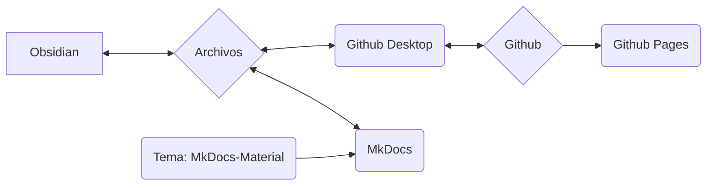

Utilizamos MkDocs como sistema para documentar nuestros procesos, procedimientos y flujos de trabajo y ponerlos a disposición en línea.

## Idea fundamental del sistema

>[!info]
>- El contenido y el diseño están estrictamente separados.
>- Todo se basa en archivos de texto simples en formato Markdown (*.md).
>- Sin datos propietarios.
>- En principio, todo se puede hacer con un editor de texto (con pocas excepciones) (yo mismo uso Obsidian y explicaré los métodos de trabajo con él).
>- Los datos se pueden editar localmente.
>- MkDocs convierte los datos de Markdown en una página web estática.
>- Los datos de Markdown, así como los datos de la página web, se almacenan en el repositorio Git de Nica e.V.
>- A través de Github Pages, todo esto se puede consultar como una página web.



>[!info]+ 
>Cada componente de software individual (Github, Github Pages, Github Desktop, MkDocs, Obsidian, MkDocs-Materials) es de **código abierto y de uso gratuito**.
>
>Si algunos componentes dejaran de funcionar (el servicio se interrumpe, el software ya no está disponible o por otras razones), los datos reales (es decir, los archivos Markdown) seguirán estando ahí.
>
>El uso de Github nos permite, por un lado, versionar los datos, lo que significa que cada cambio se documenta y es rastreable, y que cada cambio también se puede deshacer.
>También permite que otros colaboren en la documentación sin que tengamos que gestionar datos de usuario o preocuparnos por la seguridad del sistema (aunque esto es técnicamente un poco más complejo).
>
>Así, somos mucho más resilientes a largo plazo. Dado que una documentación de este tipo crece con el tiempo, considero que es una ventaja enorme.
 
### Involucrar a otras personas
El sistema que se describe a continuación puede resultar abrumador o disuasorio a primera vista para personas que normalmente no tienen mucho que ver con la codificación y la programación.

Para abordar esto, tenemos las siguientes opciones alternativas para la creación de contenido:
- Crear contenido en WordPress como una página.
- Crear contenido como archivo de texto, archivo de Word (u otros formatos típicos).

Estos contenidos se envían por correo electrónico a la persona responsable actualmente (ver [Aviso legal](Impressum.md)). Estas personas se encargarán de su incorporación.
## Sistema de archivos

>[!info]+ Estructura de directorios y archivos
>**/docs**
>**/site**
>
>license
>mkdocs.yml
>readme.md

## Obsidian

Especialmente gracias al uso de [Obsidian](Obsidian%20Setup.md) como editor de texto, esta configuración tiene enormes ventajas:

- Obsidian es especialmente adecuado para un gran número de archivos individuales que están vinculados mediante etiquetas o enlaces, o que están categorizados mediante estructuras de directorios (subdirectorios).
- Obsidian puede representar estos datos gráficamente, lo que mejora especialmente la gestión de grandes cantidades de datos.

Otra gran ventaja de Obsidian es su enorme ecosistema de plugins. Esto nos permite añadir funcionalidad muy fácilmente, como por ejemplo:
- Filtrado/búsqueda similar a una base de datos.
- Gestión de etiquetas (por ejemplo, cambios en muchos archivos a la vez, como renombrar una etiqueta utilizada con frecuencia).
- Gestión sencilla de metadatos (lo que se conoce como [Frontmatter](Frontmatter%20Properties.md) o YAML).

## Github

Es un programa de control de versiones para datos que se puede utilizar en línea.
### Github Desktop

Git es en realidad una herramienta de línea de comandos, lo que disuade a muchos.
Github Desktop resuelve este problema empaquetando la funcionalidad necesaria en una aplicación con una interfaz gráfica sencilla.

### Github Pages

Github Pages es un servicio de Github.
Si los datos de una página web se almacenan en un repositorio de una forma determinada, se pueden mostrar como una página web.

- El servicio es gratuito.
- MkDocs realiza todos los pasos necesarios por sí solo.

La ventaja para nosotros:
- Sin alojamiento propio.
- Sin comisiones.
- Para subir/actualizar el contenido, solo se necesita un comando de línea de comandos: ```

```
mkdocs gh-deploy
```

En general, no tenemos que preocuparnos de nada y podemos trabajar casi exclusivamente de forma local.
## MkDocs

[MkDocs](https://mkdocs.org) es un software para crear documentaciones disponibles en línea.
El contenido se crea en archivos de texto sencillos; esto se puede hacer en cualquier editor de texto que soporte el [formato Markdown](Markdown.md). 

>[!info]- Lista de posibles editores de texto
>- Notepad++
>- Atom
>- Visual Studio Code
>- Sublime
>- Editor de texto de Windows
>- Obsidian

Mediante un comando de línea de comandos, MkDocs se ejecuta y puede:

- Mostrar una versión completa de la página web sin conexión.
	- Esta se actualiza automáticamente cuando hay cambios en los archivos de texto.
	- Esto permite una redacción y un diseño de contenido muy rápidos y sencillos.
- Crear los datos para la página web estática (localmente).
	- Estos datos se pueden cargar, por ejemplo, directamente en un servidor.
- Subir directamente la página web estática mediante la conexión con Github Pages.
	- Esto es gratuito siempre que la documentación sea de acceso público y esté bajo una licencia de código abierto (cumplimos ambas condiciones).

Para la documentación completa, visite [mkdocs.org](https://www.mkdocs.org).

### Tema: MkDocs Material

https://squidfunk.github.io/mkdocs-material/
