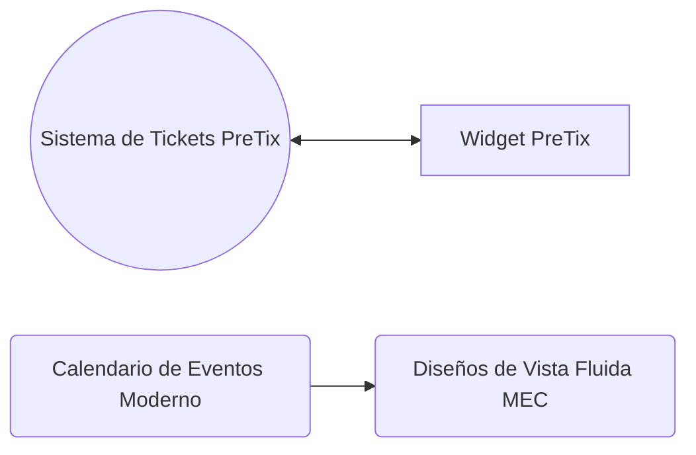

# Wordpress

## Plugins
## Sistema de Eventos y Reservas

## Tutoriales

-   :material-clock-fast:{ .lg .middle } __Contabilidad__

    ---

    Cómo se crea una página en Wordpress.
     author: piiit

    [:octicons-arrow-right-24: Ver](wordpress-pages.md){  .md-button }

[Cómo se crea una página en Wordpress](wordpress-pages.md)
