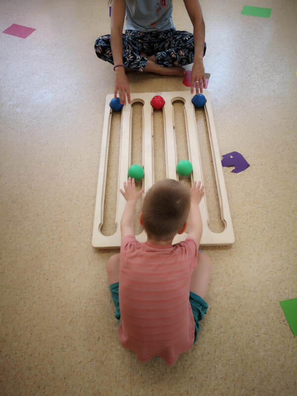
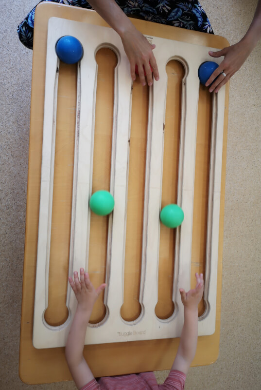

# **A Zsonglőr Tábla az Óvodában**

**Almáskert Óvoda – Budapest III. kerület**  
 *Szerző: Székely Zsuzsa, mozgásfejlesztő szakember*

---

## **Bevezetés**

Néhány évvel ezelőtt a budapesti III. kerületi **Almáskert Óvodában** egy rövid workshop keretében sajátítottuk el a **Zsonglőr Tábla** (Juggle Board) alapjait gyógypedagógusok, fejlesztő szakemberek és érdeklődő óvodapedagógusok részvételével. Ezen a képzésen én, mint gyógypedagógus vettem részt, és ez a néhány nap felemelő, mélyen motiváló élményt jelentett.

Nem sokkal ezután az intézmény vezetői a három tagóvoda mindegyikébe beszereztek egy-egy Zsonglőr Táblát. Így kezdődött az én utam a Zsonglőr Táblával egy olyan óvodában, ahol **sokféle igényű és speciális nevelési igényű gyermek** is nevelkedik.

---

## **Hogyan Kezdődött?**

Kezdetben a Zsonglőr Táblát **egyéni vagy kiscsoportos mozgásfejlesztő foglalkozásokba** építettem be, amelyeket délelőttönként egy külön helyiségben tartottam. Ezek a foglalkozások azon gyermekek számára voltak elérhetők, akiknek a szakértői bizottság által készített egyéni fejlesztési tervében mozgásfejlesztés vagy terápia szerepelt, néha **kiegészítő terápiás eszközként**.

---

{ align=right }
## **Kezdeti Tapasztalatok és Funkcionális Használat**

Elsőként **mozgássérült gyermekekkel** próbáltam ki a Zsonglőr Táblát, elsősorban a **funkcionális fejlődés támogatására**. Egy kislánynál, akinek mindkét felső végtagját érintette a központi idegrendszeri károsodás, a **váll- és kézmozgások hajlítása rendkívül nehézkesen** ment. A Zsonglőr Tábla izgalmas új eszközt jelentett számára.

Bár a szükséges mozdulatok ugyanannyi **koncentrációt és erőfeszítést** igényeltek, mint más terápiás eszközök használatakor, a golyók **fix pályákon való gurulása** és az **apró mozdulatokkal való elindíthatósága** miatt a siker **könnyebben elérhetőnek** tűnt. Ezáltal erősebb volt a sikerélmény.

Ebben az esetben nem a tábla alapmintázatának megtanítását tartottam fontosnak, hanem az **egyéni fejlesztési célokra** koncentráltam, mint például:

* A kézizmok erősítése és nyújtása  
* A testtartás javítása  
* A kompenzációs mozgások megelőzése

Gyakran hagytam, hogy ő irányítsa a tevékenységet. Észrevettem, hogy ez a **kontroll érzése** lelkesebbé és kitartóbbá tette a gyakorlatok végzése során.

---

{ align=left }
## **Alkalmazkodás az Alsó Végtagok Mozgatásához**

Egy másik esetben egy olyan gyermekkel dolgoztam, akinél jelentős **lábhossz-különbség** volt. A Zsonglőr Táblát **lábbal** használtuk. A cél a **rövidebb láb aktivizálása** volt, amely egy ortézis miatt korlátozott mozgású volt, és a mindennapi életben alulhasznált. A megfelelő pozíció megtalálása után a gyermek **kizárólag az érintett lábával** játszott.

Ez nem volt könnyű – intenzív erőfeszítést igényelt és gyors fáradtsághoz vezetett –, de **sok nevetéssel és apró győzelmekkel** járt együtt.

---

## **Testtudat és Integráció**

A Zsonglőr Táblával **kizárólag lábbal** játszottunk egy olyan gyermekkel is, akinek **fejletlen volt a testtudata és testképe**. Ez a gyermek alig ismerte fel lábai létezését, és nehezen mozgatta őket önállóan. A játék során ösztönösen próbálta **újra bevonni a kezét**, annak ellenére, hogy a tevékenység a lábakra összpontosított.

Az egész testének – részeinek, mozgásainak és térbeli helyzetének – tudatosságának fejlesztése elengedhetetlen volt az általános fejlődéséhez. Kihívásai mögött egy ritka genetikai rendellenesség állt, amely **nagyon egyenetlen kognitív profilt** eredményezett: kiváló verbális készségek, de gyenge figyelem és szenzoros integráció.

Végül a játékot kiterjesztettük **kognitív kihívásokra** is, kézzel végzett asztali játékok segítségével. Például:

* **Színsorozatok** létrehozása és megjegyzése  
* A golyóknak állatnevek hozzárendelése, amelyeknek fel kellett „jönniük a barlangjukból”, amikor hívták őket – még akkor is, ha helyet cseréltek

Ezek a tevékenységek más eszközökkel kombinálva hatékonynak bizonyultak, egyértelműen hozzájárulva a gyermek **fejlődéséhez és éréséhez**.

---

## **Testtartás és Csoportmunka**

A Zsonglőr Táblát **csoportos mozgásfejlesztő órákon** is használjuk, különösen a **testtartás javítására és a hátizmok erősítésére**. Ilyenkor a gyermekek hason fekve játszanak.

---

{ align=left }

## **Szociális Integráció és Megfigyelés**

A motoros és kognitív fejlődésen túl kezdtem észrevenni a Zsonglőr Tábla potenciálját a **szociális interakciók fokozásában**. Olyan gyermekeknek vezettük be, akik **kapcsolódási nehézségekkel** küzdöttek – azok, akiknek problémát okozott a kölcsönös figyelem és az együttműködés.

A játék során megfigyeltem:

* Vajon felnéztek-e a gyermekek a tábláról partnerükre  
* Vajon kérték-e a labdát bármilyen módon  
* Vajon elismerték-e a másik játékos jelenlétét

Strukturáltabb együttműködés érdekében **triádokban** játszottunk, két gyermekkel a tábla egyik oldalán. A játék **egyszerű szabályokat** tartalmazott, amelyek **közös problémamegoldást** igényeltek, például:

* Az egyik gyermek csak kék golyókat guríthatott, a másik csak zöldet  
* A golyók bármilyen pályán érkezhettek  
* Segíteniük kellett egymásnak a tér és az időzítés navigálásában anélkül, hogy akadályoznák egymást

Ezek a dinamikák **rendkívül informatívak** voltak, mind facilitátorként, mind megfigyelőként.

---

## **Egy Eset a Kontrollról és Szabályozásról**

Egy gyermekkel – aki gyakran került konfliktusba mind kortársaival, mind felnőttekkel – a Zsonglőr Táblát használtuk a **kontrollal kapcsolatos viselkedések** megfigyelésére és finom kihívására. Ez a gyermek **erős kontrolligénnyel** rendelkezett a napi rutinok és a játékok felett.

A táblával való játék során kezdetben finoman, majd egyre nyíltabban próbálta átvenni az irányítást a foglalkozás felett – még akkor is, ha strukturált szabályok szerint játszott egy másik gyermekkel, néhány percen belül képes volt átvenni az irányítást. Velem játszva gyakran gyorsan visszavonult, ha a tevékenység nem teljesen az ő feltételei szerint zajlott.

Ez lehetőséget kínált: a **facilitáció mikrobeállításain** keresztül olyan pillanatokat kezdtünk építeni, amikor anélkül maradhatott a játékban, hogy feladta volna autonómiájának érzését – **egyensúlyt teremtve a struktúra és a választás között**.

---

## **Folyamatos Használat és Szakmai Növekedés**

Most már a tanév során folyamatosan használjuk a Zsonglőr Táblát a következő területek felmérésére és erősítésére:

* Motoros készségek  
* Kognitív folyamatok  
* Szociális képességek

Minden esetben a részt vevő gyermekek növekedésének és fejlődésének egyértelmű jeleit tapasztaltam.

Számomra a Zsonglőr Táblával végzett munkám folyamatos fejlődését a szakmai műhelyeken való részvétel támogatja és inspirálja, ahol tapasztalatokat oszthatok meg, új megközelítéseket tanulhatok, és megújíthatom kreatív eszköztáramat. Amikor elakadok, vagy túlságosan a megszokott mintákba merevedek, ezek a műhelyek friss perspektívákat és új energiát kínálnak – segítve, hogy felfrissülve és újult lelkesedéssel térjek vissza a csoportszobába.
