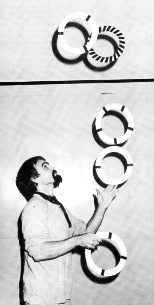

## **Mosoly legyőzi a gravitációt**
**Levél Toby Philpott-tól, az IJA európai igazgatójától**
[Kaskade 001](Kaskade%20001.md#Lächeln%20überwindet%20Schwerkraft)

Két éve viselem az "International Jugglers Association" (IJA) európai igazgatója címet. Ez egy olyan cím, amit W.C. Fields imádott volna, mert olyan fontosnak és titokzatosnak hangzik, és szinte semmit sem jelent. Nem "igazgatok" senkit, és a legtöbb időmet Angliában töltöm.

{ align=left }

Az IJA barátok kis csoportjaként indult, és mára több száz taggal rendelkező nagy szervezetté nőtte ki magát Amerikában. Az első európai zsonglőrtalálkozó is csak egy kis baráti társaságból állt Angliában, de ez volt az első lépés az "International" szó indoklásához. Ma ez a találkozó több mint tíz különböző országból vonz embereket.

A találkozók egyre nagyobbak lesznek, és sok nem tag is részt vesz rajtuk. A legtöbben nem látják értelmét az IJA-hoz való csatlakozásnak, ha az egyetlen dolog, amit kapnak tőle, egy amerikai magazin és egy címlista, amit soha nem használnak.

Ezt megértem. Ha nem létezne az IJA, akkor is szívesen találkoznék más zsonglőrökkel (nem csak azokkal, akik tőlem tanultak), tudni szeretném, hol vehetek kellékeket, hol láthatok előadásokat, hol léphetek fel az utcán. Továbbra is szeretnék ötleteket megosztani, és látni embereket, akik jobban zsonglőrködnek nálam. Ezt nagyrészt már azelőtt is meg tudtam tenni, hogy hallottam volna az IJA-ról, de többet láttam és tettem azóta, hogy elkezdtem találkozókat szervezni Európában. Ezek a találkozók a legjobb ok arra, hogy legyen egy hivatalos szervezetünk. Ez nem egy szakszervezet, és nem tudunk fellépéseket közvetíteni, vagy akár barátságot garantálni.

Úgy gondolom, hogy Európának képviselővel kell rendelkeznie az amerikai IJA igazgatótanácsában, aki kapcsolatot tart az Egyesült Államok és más országok régi tagjaival, és aki elkezdi valóban nemzetközivé tenni a szervezetet.

Amikor belépek egy zsonglőrtalálkozó termébe, két alapvető embertípust látok. Vannak, akik gyakorolnak, izzadnak és tökéletesítik a technikájukat, feszegetve saját határaikat. Ezeket "olimpikonoknak" nevezem, hogy hangsúlyozzam a tökéletességre való törekvést, a sportos küzdőszellemet, és a görög istenek és istennők szuperhősökkel való érintését.

Mások azért jöttek, hogy játsszanak, nevetgélnek és viccelődnek, kísérleteznek, improvizálnak, ötleteket cserélnek és jól érzik magukat. Őket "vándorszínészeknek" nevezem, és ők az egyszerű halandók, a bohócok, akik improvizációs képességeiket használják, mint minden vándornak és színésznek tennie kell.

Talán azt gondolod, hogy egy "európai igazgató" nevű személy "olimpikon" lenne. Valójában a zsonglőrködést egy tétlen életfázisomban kezdtem hobbiból. Most már több éves előadói és tanítói tapasztalattal rendelkezem, de mindig is a szórakozást akartam átadni, nem várok aranyérmet.

Szükségünk van a hősökre és a bohócokra. Az olimpikonok megmutathatják nekünk, mi lehetséges az elkötelezettséggel, új mércéket állítanak fel, és maguk is élvezhetik a közönséget, amely valóban el tudja ismerni az egyes mozdulatokba fektetett munkát.

A vándorszínészek azok, akik bevonzzák az új embereket, segítenek az új zsonglőröknek elindulni, terjesztik a hírt és szórakoztatnak.

Ezt egy olyan folyóiratban fogod olvasni, amelyet két német indított el, akik szívesen látnának több európait az IJA-ban.

Levélként írom ezt, mert nem vagyok újságíró, és szokásom szerint nyilvánosan követem el a hibáimat. Ha azt akarod, hogy ez a folyóirat tovább működjön, kérlek, írj a folyóirat szerkesztőinek, vagy küldj fotókat. Ha azt akarod, hogy Európa fontosabb szerepet játsszon az IJA-ban, írj nekem, és megpróbálom elmagyarázni a pozíciónkat a többi igazgatótanácsi tagnak. Ha inkább egy független európai csoportot szeretnél, akkor vágj bele és alapíts egyet. Kár lenne teljesen elszakadni egy olyan szervezettől, amely 37 éve létezik, és sok országban van tagja.

Mellesleg, ha úgy gondolod, hogy egy igazi olimpikon jobb szóvivője lenne Európának, akkor te magad is indulhatsz, vagy találj egy zsonglőr politikus, aki 1985-ben a képviselőnk lehetne.
Addig is remélem, találkozunk a néhány közös napunk során. És ne feledd: a mosoly legyőzi a gravitációt. (Ez egy jó szlogen egy választáson való győzelemhez, vagy a fordítóinknak fejfájást okozni.)
