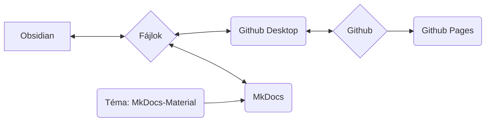

Az MkDocs rendszert használjuk folyamataink, eljárásaink és munkameneteink dokumentálására, valamint online elérhetővé tételére.

## A rendszer alapgondolata

>[!info]
>- A tartalom és a megjelenés szigorúan elkülönül.
>- Minden egyszerű, Markdown formátumú szöveges fájlra (*.md) épül.
>- Nincsenek saját, szabadalmaztatott adatok.
>- Alapvetően (néhány kivételtől eltekintve) bármilyen szövegszerkesztővel elvégezhető a munka (én magam az Obsidiant használom, és azzal fogom bemutatni a munkafolyamatokat).
>- Az adatok lokálisan szerkeszthetők.
>- Az MkDocs segítségével a Markdown fájlokat statikus weboldallá alakítjuk.
>- A Markdown fájlokat és a weboldal adatait a Nica e.v. Git-tárában tároljuk.
>- A Github Pages-en keresztül az egész weboldalként lesz elérhető.



>[!info]+ 
>Minden egyes szoftverkomponens (Github, Github Pages, Github Desktop, MkDocs, Obsidian, MkDocs-Materials) **nyílt forráskódú és ingyenesen használható**.
>
>Ha egyes komponensek megszűnnének (a szolgáltatás megszűnik, a szoftver már nem elérhető, vagy egyéb okok miatt), a tényleges adatok (tehát a Markdown fájlok) továbbra is megmaradnak.
>
>A Github használata egyrészt lehetővé teszi az adatok verziókövetését – ez azt jelenti, hogy minden változás dokumentált és nyomon követhető, valamint minden változtatás vissza is vonható.
>Lehetővé teszi továbbá mások számára is, hogy közreműködjenek a dokumentációban anélkül, hogy felhasználói adatokat kellene kezelnünk, vagy aggódnunk kellene a rendszer biztonságáért (ez azonban technikailag kissé bonyolultabb).
>
>Így hosszú távon jóval ellenállóbbak vagyunk. Mivel egy ilyen dokumentáció hosszú időn keresztül növekszik, ezt hatalmas előnynek tartom.
 
### Más személyek bevonása
Az alább leírt rendszer elsőre túlterhelőnek vagy elrettentőnek tűnhet azok számára, akik kevésbé foglalkoznak kóddal és programozással.

Ennek orvoslására a következő alternatív tartalomkészítési lehetőségeket kínáljuk:
- Tartalmak létrehozása Wordpress-ben, mint oldal.
- Tartalmak küldése szöveges fájlként, Word-fájlként (vagy más tipikus formátumokban).

Ezeket a tartalmakat e-mailben kell elküldeni az aktuálisan felelős személynek (lásd: [Impresszum](Impressum.md)). Ő gondoskodik a beillesztésükről.
## Fájlrendszer

>[!info]+ Könyvtárstruktúra és fájlok
>**/docs**
>**/site**
>
>license
>mkdocs.yml
>readme.md

## Obsidian

Különösen az [Obsidian](Obsidian%20Setup.md) szövegszerkesztőként való használata révén ez a beállítás hatalmas előnyökkel jár:

- Az Obsidian különösen alkalmas nagyszámú, címkékkel vagy hivatkozásokkal összekapcsolt, illetve könyvtárstruktúrákkal (alkönyvtárakkal) kategorizált egyedi fájl kezelésére.
- Az Obsidian grafikusan is megjelenítheti ezeket az adatokat, ami különösen javítja a nagy mennyiségű adat kezelését.

Az Obsidian további nagy előnye a hatalmas beépülő modul ökoszisztéma. Ez lehetővé teszi számunkra, hogy nagyon egyszerűen adjunk hozzá funkciókat, mint például:
- Adatbázisszerű szűrés / keresés
- Címkék kezelése (pl. változtatások sok fájlban egyszerre, mint egy gyakran használt címke átnevezése)
- Metaadatok egyszerű kezelése (úgynevezett [Frontmatter](Frontmatter%20Properties.md) vagy YAML)

## Github

Egy verziókövető program az adatokhoz, amely online is használható.
### Github Desktop

A Git valójában egy parancssori eszköz – ez sokakat elriaszt.
A Github Desktop ezt a problémát úgy oldja meg, hogy a szükséges funkciókat egy egyszerű grafikus felülettel rendelkező alkalmazásba csomagolja.

### Github Pages

A Github Pages a Github egyik szolgáltatása.
Ha egy adattárban bizonyos formában tárolják a weboldal adatait, akkor azokat weboldalként lehet megjeleníteni.

- A szolgáltatás ingyenes.
- Az MkDocs minden szükséges lépést önállóan elvégez.

Az előnyünk:
- Nincs saját tárhely.
- Nincsenek díjak.
- A tartalom feltöltéséhez / frissítéséhez mindössze egy parancssori parancsra van szükség: ```

```
mkdocs gh-deploy
```

Összességében semmiről sem kell gondoskodnunk, szinte kizárólag lokálisan dolgozhatunk.
## MkDocs

Az [MkDocs](https://mkdocs.org) egy szoftver online elérhető dokumentációk létrehozására.
Egyszerű szöveges fájlokban készül a tartalom – ez bármilyen szövegszerkesztővel elvégezhető, amely támogatja a [Markdown formátumot](Markdown.md). 

>[!info]- Lehetséges szövegszerkesztők listája
>- Notepad++
>- Atom
>- Visual Studio Code
>- Sublime
>- Windows Szövegszerkesztő
>- Obsidian

Egy parancssori paranccsal az MkDocs futtatható, és képes:

- Offline módban megjeleníteni a weboldal kész verzióját.
	- Ez automatikusan frissül, ha változások történnek a szöveges fájlokban.
	- Ez nagyon gyors és egyszerű tartalomírási és elrendezési lehetőséget tesz lehetővé.
- Elkészíteni az adatokat a statikus weboldalhoz (lokálisan).
	- Ezeket például közvetlenül egy szerverre lehet feltölteni.
- A Github Pages-hez való csatlakozás révén közvetlenül feltölteni a statikus weboldalt.
	- Ez ingyenes, amíg a dokumentáció nyilvánosan elérhető és nyílt forráskódú licenc alatt áll (ezt mi mindkettőt teljesítjük).

A teljes dokumentációért látogasson el a [mkdocs.org](https://www.mkdocs.org) oldalra.

### Téma: MkDocs Material

https://squidfunk.github.io/mkdocs-material/
