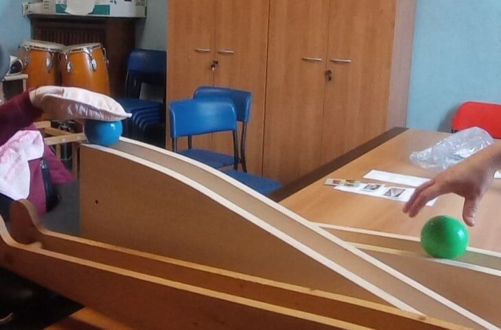
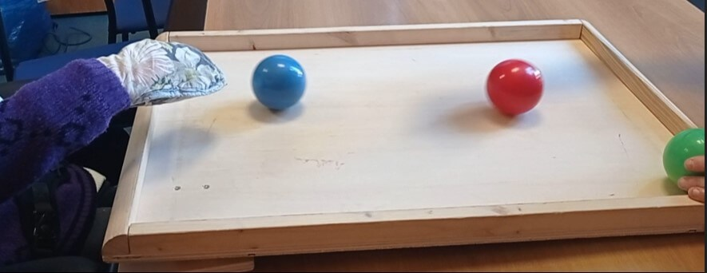
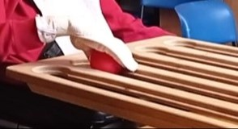

# **Oltre il Movimento: Un Percorso a Lungo Termine con il Giocoleria Funzionale**

[SELF APS](SELF%20APS.md)
**Centro Diurno Disabili – Italia**
*Scritto da Sara Papadato*

## **Gruppo Target**

Questo lavoro si concentra su una persona con disabilità e bisogni di supporto elevati che frequenta un Centro Diurno Disabili nel Nord Italia.

Si muove nell'ambiente in carrozzina ed è accompagnata da un operatore. La sua diagnosi spesso maschera il suo calore e il suo potenziale, ma sotto sotto è una donna piena di energia, gioia e determinazione.

## **Situazione Iniziale**

Ho una laurea in **Scienze Motorie** e lavoro nel campo della disabilità da molti anni. Dal 2011 mi sono specializzata in **pedagogia circense** e nel 2018 sono diventata facilitatrice certificata di **Giocoleria Funzionale** attraverso la formazione con Craig Quat.

Ho incontrato questa donna per la prima volta nel 2016 tramite un **Programma di Attività Motoria (MATP)**, sviluppato in collaborazione con **Special Olympics**. L'attività si è svolta presso un Centro Diurno Disabili gestito dall'**Azienda Speciale Consortile Offertasociale (Vimercate-MB)** con la **Cooperativa Sociale Solaris (Triuggio-MB)** come ente appaltatore.

Nel 2018, siamo passati dal MATP a un **progetto di Giocoleria Funzionale**, supportato da un team collaborativo e aperto di educatori e terapisti. Quando ha iniziato, la sua **mano destra era legata alla carrozzina** a causa di comportamenti autolesionistici e di portare oggetti alla bocca. Oggi, invece, indossa un **guanto protettivo** e ha acquisito molta più **libertà** e **controllo**.

## **Obiettivi**

Inizialmente, l'obiettivo condiviso era semplice ma essenziale:

*   **Partecipare all'attività senza mettere in atto comportamenti disfunzionali**

Nel tempo, con il contributo della fisioterapista e dello staff, gli obiettivi si sono evoluti includendo:

*   **Stimolare il movimento dell'arto superiore sinistro**
*   **Incoraggiare l'interazione con i pari attraverso attività di giocoleria**

## **Setting e Strumenti**

Le sessioni si svolgevano in una **sala polivalente**, solitamente utilizzata come ufficio, ma riservata settimanalmente per la giocoleria. I **materiali venivano assemblati e smontati** prima e dopo ogni sessione, che durava tra i **20 e i 30 minuti**, a seconda delle condizioni fisiche della partecipante. Tutto il lavoro si svolgeva in un contesto **individuale**.

**Tra i props utilizzati c'erano**:

*   Juggle Board (orizzontale e inclinato)
*   Abaco
*   Flashcups
*   Flowersticks
*   Anelli da giocoleria

## **Processo**

Dal 2018, la cliente ha partecipato a **sessioni settimanali** da ottobre a maggio. I nostri primi passi si sono concentrati sulla costruzione del **rapporto**, sulla scoperta dei suoi **interessi** e sulla creazione di modi per coinvolgerla nell'attività.

Nella fase iniziale, era sempre accompagnata da un educatore che la conosceva bene. Man mano che il nostro rapporto si rafforzava, sono riuscita infine a lavorare con lei **in autonomia**.

**Ogni sessione seguiva una struttura coerente**:

1.  **Saluto e accoglienza** al piano terra
2.  **Fase di attivazione** – spesso con lo Juggle Board
3.  **Lavoro centrale** – combinando associazione di colori e coinvolgimento degli arti utilizzando la tavola, l'abaco e i flashcups
4.  **Attivazione dell'arto superiore sinistro** utilizzando strumenti di movimento orizzontale
5.  **Fase finale** – un gioco a sua scelta e un riepilogo della sessione

La partecipante era **molto coinvolta** con i materiali e, nel tempo, ha imparato ad **accettare e godere meglio delle nuove sfide**, pur mostrando delle preferenze. Una strategia chiave è stata quella di mantenere la sua attenzione sui **compiti basati sul movimento**, non sui comportamenti di autoregolazione o evitamento, e di **inquadrare le attività come giochi o mini-competizioni** per aumentare la motivazione.

Abbiamo scoperto che era in grado di identificare e abbinare i colori, specialmente quando utilizzava props come l'**abaco** e lo **Juggle Board**. Questi momenti offrivano preziose opportunità per combinare **stimolazione cognitiva** con **gioco motorio**.

La stretta collaborazione con il **team educativo** e il supporto continuo dei **fisioterapisti** si sono rivelati essenziali per allineare i nostri obiettivi comuni e progettare strategie efficaci per l'**attivazione guidata del braccio sinistro**.

## **Risultati**

Abbiamo utilizzato l'**osservazione continua** come metodo di valutazione primario, e i progressi – sebbene spesso sottili – si sono rivelati profondamente significativi:

*   All'inizio, la partecipante tentava frequentemente di portare la mano destra alla bocca non appena veniva liberata. Oggi, questo comportamento si manifesta solo una o due volte a sessione, ed è in grado di reindirizzarsi facilmente all'attività.
*   La sua mano destra non è più legata e ora richiede solo un **guanto protettivo**.
*   Ora è in grado di **estendere intenzionalmente il braccio sinistro** fino a quattro volte consecutive per interagire con props come lo Juggle Board o i Flashcups.
*   Ha giocato con **coetanei, familiari e bambini**, sempre accompagnata da un educatore – dimostrando crescente apertura e cooperazione.

Forse la cosa più notevole è che è diventata l'"**esperta**" dell'attività di Giocoleria Funzionale all'interno del centro, dimostrando frequentemente agli altri ciò che ha imparato – con evidente orgoglio.

C'è ancora **spazio per la crescita**, in particolare nell'implementazione di sistemi di monitoraggio più misurabili. Idealmente, le sessioni future integrerebbero la **documentazione video** o **strumenti basati su sensori** per consentire livelli più profondi di riflessione e **analisi basata sui dati**. Queste aggiunte potrebbero supportare sia la facilitazione in tempo reale che la revisione post-sessione, migliorando la chiarezza e la continuità del monitoraggio dei progressi a lungo termine.

---

## **Conclusioni e Riflessioni**

Lavorare a lungo termine con una persona con disabilità complesse richiede **pazienza, costanza** e un profondo **impegno**. All'inizio, mi sentivo incerta, chiedendomi se stesse avvenendo un reale cambiamento. Ma lentamente, con gli occhi attenti del suo team educativo, ho iniziato a vedere la verità: i **piccoli spostamenti** erano in realtà **enormi passi**.

Ciò che facciamo con la Giocoleria Funzionale non riguarda solo il movimento, ma la **fiducia**, l'**attenzione**, la **presenza** e la creazione delle condizioni affinché ogni persona possa **mostrarci chi è e di cosa è capace**.

Potrebbe non sembrare sempre un progresso, ma quando impariamo a guardare diversamente, iniziamo a vedere quanto lontano qualcuno è arrivato.
