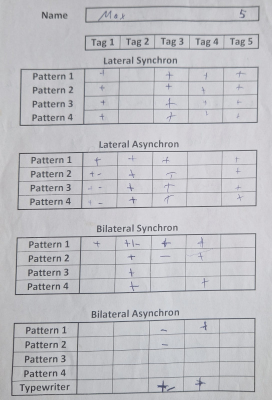
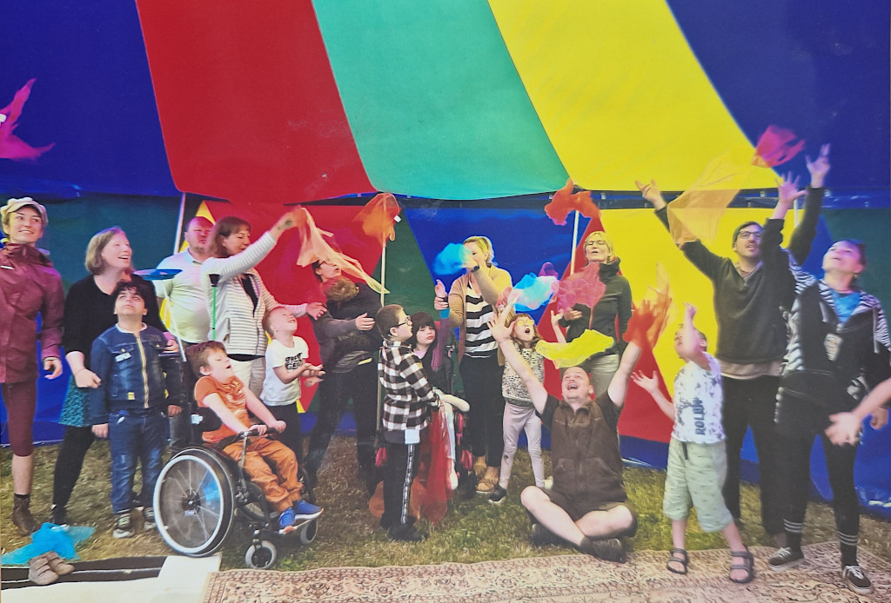

# **Un Laboratorio di Pedagogia Circense Adattiva per Bambini con Bisogni Speciali**
[NICA-EV](NICA-EV.md) - Halle, Germania
*Scritto da Marc Bielert*
## **Panoramica del Progetto e Gruppo Target**
Questo studio di caso documenta un laboratorio di pedagogia circense di cinque giorni per un gruppo di 10 bambini, di età compresa tra i 7 e i 10 anni, provenienti da una scuola per studenti con disabilità intellettive e fisiche, tenutosi nell'autunno 2024 a Halle, Germania. Il gruppo di partecipanti presentava un ampio spettro di bisogni, da significative sfide comportamentali alla paralisi cerebrale. Questa diversità ha richiesto un quadro pedagogico altamente individualizzato e flessibile.

Il progetto è stato gestito con un elevato livello di supporto, con tre formatori professionisti (della nostra associazione NICA e.V.), un volontario e 5-6 membri del personale scolastico (insegnanti, assistenti all'integrazione), con un rapporto di supporto quasi di 1:1 (circa 1:3 per quanto riguarda il nostro team).

## **Struttura del Laboratorio e Composizione del Team**
Il laboratorio si è svolto in una piccola tenda da circo all'interno del cortile della scuola, fornendo un ambiente dedicato e protetto. Le sessioni giornaliere di tre ore si basavano sulla pedagogia circense, adattata per un contesto inclusivo.

Le qualifiche del team di formazione includevano una vasta esperienza professionale nel lavoro circense inclusivo (da 4 a 15 anni), con background accademici in Scienze dell'Educazione e Pedagogia Sociale. Un elemento strutturale chiave è stata la divisione del team: **due formatori guidavano le attività di gruppo mentre uno conduceva sessioni individualizzate di 10 minuti con ciascun bambino ogni giorno**.

## **Obiettivi del Progetto**
Il progetto è stato concepito per raggiungere i seguenti obiettivi:

*   **Esperienza Orientata ai Bisogni:** Fornire nuove esperienze di movimento incentrate sull'impegno positivo e sul divertimento, piuttosto che su metriche di performance.
*   **Accessibilità:** Garantire che tutte le attività fossero accessibili a ogni bambino, indipendentemente dalla sua specifica disabilità.
*   **Valutazione dell'Efficacia:** Valutare il potenziale di progresso osservabile in un breve e intensivo lasso di tempo di formazione individualizzata in una sessione uno-a-uno.
*   **Documentazione Sistematica:** Implementare un processo di documentazione standardizzato per le sessioni individuali al fine di monitorare i progressi e garantire la continuità tra i formatori.
*   **Fattibilità Metodologica:** Dimostrare la fattibilità di integrare una formazione intensiva e individuale all'interno di una struttura di laboratorio di gruppo e in condizioni finanziarie ristrette.
{ align=left }

## **Metodologie e Adattamento Pedagogico**
Il laboratorio ha utilizzato metodi inclusivi consolidati come il **Giocoleria Funzionale, Spin Poi e Hula Hoop Integrale**, nonché idee presenti anche nel **metodo IN.ZIRQUE**. Una parte centrale del nostro lavoro ha comportato l'adattamento delle attività in base alle risposte dei partecipanti.

Un chiaro esempio di questo processo è stata l'introduzione di un **gioco di corsa "Tris"**. Il nostro progetto iniziale, che richiedeva pensiero strategico e rispetto di regole a più passaggi, si è rivelato un errore pedagogico, poiché era troppo impegnativo dal punto di vista cognitivo per il gruppo. Ciò ha richiesto un immediato cambiamento metodologico. Abbiamo **scomposto il gioco nelle sue competenze fondamentali: riconoscimento dei colori e organizzazione spaziale**, e introdotto attività più semplici di smistamento e creazione di schemi utilizzando gli stessi o materiali simili.

Dopo aver costruito queste abilità fondamentali in un contesto ludico, abbiamo reintrodotto il gioco originale, con cui i bambini sono stati poi in grado di impegnarsi con successo. **Questo incidente ha evidenziato la necessità di valutare e costruire le abilità prerequisito prima di introdurre compiti complessi.**

## **Programma Giornaliero**
Ogni giorno iniziava con un **saluto di gruppo e giochi di riscaldamento**, seguiti da **attività di gruppo** concorrenti (acrobatica, equilibrio, ecc.) e **sessioni di formazione individualizzate di 10 minuti**, oltre a **pause condivise** per mangiare, bere e socializzare. Ogni giornata si concludeva con **giochi di defaticamento e massaggio**, e un **momento di feedback giornaliero** per guidare la pianificazione del giorno successivo.

## **Risultati del Progetto**
**Progressione dei Partecipanti:** È stato osservato un progresso evidente in tutto il gruppo. Un risultato significativo è stato osservato con un **bambino non verbale con paralisi cerebrale** che in precedenza aveva mostrato una reazione minima agli stimoli esterni. Attraverso un lavoro costante e individuale con una palla rotante, il bambino ha iniziato a partecipare a un'**interazione reciproca di andata e ritorno** entro la fine della settimana. Ciò ha dimostrato il potenziale di un intervento mirato e paziente.

Vale anche la pena notare che i progressi dei diversi bambini potevano dipendere da formatori diversi (alcuni bambini si aprivano solo a formatori donne, altri solo a uomini). Ciò evidenzia che **è molto vantaggioso avere un gruppo eterogeneo di formatori**, sia per genere che per altri aspetti.

Il progetto è stato caratterizzato da un **elevato grado di fluidità operativa**, in gran parte attribuibile a un'ampia **pianificazione pre-progetto**, inclusi incontri preparatori con la scuola per comprendere i bisogni specifici e le potenziali sfide dei partecipanti.

{ align=left }

## **Apprendimenti Chiave e Fattori di Successo**
L'efficacia del progetto può essere attribuita a diversi fattori:

*   **Il Valore dell'Adattamento in Tempo Reale:** L'esempio del "Tris" sottolinea che il successo non dipendeva da un piano iniziale impeccabile, ma dalla capacità del team di riconoscere un approccio fallimentare e ristrutturarlo sulla base dell'osservazione diretta dei bisogni dei bambini.

*   **Individualizzazione Strutturata:** La documentazione sistematica delle sessioni individuali di 10 minuti si è rivelata molto efficace. Ha fornito dati concreti per la valutazione dei progressi e ha permesso a formatori diversi di lavorare con lo stesso bambino senza perdita di continuità.

## **Conclusione**
L'**alto rapporto staff-partecipanti** e la **collaborazione aperta** tra i nostri formatori e il personale della scuola hanno creato un **ambiente di supporto e reattivo** per tutti i partecipanti.

Il progetto illustra anche il valore di un **approccio pedagogico altamente strutturato ma flessibile** nel lavorare con bambini con bisogni diversi e complessi. La combinazione di **pianificazione proattiva, individualizzazione sistematica** e la **disponibilità ad adattare le metodologie** in risposta al feedback diretto dei partecipanti sono stati fondamentali per gli esiti positivi del progetto. Dimostra che anche in un breve lasso di tempo, **interventi mirati e orientati ai bisogni** possono facilitare un **coinvolgimento significativo e progressi osservabili**.
