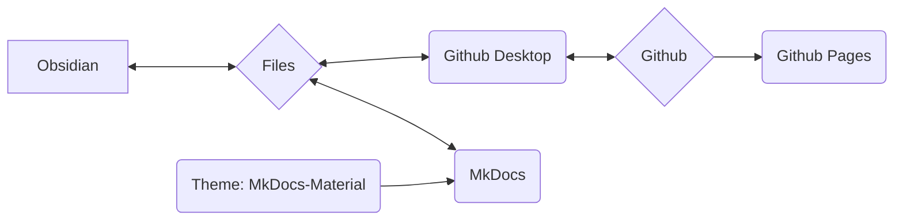

Utilizziamo MkDocs come sistema per documentare i nostri processi, procedure e flussi di lavoro e per renderli disponibili online.

## Idea di base del sistema

>[!info]
>- Contenuto e layout sono strettamente separati
>- Tutto si basa su semplici file di testo in formato Markdown ( *.md )
>- nessun dato proprietario
>- Tutto può essere fatto in linea di principio (salvo poche eccezioni) con un editor di testo (io stesso utilizzo Obsidian e spiegherò le modalità di lavoro con esso)
>- i dati possono essere modificati localmente
>- tramite MkDocs i dati Markdown vengono convertiti in un sito web statico
>- i dati Markdown e i dati del sito web vengono memorizzati nel repository Git di Nica e.v.
>- tramite Github Pages il tutto è quindi accessibile come sito web



>[!info]+ 
>Ogni singolo componente software (Github, Github Pages, Github Desktop, MkDocs, Obsidian, MkDocs-Materials) è **Open Source e utilizzabile gratuitamente**.
>
>Qualora singoli componenti venissero a mancare (servizio interrotto, software non più disponibile o altri motivi) i dati effettivi (cioè i file Markdown) sarebbero comunque disponibili.
>
>L'utilizzo di Github ci consente da un lato la versioning dei dati - ciò significa che ogni modifica è documentata e tracciabile, e ogni modifica può anche essere annullata.
>Consente inoltre ad altri di collaborare alla documentazione senza che noi dobbiamo gestire dati utente o preoccuparci della sicurezza del sistema (questo è tuttavia tecnicamente un po' più complesso).
>
>In questo modo siamo a lungo termine molto più resilienti. Poiché una tale documentazione cresce nel tempo, trovo questo un enorme vantaggio.
 
### Coinvolgimento di altre persone
Il sistema descritto di seguito può apparire a prima vista travolgente o scoraggiante per persone che hanno poca familiarità con il codice e la programmazione.

Per affrontare questo aspetto, abbiamo le seguenti possibilità alternative per la creazione di contenuti:
- Creare contenuti in Wordpress come pagina
- Contenuti come file di testo, file Word (o altri formati tipici)

Questi contenuti devono poi essere inviati via email alla persona attualmente responsabile (vedi [Impressum](Impressum.md)). Questi verranno poi inseriti.
## File system

>[!info]+ Struttura delle directory e file
>**/docs**
>**/site**
>
>license
>mkdocs.yml
>readme.md

## Obsidian

In particolare, l'utilizzo di [Obsidian](Obsidian%20Setup.md) come editor di testo offre enormi vantaggi a questa configurazione:

- Obsidian è particolarmente adatto per un gran numero di file singoli che sono collegati tramite tag o link o categorizzati tramite strutture di directory (sottodirectory)
- Obsidian può rappresentare questi dati graficamente, migliorando in particolare la gestione di grandi quantità di dati

Un altro grande vantaggio di Obsidian è il suo vasto ecosistema di plugin. Questo ci consente di aggiungere facilmente funzionalità come ad esempio:
- Filtraggio / ricerca simile a un database
- Gestione dei tag (ad esempio, modifiche in molti file contemporaneamente come la rinomina di un tag utilizzato frequentemente)
- Gestione semplice dei metadati (cosiddetto [Frontmatter](Frontmatter%20Properties.md) o YAML)

## Github

È un programma di controllo delle versioni per dati che può essere utilizzato online.
### Github Desktop

Git è in realtà uno strumento da riga di comando - questo scoraggia molti.
Github Desktop risolve questo problema inserendo la funzionalità necessaria in un'applicazione con una semplice interfaccia grafica.

### Github Pages

Github Pages è un servizio di Github.
Se i dati del sito web sono memorizzati in un repository in una forma specifica, questi possono essere visualizzati come sito web.

- il servizio è gratuito
- MkDocs esegue tutti i passaggi necessari da solo

Il vantaggio per noi:
- nessun hosting proprio
- nessuna commissione
- per caricare / aggiornare il contenuto è sufficiente un comando da riga di comando: ```

```
mkdocs gh-deploy
```

Nel complesso, non dobbiamo preoccuparci di nulla, possiamo lavorare quasi esclusivamente in locale.
## MkDocs

[MkDocs](https://mkdocs.org) è un software per la creazione di documentazione disponibile online.
Il contenuto viene creato in semplici file di testo - questo può essere fatto in qualsiasi editor di testo che supporti il [formato Markdown](Markdown.md). 

>[!info]- Elenco dei possibili editor di testo
>- Notepad++
>- Atom
>- Visual Studio Code
>- Sublime
>- Editor di testo di Windows
>- Obsidian

Tramite un comando da riga di comando, MkDocs viene eseguito e può:

- visualizzare una versione completa del sito web offline
	- questa viene aggiornata automaticamente in caso di modifiche ai file di testo
	- ciò consente una stesura e una formattazione dei contenuti molto rapida e semplice
- creare i dati per il sito web statico (localmente)
	- questi possono quindi essere caricati direttamente su un server, ad esempio
- tramite l'integrazione con Github Pages caricare direttamente il sito web statico
	- questo è gratuito finché la documentazione è pubblicamente disponibile e sotto licenza Open Source (entrambi i requisiti li soddisfiamo)

Per la documentazione completa visitare [mkdocs.org](https://www.mkdocs.org).

### Theme: MkDocs Material

https://squidfunk.github.io/mkdocs-material/
