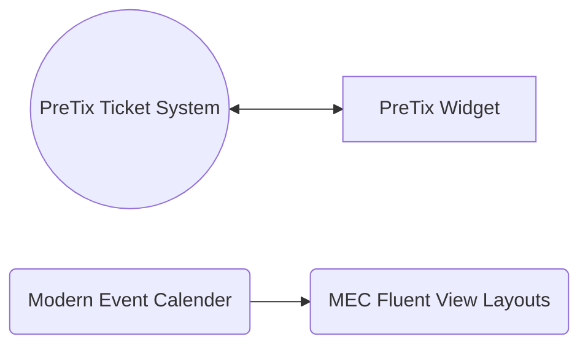

# Wordpress

## Plugin

## Sistema di gestione eventi e prenotazioni

## Tutorial

-   :material-clock-fast:{ .lg .middle } __Contabilità__

    ---

    Come creare una pagina su Wordpress.
     author: piiit

    [:octicons-arrow-right-24: Guarda](wordpress-pages.md){ .md-button }

[Come creare una pagina su Wordpress](wordpress-pages.md)
