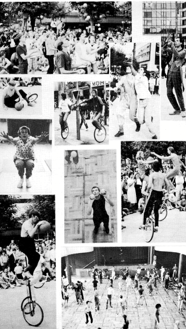
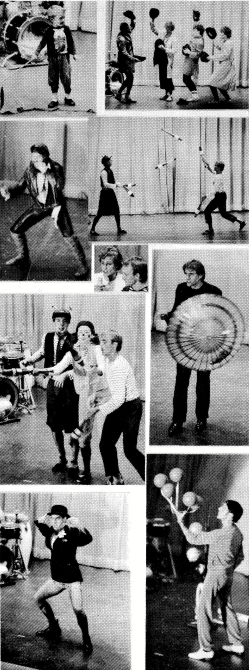
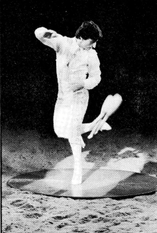
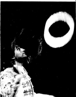
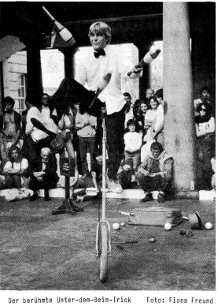

## JONGLERWEEKEND '84
**Gedachten over Frankfurt door iemand die erbij was**

400 dit keer, mensen. De 7e Europese Jongleursweek in Frankfurt was tot nu toe de grootste en bewijst dat, althans wat jongleren aan deze kant van de Atlantische Oceaan betreft, de enige mogelijke weg omhoog is.
Maar er was dit jaar iets belangrijkers dan cijfers, er was een gevoel dat het tweede weekend van september altijd de tijd zal zijn waarop jongleurs uit heel Europa al het andere opzij zullen zetten om samen te zijn.

Daarom zijn er dit soort bijeenkomsten: Eenenvijftig weken per jaar zijn de jongleurs van Europa wijd verspreid, in groepen van 3, 4 of 5, maar meestal zijn ze alleen in hun eigen kleine hoekjes, uitvindend, oefenend, werkend. Nauwelijks, zo al, hebben ze de gelegenheid om hun ideeën en trucs uit te wisselen. Zelden hebben ze de mogelijkheid om te delen wat ze hebben.

Toen naderde deze september en de jongleurmigratie begon langzaam. De tekenen waren alleen zichtbaar voor degenen die dezelfde reis maakten: knotsgrepen die uit rugzakken staken (gewone mensen vroegen zich af waarom iemand 3 squashrackets bij zich zou dragen); een bolhoed op een hoofd dat duidelijk noch bij een boekhouder noch bij een Engelsman hoorde; een camper illegaal op een trottoir geparkeerd, met een briefje op de voorruit "Waar zijn jullie allemaal?"

Zo begon het, wijd verspreid en losjes. Maar dat veranderde snel, en tegen 18.00 uur op woensdagavond, het officiële begin van de bijeenkomst van dit jaar, had de invasie van de jongleurs zijn hoogtepunt bereikt. De ruimte die voor het welkomstdrankje was gereserveerd, kon nauwelijks alle aankomenden bevatten.
Sommigen begonnen meteen te jongleren, maar de meesten zaten met open mond te kijken en zich af te vragen: "Waar komen ze allemaal vandaan?" Daar waren 400 antwoorden op.

En voor degenen die het grootste deel van het jaar alleen jongleren of die voor het eerst op zo'n bijeenkomst waren, was het een enorme schok. Naar wie kijk je eerst? Hoe deed hij dat? Waar kwam dat ding vandaan? Overload!

En ze hadden nog vier overvolle dagen voor de boeg!
Het talent van Todd Strong en Andrew Allen met diabolo's en devil sticks was het bewijs dat jongleren niet alleen een zaak van knotsen en ballen is, hoewel Antonio Bucci en zijn 7 ballen voorbeeldig waren.

Tim Bat's grappige YoYo-act zorgde ervoor dat iedereen die op zondag nog een Duncan wilde kopen, teleurgesteld werd, alle YoYos waren uitverkocht.
Gérard Estrem met zijn devil stick, Klapp's Kalli's Keulen Kompany's hoedact, de lijst kan lang worden en ik bied mijn excuses aan aan alle 390 mensen die ik niet heb genoemd. Het is genoeg om te zeggen dat elke aanwezige persoon iets nieuws te leren liet zien en dat de bijeenkomst zelf een bron van informatie was voor iedereen die een uur op het balkon met uitzicht op de hal wilde doorbrengen.

{ align=left }

En de openbare show?

Absoluut de beste openbare show die ooit op een Europese bijeenkomst is gepresenteerd.

De acts waren gevarieerd, vermakelijk, op het publiek afgestemd en verliepen zeer soepel. Bijzondere dank gaat uit naar Paul Keast en Uli Meister, het onverslaanbare duo dat de hele show professioneel, humoristisch en in drie talen aankondigde.

De openbare show is een belangrijk element van de jongleursbijeenkomsten, een soort open deur die het publiek de kans geeft om zelf te zien dat we niet zomaar een stel rondreizende zigeuners zijn die baby's stelen en de openbare orde verstoren, maar dat we in plaats daarvan een zeer getalenteerde groep zeer onafhankelijke mensen zijn.
Mimespelers, muzikanten, komieken, acrobaten, jongleurs en gewoon leuke mensen, die een stad alleen zouden plunderen als het in het contract stond.
De openbare show van dit jaar was in dit opzicht een succes, het bood de stad Frankfurt twee uur betovering, terwijl tegelijkertijd alle jongleurs de kans kregen om elkaar te complimenteren. Nogmaals hartelijk dank aan alle organisatoren van de show voor dit goede werk.

En nogmaals excuses voor het niet één voor één opsommen van alle deelnemers aan de openbare show, dat wordt door anderen gedaan, bovendien zou ik nooit iedereen recht kunnen doen.
Ik doe ook de bijeenkomst zelf geen recht. Mijn werkelijke bedoeling met het artikel was om het gevoel van het evenement over te brengen, de saamhorigheid, de kameraadschap, dat alles, het element dat elke conferentie met de volgende verbindt en de reden is dat mensen elk jaar in grotere getale terugkomen. Het is niet alleen het jongleren, maar het is iets anders en van niemand die er niet zelf bij was, kan verwacht worden dat hij begrijpt wat het is!

Maar wat het is, in al zijn eenvoud, is dit:
De bijeenkomsten zijn altijd vol plezier. Alle filosofie en diepzinnigheid die je je kunt voorstellen, kan de bijeenkomsten nooit zo samenvatten als dat ene woord dat kan. Plezier is wat het jongleursfestival maakt, omdat jongleren plezier is en altijd moet zijn.
Veel dank aan de Autonome Jongleurgroep. Met hun spellen, hun organisatie en hun harde werk hebben ze het gevoel weten te behouden en gaven ze iedereen die aanwezig was een goede reden om volgend jaar weer samen te komen in Louvain-La-Neuve, België.

Jobik LaCombe

Aangezien het grootste deel van onze lezers zelf op de jongleursbijeenkomst was, is het waarschijnlijk onnodig om een volledig verslag te geven.
Zoals Jobik schrijft, kun je sowieso niet echt waarderen wat daar gebeurd is zonder erbij te zijn geweest. In plaats daarvan hebben we enkele foto's verzameld die je misschien veel zullen herinneren, en enkele informatie verzameld die je misschien is ontgaan.
Wist je bijvoorbeeld dat er op televisie iets over ons werd uitgezonden? Op vrijdag was er in het Heute Journal een kort verslag over de wedstrijden, in Aspekte lieten ze later nog meer zien. In de Hessenschau lieten ze ook enkele scènes zien (met een vreselijk commentaar), wat waarschijnlijk heeft bijgedragen aan het vullen van het Volksbildungsheim voor de show 's avonds. (Dat was het tv-team dat zich met verblindende schijnwerpers had verspreid.) En misschien het meest verbazingwekkende is dat een korte film met een interview van ABC-News naar de Verenigde Staten werd uitgezonden. (Een langere film, die over Fritz Brehm werd gemaakt en veel festivals-scènes bevat, zal waarschijnlijk in het voorjaar op ZDF worden getoond.)
Voor iedereen die zich tot de zakelijke bijeenkomst op zondag nog niet van het feest had hersteld, hier nogmaals de belangrijkste beslissingen: Er werd unaniem besloten dat de bijeenkomst volgend jaar bij Brussel zal zijn, met steun van de stad.
Er werd ook aangekondigd dat de 10e bijeenkomst zal plaatsvinden in de stad van het 1e Europese Jongleursfestival, in Brighton, aan de zuidkust van Engeland.
Toby Philpott werd zonder tegenstem opnieuw verkozen tot Europees Organisator.
Er werd aangekondigd dat door de vele deelnemers de kosten konden worden gedekt en "Kaskade" een subsidie voor het 1e jaar kon ontvangen. De rest gaat - zoals al traditie is - naar de organisatoren van de volgende bijeenkomst.
Hoewel de meesten zeer tevreden leken met het festival, werd het verloop van de workshops enigszins bekritiseerd. Ondanks hun genialiteit en hun entertainmentwaarde waren het eerder demonstraties dan workshops, in die zin dat de deelnemers zelf werkten aan de verbetering van hun technieken. Misschien kunnen de organisatoren en workshopgevers hier volgend jaar over nadenken.

Als je het niet hebt gezien, de winnaars van de wedstrijden kregen een zak jongleerset van 3 kleurrijke kralen (ballen), mens-erger-je-niet-mannetjes (knotsen), ringen (ringen) en lucifers (vuurknotsen), allemaal verpakt in een luciferdoosje.

### Gala

{ align=left }

Als je niet meer precies weet wat er zo goed was aan de openbare show, hier nogmaals kort het programma:
STEVE MOCK uit Amsterdam begon het programma met een klassieke 3-ballenact. De 2 FRÈRES PAMPELMOUSE uit Frankrijk lieten zeer grappige, acrobatische jonglage zien.
TIM BAT uit Londen yoyote in en om zijn bolhoed, hoewel hij zijn broek vergat. WERNER SCHREINER uit Wiesbaden probeerde de kleinste ballen ter wereld te jongleren en verloor ze. ACHIM SCHLOTFELDT uit Bremen rockte 3 knotsen. Werner probeerde zich met de grootste knots ter wereld. J.J. (Gérard Estrem) uit Frankrijk was de clown die liet zien hoe de oermens het jongleren ontdekte, ALEX DANDRIDGE en MICK NOAKES uit Engeland gooiden knotsen naar giraffen. NEIL ROBINSON (momenteel in Duitsland) met zijn doek- en Chinese ringen-goochelkunst was fascinerend en grappig tegelijk.
NARBO, de typisch Amerikaanse toerist (uit Parijs) verwisselde Frankfurt met Amsterdam. SUMARAN uit Wiesbaden wiebelde op 2 Rola Bolas rond. Het INSTITUT FRANCAIS DE JONGLAGE overtrof alles met hun razendsnelle knots-passing show. WON ISRAEL, Amerikaanse mime, reed zijn motorfiets de leegte in.

Na de pauze:
KLAPPS KALLI'S KEULEN KOMPANY uit Hamburg deed gekke dingen met hoeden. FRANCOIS CHOTARD'S balldraai-act spreekt voor zich.
DAVID CRONIN en ANGELIKA GROSSE uit Kassel lieten een jongleer-workshop-travestie zien. LYNN THOMAS, geassisteerd door DAVID PHILPOTT, zwierde dingen over zijn Chinese paraplu. De SAKI-CIRCUS gaf een thuiswedstrijd met een korte 12-ballenjonglage. MARTIN SCHWIETZKE uit Montpellier liet een absoluut perfecte 5-ballenact zien, die het grootste applaus van de avond kreeg.
BARRY ROSENBERG uit de Verenigde Staten en Henrik (?) uit Denemarken speelden een grappige act met ballen en bananen. SUE BROADWAY uit Australië gooide strooien hoeden rond.
TODD STRONG speelde met zijn diabolo en samen met ANDREW ALLEN liet hij de snelste devil-stick-trucs zien (beiden uit Amerika). SEM ABRAHAMS uit Nederland brak bijna het podium toen hij op zijn eenwieler touwtjesprong.
MARCELINE KAHN uit Barcelona liet zeer indrukwekkend vuurknotsen zwaaien. MAX en CHRIS uit Londen en ACHIM uit Bremen jongleerden met vuurknotsen. In plaats van een toegift verwende COTTON ons met een podiumversie van zijn Parijse straatshow met ballen en knotsen.

## Manuel Alvarez bij Circus Roncalli

{ align=left }

Alvarez bij Roncalli — dat is perfect voetenwerk met knotsen, razendsnel gebracht op Spaanse klanken. Dynamisch stormt hij met een meer dan 6 kg zwaar torero-kostuum de piste binnen en begint een vlotte jonglage met 7 ringen.
Na een korte wisseling van attributen volgt het hoogtepunt van zijn act — een voet-georiënteerde 3-knotsenjonglage. Met dansend vermogen toont Manuel Alvarez lichtvoetige, zowel links als rechts even nauwkeurig uitgevoerde kick-ups, waarbij hij een ronde houten schijf van 2 m doorsnede niet verlaat!
Meerdere keren vangt hij achter de rug geworpen knotsen in de knieholte, laat ze naar de voet glijden, om ze vervolgens naadloos weer in de jonglage te integreren. In adembenemend tempo wervelen de knotsen met eenvoudige draai behendig van hand naar voet, voet naar voet, voet naar hand.
Zijn specialiteit is de eenvoetige kick-up met 3 knotsen tegelijk, waarbij hij er 2 vangt, terwijl de derde met dezelfde voet nogmaals wordt weggetrapt en onmiddellijk verder wordt gejongleerd.

{ align=left }

Acht plastic schotels met boomerang-achtige vliegeigenschappen laat hij aan het einde van zijn optreden tot dicht onder de tentkoepel schieten. De hoogte van de circustent is echter nauwelijks voldoende voor deze act, legt Alvarez ons uit.
We hebben hem voor de voorstelling in zijn woonwagen bezocht en daarbij ook zijn vrouw en de twee kleine dochters leren kennen. Bij een kop koffie vertelt de 27-jarige, in Sevilla geboren zoon van de beroemde Spaanse artiestenfamilie Alvarez, dat hij 8 jaar bij verschillende circusbedrijven in Afrika was geëngageerd, later in Spanje en Frankrijk optrad en sinds begin dit jaar bij Roncalli is aangesteld. Ook zijn vrouw stamt uit een oude circusfamilie en beiden vinden de sfeer in het Roncalli-circus erg prettig.

Van haar horen we dat ook de twee dochters zich al oefenen in de hoge kunst van de acrobatiek.
Bijzondere aandacht verdienen Alvarez's jongleerknotsen; hij heeft ze nog nooit hoeven kopen, vertelt hij trots, maar maakt ze zelf van hout en kurk.
Per abuis meldde de laatste editie van Kaskade dat niet Manuel, maar zijn oom Pepito Alvarez bij Roncalli speelde, wat we hierbij uitdrukkelijk corrigeren (Hiervoor willen we ons verontschuldigen, red.)
We willen Manuel Alvarez en zijn familie nogmaals bedanken voor de gastvrijheid en wensen hem veel succes.

Astrid en Jojo

## LOCATIE: STRAAT
### Londen - Covent Garden

Voor nieuwkomers bij straatoptredens en voor artiesten die de stad niet kennen, moet deze rubriek wat informatie geven over de optredens-scene in Europa, zodat je weet welke problemen en mogelijkheden er in een stad zijn voordat je er aankomt.

{ align = right}
De beroemde onder-de-been-truc
Foto: Fiona Freund

In Londen is het erkende centrum voor straatshows Covent Garden. Het is niet alleen een van de drukste toeristische gebieden, maar straatartiesten zijn ook welkom (zolang ze zich aan de regels houden!). Op het eerste gezicht kan het niveau van concurrentie van goochelaars, muzikanten, acrobaten en natuurlijk andere jongleurs behoorlijk ontmoedigend lijken. Maar eigenlijk is het bijna onmogelijk om bij slechts twee legale optreedplekken en duizenden bezoekers geen publiek voor je show te trekken.
De twee plekken worden door twee verschillende instanties georganiseerd en hebben verschillende regels. Het is het beste om te beginnen met de West Piazza-plek bij de St. Paul's kerk. Deze wordt beheerd door Alternative Arts (Basement, 1-4 King Street, London WC 2, Tel.: 01-2), die een vergunning verstrekken voor het uitvoeren van elk programma dat niet racistisch, onzedelijk of anderszins aanstootgevend is, ongeacht de kwaliteit van de show. (Een aparte vuurshowvergunning en bepaalde veiligheidsmaatregelen zijn nodig als je vuur gebruikt.)

Een afspraak krijgen voor een optreden is echter moeilijker dan de toestemming krijgen. De dag is van 11.30 uur tot het donker wordt in halve uren opgedeeld en je moet je op de optreedplek op een lijst inschrijven voor een vrij half uur.
Omdat er erg veel mensen willen optreden, kan iedereen zich maar één keer per dag inschrijven, en om zeker te zijn van een plek, moet je in de zomer voor 8.00 uur 's ochtends inschrijven. Bovendien moet je om 10.00 uur op het plein zijn, wanneer eventuele problemen worden besproken door medewerkers van Alternative Arts.

De tweede plek is in de North Hall van het gerenoveerde markthalgebouw, het is overdekt. Het wordt beheerd door het Covent Garden Market Management (Unit 41, The Market, Covent Garden, London WC2, Tel.:01-8369137). Zij eisen een strenger selectieproces en er zijn grotere beperkingen, bijvoorbeeld vuur is niet toegestaan en alles wat rommel kan veroorzaken (gebroken eieren, half opgegeten appels) is verboden. Er is hier een "stille tijd" tussen 15.00 uur en 17.00 uur, waar muziek met versterker en percussie-instrumenten enz. niet gebruikt mogen worden. (Veel regelmatig optredende artiesten gebruiken batterij-aangedreven versterkers om cassettes af te spelen, en dat helpt om een menigte aan te trekken.)
De boeking is ook anders: elke groep kan maximaal 2 uur per week boeken. Reserveren gebeurt elke maandag om 14.30 uur voor de week daarop. Dit kan natuurlijk problemen opleveren voor artiesten die maar kort in Londen kunnen zijn.

Veel artiesten hebben iemand die voor hen met de hoed rondgaat en geld ophaalt ("bottler"), die over het algemeen een kwart van de inkomsten krijgt. Er zijn meestal altijd "bottlers" aanwezig, en bij zoveel toeschouwers loont het vaak om er een in te huren.
De vaste regels nemen misschien wat spontaniteit weg die een straatartiest prettig vindt, maar ze zorgen ervoor dat iedereen een kans heeft om op te treden zonder te worden verdrongen door een andere, luidere, meer ervaren artiest.

Er zijn weinig gevestigde alternatieven voor Covent Garden om shows te geven. Het Barbican Complex verwelkomt straatartiesten en kan rond lunchtijd een goede plek zijn (Tel.: Margot Landell 01-6384141) en ook de Camden Lock market in Noord-Londen (Camden Town metrostation) kan op zondagmiddag het proberen waard zijn.

Als je even een pauze van Londen nodig hebt, heeft de kathedraalstad Canterbury een goede voetgangerszone en trekt veel toeristen, maar minder jongleurs aan. Straatshows zijn toegestaan en kunnen zeer lucratief zijn.
Ik hoop dat dit artikel nuttig is voor mensen die eraan denken om ooit naar Londen te komen. Misschien kun je over de straatshow-situatie in jouw stad berichten voor de volgende editie van Kaskade?

Charlie Holland

### Een kleine anekdote uit rest-Berlijn
**zoals het leeft en leeft, midden in Pruisen**

In het voorjaar hadden we nogal wat problemen met de politie hier — welke straatartiest had dat nog niet? Ze verboden ons, eerst beleefd, later dan dringend, om met fakkels te jongleren. Vuur onder de open hemel, wie weet niet hoe ongelooflijk gevaarlijk dat is!!! Nou, aangezien we hier wonen en nog vaker hier willen optreden, hebben we geprobeerd een vergunning te krijgen van de bevoegde autoriteiten. Maar wie is bevoegd?? Meer dan twee maanden duurde de heen-en-weer-loop van instantie naar instantie, de dienst grond- en wegenbouw, de brandweer, diverse politiebureaus en de inspectie van de arbeidsinspectie markeren de keerpunten van de hindernisloop. Het meest vermakelijke deel van de affaire was een plaatsbezoek, niet op de plaats delict Kurfürstendamm, waar ons toeristenvermaak gewoonlijk plaatsvindt, nee, op een enorm, open plein aan de muur, ver van al het brandbare goed. Daar moesten we onder het toeziend oog van 8(!) ambtenaren van de diverse instanties met onze fakkels jongleren.
Dit alles natuurlijk tijdens de gebruikelijke kantooruren, dus bij daglicht, en wie zich niet afvraagt hoe lachwekkend fakkels bij daglicht werken, zal niet verbaasd zijn dat we de vergunning uiteindelijk toch hebben gekregen. Dit echter niet zonder enkele voorwaarden te vervullen: Zo moeten we een stevige houten kist voor onze spullen meenemen (!?) evenals een wollen deken om eventuele overtollige vlammen aan onze of de kleding van het publiek te doven, bovendien moeten we 3 meter afstand houden tot het publiek en tenslotte een adequate aansprakelijkheidsverzekering kunnen aantonen. Dit alles echter alleen op bepaalde, geselecteerde plaatsen op de Kurfürstendamm.

Het is al een vreemd gevoel om naar de plek te komen waar je altijd optreedt en te weten dat je een officiële optreedvergunning van de politiechef en een aansprakelijkheidsverzekering met 1 miljoen DM dekking hebt.
Het zou echter niemand bang moeten maken om hier in Berlijn publiekelijk met fakkels te jongleren. Alleen aan mensen die hier langer op straat willen optreden, wordt aangeraden niet te hoog te jongleren of — zoals wij destijds — de fakkel-toren (schouderstand met elk 3 fakkels) in het programma te hebben, zodat de politierollen dit vanaf de straat over de hoofden van de "massa's" heen kunnen zien. Vrienden van ons hebben op deze manier het hele jaar door geen problemen gehad. In die zin: "Vuur vrij!"

Michael Genähr

**(Afbeelding: Een zwart-wit foto van een straatartiest die vuurfakkels jongleert.)** #todo

Foto: Friedhelm Teicke

**(Afbeelding: Een zwart-wit foto van een straatartiest die knotsen jongleert.)** #todo

Alex Dandridge in Covent Garden

Foto: Fiona Freund

"Heeft iemand een aansteker?"

**(Afbeelding: Een logo met jongleerknotsen, ballen en een eenwieler.)** #todo

## JONGLEREN - SPORT OF CULTUUR?
**SPEL OF WEDSTRIJD?**

Het thema dat deze editie zou domineren, werd al snel duidelijk. Brieven aan "KASKADE" en verslagen over de U.S. Convention in "Jugglers World" gingen over deze twee manieren om met jongleren om te gaan. We publiceren fragmenten om een discussie op gang te brengen.

### Spel heeft geschiedenis

Waarschijnlijk is een van de meest fascinerende dingen aan jongleren dat het het gebruik van non-verbale hersenfuncties bevordert. Bij volwassenenonderwijs heb ik gemerkt hoe kantoorbedienden en studenten schijnbaar grote verlichting vinden van het "gewicht van woorden" wanneer ze jongleren.
We hebben echter beide bewustzijnsvormen nodig, de verbale, analytische en die welke ons in staat stelt patronen en driedimensionaliteit te vatten. Het is belangrijk om zowel de oneindigheids- (of acht-) vorm te zien en tegelijkertijd elk van de individuele objecten die ze beschrijven, onder controle te houden.

Op een rustig strand heb je misschien stenen over het water laten stuiteren, of een drijvend doelwit aangewezen, of een "boules"-spel met grote ronde stenen geïmproviseerd. Bij het opgraven van een oud-Saksisch dorp (6-700 n.Chr.) werd een hoop kleine, absoluut ronde kiezelstenen gevonden die in die streek verder niet voorkomen, wat duidt op de oeroude fascinatie voor gladde bollen waarmee hier misschien een soort knikkerspel werd gespeeld.

Hoewel dergelijke spellen zeker plezierig waren, probeerden mensen uiteindelijk de ballen nauwkeuriger te beheersen, zodat het enigszins willekeurige boules werd ontwikkeld, tot het Engelse "Bowls", dat op perfect, vlak gras wordt gespeeld, of tot de vlakke snooker- of pooltafel met symmetrische ballen. Deze perfectie liet minder ruimte voor fouten, en een duidelijkere bepaling van de speeloppervlakken en de afmetingen van de objecten leidde tot nauwkeurigere spelregels, tijdslimieten en puntensystemen. Dat was geen negatieve ontwikkeling, omdat spel uiteindelijk een ernst (regels, techniek, competitie) kan dulden in een mate waarin het serieuze in de wereldgebeurtenissen met betrekking tot speelplezier zich niet kan veroorloven.

We ontwikkelen ook objecten die uitsluitend aan spel zijn gewijd. Bij veel van dit soort speelgoed is een steeds herhalende beweging op zich zeer bevredigend, ik denk aan tol, YoYo, hoelahoep en frisbee.

Als de oudste vorm van spel (d.w.z. activiteiten die niet direct overleving dienden) waarschijnlijk dans was, dan was de op een na oudste vrijwel zeker het spel met gereedschap of wapens, zoals het verschijnt in theater en vechtsporten in het Verre Oosten. Muziek en dans zijn in zoverre vergelijkbaar met jongleren dat het product niets blijvends is, geen monument van de artiest, maar een zichtbaar gemaakt proces, constant veranderende patronen in tijd en ruimte.
Ritmische beweging met objecten heeft nu in de vorm van ritmische sportgymnastiek de Olympische Spelen bereikt, en deze samensmelting van verwante kunstvormen zal waarschijnlijk doorgaan.

Bij verrassend weinig spellen worden meer dan één bal gebruikt, en bij alle laat men ze af en toe tot stilstand komen om het patroon te bekijken voordat verder wordt gespeeld.
Het jongleren lijkt dus iets unieks te zijn, zelfs als balspel beschouwd, omdat de ballen in constante beweging zijn. Bovendien kun je het alleen of in groepen "spelen", en het hoeft niet het gepolariseerde twee-teams-formaat aan te nemen. Het is fundamenteel coöperatief, heeft geen puntensysteem nodig, en in zoverre nadert het het "pure spel" (d.w.z. het is op zichzelf bevredigend).
Je kunt wel je reflexen met die van een ander meten, maar het is pas echt bevredigend als je een gemeenschappelijke ritme vindt (zoals bij een perfecte, eindeloze rally bij tafeltennis).
En het hoeft niet eens een balspel te zijn.

Ik neem aan dat de meesten van jullie een lichte trance-toestand hebben ervaren terwijl jullie verdiept waren in jongleren, en toeschouwden zijn vaak geboeid door het wervelende, hypnotiserende patroon dat ze niet helemaal kunnen beschrijven. Het is werkelijk magisch, op een manier die de podiumgoochelaar eerder mechanisch doet lijken. In de Engelse taal zijn de woorden voor magie en fantasie (magic en imagination) door het begrip van het creëren van beelden (images) nauw verwant.
Het is mogelijk dat het bekijken van het eindeloos vloeiende patroon, vergelijkbaar met het bekijken van de vlammen van een houtvuur, een kalmerend effect heeft. Er zijn geen harde randen of structuren om te vatten. Woorden kunnen het niet precies beschrijven, en zo kalmeert het de geest.
Misschien heeft de jongleur een nog oeroudere uitstraling dan die van de verhalenverteller, omdat hij het aan zijn publiek overlaat om zijn eigen woordeloze beelden te creëren, en daardoor wordt de jongleur de mythische dromenwever.
Het kan veel meer zijn dan een simpel spel.

Toby Philpott

### Olympiade voor Olympiërs

Francois Chotard's ideeën zijn meer gericht op de komende bijeenkomst in België, de ontwikkelingen die hij graag zou zien en de ideeën die hij via de bijeenkomst aan het publiek wil tonen.
Bijvoorbeeld:
Chotard: "... de relatie tussen jongleren, sport en cultuur enerzijds en anderzijds het idee dat een jongleur niet alleen een entertainer, een manipulator, een nar is, maar dat hij door het jongleren een realisatie van de idealen van menselijke waardigheid, vrijheid en algehele ontwikkeling bereikt.
Jongleren is een sport. Zoals alle sporten is het een realisatie van de mogelijkheden van het menselijk lichaam, een poging om een optimale conditie te bereiken; het betekent wennen aan serieus trainen en een gedisciplineerd leven (hygiëne, slaap, voeding...) wat allemaal psychologische voordelen met zich meebrengt.

Bovendien betekent jongleren, net als bij sport, competitie, streven naar een titel, een record, een medaille. De gouden medailles en Gouden Clowns van het Festival Circus van Morgen in Parijs en het Internationale Circus Festival in Monaco zijn hiervan bewijs.
En ik denk dat de Europese bijeenkomsten daar nog een lange weg te gaan hebben.
Het zou goed en motiverend zijn als er naast de "wedstrijden voor de lol" ook serieuze wedstrijden zouden worden georganiseerd. "Kaskade" en de jongleursbijeenkomsten kunnen een bron van uitwisseling van ideeën zijn en, zonder utopisch te willen klinken, meen ik dat dergelijke ideeën, slim toegepast, in de toekomst ertoe zouden kunnen leiden dat jongleren wordt voorgesteld als een olympische discipline.
Persoonlijk zie ik bij een jongleur minstens zoveel sportieve kwaliteiten als bij een schutter bij de schietwedstrijd in Los Angeles.
Ik zou het fijn vinden als jullie deze ideeën eens zouden overwegen, lieve jongleurs:

De invoering van een commissie die verantwoordelijk is voor het coördineren van dit soort jongleeractiviteiten en het vinden van een selectiesysteem voor de deelnemers, het definiëren van trucs, het samenstellen van de jury, het toekennen van punten...
Ik denk bijvoorbeeld dat de jury voor twee criteria punten zou moeten toekennen, ten eerste voor techniek, afhankelijk van de moeilijkheidsgraad en ten tweede voor de artistieke interpretatie, waarbij ritme, esthetiek, choreografie en originaliteit worden beoordeeld.
(Vergelijkbaar met het beoordelingssysteem voor kunstschaatsen of freestyle windsurfen) Deze beoordeling zou een classificatie mogelijk maken die overeenkomt met de subjectieve indruk van het publiek over de schoonheid van het spektakel.
We zouden een "prijs-symbool" (zoals Oscars voor de film) moeten bedenken, dat tegelijkertijd als handelsmerk voor reclame en voor de popularisering van jongleren in het publiek zou kunnen dienen.
Misschien zou een vermelding in het Guinness Book of Records indruk maken op het publiek, commercieel gezien."

Francois Chotard bij de Public Show in Frankfurt

In een latere reactie gaf hij toe dat een nieuwe ervaring zijn mening enigszins had veranderd. Hij had deelgenomen aan het 3e Internationale Jongleer- en Goochelfestival in Rive-de-Gier tussen St. Etienne en Lyon, dat werd georganiseerd door Asthony, een bekende Franse artiest.

**(Afbeelding: De cijfers 4, 5 en 5, op elkaar gestapeld, met een gestileerd ontwerp.)** #todo

De jury bij de IJA Convention van dit jaar (Afbeelding) #todo

Foto: "Jugglers World"

Chotard: "De zondag werd gedomineerd door de competitieve geest. Het bestond echt uit competitie en ik kon de spanning voelen, de nervositeit, de koppigheid, al die dingen die tegen de geest van plezier en lol ingaan.
De wortel van het probleem is als volgt: de artiest die uit is op titels en medailles, degene die Toby Philpott in de 1e Kaskade zo treffend de "Olympiaan" noemde, verkiest het misschien om deel te nemen aan dergelijke bijeenkomsten om zijn visitekaartje op te poetsen. Maar de "amateur" in de ware zin van het woord, als degene die uit liefde voor de zaak jongleert, zal meer plezier hebben op de Europese bijeenkomsten... en zo zou het festival '85 ook moeten zijn."

---

De toekomstige ideeën die Francois Chotard in zijn eerste brief presenteert, zijn op de grote bijeenkomst van de I.J.A. in de VS grotendeels al werkelijkheid.
De herfsteditie van "Jugglers World" staat vol met de resultaten van de "serieuze" wedstrijden die in juli in Las Vegas werden gehouden. Hier kun je lezen hoe Albert Lucas niet alleen de beste podiumshow leverde om de "US-Nationale Kampioenschappen" te winnen, maar ook de 100m sprint in 12,67 seconden won, evenals de 7-voorwerpen-wedstrijd met 1 min 36,53 sec. (voorheen record: 20,89 sec.!), de 5-knotsen-wedstrijd met 21 min. 5,67 sec. (voorheen record 6 min. 10 sec.) en "Ringen naar aantal" (Numbers Challenge) met 9 stuks voor meer dan de vereiste 20 schone worpen in de lucht hield!
De wedstrijd voor podiumshows, de "US Nationals", heeft een nog verfijnder puntensysteem dan dat van Francois voorgesteld.
60% van de punten geldt de techniek (verdeeld in punten voor moeilijkheid en voor foutloos jongleren), 40% de presentatie (inclusief een kostuumcategorie).
Deelnemers moeten een voorronde doorstaan, en slechts de 10 besten bereiken de eindronde.

### The Joggler's Jottings
**Het pleidooi voor jongleren als sport**

Bill Giduz, redacteur van Jugglers World, schrijft in een brief aan "KASKADE":
Ik vind de Europese "wedstrijden voor de lol" geweldig, en dat zou iets zijn dat we ook bij onze congres zouden kunnen introduceren.
Maar ik geloof dat jullie binnenkort ook onder druk zullen komen te staan om een of andere vorm van beoordeelde individuele wedstrijd te introduceren. Ik geloof dat zoiets vroeger bestond onder de naam "Rastelli-kampioenschap", maar ik weet niet veel over dit forum. (We hebben er nooit van gehoord. Kan iemand ons schrijven wat het was en waarom het niet meer bestaat? red.) Misschien zegt het feit dat het niet meer bestaat, iets over de populariteit ervan! Ik wil desondanks beweren dat competitie eerder interesse voor onze congressen heeft gewekt en dat niet ten koste van puur plezier. Ik geloof dat het heel natuurlijk is als gelijkgestemden elkaar willen meten, en wij bij de IJA bieden hen een eerlijke kans... en bovendien anderen de mogelijkheid om te zien hoe de beste jongleurs hun beste laten zien. Minder dan 10% van alle congresdeelnemers doet actief mee aan de wedstrijden, maar ik wed dat 90% wil kijken."

In zijn eigen JW-rubriek, "The Juggler's Jottings", pleit Bill voor wedstrijden die uitsluitend worden beoordeeld op sportieve en technische criteria. Hij legt uit:
"De optredende artiesten hebben elke dag op elke straathoek een forum. De arme ziel die geen extraverte persoonlijkheid heeft, maar toch gepassioneerd jongleert, heeft daarentegen geen mogelijkheid om aandacht te krijgen en wordt genegeerd vanwege zijn gebrek aan presentatie. Ik wil dat zulke mensen ook eerlijke erkenning krijgen voor hun vaardigheden, zonder de druk te hoeven voelen om vermakelijk te zijn."
Hij stelt zich voor hoe een commentator bij de Olympiade van 1992 zal zeggen:

Foto: Astrid Schenk

**(Afbeelding: Een logo van een gestileerd figuur dat ballen jongleert.)** #todo

"Als volgende treedt de Engelse Minny Bahls aan. Kijk eens naar de precisie waarmee ze 5 ballen achter haar rug jongleert! De hoogtepunten van de vluchtbanen liggen geen 5 cm uit elkaar. Let op! Een wat wankele overgang naar de "Shower"-vorm... daardoor verliest ze waarschijnlijk een tiende. Maar hoe moeiteloos gaat ze van de Shower naar een bodemjonglage over! En nu als afsluiting een pirouette... meesterlijk gevangen. Gewoon super! Zie je hoe ze lacht. En hoe het publiek juicht — ze weten hoe goed dat was!"
Als jongleren als olympische discipline zou worden erkend, gelooft Bill dat "meer mensen de technische en fysieke moeilijkheid van jongleren zouden waarderen, en dat ze langzaam zouden begrijpen hoe moeilijk het is — om uit deze oneindig complexe sport een mooie kunstvorm te creëren!"

Dus wat denk jij ervan? Schrijf ons je mening!

Foto: "Jugglers World"

## Sportcultuur in Oldenburg

Van 16-18 november '84 vond aan het Sportinstituut van de Universiteit Oldenburg de "2e Spel- en Bewegingsmarkt voor Alternatieve Sportcultuur" plaats.
Het evenement was onderverdeeld in de drie grote gebieden werkforums, optredens van verschillende groepen en solisten en discussies. Er moesten mogelijkheden worden getoond om sport anders te bedrijven dan in de conventionele stijl, namelijk door meer spel in plaats van competitie en spellen met grote groepen. Grensgebieden tussen sport en theater zoals pantomime, dans en kunststukken zoals acrobatiek en jongleren stonden echter ook op het programma.
Op zaterdagochtend vonden vier werkforums plaats onder de thema's spel, lichaamservaring, kunststukken en dans en expressie. In het werkforum kunststukken werden onder andere jongleer-, acrobatiek- en rhönradworkshops aangeboden.
Over het algemeen leek het aanbod van de werkforums interessanter voor sportpedagogen dan voor straatartiesten, jongleurs en andere artiesten die hier iets nieuws wilden leren.
Op vrijdag- en zaterdagavond vonden openbare optredens plaats, die een overzicht moesten geven van de stand van "alternatieve" sport-, spel- en artiestengroepen.
Onder andere traden de groepen Kontrollierter Abstrurz, Ätsch, Klapps Kalli's Keulen Kompany, Tanztheater Bonn, Tanztheater Impuls en Tanztheater Elcetera op.
Bovendien traden ook de eenwielerrijder Sem Abrahams en de jongleur Werner Rausch op. Bij de avondprogramma's overtrof professionaliteit echter spel en "alternativiteit" — wat men er ook onder mag verstaan. Als zelfs de 2 clowns van de Clown- en Gaukler-school Oldenburg hun aankondigingen met zeer artistieke acts verbinden, valt het voor menige groep die daarna optreedt moeilijk om het publiek, dat ook al verwend is door de "Oldenburger Kultursommer" (Festival van straatkunst met stedelijke steun), iets inspirerends te tonen.

**(Afbeelding: Een zwart-wit foto van Sem Abrahams op een eenwieler.)** #todo

Sem Abrahams in Frankfurt

Bij het kinderprogramma op zaterdagmiddag, met onder andere Ätsch en Knall & Fall, was nog meer spontaniteit, enthousiasme en speelplezier te zien bij de toeschouwers en de artiesten.
Op zaterdag en zondag vonden bovendien nog discussies plaats onder de volgende thema's:

1. Alternatieve sport op school
2. Alternatieve sportcultuur - gedepolitiseerde goedkope cultuur?
3. Haal het geld binnen - financierings- en organisatie-trucs van alternatieve sportcultuur.

De organisatie van dit evenement was optimaal, alle deelnemers hadden een gratis slaapplaats en voor de catering werd voldoende gezorgd. Over het algemeen had ik meer speelplezier en spontaniteit gewenst en minder theorie en super-artistieke optredens, maar misschien ben ik met verkeerde voorstellingen en verwachtingen naar Oldenburg gereden.

Reinhold Becker
