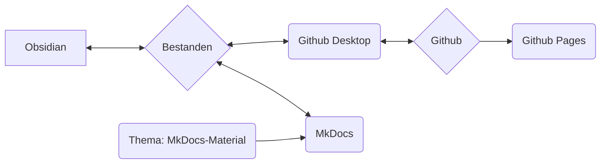

We gebruiken MkDocs als systeem om onze processen, werkwijzen en procedures te documenteren en online beschikbaar te stellen.

## Basisidee van het systeem

>[!info]
>- Content en layout zijn strikt gescheiden
>- Alles is gebaseerd op simpele tekstbestanden in Markdown-formaat (*.md)
>- geen propriëtaire gegevens
>- Alles kan in principe (op enkele uitzonderingen na) met een teksteditor worden gedaan (ikzelf gebruik Obsidian en zal de werkwijzen daarmee uitleggen)
>- de gegevens kunnen lokaal worden bewerkt
>- middels MkDocs worden de Markdown-gegevens omgezet in een statische website
>- de Markdown-gegevens en de websitegegevens worden opgeslagen in de Git-repository van Nica e.v.
>- Via Github Pages is het geheel dan als website oproepbaar



>[!info]+ 
>Elke afzonderlijke softwarecomponent (Github, Github Pages, Github Desktop, MkDocs, Obsidian, MkDocs-Materials) is **open source en gratis te gebruiken**.
>
>Mochten individuele componenten wegvallen (service wordt stopgezet, software niet langer beschikbaar of andere redenen) zijn de eigenlijke gegevens (dus de Markdown-bestanden) nog steeds aanwezig.
>
>Het gebruik van Github staat ons enerzijds toe de gegevens te versioneren - dit betekent dat elke wijziging gedocumenteerd en navolgbaar is, en dat elke wijziging ook weer ongedaan kan worden gemaakt.
>Het staat anderen bovendien toe mee te werken aan de documentatie zonder dat wij gebruikersgegevens hoeven te beheren of ons zorgen hoeven te maken over de beveiliging van het systeem (dit is echter technisch wat complexer).
>
>Zo zijn we op de lange termijn aanzienlijk veerkrachtiger. Aangezien een dergelijke documentatie op lange termijn groeit, vind ik dit een enorm voordeel.
 
### Betrekken van andere personen
Het hierna beschreven systeem kan voor personen die verder weinig met code en programmeren te maken hebben op het eerste gezicht overweldigend of afschrikwekkend zijn.

Om dit te adresseren hebben we de volgende alternatieve mogelijkheden voor het creëren van content:
- Content maken in Wordpress als pagina
- Content aanleveren als tekstbestand, Word-bestand (of andere gangbare formaten)

Deze content dan per e-mail sturen naar de momenteel verantwoordelijke persoon (zie [Impressum](Impressum.md)). Deze zal de content dan verwerken.
## Bestandsstructuur

>[!info]+ Verzeichnisstructuur en bestanden
>**/docs**
>**/site**
>
>license
>mkdocs.yml
>readme.md

## Obsidian

Vooral door het gebruik van [Obsidian](Obsidian%20Setup.md) als teksteditor heeft deze opzet enorme voordelen:

- Obsidian is bijzonder geschikt voor een groot aantal losse bestanden die via tags of links met elkaar verbonden zijn, of die via mappenstructuren (submappen) gecategoriseerd zijn
- Obsidian kan deze gegevens grafisch weergeven, wat vooral het beheren van grote hoeveelheden gegevens verbetert

Een ander groot voordeel van Obsidian is het enorme plugin-ecosysteem. Dit stelt ons in staat om heel eenvoudig functionaliteit toe te voegen, zoals:
- Database-achtige filtering / zoekfunctie
- Tagbeheer (bijvoorbeeld wijzigingen in veel bestanden tegelijk, zoals het hernoemen van een veelgebruikte tag)
- Eenvoudig beheer van metadata (zogenaamd [Frontmatter](Frontmatter%20Properties.md) of YAML)

## Github

Is een versiebeheerprogramma voor gegevens dat online gebruikt kan worden.
### Github Desktop

Git is eigenlijk een command-line tool - dat schrikt velen af.
Github Desktop lost dit probleem op door de benodigde functionaliteit in een applicatie met een eenvoudige grafische interface te verpakken.

### Github Pages

Github Pages is een service van Github.
Als er websitegegevens in een bepaalde vorm op een repository zijn opgeslagen, kunnen deze als website worden weergegeven.

- de service is gratis
- MkDocs regelt alle benodigde stappen vanzelf

Het voordeel voor ons:
- geen eigen hosting
- geen kosten
- voor het uploaden / bijwerken van de content is slechts één command-line commando nodig: ```

```
mkdocs gh-deploy
```

Over het algemeen hoeven we nergens aan te denken en kunnen we bijna uitsluitend lokaal werken.
## MkDocs

[MkDocs](https://mkdocs.org) is software voor het maken van online beschikbare documentaties.
De content wordt gemaakt in eenvoudige tekstbestanden - dit kan in elke willekeurige teksteditor die het [Markdown-formaat](Markdown.md) beheerst. 

>[!info]- Lijst van mogelijke teksteditors
>- Notepad++
>- Atom
>- Visual Studio Code
>- Sublime
>- Windows Teksteditor
>- Obsidian

Middels een command-line commando wordt MkDocs vervolgens uitgevoerd en kan het:

- offline een voltooide versie van de website weergeven
	- deze wordt automatisch bijgewerkt als er wijzigingen aan de tekstbestanden zijn
	- dit maakt het zeer snel en eenvoudig schrijven en vormgeven van de content mogelijk
- de gegevens voor de statische website creëren (lokaal)
	- deze kunnen dan bijvoorbeeld direct naar een server worden geladen
- middels koppeling aan Github Pages de statische website direct uploaden
	- dit is gratis zolang de documentatie publiekelijk beschikbaar is en onder een open source licentie valt (beide voldoen wij)

Voor volledige documentatie bezoek [mkdocs.org](https://www.mkdocs.org).

### Thema: MkDocs Material

https://squidfunk.github.io/mkdocs-material/
