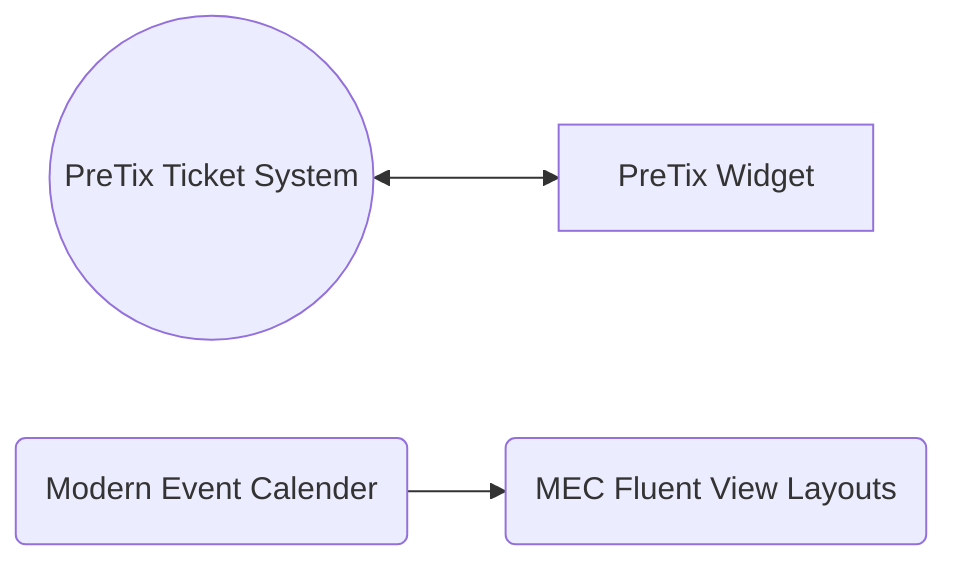

# Wordpress

## Plugins
## Evenementen- en Boekingssysteem

## Tutorials

-   :material-clock-fast:{ .lg .middle } __Boekhouding__

    ---

    Hoe een pagina bij ons in Wordpress wordt aangemaakt.
     auteur: piiit

    [:octicons-arrow-right-24: Bekijken](wordpress-pages.md){  .md-button }

[Hoe een pagina in Wordpress wordt aangemaakt](wordpress-pages.md)
