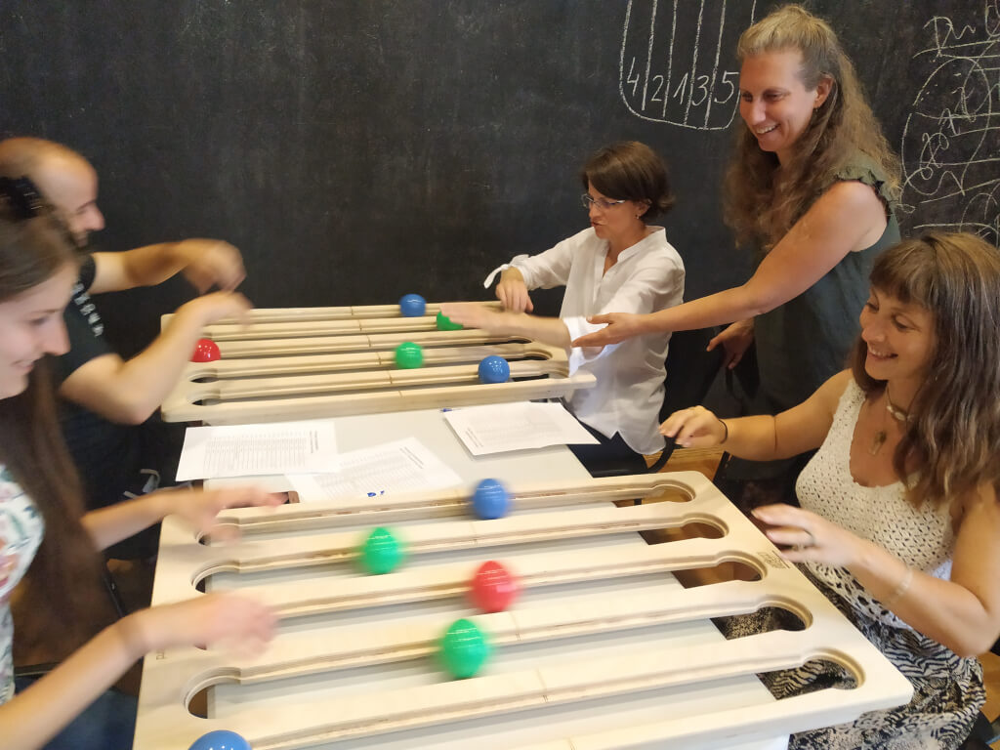
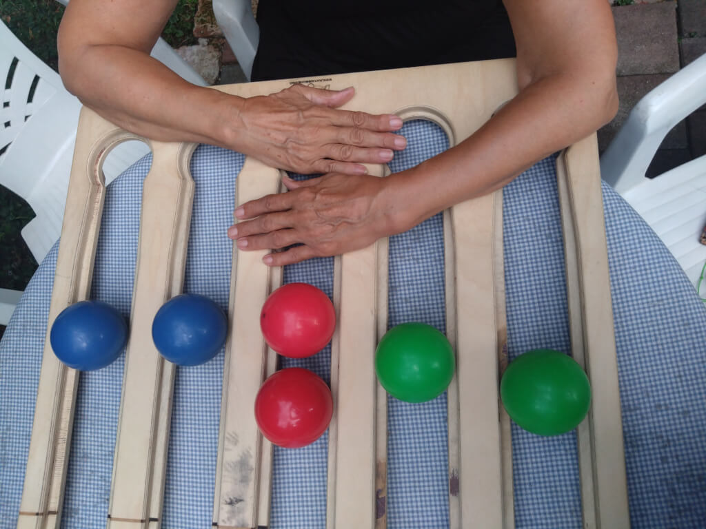
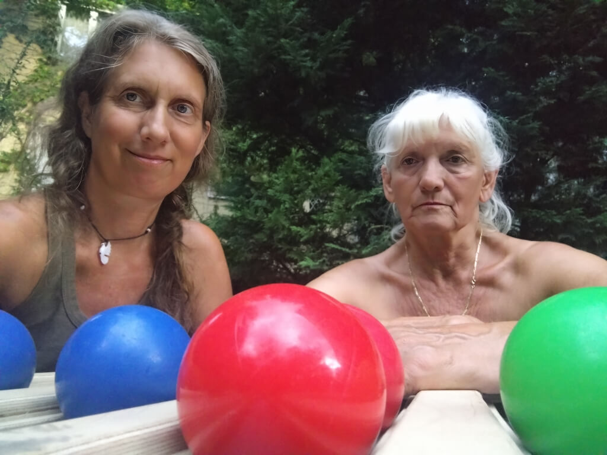

# **Wsparcie rehabilitacji złamania nadgarstka za pomocą funkcjonalnych narzędzi żonglerskich**

[Inspirál Circus Center](Inspirál%20Circus%20Center.md) - Budapeszt, Węgry
Autor: Gallyas Veronika

## **Wprowadzenie**
 Niniejsze studium przypadku analizuje wykorzystanie **funkcjonalnego żonglowania** do wsparcia procesu rehabilitacji **70-letniej kobiety** powracającej do zdrowia po **złamania nadgarstka**. Praca trwała przez **trzy miesiące** w Budapeszcie na Węgrzech, będąc współpracą między pacjentką a edukatorem żonglerki wyszkolonym w zakresie adaptacyjnych sztuk cyrkowych. Celem było wykorzystanie zadań inspirowanych żonglerką w celu zwiększenia mobilności, zmniejszenia frustracji i stworzenia przyjemnych, opartych na powtarzalnym ruchu ćwiczeń, które uzupełniały cele fizjoterapii.

---

## **Tło i podejście**
 Złamania nadgarstka, zwłaszcza kości **nadgarstka**, są częste u osób starszych z powodu upadków. Powrót do zdrowia jest często powolny – **odzyskanie precyzyjnej kontroli motorycznej** może zająć **sześć miesięcy lub dłużej**. Jako edukator żonglerki z prawie **30-letnim doświadczeniem** i formalnym wykształceniem cyrkowym, byłem zaintrygowany wyzwaniem adaptacji narzędzi cyrkowych do wspierania tego rodzaju rehabilitacji.

Zacząłem od przeglądu diagnozy fizjoterapeuty i zalecanych ćwiczeń. Moim celem było „ubranie” tych zadań w **zabawne i angażujące formaty** – co nazywam „ubieraniem ich w żonglerskie szaty”. Jednocześnie chciałem **wprowadzić oryginalne sekwencje ruchowe** zaczerpnięte z mojego wieloletniego doświadczenia w nauczaniu funkcjonalnego żonglowania.

---

## **Metodologia i narzędzia**
 Praca rozpoczęła się, gdy klientka **nadal nosiła gips**, używając miękkich przedmiotów do zachęcania do **delikatnych ruchów palców**. Później przeszliśmy do bardziej złożonych narzędzi i dynamicznych aktywności. Na każde indywidualne spotkanie przynosiłem **szeroką gamę rekwizytów**, wybierając te, które mogły **stymulować ruch nadgarstka** bez jego przeciążania.

Kluczowe narzędzia obejmowały:

*   **Miękkie piłki**: obracanie dwóch piłek w dłoni stymulowało **mobilność palców**, zarówno podczas, jak i po fazie noszenia gipsu.
*   **Poi**: używane do **wielokierunkowego ruchu nadgarstka** i mikro-korekt w późniejszych etapach powrotu do zdrowia.
*   **Juggle Board**: umożliwiał **sekwencje otwarte** i adaptacje, takie jak **toczenie z dłońmi skierowanymi do góry**, aby stymulować rotację nadgarstka.
*   **Pływający kijek**: idealny we wczesnej fazie ze względu na ograniczoną mobilność; oferował **poczucie sukcesu** i **delikatną stymulację**.

Wszystkie narzędzia pozostawały u klientki między sesjami, aby **zachęcić do codziennej praktyki**.

---

## **Kreatywne strategie**
 Zainspirowany **metodologiami cyrku społecznego**, wprowadziłem **element mini-występu**. Wspólnie stworzyliśmy etiudę zatytułowaną **„Flea Circus”** (Cyrk pchli), do muzyki, w której dwa palce odgrywały słonie balansujące na piłce. Ta zabawna forma **zwiększyła powtarzalność**, pobudziła wyobraźnię i sprawiła, że praktyka była bardziej **emocjonalnie satysfakcjonująca**.

Sesje odbywały się w domu klientki, chociaż docenialiśmy wartość **grupowego środowiska Inspirál Circus Center**, gdzie obecność społeczności i różnorodne bodźce mogą być bardzo motywujące.

---

## **Kluczowe obserwacje**
 Kilka czynników przyczyniło się do sukcesu tego procesu:

*   **Terapeutyczna moc rozmowy**: możliwość dzielenia się frustracjami i triumfami okazywała się emocjonalnym wsparciem.
*   **Zaangażowanie obustronne**: pracowaliśmy **obydwiema rękami**, mimo że tylko jedna była kontuzjowana. Stworzyło to okazje do porównania i **aktywacji krzyżowej**.
*   **Dokumentacja wideo** sesji zwiększała motywację poprzez widoczne śledzenie postępów.
*   Zadania żonglerskie pomogły **zidentyfikować i wyeliminować kompensacyjne wzorce ruchowe**, takie jak inicjowanie ruchów nadgarstka z ramienia zamiast z przedramienia.
*   Narzędzie **poi** początkowo powodowało frustrację – jego trudność i sporadyczny kontakt z ciałem stanowiły wyzwanie dla klientki. Dostosowaliśmy się, przechodząc na poi z **pętlami na palce** dla lepszej kontroli.

---

## **Wyzwania i refleksje**
 Jednym z głównych wyzwań była moja **ograniczona wiedza anatomiczna** – chociaż potrafiłem projektować skuteczne sekwencje ruchowe, brakowało mi pełnego zrozumienia **złożonej architektury mięśniowo-szkieletowej** nadgarstka. To czasami sprawiało, że czułem się niepewnie.

Dla klientki największym wyzwaniem było **niewykonywanie zadań dobrze**. Jednak poczucie radości i celu, które odczuwała dzięki **manipulacji piłką** – gdzie sukces był namacalny – stanowiło potężną **równowagę emocjonalną**.

Ważnym elementem naszego procesu było badanie **osobistego znaczenia urazu**. Dyskutowaliśmy, jak złamanie może symbolicznie odzwierciedlać **granice, tempo lub zmianę kierunku życiowego**. To nadało naszej pracy **znaczącą głębię** wykraczającą poza fizyczne odzyskanie sprawności.

---

## **Wnioski**
 Ta współpraca pokazuje, jak **funkcjonalne żonglowanie** może skutecznie wspierać rehabilitację w sposób **elastyczny, adaptacyjny i emocjonalnie rezonujący**. Nie zastępuje opieki klinicznej, ale jest jej **niezbędnym uzupełnieniem** – wprowadzając radość, opowieść i zabawę do procesu leczenia. Klientka kontynuuje teraz swoje postępy **samodzielnie**, używając własnych poi i miękkich piłek, odkrywszy nową motywację i kreatywne narzędzia do samodzielnej opieki.
