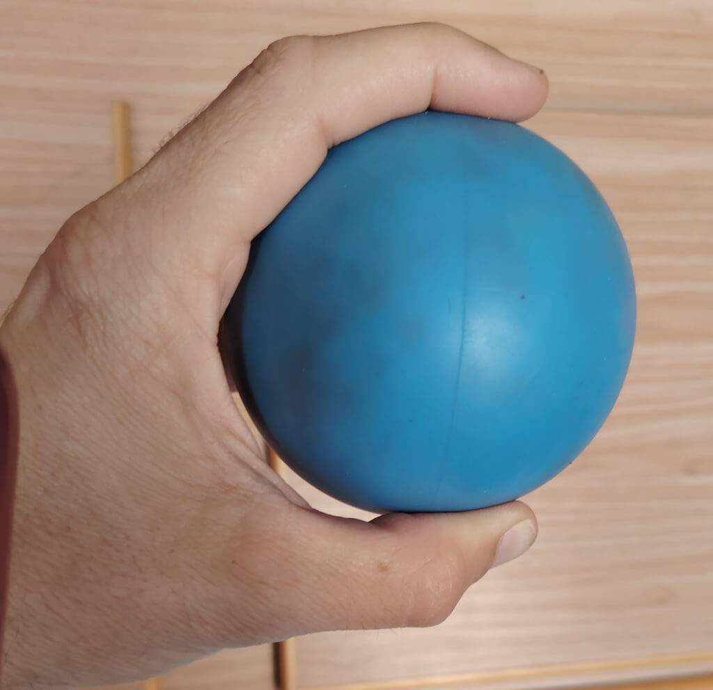
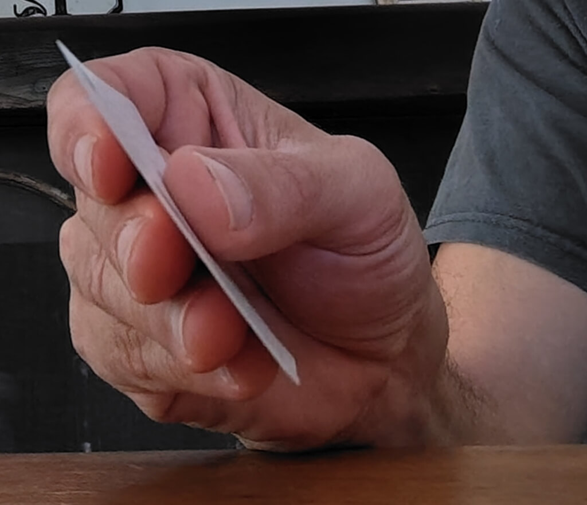
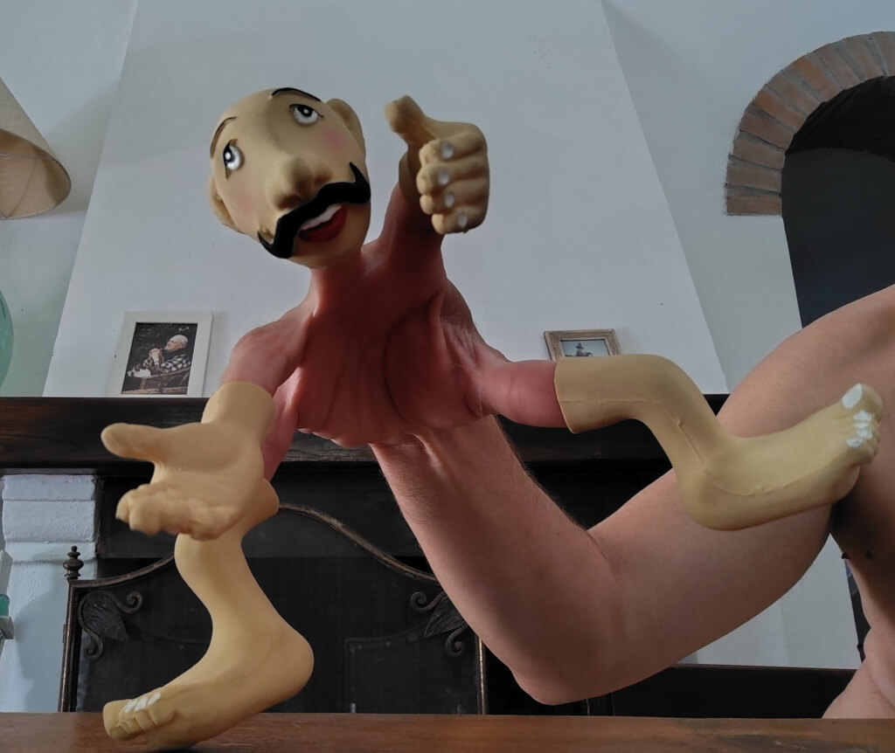

# **Odbudowanie Chwytu — Funkcjonalne Żonglowanie i Rehabilitacja Rąk we Florencji, Włochy**

[SELF APS](SELF%20APS.md)
**Centrum Dziennego Pobytu dla Osób Niepełnosprawnych – Trezzo sull'Adda, Włochy**
**Autor:** Lapo Botteri
**Realizacja:** Circo Tascabile w centrum C.T.E. w Cinque Vie, Florencja

---

## **Grupa Docelowa**
 Projekt skupiał się na **dorosłych z ciężkimi niepełnosprawnościami ruchowymi**, w szczególności na osobach z **ograniczoną zdolnością chwytania rękami**. Uczestnicy – sześciu podopiecznych centrum C.T.E. w Cinque Vie we Florencji – wszyscy byli **użytkownikami wózków inwalidzkich**, zmagającymi się z **złożonymi wyzwaniami fizycznymi**, ale zachowującymi **średnio-wysoki poziom funkcjonowania poznawczego**. Inicjatywa została opracowana w ścisłej współpracy z fizjoterapeutami ośrodka, a jej celem było **wsparcie działań rehabilitacyjnych poprzez zabawy oparte na ciekawości**, promujące **adaptację neuromotoryczną**.

---

## **Sytuacja Początkowa**
 Nazywam się **Lapo Botteri**, posiadam dyplom z wychowania fizycznego oraz dodatkowe uprawnienia nauczyciela sportu. Po raz pierwszy zetknąłem się z **Funkcjonalnym Żonglowaniem** w 2016 roku podczas warsztatów z **Craigiem Quatem**. To doświadczenie **zmieniło moją ścieżkę zawodową**. W ciągu kilku tygodni nawiązałem kontakt z lokalnym ośrodkiem terapeutycznym i zacząłem integrować tę metodologię w mojej praktyce. Od tego czasu pracuję w tej samej organizacji, obecnie **13 godzin tygodniowo**, rozwijając **długoterminowe, zindywidualizowane programy**.

Centrum C.T.E. obsługuje osoby z **ograniczeniami mobilności**, z których wiele boryka się z dodatkowymi trudnościami, takimi jak **spastyczność**, **ograniczony zakres ruchu** czy **zaburzenia koordynacji**. Podczas gdy fizjoterapeuci skupiają się na rehabilitacji biomechanicznej, moja rola – poprzez Funkcjonalne Żonglowanie – polegała na angażowaniu **programowania neuromotorycznego** na styku **zabawy, precyzji i inteligencji ruchu**.

---

## **Cele**
 Każdy uczestnik miał **spersonalizowany zestaw celów**, określony we współpracy z personelem ośrodka. Głównym celem było **wsparcie rehabilitacji kończyn górnych** poprzez **eksplorację sensoryczno-motoryczną**. Cele drugorzędne obejmowały:

*   **Poprawę siły chwytu i zręczności manualnej**
*   **Wspieranie koordynacji oburęcznej**
*   **Zwiększenie koncentracji i zaangażowania poznawczo-emocjonalnego**

---

## **Miejsce i Narzędzia**
 **Przestrzeń do pracy**
 Sesje odbywały się w **niewielkiej sali gimnastycznej** ośrodka, cichej i łatwej do adaptacji przestrzeni, dobrze nadającej się do **działań skoncentrowanych na zmysłach**. Każdy uczestnik brał udział w **indywidualnej, 15-minutowej sesji** raz w tygodniu, od października do maja.

**Narzędzia do pracy**
 Materiały dobierano zgodnie z umiejętnościami i celami każdego uczestnika. Obejmowały one:

*   **Juggle Board** (plansza do żonglowania)
*   **Pierścienie do żonglowania**
*   **Piłeczki antystresowe**
*   **Pacynki na palce**
*   **Bambusowe deszczowe patyki**
*   **Pisząca zabawki zwierzątka**
*   **Flashcups** (kubeczki do żonglowania)
*   **Przedmioty codziennego użytku** (sztućce, szczotki, butelki)
*   **Materiały sensoryczne** dostosowane do specyficznych rodzajów chwytu

---

## **Proces**
 Program realizowano przez **osiem miesięcy**, sesje odbywały się co tydzień. Każda sesja miała uporządkowany przebieg, a treści **dostosowywano do indywidualnych potrzeb fizycznych i emocjonalnych** każdego uczestnika.

**Faza Przygotowawcza**
 Rozpoczynaliśmy od **rozmowy i aktywacji dotykowej**. Pytania typu „Jak się dzisiaj czujesz?” łączono z **delikatnymi masażami dłoni i ramion**, aby zwiększyć **świadomość ciała** i zmniejszyć napięcie.

**Faza Analityczna**
 Badaliśmy **zdolności motoryczne małe** i **ukierunkowane wzorce ruchowe**, takie jak izolacja palców, rotacja nadgarstka i integracja obustronna. Celem było **doskonalenie precyzji i samoświadomości** w ruchu.

**Faza Globalna**
 Wypracowane elementy łączono w **zintegrowane zadania**, takie jak **kontrolowanie ruchu piłki na Juggle Board** czy **rytmiczna wymiana pierścieni do żonglowania**. Zadania te kładły nacisk na **funkcjonalny przepływ, koordynację** i **pewność ruchu**.

---

## **Proces Organizacyjny**
 Dwa interdyscyplinarne zespoły dostarczały kluczowych informacji przez cały czas trwania programu:

**Edukatorzy**
 Dostarczali informacji o **codziennym zachowaniu, profilu emocjonalnym** i **preferencjach edukacyjnych** każdego podopiecznego, pomagając **dostosować tempo i ton sesji**.

**Fizjoterapeuci**
 Zapewniali **bezpieczeństwo techniczne**, doradzając w kwestii postawy, ograniczeń mięśniowych i bezpiecznych zakresów ruchu. Ich wskazówki pozwalały na **kreatywną eksplorację w bezpiecznych ramach biomechanicznych**.

Chociaż nie napotkaliśmy większych przeszkód, zaobserwowaliśmy **nieoczekiwanie wysoki poziom zaangażowania i poprawy**, przekraczający początkowe oczekiwania.

---

## **Wyniki**
 Chociaż **nie stosowano formalnych metryk**, informacje zwrotne zbierano od całego zespołu:

**Fizjoterapeuci**
 Zgłosili **brak mierzalnych zmian biomechanicznych**, ale uznali, że praca ta **znacząco uzupełnia ich sesje**.

**Edukatorzy**
 Zaobserwowali **znaczące poprawy w koncentracji, regulacji zachowania** i **koordynacji rąk**. Uczestnicy zaczęli **naturalniej używać obu rąk** i wykazywali postępy w posługiwaniu się narzędziami, takimi jak **długopisy, kubki i sztućce**.

**Terapeuta muzyczny**
 Zauważył **lepszą kontrolę i intencjonalność** podczas gry na instrumentach muzycznych, szczególnie podczas **uderzania pałeczkami w ksylofon**.

**Logopeda**
 Odnotował **lepszą koncentrację** i większą łatwość w obsłudze **manualnych urządzeń komunikacyjnych**.

---

## **Wnioski i Refleksje**
 Pojawiły się dwa kluczowe pytania:

**Po pierwsze**: Dlaczego **fizjoterapeuci zaobserwowali mniej zmian** niż pozostali członkowie zespołu? Ich kliniczne spojrzenie jest kluczowe, jednak może ono **przeoczyć subtelne postępy funkcjonalne** osiągnięte dzięki ucieleśnionej zabawie.

**Po drugie**: Jak możemy lepiej dokumentować tego typu zmiany? W przyszłych projektach mamy nadzieję wdrożyć **oceny wyjściowe i porównania po sesjach**, wykorzystując narzędzia takie jak **analiza wideo lub czujniki ruchu**, aby jaśniej śledzić wyniki.

**Funkcjonalne Żonglowanie może nie przynosić natychmiastowych rezultatów.** Ale **tworzy przestrzeń dla małych cudów** – takich jak trzymanie łyżki, chwytanie ołówka czy uderzanie pałeczką z **odnowionym celem i radością**.
