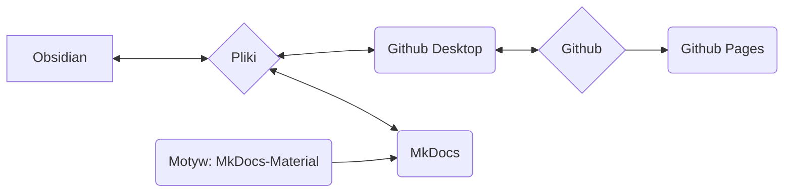

Używamy MkDocs jako systemu do dokumentowania naszych procesów, metod i procedur oraz udostępniania ich online.

## Podstawowa idea systemu

>[!info]
>- Treść i układ są ściśle oddzielone
>- Wszystko opiera się na prostych plikach tekstowych w formacie Markdown ( *.md )
>- brak zastrzeżonych danych
>- Wszystko można w zasadzie (z niewielkimi wyjątkami) zrobić za pomocą edytora tekstu ( ja osobiście używam Obsidian i wyjaśnię sposób pracy z nim )
>- dane można edytować lokalnie
>- za pomocą MkDocs dane Markdown są przekształcane w statyczną stronę internetową
>- dane Markdown oraz dane strony internetowej są przechowywane w repozytorium Git Nica e.v.
>- za pośrednictwem Github Pages całość jest następnie dostępna jako strona internetowa



>[!info]+ 
>Każdy pojedynczy komponent oprogramowania (Github, Github Pages, Github Desktop, MkDocs, Obsidian, MkDocs-Materials) jest **Open Source i można go używać bezpłatnie**.
>
>Jeśli poszczególne komponenty przestaną działać (usługa zostanie wycofana, oprogramowanie przestanie być dostępne lub z innych powodów), same dane (czyli pliki Markdown) nadal pozostaną.
>
>Korzystanie z Github pozwala nam z jednej strony na wersjonowanie danych – co oznacza, że każda zmiana jest dokumentowana i możliwa do prześledzenia, a także każda zmiana może zostać cofnięta.
>Pozwala to również innym na współpracę przy dokumentacji bez konieczności zarządzania danymi użytkowników czy martwienia się o bezpieczeństwo systemu (jest to jednak technicznie nieco bardziej skomplikowane).
>
>Dzięki temu jesteśmy znacznie bardziej odporni w dłuższej perspektywie. Ponieważ taka dokumentacja rośnie przez długi czas, uważam to za ogromną zaletę.
 
### Zaangażowanie innych osób
Opisany poniżej system może na pierwszy rzut oka przytłaczać lub odstraszać osoby, które na co dzień nie mają wiele wspólnego z kodowaniem i programowaniem.

Aby temu zaradzić, oferujemy następujące alternatywne sposoby tworzenia treści:
- Tworzenie treści w Wordpressie jako strona
- Treści jako plik tekstowy, plik Word (lub inne typowe formaty)

Te treści należy następnie przesłać e-mailem do osoby aktualnie odpowiedzialnej (patrz [Impressum](Impressum.md)). Zostaną one następnie wdrożone.
## System plików

>[!info]+ Struktura katalogów i pliki
>**/docs**
>**/site**
>
>license
>mkdocs.yml
>readme.md

## Obsidian

Szczególnie dzięki wykorzystaniu [Obsidian](Obsidian%20Setup.md) jako edytora tekstu, to rozwiązanie ma ogromne zalety:

- Obsidian jest szczególnie odpowiedni do zarządzania dużą liczbą pojedynczych plików, które są powiązane za pomocą tagów lub linków, lub skategoryzowane za pomocą struktur katalogów (podkatalogów).
- Obsidian może przedstawiać te dane graficznie, co szczególnie ułatwia zarządzanie dużymi ilościami danych.

Kolejną dużą zaletą Obsidian jest ogromny ekosystem wtyczek. Pozwala nam to bardzo łatwo dodawać funkcjonalności, takie jak:
- Filtrowanie / wyszukiwanie przypominające bazę danych
- Zarządzanie tagami (np. zmiany w wielu plikach jednocześnie, takie jak zmiana nazwy często używanego tagu)
- łatwe zarządzanie metadanymi (tzw. [Frontmatter](Frontmatter%20Properties.md) lub YAML)

## Github

Jest to program do kontroli wersji danych, który można wykorzystać online.
### Github Desktop

Git jest w rzeczywistości narzędziem wiersza poleceń – co wielu odstrasza.
Github Desktop rozwiązuje ten problem, integrując niezbędne funkcje w aplikacji z prostym interfejsem graficznym.

### Github Pages

Github Pages to usługa firmy Github.
Jeśli dane strony internetowej są przechowywane w repozytorium w określonej formie, mogą być one wyświetlane jako strona internetowa.

- usługa jest bezpłatna
- MkDocs wykonuje wszystkie niezbędne kroki samodzielnie

Nasza korzyść:
- brak własnego hostingu
- brak opłat
- do przesłania / aktualizacji treści wystarczy jedno polecenie w wierszu poleceń: ```

```
mkdocs gh-deploy
```

Ogólnie rzecz biorąc, nie musimy się o nic martwić i możemy pracować prawie wyłącznie lokalnie.
## MkDocs

[MkDocs](https://mkdocs.org) to oprogramowanie do tworzenia dokumentacji dostępnej online.
Treść jest tworzona w prostych plikach tekstowych – można to zrobić w dowolnym edytorze tekstu obsługującym [format Markdown](Markdown.md). 

>[!info]- Lista możliwych edytorów tekstu
>- Notepad++
>- Atom
>- Visual Studio Code
>- Sublime
>- Edytor tekstu Windows
>- Obsidian

Za pomocą polecenia w wierszu poleceń MkDocs jest uruchamiany i może:

- wyświetlać gotową wersję strony internetowej offline
	- jest ona automatycznie aktualizowana w przypadku zmian w plikach tekstowych
	- pozwala to na bardzo szybkie i łatwe tworzenie i projektowanie treści
- tworzyć dane dla statycznej strony internetowej (lokalnie)
	- można je następnie na przykład załadować na serwer
- za pośrednictwem połączenia z Github Pages bezpośrednio przesyłać statyczną stronę internetową
	- jest to bezpłatne, dopóki dokumentacja jest publicznie dostępna i objęta licencją Open Source (oba warunki spełniamy)

Pełna dokumentacja dostępna jest na stronie [mkdocs.org](https://www.mkdocs.org).

### Motyw: MkDocs Material

https://squidfunk.github.io/mkdocs-material/
