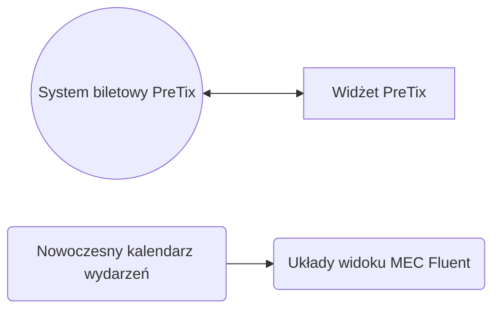

# Wordpress

## Wtyczki
## System rezerwacji i wydarzeń

## Samouczki

-   :material-clock-fast:{ .lg .middle } __Księgowość__

    ---

    Jak utworzyć stronę w naszym systemie Wordpress.
     autor: piiit

    [:octicons-arrow-right-24: Zobacz](wordpress-pages.md){ .md-button }

[Jak utworzyć stronę w Wordpress](wordpress-pages.md)
