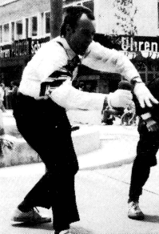
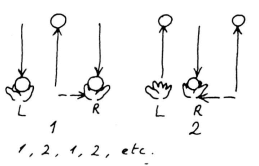
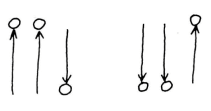
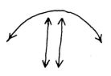
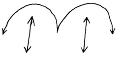
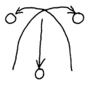
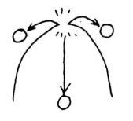

### A Página das Colunas
Fonte: [Cascata 001](Kaskade%20001.md#Die%20Säulen-Seite)

{ align=left }
Dr. P. Luftiko (ver imagem)

Ok. Agora consegues fazer malabarismo com 2 bolas numa mão, tanto com a esquerda como com a direita. Poderias tentar com 4 agora. Mas espera um pouco! Existem centenas de maneiras de usar esta habilidade com 3 bolas na forma de "colunas" que espantariam os teus amigos e fariam o teu público rir às gargalhadas.

A forma básica das "colunas": 2 bolas lançadas numa mão, paralelas uma à outra (ou seja, não em círculo), enquanto a mão esquerda lança a 3ª no mesmo ritmo em que a mão direita lança a bola exterior.

Com este ritmo básico, podes variar este tema infinitamente através de pequenas alterações. Podes mudar as trajetórias e a mão com que fazes malabarismo com 2 bolas.

Nas descrições seguintes, os termos "bola única" e "bolas duplas" referem-se às trajetórias e não ao número de bolas em cada mão. Ou seja, na forma básica, a bola única salta no meio e as bolas duplas nas extremidades.

#### Ténis

A bola única é lançada inicialmente para a extrema direita,

depois voa num arco alto para a esquerda e volta, sempre de um lado para o outro. As trajetórias são assim:

As bolas duplas formam a "rede" (Poderias fazer sons de raquetes de ténis ou imitar o John McEnroe!)

#### Barreiras

O início é semelhante ao ténis, mas desta vez a bola única faz uma aterragem intermédia no meio.

Cada uma das duas bolas duplas representa uma barreira. (Se disseres "boing" a cada aterragem da bola única, o espectador terá a impressão de que a bola está a quicar.)

#### Cruzamento

Claro que também podes fazer truques com as bolas duplas. Aqui elas cruzam-se.

Embora tenhas tomado a precaução de lançar uma bola dupla um pouco mais alto que a outra, infelizmente vais descobrir muitas vezes que elas colidem no meio e fogem de forma incontrolável. Não te preocupes! Com prática, conseguirás que esta colisão aconteça propositadamente, sem que as 2 bolas escapem em direções diferentes fora do teu alcance.

Quanto mais alta for a colisão, mais entusiasmado o público ficará.

#### Braços Cruzados

Tenta apanhar a bola dupla direita com a mão esquerda e, simultaneamente, a bola dupla esquerda com a tua mão direita. A receção normalmente não é muito difícil, mas depois o lançamento vertical...!! Pratica apenas com as bolas duplas até isto funcionar, antes de voltares a incluir a bola única.

#### Lançamentos por cima do ombro
(para avançados!)

Em vez de simplesmente lançares as bolas duplas verticalmente para cima, lança-as por cima dos ombros, com a mão direita por cima do ombro direito e a esquerda por cima da esquerda. Se não te aqueceres devidamente, vais deslocar os ombros. Se as bolas duplas se cruzarem por cima da tua cabeça contra a tua vontade, então aparentemente tens o mesmo problema que eu!
