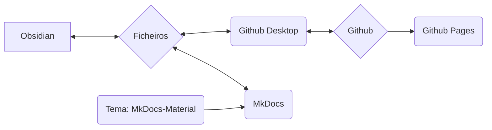

Utilizamos o MkDocs como sistema para documentar e disponibilizar online os nossos processos, métodos e fluxos de trabalho.

## Ideia Base do Sistema

>[!info]
>- Conteúdo e layout são estritamente separados
>- Tudo se baseia em simples ficheiros de texto em formato Markdown (*.md)
>- Sem dados proprietários
>- Em princípio, tudo pode ser feito com um editor de texto (com poucas exceções) (eu pessoalmente uso o Obsidian e explicarei os métodos de trabalho com ele)
>- Os dados podem ser editados localmente
>- Através do MkDocs, os dados Markdown são convertidos numa página web estática
>- Os dados Markdown, bem como os dados da página web, são armazenados no repositório Git da Nica e.V.
>- Através do Github Pages, tudo pode ser acedido como uma página web



>[!info]+ 
>Cada componente de software individual (Github, Github Pages, Github Desktop, MkDocs, Obsidian, MkDocs-Materials) é **Open Source e de uso gratuito**.
>
>Caso componentes individuais deixem de existir (serviço descontinuado, software já não disponível ou outros motivos), os dados originais (ou seja, os ficheiros Markdown) ainda estarão disponíveis.
>
>A utilização do Github permite-nos, por um lado, a versionamento dos dados – isto significa que cada alteração é documentada e rastreável, e que qualquer alteração pode ser desfeita.
>Permite também que outros colaborem na documentação sem que tenhamos de gerir dados de utilizadores ou nos preocupar com a segurança do sistema (embora isto seja tecnicamente um pouco mais complexo).
>
>Assim, somos significativamente mais resilientes a longo prazo. Como uma documentação destas cresce ao longo do tempo, considero esta uma vantagem enorme.
 
### Envolvimento de Outras Pessoas
O sistema descrito a seguir pode parecer avassalador ou intimidante à primeira vista para pessoas que normalmente têm pouco contacto com código e programação.

Para abordar isto, temos as seguintes opções alternativas para a criação de conteúdo:
- Criar conteúdo no Wordpress como uma página
- Criar conteúdo como ficheiro de texto, ficheiro Word (ou outros formatos típicos)

Enviar estes conteúdos por e-mail para a pessoa atualmente responsável (ver [Impressum](Impressum.md)). Esta pessoa irá depois integrá-los.
## Sistema de Ficheiros

>[!info]+ Estrutura de diretórios e ficheiros
>**/docs**
>**/site**
>
>license
>mkdocs.yml
>readme.md

## Obsidian

Especialmente com a utilização do [Obsidian](Obsidian%20Setup.md) como editor de texto, esta configuração tem enormes vantagens:

- O Obsidian é particularmente adequado para um grande número de ficheiros individuais que estão ligados através de tags ou links, ou que são categorizados através de estruturas de diretórios (subdiretórios).
- O Obsidian pode apresentar estes dados graficamente, o que melhora especialmente a gestão de grandes volumes de dados.

Outra grande vantagem do Obsidian é o seu vasto ecossistema de plugins. Isto permite-nos adicionar funcionalidades muito facilmente, como por exemplo:
- Filtragem/pesquisa semelhante a bases de dados
- Gestão de tags (por exemplo, alterações em muitos ficheiros ao mesmo tempo, como renomear uma tag utilizada frequentemente)
- Gestão simples de metadados (o chamado [Frontmatter](Frontmatter%20Properties.md) ou YAML)

## Github

É um programa de controlo de versões para dados que pode ser utilizado online.
### Github Desktop

O Git é, na verdade, uma ferramenta de linha de comandos – isto afasta muitas pessoas.
O Github Desktop resolve este problema ao agrupar a funcionalidade necessária numa aplicação com uma interface gráfica simples.

### Github Pages

O Github Pages é um serviço do Github.
Se os dados de uma página web estiverem armazenados num repositório de uma forma específica, estes podem ser apresentados como uma página web.

- O serviço é gratuito
- O MkDocs trata de todos os passos necessários automaticamente

A vantagem para nós:
- Sem alojamento próprio
- Sem taxas
- Para carregar/atualizar o conteúdo, basta um comando de linha: ```

```
mkdocs gh-deploy
```

No geral, não precisamos de nos preocupar com nada e podemos trabalhar quase exclusivamente localmente.
## MkDocs

O [MkDocs](https://mkdocs.org) é um software para criar documentações disponíveis online.
O conteúdo é criado em simples ficheiros de texto – isto pode ser feito em qualquer editor de texto que suporte o [Formato Markdown](Markdown.md).

>[!info]- Lista de editores de texto possíveis
>- Notepad++
>- Atom
>- Visual Studio Code
>- Sublime
>- Editor de Texto do Windows
>- Obsidian

Através de um comando de linha, o MkDocs é executado e pode:

- Apresentar uma versão completa da página web offline
	- Esta será atualizada automaticamente sempre que houver alterações nos ficheiros de texto
	- Isto permite a criação e formatação de conteúdo de forma muito rápida e simples
- Criar os dados para a página web estática (localmente)
	- Estes podem, por exemplo, ser carregados diretamente para um servidor
- Através da ligação ao Github Pages, carregar diretamente a página web estática
	- Isto é gratuito, desde que a documentação esteja publicamente disponível e sob uma licença Open Source (ambos cumprimos)

Para a documentação completa, visite [mkdocs.org](https://www.mkdocs.org).

### Tema: MkDocs Material

https://squidfunk.github.io/mkdocs-material/
