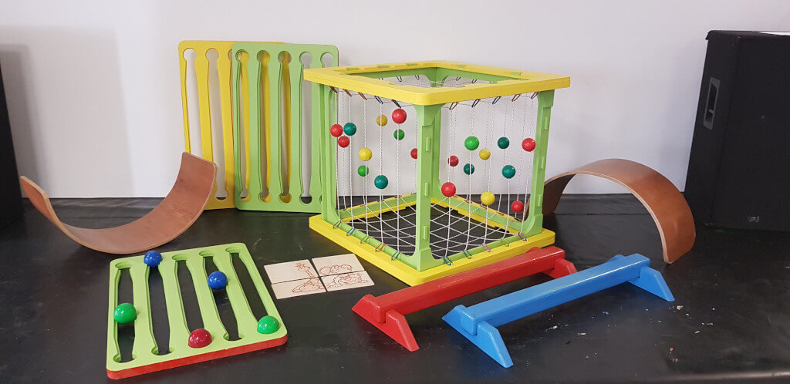
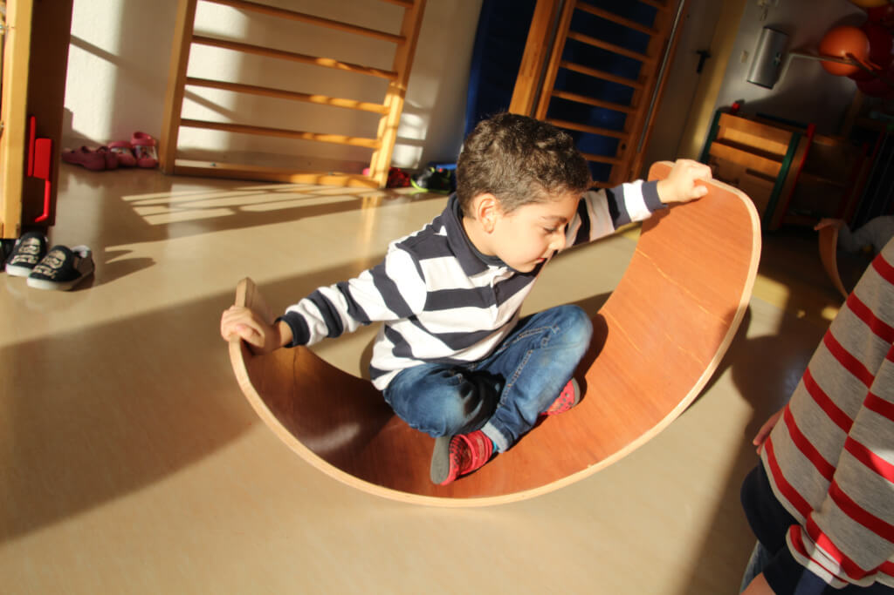
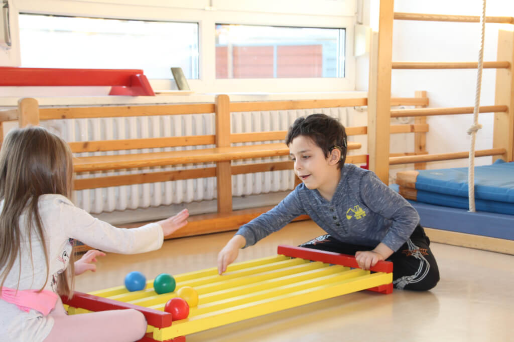

# **Pohyb a hra v predprimárnom vzdelávaní**

[NICA e.V.](NICA-EV.md), Halle, Nemecko
*Napísal Marc Bielert*

## **Prehľad projektu a kontext**
 Táto prípadová štúdia skúma dlhodobý cirkusový workshop realizovaný v **materskej škole v sociálne znevýhodnenej oblasti východného Nemecka**. Projekt sa stal cenenou a konzistentnou súčasťou týždennej rutiny, do ktorej sa zapájala **veľmi rôznorodá skupina detí vo veku od 1,5 do 6 rokov**. Podľa riaditeľky materskej školy približne **90 % detí hovorilo po nemecky ako druhým alebo dokonca tretím jazykom**. Táto jazyková krajina predstavovala pretrvávajúcu komunikačnú výzvu: niektoré deti sa naučili signalizovať porozumenie, aby potešili dospelých, aj keď boli zmätené.

To si vyžadovalo, aby si facilitátori vyvinuli **silnú citlivosť na verbálne aj neverbálne podnety**. Tím, zložený z **dvoch facilitátorov so 4 až 15-ročnými skúsenosťami** v inkluzívnej cirkusovej práci a s akademickým vzdelaním v oblasti **pedagogických vied a sociálnej pedagogiky**, sa stretol so známou realitou v komunitách s nedostatočnými zdrojmi: **oddaný, ale poddimenzovaný vzdelávací tím**. To obmedzovalo schopnosť materskej školy ponúkať individuálnu podporu, vďaka čomu bol externý workshop **vítaným doplnkom** do života detí.

---

## **Filozofia a pedagogický prístup**
 Projekt sa riadil **jednoduchou, ale silnou zásadou**: deti sú vystavené **širokej škále pohybových zážitkov v hravom prostredí**. Pedagogický prístup zdôrazňoval **rovnosť**, **interakciu na úrovni očí** a vytváranie **atmosféry s nízkym tlakom a podporujúcej objavovanie**. Úspech nebol definovaný výkonom, ale **angažovanosťou, zvedavosťou** a **slobodou skúšať, zlyhať a skúšať znova**.

Toto jemné prostredie koexistovalo s **jasnou štruktúrou a hranicami**. Facilitátori v prípade potreby dodržiavali **pravidlá a autoritu dospelých**, čím zabezpečovali bezpečnosť a súdržnosť skupiny. Zároveň boli deti povzbudzované k **samostatnému riešeniu menších sociálnych konfliktov**, čím sa podporovali **zručnosti v oblasti vyjednávania a sebaregulácie**.

---

## **Materiály a prostredie**
 Workshopy sa konali v **malej telocvični**, ktorá bola upravená pomocou **špecializovaného aj tradičného cirkusového vybavenia**, vrátane:

* **Žonglovacích dosiek**, umožňujúcich objavovanie štruktúrovaných vzorov bez rozhádzaných loptičiek

* **Newtonových zariadení**, na kontrolované hádzanie a koordináciu

* **Zakrivených balančných dosiek**, na rovnováhu, plazenie a kotúľanie

* **Parkourových prvkov**, ako sú kladiny a žinenky na rozvoj hrubej motoriky

* Neskôr pridané: **poi, obruče, šatky** a **spinning plates** na obohatenie zmyslových a pohybových variácií

Toto prostredie bolo navrhnuté tak, aby bolo **príjemné a rozvojovo podporné**, umožňujúc deťom voľne objavovať pohyb a zároveň rozvíjať kľúčové motorické zručnosti.

{ align=left }

---

## **Návrh workshopu pre batoľatá (1,5 – 3 roky)**
 Účasť bola vždy dobrovoľná. Na zabezpečenie spravodlivosti boli **deti vyberané prostredníctvom kombinácie náhodného výberu a odporúčania pedagóga**. Tím sa snažil o **nízky pomer trénerov k deťom (ideálne 1:4)**, aby poskytol individuálnu pozornosť, ktorá inak nebola dostupná.

Každé **60-minútové stretnutie nasledovalo rituálnu štruktúru**:

* **Privítacia pieseň s pohybom** vytvorila rytmus a psychologickú bezpečnosť

* Okamžité zapojenie do **fyzickej hry**, vrátane parkouru a hier na žonglovacích doskách

* **Prstové hry a známe piesne** poskytli štruktúru a zameranie

* Aby sa zabránilo nadmernej stimulácii, **nepoužívala sa nahraná hudba** – iba **živé skupinové spievanie**

* **Rozlúčková pieseň** a **omaľovánka** ako žetón účasti ukončili stretnutie

Táto predvídateľná sekvencia ponúkala **pohodlie a rytmus** skupine, ktorá bola príliš mladá na zložité naratívne štruktúry.

{ align=left }

---

## **Návrh workshopu pre predškolákov (4 – 6 rokov)**
 90-minútové stretnutia pre staršie deti vychádzali z rovnakých základov, ale boli **obohatené o naratívny oblúk**. Každé stretnutie bolo spojené s **jedným z piatich príbehov**, každý spojený s **dielikom puzzle**, ktorý slúžil ako **motivačný a symbolický kotviaci bod**.

Aktivity nasledovali **dynamický tok**:

* **Vysokoenergetický parkour**

* **Sústredená koordinácia** s Newtonovým zariadením

* **Kooperatívna, upokojujúca hra** na žonglovacích doskách

Keď deti dokončili každú fázu, **získali nový diel puzzle**, čím sa vytvoril pocit **pokroku a vzrušenia**. **Nahraná hudba a pohybové hry** ako „freeze dance“ boli začlenené na udržanie energie a zábavy.

{ align=left }

---

## **Výsledky a pozorovanie**
 Krátkodobé výsledky boli **konzistentne pozitívne**. Deti boli **radostné a hlboko zapojené**. Facilitátori pozorovali zlepšenie **fyzických schopností** (rovnováha, koordinácia), **kognitívneho vývoja** (sústredenie, pozornosť) a **sociálnej dôvery**.

Nápadným pozorovaním bola **udržaná pozornosť batoliat**. Deti už od 1,5 roka zostávali sústredené počas **celého stretnutia** – čo si s **úžasom všimli aj bežní pedagógovia**.

Silné stránky projektu – **interakcia na úrovni očí, hra s nízkym tlakom a posilnenie postavenia pri riešení konfliktov** – vytvorili hlboko **podporné prostredie**. Avšak práve úspech programu predstavoval výzvu: **dopyt neustále presahoval kapacitu**. Nadšenie detí sťažovalo emocionálne obmedzenie veľkosti skupiny a **ideálny pomer trénerov bol občas prekročený**.

---

## **Vyvíjajúca sa prax a budúce smerovanie**
 Počas svojej **sedemročnej evolúcie** sa metodika projektu naďalej prispôsobovala. Pre staršiu skupinu facilitátori teraz **upúšťajú od rigidných naratívov** smerom k **otvorenejším aktivitám vedeným deťmi**. Tradičné cirkusové zručnosti ako **poi a spinning plates** sa stávajú ústrednejšími.

Okrem toho facilitátori **integrujú obľúbené piesne detí** do segmentov voľnej hry, čím zvyšujú **osobnú relevanciu a emocionálne spojenie**. Projekt naďalej skúma, ako si udržať svoje **základné hodnoty inkluzivity a angažovanosti**, pričom flexibilne reaguje na meniace sa potreby a záujmy.
