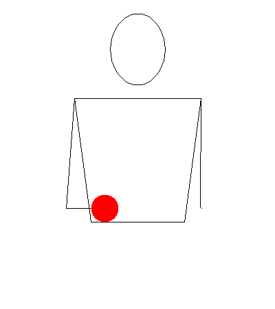
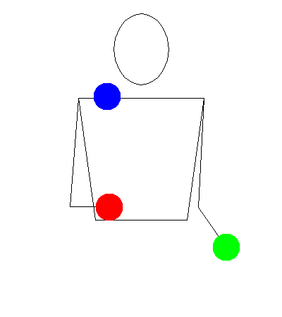

# Základy hodenej žonglérskej kaskády

(Tradičná) metóda učenia sa žonglovania s 3 objektmi. Moderné prístupy, ako napríklad [5-kroková metóda](5-Step%20Methode.md) od [[Person/Craig Quat]], ju dopĺňajú a rozširujú.

Tento základný vzor, ako aj didaktický prístup k jeho učeniu, je do značnej miery nezávislý od použitého náčinia. Nezáleží na tom, či ide o šatky, lopty, kužele alebo iné rekvizity – postupnosť zostáva rovnaká.

Najprv si pred sebou vizualizujte rám okna.
Ten naznačuje rovinu hodu, t. j. rovinu, v ktorej sa objekty pohybujú. Okrem toho nám pomáha vizualizovať si body, do ktorých hádžeme. V úrovni hlavy (mierne nad hlavou), mierne vpravo a vľavo od hlavy, sa nachádzajú tieto dva body.

Začnite s jedným objektom v rytme: 1 a 2 – jedna je hod a let, 2 je chytanie. Objekt opisuje akúsi ležatú osmičku v rovine hodu, zatiaľ čo prechádza z pravej do ľavej ruky a späť.

Dva objekty. Začnite s jedným objektom v každej ruke. Hody sa robia na rovnakých dráhach, dôležitý je tu rytmus. Hod, hod, chytanie, chytanie. (1 a 2 a 3 a 4) – hody sa vykonávajú postupne, s časovým odstupom.

Dva objekty, rôzne farby. Vždy začnite s jednou farbou – tým sa rovnomerne trénuje pravá aj ľavá strana. (Prvá sekvencia P, Ľ – druhá sekvencia Ľ, P)

Dva objekty, začnite s dvoma objektmi v jednej ruke. V závislosti od rekvizity existujú rôzne spôsoby držania objektov.
Základným cvičením je tu jednotlivé púšťanie objektov z jednej ruky a chytanie dvoch objektov v druhej ruke. Aj to sa deje opäť s časovým odstupom.

Tri objekty. Dva v jednej ruke, jeden v druhej. Ruka s dvoma objektmi začína hádzať. V zásade ide len o kombináciu predchádzajúcich cvičení s dvoma objektmi.

Tento základný princíp sa využíva aj pri nasledujúcom [[Partnerübung|partnerskom cvičení]](Partnerübungen%20Wurfjonglage%20Kaskade.md).
