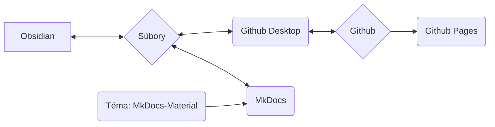

Používame MkDocs ako systém na dokumentovanie našich procesov, postupov a pracovných tokov a na ich sprístupnenie online.

## Základná myšlienka systému

>[!info]
>- Obsah a rozloženie sú striktne oddelené
>- Všetko je založené na jednoduchých textových súboroch vo formáte Markdown (*.md)
>- žiadne proprietárne údaje
>- Všetko je v zásade možné (až na malé výnimky) urobiť pomocou textového editora (ja osobne používam Obsidian a vysvetlím pracovné postupy s ním)
>- údaje je možné upravovať lokálne
>- pomocou MkDocs sa údaje z Markdownu konvertujú do statickej webovej stránky
>- údaje z Markdownu aj údaje webovej stránky sa ukladajú v repozitári Git spoločnosti Nica e.v.
>- cez Github Pages je potom všetko dostupné ako webová stránka



>[!info]+ 
>Každá jednotlivá softvérová zložka (Github, Github Pages, Github Desktop, MkDocs, Obsidian, MkDocs-Materials) je **open source a je možné ju používať bezplatne**.
>
>Ak by jednotlivé komponenty vypadli (služba by bola ukončená, softvér by už nebol dostupný alebo z iných dôvodov), samotné údaje (teda súbory Markdown) zostanú zachované.
>
>Používanie Githubu nám na jednej strane umožňuje verzovanie údajov – to znamená, že každá zmena je zdokumentovaná a sledovateľná, a každá zmena môže byť aj vrátená späť.
>Taktiež umožňuje iným osobám prispievať k dokumentácii bez toho, aby sme museli spravovať používateľské údaje alebo sa starať o bezpečnosť systému (čo je však technicky trochu náročnejšie).
>
>Týmto sme dlhodobo oveľa odolnejší. Keďže takáto dokumentácia rastie dlhodobo, považujem to za obrovskú výhodu.
 
### Zapojenie ďalších osôb
Systém, ktorý je ďalej popísaný, môže pre osoby, ktoré sa inak s kódom a programovaním stretávajú len málo, na prvý pohľad pôsobiť ohromujúco alebo odstrašujúco.

Aby sme to riešili, máme nasledujúce alternatívne možnosti tvorby obsahu:
- Tvorba obsahu na WordPresse ako stránka
- Obsah ako textový súbor, súbor Word (alebo iné bežné formáty)

Tieto obsahy potom poslať e-mailom aktuálne zodpovednej osobe (pozri [Tiráž](Impressum.md)). Tá ich potom spracuje.
## Súborový systém

>[!info]+ Štruktúra adresárov a súbory
>**/docs**
>**/site**
>
>license
>mkdocs.yml
>readme.md

## Obsidian

Najmä vďaka použitiu [Obsidianu](Obsidian%20Setup.md) ako textového editora má toto nastavenie obrovské výhody:

- Obsidian je obzvlášť vhodný pre veľké množstvo jednotlivých súborov, ktoré sú prepojené pomocou značiek alebo odkazov, alebo sú kategorizované pomocou štruktúr adresárov (podadresárov).
- Obsidian dokáže tieto údaje graficky zobraziť, čo obzvlášť zlepšuje správu veľkého množstva údajov.

Ďalšou veľkou výhodou Obsidianu je rozsiahly ekosystém pluginov. To nám umožňuje veľmi jednoducho pridávať funkcie, ako napríklad:
- Filtrovanie/vyhľadávanie podobné databáze
- Správa značiek (napr. zmeny vo viacerých súboroch naraz, ako je premenovanie často používanej značky)
- Jednoduchá správa metadát (tzv. [Frontmatter](Frontmatter%20Properties.md) alebo YAML)

## Github

Je program na kontrolu verzií pre údaje, ktorý je možné používať online.
### Github Desktop

Git je v skutočnosti nástroj príkazového riadku – to mnohých odrádza.
Github Desktop tento problém rieši tým, že potrebnú funkcionalitu zabalí do aplikácie s jednoduchým grafickým rozhraním.

### Github Pages

Github Pages je služba od Githubu.
Ak sú v repozitári uložené údaje webovej stránky v určitej forme, môžu byť zobrazené ako webová stránka.

- služba je bezplatná
- MkDocs vykoná všetky potrebné kroky automaticky

Výhoda pre nás:
- žiadny vlastný hosting
- žiadne poplatky
- na nahrávanie/aktualizáciu obsahu stačí príkaz príkazového riadku: ```

```
mkdocs gh-deploy
```

Celkovo sa nemusíme o nič starať, môžeme pracovať takmer výlučne lokálne.
## MkDocs

[MkDocs](https://mkdocs.org) je softvér na vytváranie online dostupných dokumentácií.
Obsah sa vytvára v jednoduchých textových súboroch – to je možné v akomkoľvek textovom editore, ktorý podporuje [formát Markdown](Markdown.md).

>[!info]- Zoznam možných textových editorov
>- Notepad++
>- Atom
>- Visual Studio Code
>- Sublime
>- Windows Text Editor
>- Obsidian

Pomocou príkazu príkazového riadku sa MkDocs potom spustí a môže:

- offline zobraziť hotovú verziu webovej stránky
	- tá sa automaticky aktualizuje pri zmenách v textových súboroch
	- to umožňuje veľmi rýchle a jednoduché písanie a formátovanie obsahu
- vytvoriť údaje pre statickú webovú stránku (lokálne)
	- tie sa potom dajú napríklad priamo nahrať na server
- prostredníctvom prepojenia s Github Pages priamo nahrať statickú webovú stránku
	- to je bezplatné, pokiaľ je dokumentácia verejne dostupná a pod licenciou open source (obe podmienky spĺňame)

Pre úplnú dokumentáciu navštívte stránku [mkdocs.org](https://www.mkdocs.org).

### Téma: MkDocs Material

https://squidfunk.github.io/mkdocs-material/
