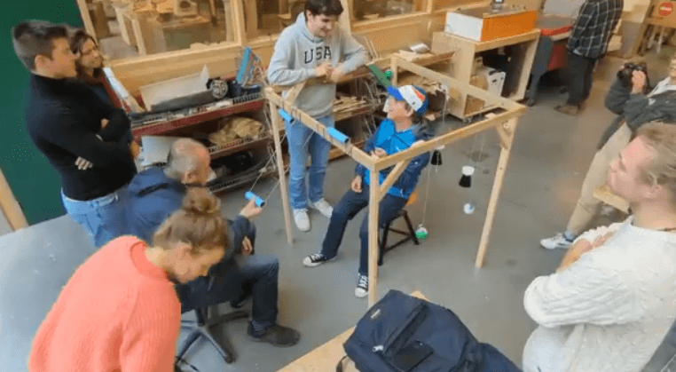
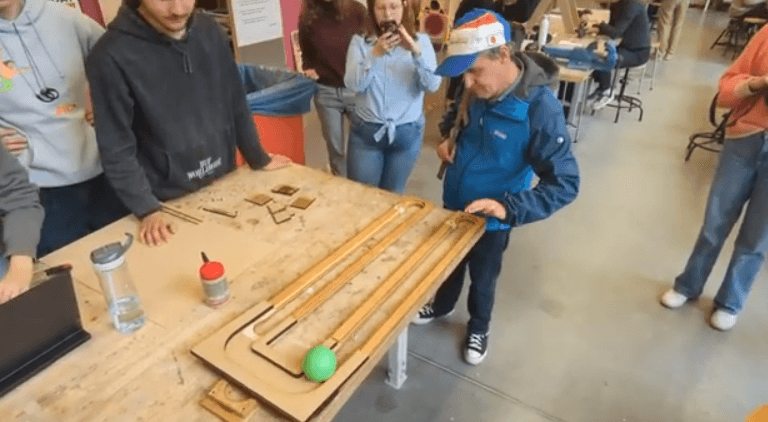
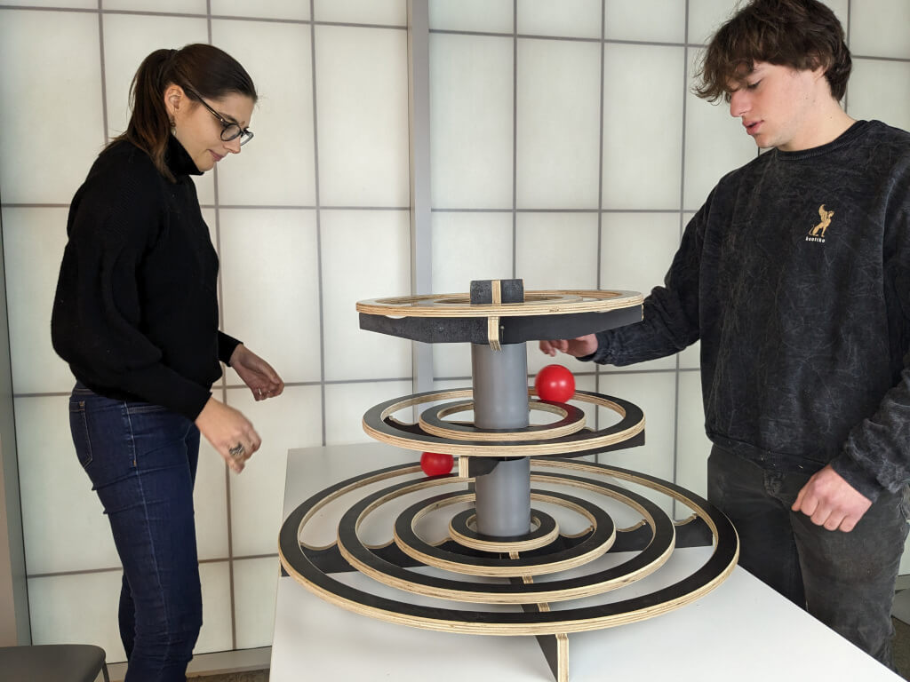

# **Дослідження випадку: Спільний дизайн – Інклюзивні циркові реквізити через міжсекторальну співпрацю (Бельгія)**

Написано Ельгою Полле, директоркою [Circusatelier Woesh](Circusatelier%20Woesh.md)

---

## **Огляд**

Це дослідження випадку розглядає багаторічну міжсекторальну співпрацю між **інклюзивними цирковими педагогами**, **студентами університетів** та **громадськими організаціями** в Бельгії. Ініціативу очолила я, **Ельга Полле**, разом із відданою командою **Circusatelier Woesh**, що базується в регіоні Західна Фландрія.

З діяльністю, що охоплює **Брюгге, Остенде, Руселаре** та **Кортрейк**, Woesh давно прагне поєднувати **художні циркові практики** з глибокою **соціальною місією**. Проєкт, описаний тут, був розроблений як частина ширшої ініціативи під назвою **Bushcraft** – довгострокової програми, присвяченої сталому та інклюзивному розвитку цирку у Фландрії та за її межами.

У 2019 році наша команда поставила ключове запитання: **Як ми можемо перетворити короткострокові інтервенції на довготривалі, самодостатні інклюзивні програми?**

Результатом став двосторонній підхід, що поєднував:

1. Створення **індивідуальних ролей Циркових Асистентів** для людей з інвалідністю
2. **Спільний дизайн інклюзивних циркових реквізитів** через академічні партнерства

Міжнародні співробітники, такі як **Крейг Кват**, засновник **Quat Props**, приєдналися до нас у цьому процесі, надаючи ідеї, наставництво та підтвердження, що допомогло сформувати нашу роботу.

## **Напрямок 1: Індивідуальні ролі Циркових Асистентів**

У наших майстер-класах та просвітницьких програмах ми послідовно включаємо учасників з **фізичними та інтелектуальними порушеннями**. Хоча ми бачили значущі моменти, що виникали з цих взаємодій, ми усвідомили, що **короткострокової інклюзії недостатньо**.

Ми хотіли піти далі. Тому ми запитали себе: **Чи можуть люди з інвалідністю також стати фасилітаторами та лідерами в наших програмах?**

Щоб перевірити це, ми співпрацювали з місцевими мережами, такими як **VZW De Viersprong**, щоб створити довгострокові **асистентські посади** в нашій команді. Ці асистенти – дорослі з інвалідністю, літні учасники та молодь з вразливих груп населення – проходили постійне навчання з:

* **Базової циркової педагогіки**
* **Стратегій фасилітації**
* **Фізичного вираження та сенсорної взаємодії**

Одним із найефективніших інструментів, які ми використовували, була система **Juggle Board**. Її **невербальна взаємодія**, **ритмічна структура** та **доступний вхідний пункт** дозволили асистентам співпрацювати з самого початку.

З часом наші асистенти брали на себе все більш значущі обов'язки:

* Проведення занять у **школах**, **будинках для людей похилого віку** та **громадських місцях**
* Пряма співпраця з **провідними фасилітаторами** та підтримка з боку спеціалізованих тренерів
* Вивчення **символічних систем комунікації** або **мови жестів** для покращення доступності

Одна з наших груп асистентів активно працює вже **понад п'ять років**, демонструючи стійкість та глибину цієї моделі. Їхня присутність збагатила наші заняття та привнесла нові рівні **емпатії, різноманітності та спільної відповідальності** в нашу педагогіку.

## **Напрямок 2: Інклюзивний дизайн реквізиту через академічну співпрацю**

Водночас ми виявили ще одну серйозну перешкоду: **більшість стандартного циркового обладнання не розроблена з урахуванням інклюзивності**. У відповідь ми **запустили дизайн-співпрацю з Університетом прикладних наук HOWEST**, залучивши студентів програми **Дизайн продуктів** до багаторічної роботи з прототипування нових, доступних інструментів.

Протягом трьох років мультидисциплінарні студентські команди запрошувалися до розробки **нових циркових інструментів** на основі набору критеріїв, які ми спільно створили:

* **Простота використання** (індивідуально та в групі)
* **Сенсорна взаємодія**
* **Видимі криві навчання**
* **Емоційне вираження та потік**
* **Можливість відтворення та адаптації**

Студентам було запропоновано вийти за межі традиційних циркових форм та методів. Під керівництвом нашої команди – та з відгуками як від педагогів, так і від учасників – вони розробили **десятки прототипів**. Деякі використовували **низькотехнологічні перероблені матеріали**; інші досліджували **3D-друк** та **змінні системи**.

Серед помітних творінь були:

* **Сенсорні вежі для жонглювання**
* **Колісні рами для маніпуляцій великою групою**
* **Адаптовані палички-квіти та дошки для фліпперів**
* **Палички-кільця та інструменти типу "жорсткий млин"**
* **Модульні набори інструментів**, які могли змінювати функції залежно від потреб користувача

Нам також пощастило прийняти **Крейга Квата** як запрошеного наставника. Він спостерігав за презентаціями, брав участь у тестуванні користувачами та допомагав студентам розмірковувати над тим, як **зосередитися на здібностях та процесі**, а не лише на компенсації обмежень.

## **Результати**

Результати цієї співпраці були як **практичними, так і культурними**.

**Практично, проєкт:**

* Створив понад **15 інклюзивних циркових прототипів**
* Забезпечив **10+ довгострокових асистентських посад** для людей з інвалідністю
* Уможливив успішне тестування нових інструментів у реальних громадських умовах

**Культурно, проєкт:**

* Побудував мости між **мистецтвом, терапією та дизайном**
* Надав студентам та персоналу **безпосередній досвід доступності**
* Спричинив **міждисциплінарні розмови**, які продовжують розвиватися
* Зміцнив внутрішній **потенціал організації до інклюзії**

Найважливіше, проєкт змінив те, як усі залучені – учасники, дизайнери, викладачі – **бачили себе**. Не просто як отримувачів чи спостерігачів, а як **співавторів спільного бачення** інклюзивного майбутнього цирку.

---

## **Наступні кроки**

Наша робота триває під егідою **Woeshcraft** – платформи для подальшого розвитку, роздумів та обміну. Наші поточні пріоритети включають:

* Публікацію **посібників з відкритим вихідним кодом "Adopt-a-Prop"** для наших розробок
* Побудову **зворотного зв'язку** з іншими практиками, які адаптують інструменти
* Поглиблення партнерства з **реабілітаційними та доглядовими організаціями**
* Продовження інтеграції асистентів у наше **регулярне програмне планування занять**

## **Висновок**

Цей проєкт продемонстрував, що інклюзія в цирку вимагає як **структурної адаптації (реквізит, ролі)**, так і **організаційної відданості**. Ми підтвердили, що коли учасникам надається реальна відповідальність та інструменти, що відповідають їхнім потребам, вони роблять значущий внесок – часто понад очікування.

Завдяки двосторонньому підходу навчання **Циркових Асистентів з особливими потребами** та розробки **доступних інструментів у партнерстві з HOWEST**, ми створили нові ролі та новий реквізит, які розширюють участь у конкретних формах.

Результати були трансформаційними. Тепер у нас є **довгострокові асистенти, інтегровані в наші програми**, **каталог інклюзивних прототипів** та зростаюча мережа партнерів, які переосмислюють, яким може бути цирк.

Це **живий процес**. Ми прагнемо зв'язатися з іншими, хто уявляє нові способи, якими цирк може включати всіх – і ми сподіваємося, що ця робота **надихне нові ідеї та партнерства**, адже **цирк стає справді інклюзивним лише тоді, коли ми створюємо його разом**.
