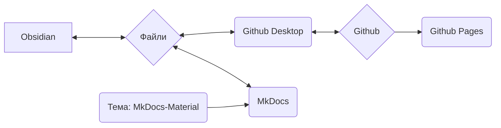

Ми використовуємо MkDocs як систему для документування наших процесів, підходів та робочих процесів і надання їх онлайн.

## Основна ідея системи

>[!info]
>- Зміст і макет суворо розділені
>- Все базується на простих текстових файлах у форматі Markdown (*.md)
>- Немає пропрієтарних даних
>- В принципі, все (за кількома винятками) можна зробити за допомогою текстового редактора (я особисто використовую Obsidian і поясню робочі процеси з ним)
>- Дані можна редагувати локально
>- За допомогою MkDocs дані Markdown перетворюються на статичний вебсайт
>- Дані Markdown, а також дані вебсайту зберігаються в репозиторії Git Nica e.v.
>- Через Github Pages це все стає доступним як вебсайт



>[!info]+
>Кожен окремий програмний компонент (Github, Github Pages, Github Desktop, MkDocs, Obsidian, MkDocs-Materials) є **відкритим програмним забезпеченням і безкоштовним у використанні**.
>
>Якщо окремі компоненти зникнуть (сервіс буде припинено, програмне забезпечення більше не буде доступне або з інших причин), самі дані (тобто файли Markdown) залишаться.
>
>Використання Github дозволяє нам, з одного боку, версіонувати дані — це означає, що кожна зміна документується і є відстежуваною, а також кожну зміну можна скасувати.
>Це також дозволяє іншим співпрацювати над документацією, не вимагаючи від нас керування даними користувачів або турботи про безпеку системи (хоча це технічно дещо складніше).
>
>Таким чином, ми стаємо значно стійкішими в довгостроковій перспективі. Оскільки така документація зростає протягом тривалого часу, я вважаю це величезною перевагою.

### Залучення інших осіб
Система, описана нижче, може здатися приголомшливою або лякаючою на перший погляд для людей, які зазвичай мало мають справу з кодом та програмуванням.

Щоб вирішити цю проблему, ми маємо такі альтернативні способи створення контенту:
- Створення контенту в Wordpress як сторінки
- Контент у вигляді текстового файлу, файлу Word (або інших типових форматів)

Цей контент потім надсилається електронною поштою відповідальній особі (див. [Вихідні дані](Impressum.md)). Потім він буде інтегрований.
## Файлова система

>[!info]+ Структура каталогів та файли
>**/docs**
>**/site**
>
>license
>mkdocs.yml
>readme.md

## Obsidian

Особливо завдяки використанню [Obsidian](Obsidian%20Setup.md) як текстового редактора, ця конфігурація має величезні переваги:

- Obsidian особливо підходить для великої кількості окремих файлів, які пов'язані тегами або посиланнями, або категоризовані за допомогою структури каталогів (підкаталогів).
- Obsidian може візуально відображати ці дані, що особливо покращує керування великими обсягами даних.

Ще одна велика перевага Obsidian — це величезна екосистема плагінів. Це дозволяє нам легко додавати функціональність, наприклад:
- Фільтрація/пошук, подібний до бази даних
- Керування тегами (наприклад, одночасна зміна в багатьох файлах, як-от перейменування часто використовуваного тегу)
- Просте керування метаданими (так званий [Frontmatter](Frontmatter%20Properties.md) або YAML)

## Github

Це програма для контролю версій даних, яку можна використовувати онлайн.
### Github Desktop

Git насправді є інструментом командного рядка — це лякає багатьох.
Github Desktop вирішує цю проблему, пакуючи необхідну функціональність у програму з простим графічним інтерфейсом.

### Github Pages

Github Pages — це сервіс від Github.
Якщо дані вебсайту зберігаються в репозиторії у певному форматі, їх можна відображати як вебсайт.

- Сервіс безкоштовний
- MkDocs самостійно виконує всі необхідні кроки.

Перевага для нас:
- Немає власного хостингу
- Немає комісій
- Для завантаження/оновлення контенту потрібна лише команда командного рядка: ```

```
mkdocs gh-deploy
```

Загалом, нам не про що турбуватися, ми можемо працювати майже виключно локально.
## MkDocs

[MkDocs](https://mkdocs.org) — це програмне забезпечення для створення документацій, доступних онлайн.
Вміст створюється в простих текстових файлах — це можна зробити в будь-якому текстовому редакторі, який підтримує [формат Markdown](Markdown.md).

>[!info]- Список можливих текстових редакторів
>- Notepad++
>- Atom
>- Visual Studio Code
>- Sublime
>- Windows Text Editor
>- Obsidian

За допомогою команди командного рядка MkDocs запускається і може:

- Відображати готову версію вебсайту офлайн
	- Вона автоматично оновлюється при змінах у текстових файлах
	- Це дозволяє дуже швидко та легко створювати та оформлювати контент
- Створювати дані для статичного вебсайту (локально)
	- Їх можна, наприклад, безпосередньо завантажити на сервер
- За допомогою інтеграції з Github Pages безпосередньо завантажувати статичний вебсайт
	- Це безкоштовно, доки документація є загальнодоступною та під ліцензією відкритого програмного забезпечення (ми відповідаємо обом умовам)

Повну документацію можна знайти на [mkdocs.org](https://www.mkdocs.org).

### Тема: MkDocs Material

https://squidfunk.github.io/mkdocs-material/
