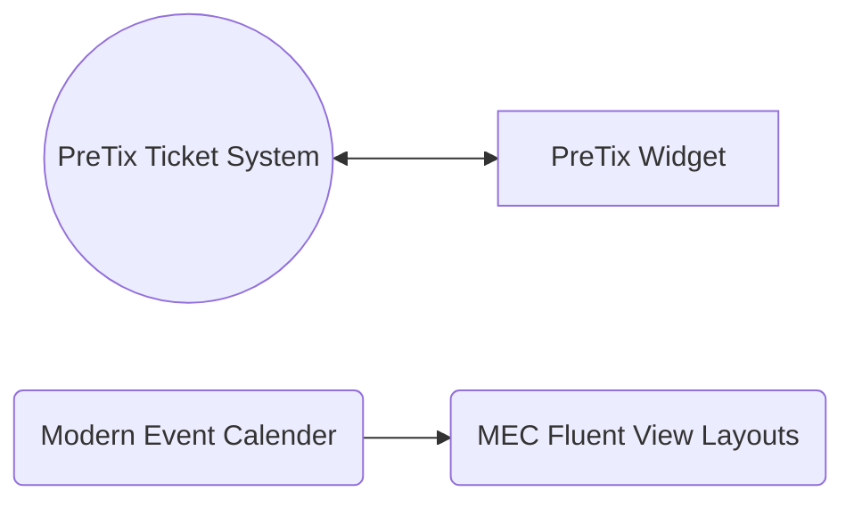

# Wordpress

## Плагіни
## Система подій та бронювання

## Посібники

-   :material-clock-fast:{ .lg .middle } __Бухгалтерія__

    ---

    Як створити сторінку у нас на Wordpress.
     author: piiit

    [:octicons-arrow-right-24: Переглянути](wordpress-pages.md){  .md-button }

[Як створити сторінку у Wordpress](wordpress-pages.md)
